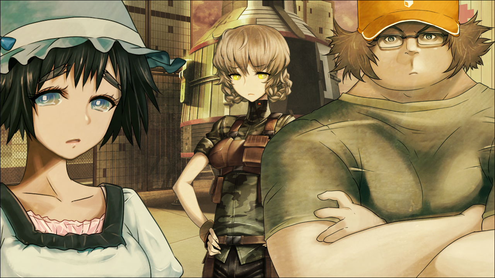

# 
 命运石之门0 游戏文本 

## 
 Steins; Gate 0 game text 

> <big> **楔子** </big>  
> 1.129848  
> [ 2010/07/28 ] 接动漫 *23β* 话，冈伦误杀红莉栖后。  

舱门开启了。  
耀眼的光芒照射入我的眼睛。  
这里是哪里？  
我眯起眼睛。  
勉强能看到的，是夏天的晚霞。  
不想从这里出去。  
真想就这样消失。  
然而——  
我被抓住了手腕，强硬的拽了出去。  

桶子：“唔哦，这就回来了！明明连一分钟都没过呢。”  
真由理：“……冈伦？”  

听到了熟悉的昵称，但是我已经没有力气做出反应。  
我像马上要倒地一样蹲坐着。  

“冈伦！” ——真由理跑过来，担心地看着我的脸。  
但是，现在我连去在意这些都觉得麻烦。  
——别跟我这种人说话。  
——让我一个人待会。  

桶子：“喂，冈伦，你这不是浑身是血吗！怎么了？！”  
铃羽：“爸爸，现在就去拿水和毛巾来！还有衣服！”  
桶子：“诶诶？什么情况啊说明一下please！”  
铃羽：“好了！快去！”  
桶子：“好，好吧。”  
桶子慌忙的跑向楼顶门的方向。  

真由理：“冈伦，你没事吧……？振作点……不要死啊……”  
铃羽：“没事的，并没有受伤的样子。”  

别这样！  
别来管我这种人！  
让我一个人待着！  
我没能拯救她。  
反而，亲手夺去了她的生命。  
在三周前的这个地方。  
是我，杀的。  
我是，杀人犯。  

“都是白费的……不管用什么方法，都是白费的……  
&emsp;&emsp; 呵，呵呵呵……一切，都是早已注定的……  
&emsp;&emsp; 都一样……跟真由理那时候，一样的……  
&emsp;&emsp; 不管，如何挣扎……结果都，一样的……”  
不管重来多少次，肯定会收束成为同样的结果。  
与过程无关。  
不管是时间跳跃还是时间旅行，都不可能改变过去的结果。  
这一残酷的事实，我明明已经知道了。  
没想到会这样，以最痛苦的形式再次感受到。  
“白费的……白费的啊……不管如何都是白费的啊！”   

“都明白的…一开始就明白的……这种结果…早就是预料之中的……  
&emsp;&emsp; 已经…累了……我一直，都没休息……所以，已经够了……  
&emsp;&emsp; 哈哈，哈……”  

真由理：“冈伦……你到底遇到了什么事……”  
“是我…是我杀的…是我杀死她的……简直像个傻瓜…这全都是我的错……”  
铃羽：“牧濑红莉栖她，是被冈伦叔叔误刺而死的。”  
真由理：“杀死了……？骗人的吧……这怎么……”  
铃羽：“不过请放心，还能在跳跃一次的。”  
“别管我……我这种人，不管进行几次……结局都一样的……”  
铃羽：“说什么呢！？难道要放弃了吗！  
&emsp;&emsp; 冈伦叔叔你的肩上，可是扛着数十亿人的性命啊！  
&emsp;&emsp; 只是失败一次有什么好沮丧的！”  
“不管怎么样，都救不了红莉栖的……我们根本无法忤逆世界线的收束！”  
这就是，世界的真理。  
这是早就清楚得不能再清楚的事情了。  

铃羽：“唔……这样的话，就算硬来我也要让你振作起来！”  
真由理：“不行啊！这么勉强他，是不好的啊……  
&emsp;&emsp; 变得这么颓废的冈伦，我根本看不下去啊……”  
铃羽：“可是啊，这样下去，是无法改变未来的啊。”  
真由理：“为什么？为什么要把未来的事，都推给冈伦呢？  
&emsp;&emsp; 这实在，太沉重了……”  
铃羽：“这都是因为冈伦叔叔，有着成为世界观测者的能力啊。”  
真由理：“冈伦他，明明没有期望过这个……  
&emsp;&emsp; 而且我觉得，就算是再尝试一次，也只会继续让冈伦受伤……  
&emsp;&emsp; 让一个人来改变未来这种事，肯定是办不到的啊……”  
铃羽：“所以说，为此才有这**Steins;Gate（命运石之门）**……  
&emsp;&emsp; 你的心情我明白。但是啊，我也是从未来，来到这里的啊。  
&emsp;&emsp; 不论如何我也回不去2036年了，所以我不会就这么放弃的。”  
真由理：“……”  
铃羽：“冈伦叔叔，有一点我要提醒你。  
&emsp;&emsp; 留给这台时间机器的燃料，是有限的。  
&emsp;&emsp; 虽然我之前说最多还能来回两次，但其实还是有点剩余的。  
&emsp;&emsp; 不过，也只够移动**344**天。  
&emsp;&emsp; 即使是单程时间跳跃，超过从现在开始的不到一年的时间，  
&emsp;&emsp; 就再也没办法到达7月28日了。  
&emsp;&emsp; 请记住了，到了那天，即使只有我一个人，我也会跳跃的。”  

“……”  
有谁在对我说着些什么。  
但是，我并不能理解话中的意思。  
什么都不想听。现在我只想像烂泥一样睡过去。  
已经可以了吧。  
快放过我吧。  

真由理：“冈伦？冈伦……呐，冈伦……  
&emsp;&emsp; 已经，不用拼命了哦。  
&emsp;&emsp; 就算哭出来也可以哟，冈伦。  
&emsp;&emsp; 真由喜会一直在你身边的，冈伦。”  

“……（啜泣）”    
不知是不是因为真由理的话，  
眼泪，流了出来。  
我下定决心，要忘记这一切。  
所以从那天起，我就再也没有去过LAB——未来机械研究所。  

 

> (to be continued)
---

| ←prev | [home](../../) | [next→](./0001) |

<!--
<table style="width:100%">
<tr>
    <td style="width:33%"> <a href="./000"> ←previous </a> </td>
    <td style="width:34%"> <a href="../../"> home </a> </td>
    <td style="width:33%"> <a href="./001"> next→ </a> </td>
</tr>
</table>
-->
