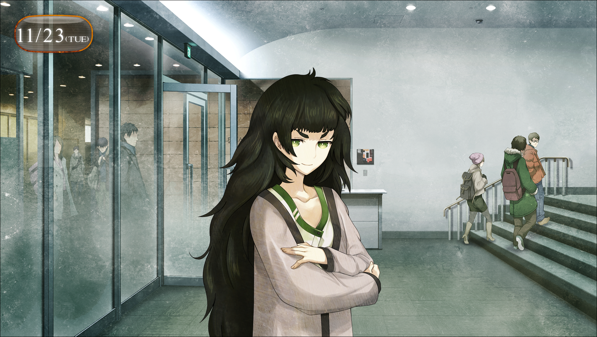

> <big> **零化域的缺失之环 - 01** </big>  
> 1.129848  
> [ 2010/11/23 ] 研讨会前，结识真帆，“初遇”萌郁。

在车站前耸立着的秋叶原新地标之一，UPX。  
在4楼的大厅里，从早晨开始就为ATF——秋叶原科技论坛——的演讲做着准备。  
同国内外数所大学和研究设施合作，这里不定期的开展着研讨会和座谈会。我所在的东京电机大学也作为产学合作机能的一环参与其中，相关研究会的学生也必须参加这些研讨会，并向导师上交报告。不这样做的话，就拿不到学分。  
我作为演讲者之一井崎准教授的助手参与这次演讲，现在正在公共大厅里的前台呆着，拿着名单记录参加研讨会的学生的出勤情况。离研讨会开始还有一段时间，大厅里的人也是零零散散，名单上的学生还一个都没有来。  
真是闲啊，只能在这里等着。  

对于以前的我来说，这么勤奋是无法想象的。我之所以这样向井崎教授展示自己，是因为我有了新的人生目标——维克多·孔多利亚大学。井崎教授正在和这所大学进行共同研究，人脉也很广。如果能当他的助手的话，应该会成为我靠近自己目标的第一步吧。我用自己不够用的脑细胞这样想道。而且，在这次的演讲中，接下来还会进行维克多·孔多利亚大学的研讨会。对于此事，我当然也很关注。  

夏天吗……  
“唔……”  
我发出了一阵痛苦的呻吟。那个时候的，红发天才少女的身姿再一次从脑海中一闪而过。  
我之所以把维克多·孔多利亚大学作为我的目标，是因为想要学习牧濑红莉栖想要做的东西，并且自己把它继续进行下去。当然，我不是红莉栖那样的天才。所以，我也不会说出“想要继承她全部的研究”之类没有自知之明的话来。  
但是，对我来说，至少一成的话，如果能够做到的话……  
真亏我能够这样子振作起来。  

我这样想着而发出一阵苦笑，这时大厅里响起一个声音。  
“那个，那边那位——？”  
“嗯……？”  
我抬起头，看到从电梯井的方向走来一位小小的少女。  

身高，体格，总之整体上都很小。姑且能感受到一些，只有经历过青春期才会产生的女性特有的魅力，所以应该不会是小学生……大概是中学生吧。  
明明有着一张这么可爱的脸，这女孩却显得有些土气。乱蓬蓬的头发被随意的留在背后，服装也是，就连我也能一眼看出来根本没有任何品味可言。  
“打扰一下，请问职员室在哪边？”  
“那个，这里是ATF研讨会的会场哦……”  
这里明显和女中学生不搭调，估计是进错地方了吧。  
“这种事我知道啊！要我重复几次才够呢？  
&emsp;&emsp; 啊不，我还是第一次跟你说这个啊……  
&emsp;&emsp; 但对我来说，你已经是第四个了。  
&emsp;&emsp; 真是的，到了这地方后就一直……”  
盛气凌人的少女从怀中掏出了一张卡片。那是给这次演讲的参加者配发的来宾卡，在正面用日语和英语印有姓名和所属机构。  
“诶……？来宾……维克多·孔多利亚大学，脑科学研究所，比屋定真帆？”  
我比较着眼前的少女和卡片，总算想到了。  
“啊啊！是这么回事啊！你这张卡，是在哪里捡到——”  
“这种话我也是第四次听了！”  
她一副烦透了的样子，举起了另一张卡片给我看。  
这是带有照片的卡片，来自维克多·孔多利亚大学的脑科学研究所。  
“诶？诶？！”  

我在另外的世界线上，不知何时见过红莉栖拿的卡片，和这张是同样的设计。  
在ID卡上印着的照片，毫无疑问是眼前的女孩。  
“读作 *Hiyajo Maho* 哦，我的名字，比屋定真帆。  
&emsp;&emsp; 因为不论是汉字还是罗马音都没人能好好读出来，所以就先跟你说明咯。”  
“嗯……那个……维克多·孔多利亚大学的……中学生？”  
“要犯迷糊的话请等到晚上。大学里可能会有中学生吗？”  
“这……也是呢。那就是，跳级的吗……”  
与日本不同，在美国跳级并不少见。红莉栖也是17岁就已经大学毕业了。  
就算这么说……这么小的女孩子就已经是大学的研究员什么的……  
“……我能先跟你确认件事么？”  
“啊……嗯。”  
“你现在，多少有点震惊的吧？  
&emsp;&emsp; 比如‘这么小的孩子……不敢相信啊’，  
&emsp;&emsp; 还有就是‘这个年龄就……好厉害啊？’之类的。”  
“啊，哈哈。”  
由于被说中了我发出略带尴尬的笑声。  
“仔细看这里！”  
比屋定真帆用纤细的手指指着ID卡的一处。  
1989年出生，现在是2010年的话……  
“……21岁？！”  
“所以说我可是了不起的成年女性了！  
&emsp;&emsp; 可不是中学生，当然更不是小学生、幼女什么的。”  
说着，一下子挺起了胸膛。虽然胸部完全说不上大，但是看起来就像是在强调“我是穿衣显瘦的类型，脱下来可是很厉害的哦”一样。  
“……”  
“你这表情是什么意思？”  
“啊，不。……抱歉啊，我道歉。”  
不敢相信……居然比我年纪还大……  
介绍给桶子的话，估计他会一边叫着“合法萝莉ktkr！”之类的，一边双手蠢蠢欲动吧。  
“算了，不管去哪都会被这么对待。”  
“嗯，我想也是……”  
“你说什么？”  
“啊不，没什么！”  

话说回来，脑科学研究所吗……那不是红莉栖所属的地方吗。所以，这孩子……不，这位女性说不定认识红莉栖。我强忍着想要问些什么的冲动，再次查看记录着研讨会进度的小册子。维克多·孔多利亚大学的演讲，是今天演讲的最后一场，也就是所谓的“压轴”。这次是这位比屋定真帆要上台演讲吗？就像在夏天的演讲中，红莉栖登台那样……不，等等。不对，不是这样的。没有这样的事实。牧濑红莉栖根本没有在夏天进行演讲。那是α世界线上的事情。在现在我所处的世界线上，她在夏天的演讲之前就……  

“今天，是你上台吗？”  
“不哦，我是来做助手的，还有负责一点翻译。”  
我再次看向小册子，在讲师一栏写着 *Alexis Leskinen* 的名字。  
阿莱克西斯·雷斯吉宁，职务是维克多·孔多利亚大学的教授、脑科学研究所主任。  
“主题是‘人工智能革命’吗？嗯，有点意思呢。”  
“有时间的话真想听听你的感想呢。”  
“奉陪哦。——啊，你是要去职员室的吧？”  
我把她领到电梯旁，给她指出了职员室的位置。  
“谢谢啦！”  
没有理由继续缠着她了。我也点了点头，回到了自己的位置。  

就在这时——  
正好电梯门打开，从里面走出一位女性。  
认出这位女性的脸的瞬间，我全身的汗毛都立了起来。

“……！！！”  
桐生……萌郁！  
我拼命控制住马上就要喊叫出来的冲动。  
冷静下来！  
这里是β世界线！  
**真由理还活着！**  
**萌郁不会杀真由理！**  
我们四目相对。眼镜后的那双瞳孔依旧是没有生气，看不懂在想些什么。  
为了不被看穿，我慌忙错开了视线。  
“……？”  
萌郁歪了歪头，但很快对我失去了兴趣，向着比屋定真帆走了过去。  
“那个……？”  
“啊啊，你是杂志社的人吧？”  
“……按照约定……来采访……”  
不知该说是一如既往，还是在这条世界线也一样，萌郁依旧只能用含混不清的语调说话。  
“雷斯吉宁教授还没到，可能会让你稍等下。”  
“……好的。”  
“教授来之前，要不要我说明下系统的概要呢？”  
“拜托…了……”  
两人说完，便一同往职员室走去，从我的视线中消失了。  

我看着两人的背影，反复深呼吸。  
尽管想要冷静下来，但是心跳却很难平复。  
“桐生萌郁……难道……又是，你么？”  
像是内心的创伤要阻碍我一样，讨厌的感觉。  
就像通过秋叶原的所有线路都因为恐怖袭击预告而停运的那个夜晚。  
就像被阴云一般的不祥的预感笼罩着的那个时候一样。  
“你又要在这里……”  
还是说，这只是我想太多了吗？  
现在的萌郁不是什么**SERN**的**Rounder**，只是一名杂志记者吗？  
不，就算桐生萌郁是Rounder，我们也和SERN没有关系了，SERN不可能再盯上我们。  

“呼……”  
我再次深呼吸，从口袋里拿出镇定剂，用之前买的矿泉水冲服到胃里。  
到要小发作大概需要15分钟，这段时间应该会相当难熬。  
一边带点自嘲的笑着，我坐回了前台的椅子上。  

 

> (to be continued)
---

| [←prev](./0000) | [home](../../) | [next→](./0002) |
