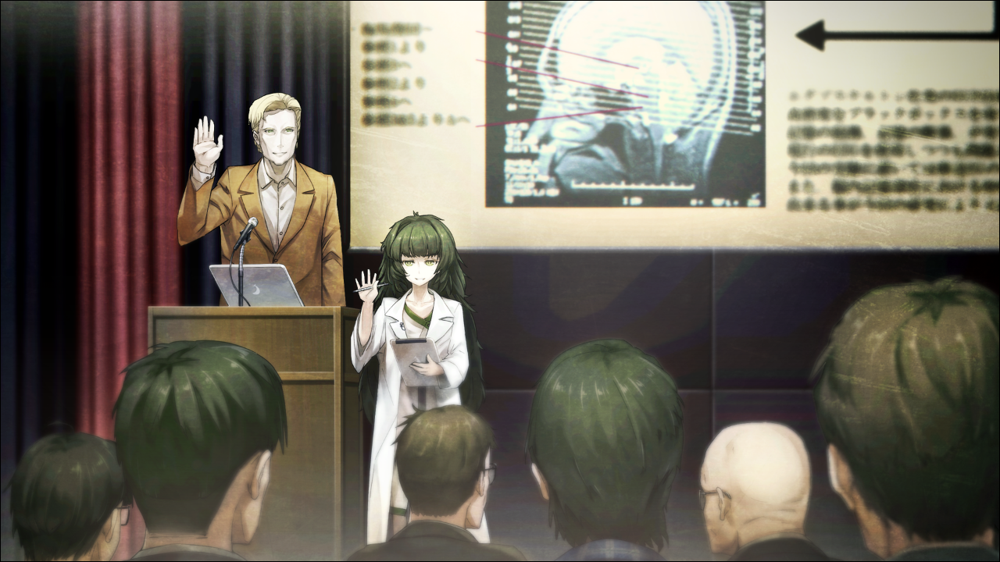
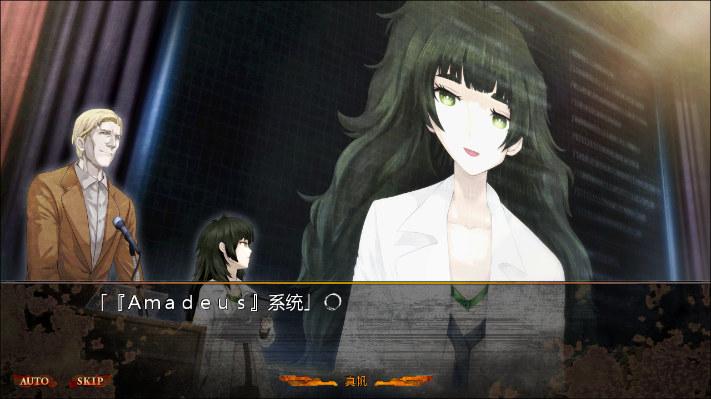

> <big> **零化域的缺失之环 - 02** </big>  
> 1.129848  
> [ 2010/11/23 ] 研讨会前半程，红莉栖论文被质疑，冈伦爆发。

平复心情的时候接到了真由理的***RINE***。  
这是最近才火起来的一种即时通讯软件，比邮件更加方便，所以用的人很多。  
『嘟嘟噜~冈伦~研讨会的准备还顺利吗？』  
「啊啊，没问题」  
『是吗？真好呢~  
&emsp;很期待是怎样的研讨会呢  
&emsp;真由喜也想看看啊~』  
「对你来说可能太难了」  
『说的也是呢~那么，就不打扰你啦，再见~』  
字里行间都充斥着真由理那无忧无虑的风格啊。  
多亏了她，15分钟感觉也没那么难过了。  

前台上，堆着分发给研讨会参加者的小册子和宣传单，还有资料的折叠传单。  
《疑似科学的系谱和中钵论文》，这是井崎准教授的研讨会宣传册。  
《中钵论文》——那个男人在俄罗斯发表的论文，记载了关于时间机器实用化的理论。  
在那个命运的7月28日，中钵从亲生女儿那里夺去了论文并且带走。  
我是知道这件事情的——只有我和中钵知道。  
我试着翻了翻宣传册，简单介绍了20世纪之后的很多疑似科学和伪科学，姑且可以当做奇闻读物来看。作为这个系谱的最尖端，在后半场华丽登场的，就是俄罗斯的《中钵论文》，井崎这样下结论道。简而言之，就是中钵博士的事件及其理论完全没有被明面上的学会所认可。不惜排除自己的女儿都要得到的地位、权威和名声，这个男人一样都没有得到。而且就听到的传闻来看，他在论文发表之后就被俄罗斯的研究设施软禁了起来。听说他还以为自己会得到很好的待遇，这就显得更为滑稽。有一段时期，被许多伪科学杂志报道和采访，他也沉醉其中。讽刺的是，《中钵论文》实在是太过正确，并且富有革命性。因为害怕这论文泄露到其他国家，以俄罗斯对外情报厅未收，俄罗斯对此实施了严格的情报管制。尽管如此，在水面之下，围绕着论文的情报战争已经开始了。从2036年回来的旅行者，约翰·提托都这样说了，应该就是这样没错。  
世界会就这样进入第三次世界大战吗？  
现在考虑这些也没用。  

那之后的几个小时，演讲顺利的进行着。井崎准教授的研讨会之后，电大学生大部分都回去了，我为了消磨时间并且听听维克多·孔多利亚大学的演讲继续待在这里。想着时间还早，我在走向会场的途中，正好看到了从职员室出来的比屋定真帆。她旁边有一位身材特别高大的外国男性，那个人就是阿莱克西斯·雷斯吉宁教授吗？听起来不像是美国人的名字，可能和红莉栖一样是其他国家来的移居者或是移民的后裔。  
虽然没有想要偷听，但看到两人表情严肃的边走边说，我也忍不住关注起了谈话内容。对话自然是用流利的英语，所以我没怎么听懂。但是从谈话的声调上可以听出来那并不是什么轻松的话题。话说刚才在谈话当中好像有听到“牧濑”这个单词……真痛恨自己蹩脚的英语能力。就在这样的谈话当中，二人走进了在UPX剧场旁边的演讲者准备室。我将自己好不容易听到的信息的片段试着整理起来。“红莉栖家发生火灾”，“牧濑夫人平安无事”，“强盗”，“警察停止调查”，“为什么FBI会来”，“真奇怪”。大概是在说这样的事。红莉栖的家……这样说是指在美国的住所吗？红莉栖的母亲就应该住在美国。那里发生了火灾？强盗、停止调查还有FBI什么的，这些可疑的词汇让我非常在意。  
在我心情一团乱的时候，演讲开始的时间到了。没办法，我只好走进了剧场。  

虽然根据刚才进入剧场的人流就可以大概推断，现场的气氛相当高涨。同大学生带有升级或者毕业而获取学分目的而来参加的井崎教授的研讨会的氛围明显不同，对尖端科学感兴趣的听众，以及像是研究者的人，几乎占满了整个会场。这可能是因为最近维克多·孔多利亚大学的研究者们接二连三的在《*Science*》杂志上发表论文，一跃成为了众人瞩目的焦点吧。  
哪里有空座位呢？这样想着我在角落发现到了一个空位。但是看到旁边座位上的人，我又差点喊了出来。  
桐生萌郁，又是你吗……  
她完全不和周围的人交流，仅仅是一直在用放在大腿上的手机打着字。看样子我曾经命名为“闪光的指压师（*Shining Finger*）”的高速拇指功力仍然健在。究竟在和谁联络呢？完全想象不到。  
我像是逃一样的离开了那里，寻找另外的空位。  
几乎就在我坐下的同时，雷斯吉宁教授和比屋定真帆出现在了讲台上。  

现场一下子爆发了热烈的掌声。但是看到随后出现的较小少女，掌声变成了窃窃私语。对于比屋定真帆来说，这种反应想必是意料之中吧。她带着平常的表情站在教授旁边。  
教授拿着话筒环视现场的样子，看起来相当的老练。  
“*Ladies and gentlemen……*”  
雷斯吉宁教授用英语开始了演讲。  
而比屋定真帆则在教授的示意后，恰当地开始了同声传译。  
真帆（同传）：“感谢各位，今日出席本人的研讨会。  
&emsp;&emsp; 我是维克多·孔多利亚大学，脑科学研究所的阿莱克西斯·雷斯吉宁。  
&emsp;&emsp; 专业是，脑信号处理系统以及人工智能理论。”  
“然后，我是其助手比屋定真帆，在教授的指导下在脑科学研究所研习中。请多指教。”  
最后一句是比屋定真帆本人的自我介绍。  
观众席上又产生了一阵骚动，和我第一次遇到她时相同的反应。  
嘛，会有这样的反应也是很正常的嘛。  
真帆（同传）：“那么，事不宜迟，向各位介绍我们最新研究的一部分吧。  
&emsp;&emsp; 虽然这次的主题是‘人工智能革命’，  
&emsp;&emsp; 但我们接下来要演示的系统，恐怕会超乎各位的想象。”  
雷斯吉宁教授站在讲台上准备好的笔记本电脑前，开始操作键盘。  
真帆（同传）：“这台电脑，现在正与我们研究所中的一台超级电脑连接着——  
&emsp;&emsp; 啊，先不要用投影仪播放出来！”  
好像是正在启动一些重要的程序，比屋定真帆代表教授制止了工作人员的投影。  
真帆（同传）：“很抱歉，因为还在开发途中，极度欠缺美感的程序会溢满屏幕的。  
&emsp;&emsp; 被人看到如此廉价的程序我会很不好意思，比被看到裸体还要不好意思。  
&emsp;&emsp; 在座的各位中有工程师的话，就会很理解的吧？”  
一部分明白了雷斯吉宁教授玩笑的听众发出了笑声。  

真帆（同传）：“在启动期间，就让我来说明一下系统整体的概述吧。”  
在讲台中央还设置有另外一台投影仪，画面放映出了概略图，图片上还带有为了方便一般听众理解的日语翻译。  
**《关于蓄积在颞叶的记忆相关神经脉冲信号的解析》**  
……！  
对我来说，这标题再熟悉不过了。就是想忘也忘不掉。  
这是由一位17岁天才少女写成，发表在《*Science*》杂志且广受好评的论文的标题。  
解析了全部掌管着人类记忆的神经脉冲模式的她，应用这些知识，成功的将记忆转化成了数字信号。并且，就在我面前，完成了**时间跳跃机**这一划时代的发明。  
虽然已经不存在了。不论是时间跳跃机还是发明者本人，在这条世界线上都不存在了。  
真帆（同传）：“因为曾在《*Science*》杂志发表过，所以在座各位中也有人了解的吧。  
&emsp;&emsp; 这是我们小组中一位天才般的日本研究者提出并完成的。”  
说到这，比屋定真帆好像发出了一声连自己都没察觉到的叹息。然后继续同传的工作。  
真帆（同传）：“人类的记忆是由大脑皮质，尤其是颞叶所记录，类似于闪存一样的东西。  
&emsp;&emsp; 而对那个磁盘进行记忆读写的，就是位于颞叶处被称为海马旁回的部位。”  
雷斯吉宁教授边说边指向投影出来的大脑和海马体的图片。  
真帆（同传）：“大脑，是在被称为神经元的细胞之间，以传导电子信号来活动。  
&emsp;&emsp; 所谓的记忆过程，实际上就是这种电子信号传导的一种，由海马体来控制。  
&emsp;&emsp; 即是说，正因为电信号一直在海马体出入，才会有记忆的形成。  
&emsp;&emsp; 而牧濑红莉栖——那个，是指这篇论文的作者——嗯……牧濑研究员考虑到……  
&emsp;&emsp; 那个……通过海马体的电子信号，根据电子信号的类型，和大脑皮质的……”  
比屋定真帆的翻译突然乱了节奏，突然变得语无伦次起来。  
即使有如此高超的语言功力，长时间进行同声传译相比也是十分辛苦的。我在网络上看过报道，说即使是同声传译的专家，最多20分钟就是极限了。在国际会议和海外直播的同声传译工作都是由多个人轮流担任的。  
但除了这个原因我还有一种感觉。之所以突然乱了节奏，是因为出现了红莉栖的名字？  
雷斯吉宁教授察觉到了比屋定真帆的动摇，暂停了演讲。  
比屋定真帆简短的道了歉，然后演讲继续。  
真帆（同传）：“牧濑研究员，着眼于出入海马体的电子信号模式，  
&emsp;&emsp; 哪个类型对应于大脑皮质中的哪项记忆呢？  
&emsp;&emsp; 随着分析，终于得到了完整的数据。  
&emsp;&emsp; 据此，将记忆这种暧昧的模拟量，转换成电子信号模式的组合这种数字量。  
&emsp;&emsp; 基础理论得以确立，这就是她在《*Science*》杂志上所发表的论文内容。”  
比屋定真帆又是一声不易察觉的叹息。  
真帆（同传）：“然后现在，我们的小组，正以此理论为基础，  
&emsp;&emsp; 开发能够把人类记忆作为数据取出的系统。”  
剧场内产生了微微的骚动。  
真帆（同传）：“即是——将人类的记忆保存到电脑，并加以活用的系统。”  
剧场内的骚动更大了。  
是吗……红莉栖的研究，在她死后还被好好的继承下来了啊。  
这应该也是理所当然的事情吧。  
在α世界线上我亲身证实过的，时间跳跃机的基础理论。  
那时候，毫无疑问我的记忆是被数字化并储存在了电脑中。  
眼前的雷斯吉宁教授所讲述的，正是这一实践的基础技术。  
真帆（同传）：“现在，我们所进行的项目主要为两个方面，一是应用于医疗方面……”  
说着，切换了投影仪的影像。  
真帆（同传）：“现在显示的是我们与精神生理学研究所共同进行的项目。  
&emsp;&emsp; 将保存在电脑中的记忆数据，通过海马体再次写入原本的大脑中的……”  
“难以置信！”  
坐在第一排的一个像是研究生的男子，忍不住发出了赞叹。  
雷斯吉宁教授对这无礼的打断却没有表现出不快，而是柔和地回答。  
真帆（同传）：“确实难以相信，这种心情我能够理解。  
&emsp;&emsp; 如果我处在各位的立场亦会如此吧。  
&emsp;&emsp; 不过，我们也在此研究中感受到了它的价值。  
&emsp;&emsp; 如果此技术能够实用化，将会是多么美妙呢？  
&emsp;&emsp; 比如，老化所带来的记忆障碍，还有老年痴呆等，  
&emsp;&emsp; 对这些病症的对症疗法值得期待。  
&emsp;&emsp; 程序会将患者的记忆作为数据自动备份，  
&emsp;&emsp; 即使记忆丢失，只要与电脑连接，重新将数据覆盖回脑内即可。  
&emsp;&emsp; 为此，我们设想，这是不是能够帮助人们延缓遗忘的进程。  
&emsp;&emsp; 最终，就可以让海马体随时与PC里的记忆数据连接。  
&emsp;&emsp; 那样，在丧失大脑机能的状态下，比如大脑受到强烈损伤而萎缩，  
&emsp;&emsp; 即使变成那种状态，也能让人脑的机能继续维持运作。  
&emsp;&emsp; 正如同外接存储器一样。”  
大厅被异样的氛围笼罩着。  
对于自己好像见证了一个不得了的技术的发布的震惊，  
和对于这种技术是否只是纸上谈兵而不可能实用化的怀疑，  
以及对于这样操纵人类大脑产生的厌恶感，
诸如此类的种种感情掺杂在一起而成的兴奋，在人群中传播。  

于是，雷斯吉宁教授把大大的手掌举起来，做出请大家举手示意的动作。  
真帆（同传）：“看来，在解释第二个项目之前，我们需要先来回答一下各位的疑问呢。  
&emsp;&emsp; 我会尽可能地作出解释。请。”  
立刻，许多人把手举了起来。看来从年轻者到年长者，许多不同的人都对于这项技术有着强烈的好奇心。  
雷斯吉宁教授指向提问者，示意提出问题。  
最初的问题是这样的：在把模拟化的记忆作为数字信号记录的过程，需要进行采样。而这是不是代表有被舍弃的信息呢？  
对于用日语提出的疑问，教授很快点头，并立刻用英语开始了回答。或许他能听懂日语吧。  
真帆（同传）：“你的问题换一种说法，  
&emsp;&emsp; 是指在将交响乐的现场演奏保存成 *.wav* 格式时，  
&emsp;&emsp; 无法将现场演奏的所有要素都完美的记录下来吧。  
&emsp;&emsp; 确实，我们也有此疑问，这也是现在的研究中最困难的一环。  
&emsp;&emsp; 脑内的网络，只看神经递质的ON和OFF，  
&emsp;&emsp; 也就是说，看做二进制的数据交换的话，  
&emsp;&emsp; 就是简单的问题了，因为那就跟数字化的数据是一样的。  
&emsp;&emsp; 但实际上我们知道，  
&emsp;&emsp; 神经递质和电信号在大脑中是以模拟信号的方式产生变化的。  
&emsp;&emsp; 关于这个问题，目前我们只有使用更高的采样率这种解决方案。  
&emsp;&emsp; 用音乐来比喻的话，  
&emsp;&emsp; 比起44.1kHz采样作品，听众更愿意选择48kHz甚至96kHz。  
&emsp;&emsp; 由此，尽管是数字信号，也可以得到和模拟信号更为接近的信息。”  
些许的失望感在听众间传播开来——果然只是纸上谈兵，不可能实用化吧——之类的。  

接下来又有几个人提出了问题。每个人的提问都是对教授的研究持否定的态度，并且表达方式多是让人怀疑是否是挑衅性质的。就连在一旁听着的我都忍不住烦躁起来。这既是雷斯吉宁教授的研究，同时也是和红莉栖相关的研究。这技术的实用性我是最清楚地知道的，所以我无法原谅那些不经大脑就横加否定的人。这些家伙，真的是研究者吗？  
我压抑着自己的情绪，把目光移回讲台。……难道她也在生气？比屋定真帆明显一脸不高兴的表情，与雷斯吉宁教授对于无礼的提问，承认其中的问题点并柔和地回答的做法形成了鲜明的对比。而她翻译的话语中也能听出些许话中带刺的感觉，这让我对她稍稍有了一些亲近感。  
问答环节还在继续进行，又有一个人十分傲慢地在说着：  
“说到底，把这种东西用在医学上根本就是无谋之举吧！  
&emsp;&emsp; 把数据写回大脑什么的，绝对办不到！简直疯了！  
&emsp;&emsp; 《*Science*》杂志上的那篇论文我也看过了，还是难以置信。  
&emsp;&emsp; 更别说，第一作者只是个**区区17岁的女性而已**——”  
对于这番话，我是绝对不能当做没听到的。  
“我说你啊——”  
台上的比屋定真帆好像试图反驳那位没礼貌的质问者，可我已经控制不住地站了起来怒吼：  
“我有异议！”  
“诶？！”  

在讲台上的两人，以及现场所有的听众，都一齐看向突然发作的我。  
“都不去试试，能明白些什么？  
&emsp;&emsp; 这世上不是有很多一开始都觉得办不到的技术吗？  
&emsp;&emsp; 但是，不正是有着克服困难得到结果的研究者们，才会有了现在的科技吗？  
&emsp;&emsp; 只是一味批判的话，是不会有进步的！”  
会场突然安静下来。但是，对于在这种情况下站起来这件事我并不后悔。  
只是忽然怀念起，那个同样是在研讨会上被我突然起立发言打断，却机智地反问我到哑口无言的某个17岁天才少女。——当然那是别的世界线上的事了。  
“你……”  
讲台上的比屋定真帆呆呆地看着我。  
雷斯吉宁教授则是向视线对上的我露出洁白的牙齿，显然是在微笑。  
雷斯吉宁：“*Awesome! He's really something!* ”  
一边这样说着，一边很高兴的样子独自鼓起掌来。  
“哎？”  
为，为什么鼓掌？  
得到这样的反应，岂不是更羞耻吗？  
真帆（同传）：“唉……真棒！他还真是个了不起的家伙！……这般。”  
比屋定真帆不知道是无奈还是欣慰的长出了一口气，然后特意面朝我翻译了教授的话。  
真帆（同传）：“只是身为科研人员必须时刻保持冷静。  
&emsp;&emsp; 能够大声嘶喊的时候，就只有试验成功的时候——  
&emsp;&emsp; ‘我们做到了！’  
&emsp;&emsp; 只要这句话就足够了。……这样子哦。”  
“对，对不起……”  
我连忙低下头，坐到椅子上。  
本来以为现在的自己很冷静，果然还是气血上涌了。相比半年前毫无成长。如果红莉栖还在的话，我又会被她狠狠的嘲讽了吧。周围听众投来冰冷的视线让我好痛苦，如果可以的话真想现在就退场。但是因为很在意雷斯吉宁教授接下来的话，就没能动弹。  
真帆（同传）：“嗯，那么各位，差不多该继续了。  
&emsp;&emsp; 不过在此之前，让我们先为那位勇敢的人鼓掌吧！”  
现场响起了稀稀拉拉的掌声。喂喂，饶了我吧。  
真帆（同传）：“正因为有着他这样的挑战者，才会使科学进步，  
&emsp;&emsp; 并得出让所有人事后震惊的理论。  
&emsp;&emsp; 他，也许能成为第三位爱因斯坦呢。  
&emsp;&emsp; 顺带一提，第二位爱因斯坦呢，是现场我的这位有点小啰嗦的助手。  
本来一本正经翻译的比屋定真帆突然反应过来，向教授抗议道：  
“……教授，请不要说些奇怪的话。”  
整个会场响起一阵小小的笑声，缓解了刚刚被我弄得有些尴尬的气氛。  

真帆：“那么，我会暂时停止翻译工作了。  
&emsp;&emsp; 接下来，会有比我更优秀的翻译登场。  
&emsp;&emsp; 这就是，我们小组，现在最为用心进行的第二个项目——”  

 

> (to be continued)
---

| [←prev](./0001) | [home](../../) | [next→](./0003) |
