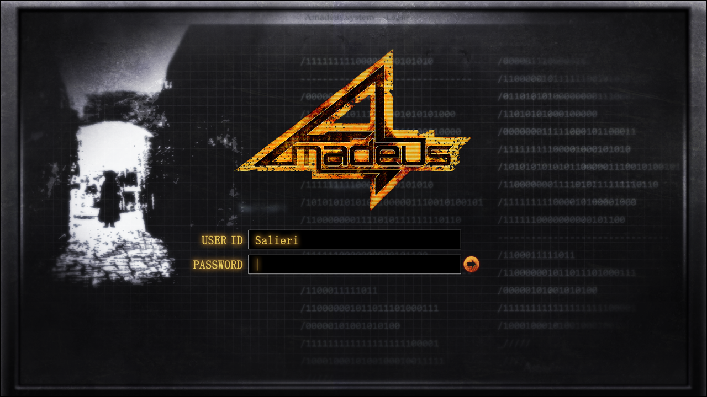

> <big> **零化域的缺失之环 - 05** </big>  
> 1.129848  
> [ 2010/11/28 ] 又一次？第一次？见到“红莉栖”。  

ATF上的派对结束以后已经过了几天。

从池袋开始急行10分钟，然后从堉玉县的和光市站坐10分钟的巴士。在独立行政法人“理化学研究所”旁边不远的地方建造的大楼二楼，就是目的地了。  
【脑科学综合研究机构·日本办公室准备室】  
入口处的牌子上是这么写的。  
不单单是要用三种特殊钥匙解锁，最后还得用上安全卡，好不容易算是进来了。  
“这里是？”  
“各国的脑科学家联合，准备创立全新的机构。由我们研究所来主导呢。”  
比屋定真帆一边这么说明着，一边当着向导。  
这件办公室应该还没有租用多长时间，摆在这的办公位也基本是空的，没什么人用过的迹象。连白板都没有，给人感觉很煞风景的房间。因为房间朝向北面，光线也很糟糕。被日光灯那枯燥的光照亮的室内，也是种冷的要死的气氛。  
“这里怎么说也只是准备室而已啦。”  
在许多的空桌子当中，有两张桌子上放有书籍之类的东西。在那当中的一个，被笔记啊计算机啊咖啡杯啊还有营养品瓶子什么的，总而言之被各种东西弄得非常杂乱的桌子上，放着比屋定真帆的包。那就是说，另外一个整理的很干净的桌子那边，就是雷斯吉宁教授的东西了吧。  
“教授呢？”  
“今天休息。”  
啊，今天是星期天来着。  
“你也是？”  
“是啊，要不是那样的话，怎么可能一直睡到午后嘛。”  
确实…刚才在和光市车站前面的宾馆那碰面的时候，是一脸睡眼惺忪的样子走出来的。  
我今天就如同雷斯吉宁教授提议的那样，是为了见到『Amadeus』的“红莉栖”而来的。有关测试员的相关内容，在一路走到这里的过程中已经从比屋定真帆那大概了解了。简单来说，好像是『Amadeus』需要对话样本数据，于是要给我创造一种24小时随时能与之对话的环境的样子。更加详细的我就不知道了。  
要24小时，随时与『Amadeus』的“红莉栖”对话吗……  
“那家伙……就在这里吗？”  
“是啊。”
比屋定真帆点着头，往我这里瞥了一眼。  
“你刚才，是用“那家伙”来叫的吧？”  
“欸？啊……”  
“看起来比起我预想中的，你们俩好像更亲近一些嘛。”  
“……”  
不回答这件事本身，可能就是一种回答吧。  
对于这种态度的我，她表现出了些许犹豫。  
“那样的话，可能还是放弃见她这件事比较好哦……”  
“为什么呢？”  
“那个系统……对于越是亲近的人，就越显得残酷。”  
“……没事的。”  
“……（叹气）知道了，不讲这个了。那么相对的，有一点你要做好觉悟。  
&emsp;&emsp; 读取的记忆，是建立在红莉栖最后更新的3月那时候的数据基础之上的。  
&emsp;&emsp; 所以，3月以后，比如问她在日本留学时候的事，是完全沟通不了的。  
&emsp;&emsp; 而且，从3月开始到今天为止的这段时间，我跟教授也有好几次启动过。  
&emsp;&emsp; 这段时间里‘红莉栖’——啊，是『Amadeus』的那位‘红莉栖’  
&emsp;&emsp; ——累积了和原本的红莉栖不同的记忆。  
&emsp;&emsp; 从我们这听到的那些话，在网络上检索到的情报，  
&emsp;&emsp; 跟各种不同的人发生不同的对话什么的…诸如此类的东西。  
&emsp;&emsp; ……  
&emsp;&emsp; 总之，接下来要遇见的这位，  
&emsp;&emsp; **不是那个曾经和你是朋友的牧濑红莉栖**。  
&emsp;&emsp; 这也是这个系统的一个问题所在，往往是这边——也就是人类这边，  
&emsp;&emsp; 反而会产生混乱。  
&emsp;&emsp; 就像是，会陷入那种跟真正的红莉栖在这个瞬间聊天的错觉般。  
&emsp;&emsp; 对这些非共有记忆产生的不协调感，反倒会让这边的大脑跟不上的。”  
会把显示跟虚构互相混淆……非共有的记忆产生的不协调……这样么……  
那种感觉的话，可是已经清楚到让我厌烦的程度了啊。  
***Reading·Steiner***  
只有我才拥有的，会让自己和他人的记忆产生差别的力量。  
“带路吧。”  
比屋定真帆小小的点了下头。  
“在这边哟。”  
往房间的里面走了过去。  
在前面的是个被很厚的隔墙给分开的一个隔间。  
为了进入这个隔间，还要用到跟刚才进入准备室用的不同的卡片钥匙，然后则是密码。  
“还真是戒备森严啊。”  
“现在这个时代，企业间谍可是最可怕的了。”  
比屋定真帆将密码输入以后，门上的锁解除了。  
“请进。”  

隔间大概有四个半榻榻米那么大。有一张雪白的桌子，上面摆着一台30英寸左右的一体机电脑，以及配套的鼠标键盘，另外还带有音响与可转动的摄像头。  
“稍微往后面坐一下。”  
好像是为了方便参观在电脑上进行的工作，房间后面放着一个小小的沙发。我坐了过去。  
比屋定真帆将电脑接通电源，开始敲击键盘。不一会画面上就出现了“Amadeus System”的字样。输入ID的时候看见了，“Salieri”。  
萨列里？*Amadeus* 和 *Salieri* 吗？ 究竟意味着什么呢。  
话说，在《Amadeus》这部著名的电影里，有一位嫉妒、厌恶、憎恨<abbr title="沃尔夫冈·阿马德乌斯·莫扎特，德语 Wolfgang·Amadeus·Mozart，1756.1.27—1791.12.5。">莫扎特（*Amadeus*）</abbr>的才能，却从心底里醉心于他的登场人物。这位人物，就是<abbr title="安东尼奥·萨列里，意大利语 Antonio·Salieri，1750.8.18—1825.5.7">萨列里（*Salieri*）。</abbr>  

“别偷看密码哟。”  
比屋定真帆用自己的身体挡住了手。我则把视线错开。  
登陆系统的过程完成以后，显示器上出现了只有命令行的一点装饰都没有的漆黑画面。  
“准备好了吗？”  
“啊啊，拜托了。”  
比屋定真帆在命令行里输入了几个命令。  
“不好意思，这个部分暂时还不能让你看。”  
“嘛，我就算看到也全都看不懂啊。”  
“姑且，还是不看吧。”  
显示器被小关了一下。  
比屋定真帆将椅子转过来对着我  
这才发现，自己的手已经紧紧地握成了拳头。  
是从什么时候开始的？手心已经满是汗水，拇指根部留有指甲的痕迹。  
搞不好，我在无意识之中，在紧张么。  
“呼……”  
“怎么了吗？”  
“啊，没什么……到了现在却有点害怕起来了。”  
“还来得及哦，现在马上从这里出去也是可以的哦。”  
“……真是坏心眼啊。”  
“是吗？我明明是在担心你呢。”  
“那么，总得说几句像样的话比较好吧。红莉栖也好你也是，最爱实验少女都是——”  
一瞬间，就像以前那样一不小心就从嘴里说出了不像样的俏皮话。  
我慌张地改变了口气。  
“咳咳，一天到晚忙于实验的家伙，一点都不可爱。”  
“刚才的发言可是明显的诽谤跟中伤啊，我能以侮辱罪起诉你吗？”  
“别这样，很吓人的。”  
“我可是认识很棒的律师哟，介绍给你怎么样？”  
“在那之前请先取消起诉这件事。”  
“想要调解私下解决的话，那就做好付出相应金额的觉悟吧。”  
“待会请你喝Dr. Pepper就是啦。”  
“真廉价。”  
比屋定真帆发出咯咯的声音，好歹是笑了。一般来说这应该是让人觉得不礼貌的小动作，但是很不可思议的对于面前的少女——不，应该是很出色的成年女性才对——并没有那种不快的感觉。比屋定真帆，她身上那种科学家特有的难以取悦的感觉很是明显，总是好像哪里不开心，给人以强烈的难以相处的女性的印象。但出乎意料的是，她也有这样让人讨厌不起来的一面。  
啊啊，原来是这样——  
她，比屋定真帆——  
跟红莉栖很像啊……  
第一次见到红莉栖的那时候，果然也是这样的。  
又傲慢又让人讨厌的家伙，绝对不允许自己的说法被曲解，又顽固，又一根筋，说她一句就会吊起眉毛来不停地辩论，针对一字一句总要反驳。  
曾经发自内心的觉得，这是多么不可爱的女人啊。  
然而，那份第一印象的背后，红莉栖的内在却是那么的脆弱，容易受伤。而且，一直都是那么的温柔，那么惹人怜爱——  

“有什么奇怪的吗，学姐？”  
突然，从喇叭里想起了女性的声音。  
“啊……！”  
禁不住，从沙发上坐起了身。  
我很清楚……这个声音。  
不可能会忘掉！  
不可能会忘——  
比屋定真帆的手把显示器打开了。  
在画面里，我一辈子也不可能忘记的她的身影，慢慢地浮现了出来。  
是模拟出了她在脑科学研究所活动时的样子吗？她的身上，穿着白大褂。  
电脑的摄像头自动往我这边看了过来。  
“那个，学姐，这位是？”  
比屋定真帆把我介绍给了她。  
我的耳朵已经无法接收声音。  
仅仅眼睛看得出神。  
就算是现在，也好想把手伸过去。  
想要去触摸她。  
在那里的——  
她，就在那里。  

“请多关照！”  

 

> (to be continued)
---

| [←prev](./0004) | [home](../../) | [next→](./0006) |
