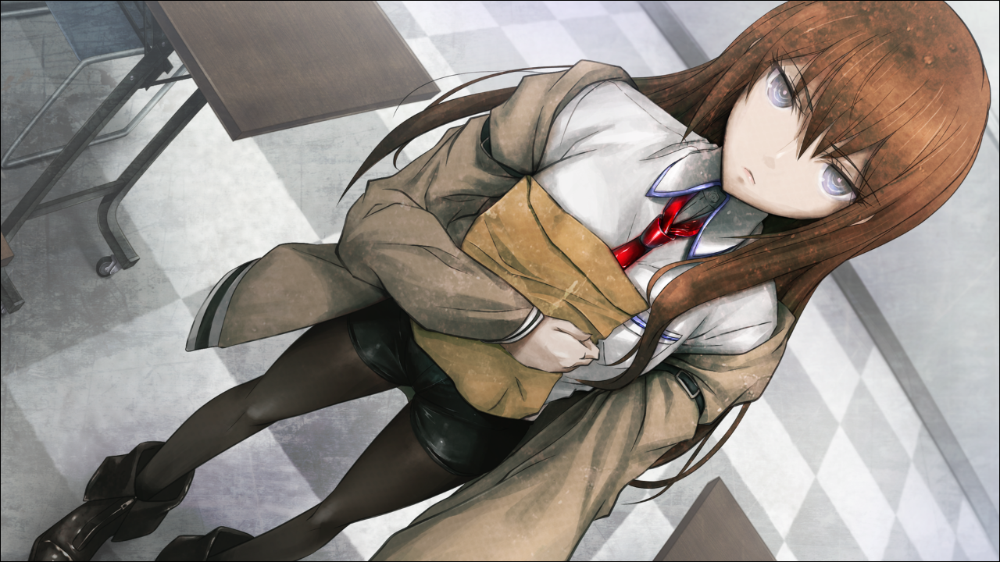
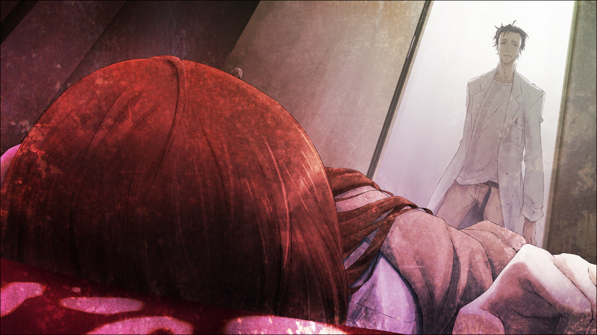
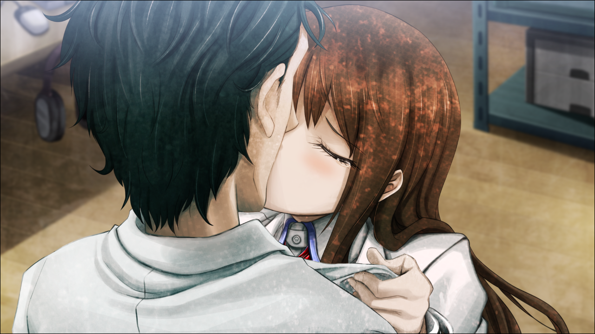
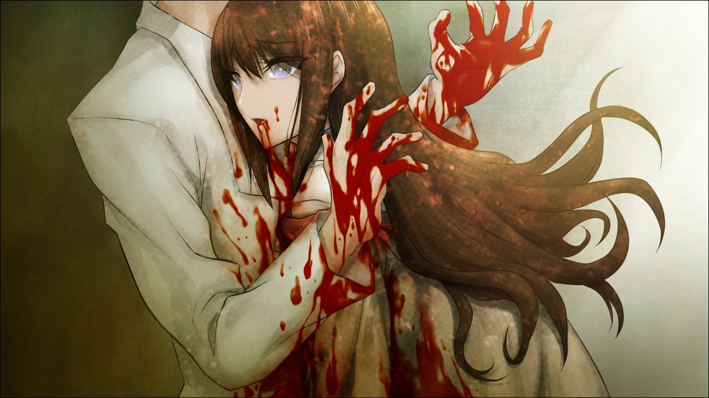

> <big> **闭时曲线的碑文 - 01** </big>  
> 1.129848  
> [ 2010/11/29 ] 心理治疗，而后跟真由理到秋叶原见菲利斯和琉华子。  

“来吧，冈部先生。请放松一点。  
&emsp;&emsp; 把我的声音化作桥梁，下落着回到过去。  
&emsp;&emsp; 你一点一点，一点一点的落下去……  
&emsp;&emsp; 一会儿你会看见一阵温和的光芒……”  
这是在做梦。白日梦。我对于自己正在接受心理辅导的事实有着清晰的。把身体交托给沙发，尽量使内心慢慢冷静下来，照着心理医生说的那样，想象着景色。  
“那光看上去是什么颜色的？”  
“红色。”  
“红色吗？原来如此。  
&emsp;&emsp; 在那阵光芒当中，站着对你来说很重要的人。  
&emsp;&emsp; 那是你的家人吗？”  
“并不……”  
“那么，是朋友？还是恋人？”  
“恋人……不，不是恋人。连朋友都不是……”    
“那么，是怎样呢？”  
“我和……那家伙是……”  

脑海中突然如同间歇泉喷发一般，一下子，各种各样的回忆喷涌而出。  
被第一次见的红莉栖拽出讲座，奇怪的问我刚刚要跟她说的话是什么；  

最初见到红莉栖倒在血泊之中的我发出震惊的声音；  

“说吧，我知道你已经时间跳跃过了。”——  
红莉栖背对夕阳站在天桥上，向无尽轮回中的我伸出救赎之手；  

“拯救真由理吧。  
&emsp;&emsp; 到β世界线去，到真由理不会死的世界去。  
&emsp;&emsp; 不单单是为了你，也是为了我啊。”——  
昏暗的广播馆楼顶走廊，浑身湿透的红莉栖帮我下定决心；  

“冈部……你，会…记得…我吗？”——  
怎么可能忘记，在LAB两人独处时笨拙的吻，与红莉栖的呢喃；  

“……我……会死……吗？……不想……死啊……”——  
这是浑身是血倒在我怀中的红莉栖留给我的最后一句话。  

杀了她的人……是……  

“啊啊啊啊啊啊啊啊啊啊啊啊啊啊啊啊啊啊啊！”  
“冈部先生！？”  
“是我刺进去的！是我！是我啊！！！”  
“听好了，我会拍一下您的肩膀，以此为信号让您清醒过来！3、2、1，嗨！”  
随着乓的一声，两肩感到一阵振动。  
红莉栖痛苦的样子一瞬间就消失了，然后能感觉到自己的意识开始慢慢的恢复清醒。  
“呜……”  
缓慢的抬起倚靠在沙发上的身体。突然传来的一阵眩晕感，让我往前一倾。  
“您没事吧？请稍事休息，我马上就去拿毛巾来。”  
心理医生从诊疗室走了出去。  
这才发现全身已是汗如雨下。室内空调是关着的，所以能确定这不是因为温度高而冒的汗。  
“呼……哈……”  
精神科的催眠治疗，这应该是第一次体验。很奇怪的，身体觉得很重。  

到外面来以后，池袋的大街已经完全被夜幕笼罩。临近12月的现在，风真的是很冷。  
“感觉怎么样，冈伦？”  
正在用温柔的声音询问着我的女孩是椎名真由理，正在上高中的我的青梅竹马。今天特地陪我来这里做心理辅导。虽然我说了不用，但她还是从学校早退过来了。老是让她这么担心啊。大约三个月前，我光是为了拯救这个天然呆的青梅竹马，就已经费尽心力了。真由理对我来说，一直都是应当被守护的存在。但是现在，却让真由理担心着我。这次前来接受心理辅导，也是真由理强烈推荐的结果。  
“啊，也没什么大不了的。”  
为了让她安心而小小的撒了个谎。  
实际上，我被诊断为内心有着严重的心理创伤，因而强行中断了催眠治疗，转为接受心理辅导跟药物治疗。简而言之，就是说一边进行药物治疗的同时一边等待其自然治愈，除此之外没有什么更好的对策的样子。对于这个，是不是受到了昨天去比屋定真帆那看见的“她”的影响，我还不清楚。时间机器与世界线，还有与这些相关发生的那么多事情，不能跟心理医生说就这么直接接受治疗，对方说不定也不知道该怎么下判断。不管怎么说，就结果而言我决定不去考虑那么多东西。  
“呐真由理，晚饭还没吃吧？去吃点什么东西吧，我请客。”  
“啊，那样的话，去秋叶原怎么样呀？  
&emsp;&emsp; 琉华君跟菲利斯呢，想跟久违的冈伦见个面啊。”  
秋叶原……么。从这里要回我家的话用走路的就可以了，去秋叶原不是绕了个大原路吗。尽管这样，还是无法拒绝真由理的请求。  
“啊……好吧。”  
“真的！那我这就联络他们~”

夏天那会儿还会每天都来……倒不如说，基本是住下的秋叶原，最近一周来三次就算很多了。就算如此，也只是在从大学回家的路上顺便停一下买东西而已。  
从站前广场走了下去。  
池袋也是这样，因为离圣诞节还有一个月，相关的装饰也不是那么夸张。等12月的时候，就会变成一片圣诞节的景色了吧。那段时间，大概就会出现身着圣诞老人服装的女仆小姐了。  
在秋叶原散发传单，然后还穿着圣诞老人服的女仆么……  
从字面上来看也过于意义不明了。  

“啊！是菲利斯跟琉华君呢！嘟嘟噜~”  

 

> (to be continued)
---

| [←prev](./0005) | [home](../../) | [next→](./0007) |
