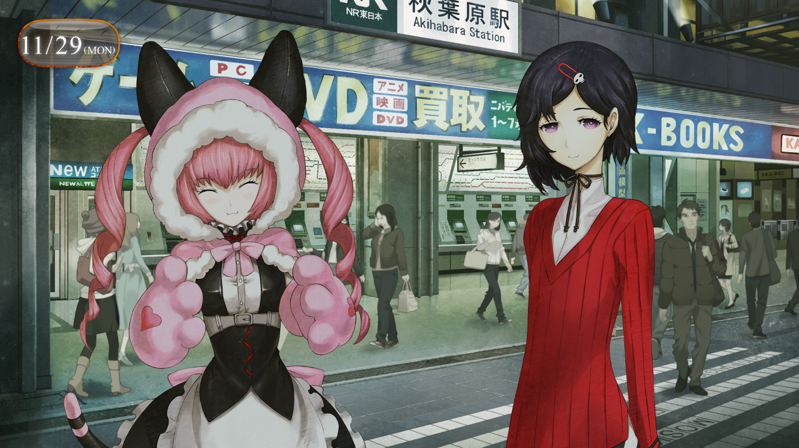

> <big> **闭时曲线的碑文 - 02** </big>  
> 1.129848  
> [ 2010/11/29 ] 四人谈话，约定「让铃羽笑起来大作战」的圣诞派对。

“呜喵~凶真~”  
“冈部先生~真由理酱~”  
已经汇合在等着我们的菲利斯跟琉华子，见到我们以后马上跑了过来。  
“真想见你啊喵~！”  
毫不犹豫地抱紧我的，是菲利斯·喵喵。虽然我知道这是所谓的“女仆小姐”模式用名，本名秋叶留未穗的她本人却一直强调说私下里也要叫她菲利斯。明明实际身份是堪称秋叶原地主的秋叶家的大小姐，却在自家的女仆咖啡厅 *MayQueen+Nyan²* 开心地作为金牌女仆工作着。今天身上也是和以前一样，穿着店里的女仆装。*MayQueen* 里到时候是不是也会换上圣诞服装呢？  
“别，别这样啦……大家都看着呢。”  
想把菲利斯从身上支开，但是却很难做到。干脆把头上的那个猫耳抢过来算了。  
“有什么不好的喵！毕竟是凶真和菲利斯的关系喵~”  
“才不好呢。还有啊，凶真什么的别那么叫了。”  
“为什喵？”  
“因为那个名字是黑历史。”  
“呜喵……（失落）”  
菲利斯看起来很不满的样子，还是当没看见好了。  
对我来说，“凤凰院凶真”已经是被封印掉的存在，当作已经消失掉的存在。“他”制造出了时间机器这种禁断的发明，因为这个原因被掌握世界的系统所惩罚。践踏了许多人的回忆，失去了重要的人，而“他”自己也收到了巨大的心理创伤而收场。不能让“他”再次苏醒。对我来说，已经不需要了。  
“那，应该怎么叫比较好喵？”  
“那当然是，冈部什么的……”  
“果然啊，还是叫冈伦这样的，更加可爱点是不是更好呀？是吧，菲利斯酱！”  
“嗯，真由喜这么说的话，以后就这么叫好了喵……虽然哪里还是有点违和感。”  
一边摆着还没完全接受的样子，菲利斯总算是从我这里抽开了身子。  

“琉华子也是，好久不见了啊。”  
“是啊……”  
琉华子很开心的微笑着。还是跟以前一样，像个女孩子一样的可爱啊……  
但是，是男的。  
他是真由理的同级生，经常能够看见他在自家柳林神社那儿帮忙的样子。实际上，“琉华子”这么叫本身就不太对来着。就像我跟菲利斯说不要叫我“凶真”那样，他也是有“漆原琉华”这么个名字的。但是，到了现在让我去叫琉华子“琉华”这样……那啥，还是……有点难为情。  
“总觉得，挺让人怀念的感觉啊。  
&emsp;&emsp; 我时常还是会去LAB那露个面，但是冈部先生，最近好像都没怎么过来呢。”  
“啊，啊啊……大学那研讨课很忙啊，还要做好ATF的准备什么的。”  
就算那些方面的准备都完成了，现在又多了雷斯吉宁教授跟比屋定真帆的事，还有就是……『Amadeus』那些事也是，完全没有什么空余的时间。  
但是，这个话题并没有对这三个人说。  
“还有就是，社团活动我也在参与的。”  
“加入了社团吗？”  
“什么样的社团喵？果然是UFO还是UMA之类的？”  
把我想成什么了……说起来，除了跟真由理，好像是没说过来着。  
于是我就故弄玄虚地对着菲利斯，把眼睛睁得浑圆地跟二人对视，挺胸宣言道：  
“是网球部！”  

“欸欸欸————？？”（×2）  
菲利斯跟琉华子的惊呼，让周围的行人都以为发生了什么的回过头来。  
“为，为什么，是网球部喵？”  
“冈部先生，到现在为止有什么时候打过网球吗？”  
“肯定是初学者啊。”  
与外表不同，我在运动方面真的很不擅长。长跑的话，甚至还有输给真由理的自信。  
“那，到底是为什喵？”  
“嗯——这说来话长……大学研讨课的准教授是网球部的顾问，然后就被拉进去了。”  
“根本一点都不长喵……”  
“嘛，听我说啊。因为对方是经常给我照顾的人，所以姑且去社团露个头。  
&emsp;&emsp; 于是，没想到我居然有着网球这方面的才能啊！  
&emsp;&emsp; 明明是个初学者，但是却把那群社团成员给连战连胜了。  
&emsp;&emsp; 怎么样，是不是很厉害啊？”  
菲利斯：“哈啊……”  
琉华子：“冈部先生，果然是很厉害的！”  
“哈哈哈，既然是这样的话，向着职业网球运动员的目标去也未尝不可啊！”  
真由理：“目标！温布尔顿！是吧~”  
菲利斯：“……”  
“嗯？怎么了吗菲利斯？头疼吗？”  
菲利斯：“该从哪里开始吐槽呢……不管怎么看，这都是社团为了拉新人而设计的陷阱啊喵……”  
“别，别直接说出来啊……  
&emsp;&emsp; 我好歹，虽然也有想过是不是有什么小九九——。  
&emsp;&emsp; 但也装作不去想的样子啊。大家都是好人啊。”  
琉华子：“那，社团的练习会很忙的吧……”  
“啊，没……练习基本上是没怎么去的……”  
琉华子：“啊？”  
菲利斯：“那，到底是在干什么喵？”  
“联谊……什么的……”  

“欸欸欸欸欸————————！！？？”（×2）  
两人又一次发出了响彻站前的大声惊呼，让我们沐浴在周围投来的目光之中。  
“也没必要那么惊讶吧，我好歹也是个普通的大学生啊。”  
“是，是这样的呢，对不起……但是……呜嗯……”  
琉华子扭扭捏捏的在那想要说点什么。  
“明明都已经有菲利斯了喵，却还跟其他的女孩子一起愉快的搞联谊……不可原谅喵！”  
“别搞错了啊，我对女孩子什么的并不……”  
实际上，虽然我也算成员之一，但那里并不是什么像我这种的临时现充能够待的地方。说到底，跟那群真现充根本不可能说得上话。在一群衣着光鲜的男女面前就只有我是一副不明所以的样子，这才是事实真相。对我来说实在是一种鲁莽的挑战……  
这件事也是，还是不要跟菲利斯他们说算了。  
“真好啊——真由喜也想跟冈伦联谊呢~”  
啥？真由理！？是应该有这方面兴趣的年龄吗！？  
“因为啊，是大家一起在快快乐乐的派对不是吗~？”  
……好像哪里不对。  
“呜喵……虽然应该是没错就是了，但是果然还是觉得哪里有些微妙的不同喵……”  
“在LAB怎么样啊？琉华君和菲利斯酱当然都要来。还有桶子君，绹酱和铃小姐也——啊！”  
真由理一脸做错事似的表情看着我。  

铃羽……么。  
阿万音铃羽，又称约翰·提托（*John·Titor*），从2036年来的时间旅行者。与现在正拼命要放弃抗争的我形成鲜明对比的，从不放弃的真正的战士。夏天以来，就没怎么再见到过她。是我主动要避开和她见面。我开始远离LAB这件事，也是有她现在正住在LAB里的这个原因的。毕竟到一个月前为止，我只要听到铃羽的名字，过去的记忆就会开始浮现，光是忍受这一点就让我精疲力竭。那件事之后过了3个月，虽然总算能够做到听到她的名字也没问题，但是直接见面的话，我仍旧没有能够保持冷静的自信。当然不是那家伙的错，也没有去责怪她的想法。所以，我希望铃羽也不要怪罪我。但尽管没有直接责备我，可是一旦被那家伙尖锐的目光看着的时候，心中就会出现像是罪恶感一般的感觉，这也是事实。  

“我，我说，大家？真由喜呢，有一个和桶子君一起考虑的作战方案！”  
“作战方案？”  
完全像是以前的我一样啊……  
“是什么样的作战喵？”
“那个呢——「让铃羽笑起来大作战」！”  
“欸？”  
真由理这家伙，突然说什么？  
……不，或许不是“突然”。这家伙也站在她的立场上一直在考虑着也说不定。  
因此我也，尽量明快的回答她：  
“说出来听听吧，真由理。”  
“嗯！那个呢，真由喜在想，铃小姐平时虽然看起来很可怕，其实说不定是非常温柔的人呢？  
&emsp;&emsp; 在LAB的时候呢，在沙发上迷迷糊糊睡着，不知什么时候盖上了毯子。  
&emsp;&emsp; 就算向铃小姐询问，‘那种事情我不知道’——她也只会这样回答我。”  
“啊，我也有这样的事情！以前，被父亲派去买东西，回去的路上正因为东西太重在烦恼。  
&emsp;&emsp; 然后，阿万音小姐正好路过，什么也没说，帮我拿了东西。”  
“欸，我还是第一次听说呢。”  
“她说，‘这种理所当然的事情，不要对别人说了’——啊，说漏嘴了……”  
“是吗……”  
α世界线的铃羽，一直用笑脸面对着大家，飒爽地骑着山地自行车的开朗的女孩子。与之相对的，这个世界线的铃羽，并不是那种经常让人看见笑容的类型。这是铃羽的经历的影响。根据从桶子那里间接听来的事情，因为第三次世界大战为契机实行的国民皆兵制度，铃羽似乎从中学的时候就开始接受军事训练了。在那之后，参加时间机器方面的反体制势力，投身于激烈的斗争中。由于这个的影响，就和发自心底的笑容无缘了。  

“原来如此啊……”  
“那，具体的话要做什么喵？”  
“圣诞晚会哟！”  
“圣诞晚会？”（×3）  
同步了！  
“不是马上就要圣诞节了吗？铃小姐呢，说从来没有去过圣诞晚会。  
&emsp;&emsp; 所以真由喜想把这个当作礼物送给铃小姐。”  
听到这话的菲利斯和琉华子，几乎同时点了下头。  
“这件事，我参加了喵！”  
“我也是！”  
“欸嘿嘿~谢谢！冈伦也……愿意参加吗？”  
“唔……这个……”  
“不行……吗？”  
“暂且不说我……铃羽应该不愿意吧？”  
不会再跳跃到过去。我这样说的时候铃羽的表情，就算到了今天也无法忘记。充满了愤怒和绝望的表情，就像刚抓到手的最后的希望从眼前消失的感觉吧。她那个时候对我说的话，现在也像锐利的刺一样扎在我的心上。  
“铃羽……很讨厌我的……”  
“真由喜并不这么认为哟。  
&emsp;&emsp; 铃小姐呢，是不是因为对冈伦发火的事情，在后悔着呢？  
&emsp;&emsp; 我想，她肯定是无法坦率地说出来这份心情的。”  
“是这样的吗？”  
“嗯，一定是这样的。”  
既然真由理都这么说了，也不能拒绝了吧。  
“知道了，我再考虑看看吧。”  
“嗯！”  

“那…那个，话说，冈部先生。”  
正好谈话告一段落，琉华子怯生生地问道。  
“……诊察，怎么样了？”  
琉华子大概是从真由理那里听说了心理咨询的事情。今天特意通过真由理想要见面，也许是在意诊察的结果吧。琉华子和菲利斯，也让她们担心了呢。在这个世界线，两人虽然不是LABMem，但作为无可替代的伙伴这一点并没有不同。  
“催眠疗法这样的虽然是初体验，真是相当有趣啊。  
&emsp;&emsp; 我至今为止都认为我不会中什么催眠术的，吃惊了。”  
“中招了吗？”  
“完全的呢。”  
“欸？”  
“琉华喵这样的人，催眠术之类的立即就会中招的样子喵。”  
“哪会……”  
“哈哈哈，确实会立即生效被干掉吧。”  
因为琉华子的性格很容易相信别人。  
话说，一直在这里长谈也不是个事，肚子也饿了，找家店吧。  
“呐，你们想吃点什么？我请客哦。”  
暂且，向着友都八喜方向走去。那边的话也有饮食街，可能正好。  
“太好了喵！凶真——不对，冈伦，真大方喵！”  
“非常感谢！”  
“欸嘿嘿~要吃什么呢~炸鸡吗~”  
“多汁炸鸡？”  
“真由喜满脑子全是这个喵。”  

一边走在结伴三人的后面，忽然考虑着，在这里，红莉栖在的话……明明，这数月中一直努力不去考虑那家伙的事情的。会这样想，果然是昨天的体验的原因吧。昨天，我看到的，那个表情和动作；和我说话的，那个声音和说话方式，让我回忆起来，和她的对话……  

 

> (to be continued)
---

| [←prev](./0006) | [home](../../) | [next→](./0008) |
