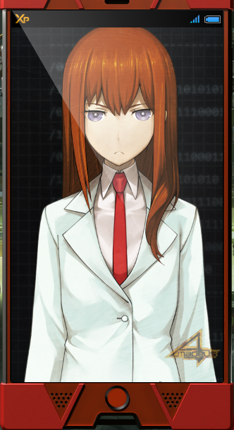

> <big> **闭时曲线的碑文 - 04** </big>  
> 1.129848  
> [ 2010/11/29 ] 与“红莉栖”的第一通电话。

我本以为自己已经做好觉悟，才接受的。  
但是，居然会变成这样，我完全没有想到……  
走去美食街的路上跟在三人身后的我正在纠结着的时候，电话铃声突然响了起来。  

“你好……”  
“这里是牧濑。”  

是的，这是『Amadeus』。教授给我安装的这个APP，让我可以无论何时何地，都能够通过我的智能手机连接到位于维克多·孔多利亚大学的服务器。  
“冈部先生这边当然可以主动联系‘红莉栖’，  
&emsp;&emsp; ‘红莉栖’也会联系你，到时候就请好好应对吧。”  
虽然当时比屋定真帆这样向我说明了，但是我没想到竟然会是这样。  
对方主动联系我什么的……并且人物竟然会显示在屏幕上什么的……  
“还是说，‘我是克里斯蒂娜’这样自我介绍会比较好呢？”  
好像……很是生气的样子。  
说来也是，包括最开始的一次，“红莉栖”的八次联络，我一次都没有接过。  
“具体情况我从雷斯吉宁教授和学姐哪里听说了，  
&emsp;&emsp; 所以才想说一开始由我这边打个招呼。  
&emsp;&emsp; 没想到竟然会被拒接八次！  
&emsp;&emsp; ……  
&emsp;&emsp; 为什么不说话了？”  
在这种人流密集的地方，和手机上显示的女孩子说话什么的……实在是，太羞耻了。  
“嘛，如果你不想和我说话的话倒也没关系。  
&emsp;&emsp; （小声）什么嘛！明明以为能有更多说话机会的。  
&emsp;&emsp; （小声）像个笨蛋似的，真是的——  
&emsp;&emsp; 咳咳，不管怎么说，在测试过程中我和你一直是联系在一起的。  
&emsp;&emsp; 等你心情好的时候就联络我吧。  
&emsp;&emsp; 我也是很忙的，也不是什么时候都可以接你电话的。  
&emsp;&emsp; 那么，再见了。”（挂断）  
啊，怎么回事呢……比起昨天说话的时候，彬彬有礼而又坦率的“红莉栖”来，更加不高兴，更加爱逞强，比别人好奇心更强，像是随时都要挑衅的，那态度……我切身感受到，这毫无疑问，就是牧濑红莉栖。是我认识的，和我一同度过了那三周的，LABMem No.004，克里斯蒂娜，同时也是我的助手的，牧濑红莉栖。比起昨天在脑综研准备室见到的时候，动作有些僵硬，但这应该是因为我这手机的性能不足，也是没有办法的。仅仅这样，我的胸中就一阵痛苦。忍不住紧握着手机，呆呆地站在那里。  

“凶真——不对，冈伦，怎么了喵？”  
“啊……嗯！我现在就过去！”  
我一边慌忙地追上菲利斯他们，一边紧咬着牙关。  

确实，如同雷斯吉宁教授说的那样，这个测试对我来说可能是残酷的。  
即使如此，我的脑中已经忍不住开始考虑——  

和“红莉栖”要说些什么。

 

> (to be continued)
---

| [←prev](./0008) | [home](../../) | [next→](./0010) |
