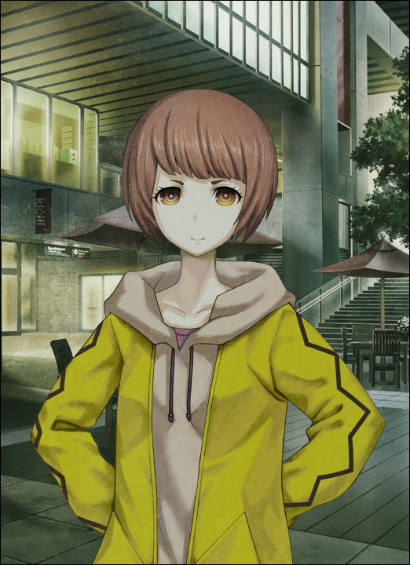
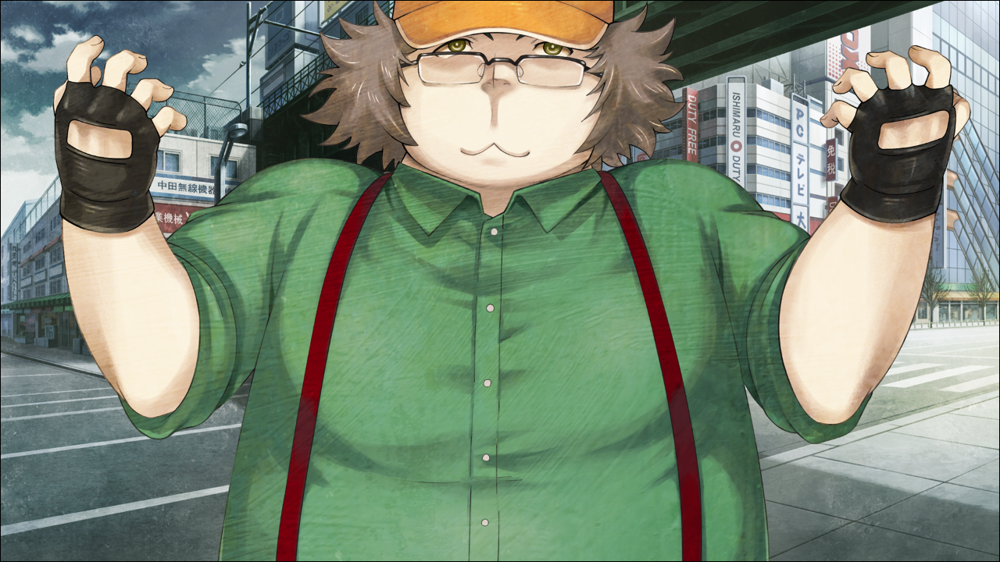
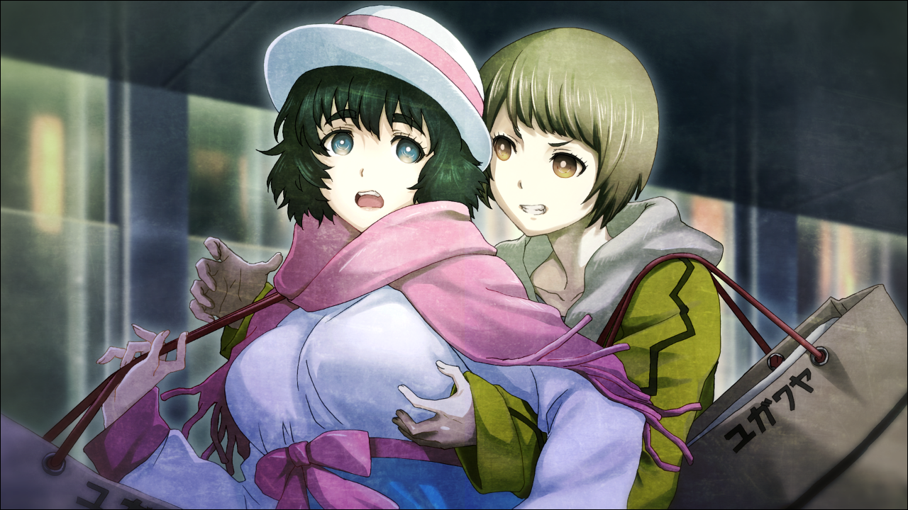

> <big> **闭时曲线的碑文 - 06** </big>  
> 1.129848  
> [ 2010/12/04 吹雪视角 ] 真由理和她的Cosplay伙伴三人；吹雪的噩梦。  

到了12月，天空变暗的时间越来越早。在Cosplay店中选择商品的时候，外面的景色已经踏入了夜晚。中濑克美感到惊讶。拉着的拉杆箱传来沉甸甸的感觉。今天买的东西全都塞了进去，箱子都很明显地涨了起来。尽管如此，能够和因为Cosplay而互相认识的朋友们一起买东西，假期过得很充实。爽快的疲劳感。到车站的路上都踏着轻快的脚步。  
“吹雪酱，快要跳着小步了吖~”  
“啊，你明白？因为今天买了好多东西，很开心哦~满足满足！”  
“多亏了吹雪酱，真由喜也愉快地购物了哦~谢谢你来陪我。”  
“为了真由喜，这可是小事一桩呢！”  
吹雪一边回答，一边朝着真由理抱了上去，但是被真由理轻巧地避开了。真由理虽然看上去呆呆的，但其实运动神经很好。  
顺带一提，“吹雪”是中濑克美的Cosplay名。  
中濑克美是高二学生。和同年的真由理对比起来，更加男孩子气和运动风。如果出男装Cos的话，围绕她的摄影师当中，比起男性，女性反而会更多。  
“这样一来，冬季CM就没什么要担心的了。”  

这一天，包含吹雪在内的朋友四人，为了购买制作Cosplay服装用到的材料，去了池袋的汤川屋、乙女路和东京HANDS，而后又到秋叶原去逛了几家Cosplay商店。这全都是为了年末的冬季CM（*Comic Market*）做的最后准备。  
“虽然这样说，但是制作服饰的不就几乎只有真由理吗？  
&emsp;&emsp; 不要太勉强哦，真由理酱……”  
充满担心地说着话的，是枫。本名是来岛枫，直接用本名当作Cosplay名，是比吹雪大三岁的女子大学生。虽然枫很有女人味，三围也是像平面模特一样完美的标准值，但性格却有些内向。大学里，不管多少次邀请她参加选美比赛，她都是以“现充一样的活动好像很可怕”这种理由去拒绝。尽管如此，和吹雪她们一起参加CM之类的活动上的Cosplay，还是十分期待的。  

“这样的话，趁这个机会，大家来帮真由理酱一起做服装吧？”  
阿万音由季提出了这样的建议。  
五官端正，整体上都被和善气氛所包围着的女性，从同性的吹雪看来也是很美丽的人。翠绿直率的眼神，闪烁着的不是普通美女的桀骜不驯，而是让人感到亲切的光芒。阿万音由季是明路大学四年级学生，和枫属于同一个社团，在四人当中年纪最大。曾经一度因为要专心找工作而从Cosplay隐退，但仅仅半年就耐不住性子，复活了之前的兴趣。之后，和吹雪她们一起行动的机会也增加了。  

真由理：“没这样的事。要你们帮忙什么的，多不好意思呀~”  
大家一起微笑着看向真由理，而她则慌张地左右摇头。  
真由理：“因为今天，一半以上的材料费都被你们分担了吧？真由喜这样就已经很高兴了。”  
枫：“因为是制作我们的服装啊，要是不出钱的话才过意不去。”  
由季：“而且我一直想着和真由理酱一样，能够制作出漂亮的衣服。”  
吹雪：“嗯嗯。而且真由喜制作的服装质量好高的！真的，非常感谢哦。”  
由季：“呐，真由理酱，请务必让我们帮忙！”  
真由理：“诶嘿嘿~嗯，那么，大家一起制作吧？”  
自己做的衣服被赞扬，对真由理来说是比什么都高兴的事情。吹雪她们是知道的。  
真由理：“啊，有另外一件事，真由喜想要拜托大家。其实……”  
真由理郑重其事地向三人说的，是现在已经成为日本人年末的例行公事一样的一大活动——  
真由理：“我们要开圣诞派对！由季小姐，枫小姐和吹雪酱请务必要来哦~”  
吹雪：“圣诞派对吗？”  
真由理：“嗯！怎么样？”  
吹雪：“要去要去！”  
吹雪的圣诞夜预定只是和家人一起聚餐而已，立即就举起了手。学校的朋友们都不想约，反正一个个的都是和男友快乐地度过，这些混蛋！吹雪稍微闹起了别扭。  
枫：“我也是，没有问题哟。”  
枫也随即点头。只有由季还在踌躇是否答应。  
由季：“我的话……到底怎么办呢？”  
真由理：“欸？莫非是，已经先有约了？”  
吹雪：“那是，拥有由季这种程度的美貌，邀请一起度过圣诞夜的男人估计都堆成山了。”  
真由理：“欸欸！？”  
由季：“才，才没有这种事情！”  
吹雪：“是这样吗？那么我可不会错过机会！”  
由季：“要是能和吹雪酱在圣诞节约会的话，比任何事情都要优先呢。”  
吹雪：“哈~由季，love~~”  
枫：“呵呵，吹雪酱不是对真由理酱一心一意的吗？”  
吹雪：“真由喜也是，枫酱也是，最喜欢了的说！”  
吹雪迅速地抱住枫。像这样对柔软并散发着好闻香味的枫揉揉抱抱，是让她的日常。  
真由理：“啊，对了。由季，下次，能教真由喜做美味的法式咸派吗？”  
由季很擅长料理，最近经常教真由理。吹雪和枫也偶尔会参加“由季料理教室”。  
由季：“可以哟~想做什么样的法式咸派？”  
真由理：“嗯~真由喜想要做菠菜和蘑菇的！”  
枫：“火腿和番茄还有培根也很美味哦~”  
吹雪：“啊啊！只是想想口水就流出来了……”  
真由理：“嗯……这样啊，真难选择呢……”  
由季：“那么，两个都教给你吧。”  
真由理：“真的？是呢~有各种味道大家也会开心呢~”  
由季：“莫非，是圣诞派对用？”  
真由理：“嗯，是的呢。虽然只有不到一个月的时间了，在那之前想要学会呢。”  
由季：“那就特训吧。什么时候？明天？”  
真由理：“嗯！真由喜没问题！”  
吹雪：“啊……明天啊，我和朋友有约了……”  
枫：“我有打工……”  
吹雪因为太想参加，一下子情绪低沉了下来。真想尽情的享受由季做的美味法式咸派啊……一边这样想象着，吹雪的肚子咕噜咕噜地叫了起来。说起来已经到了晚饭的时间了。由季和真由理干脆地决定了见面的地点。  
由季：“场所的话，如果是我租的房子，稍微有点远……”  
真由理：“LAB怎么样？”  
由季：“嗯，好啊。”  
真由理：“要加油学习制作方法了哦~”  
由季：“能成为一个开心的派对就好了呢~”  

真由理：“嗯！真由喜要做圣诞的衣服。大家愿意穿吗？”  
由季：“哇，除了CM的份之外还要做啊！真由理酱真有干劲呢。”  
真由理：“真由喜干劲满满的哟~呼呼！”  
真由理这么说着鼓起了干劲，做了个小小的胜利姿势。  
枫：“圣诞服的话，可爱的迷你裙很不错啊。配上白色的过膝长袜和红色的长筒皮靴……”  
吹雪：“欸——？枫酱倒还好，我好像不适合这种吧”  
克美没有自信地向真由理和由季问道。  
由季：“明明是很喜欢可爱的衣服的说~”  
被戳中要点，吹雪连辩解的话都说不出。对于自己的容貌很像男孩子一样这件事，她一直很自卑，所以也有衣服不合适的自觉。就算这样，犹豫心理上也是完全的少女，所以也有想要穿可爱衣服的愿望。  
真由理：“交给我好了！真由喜会好好做适合吹雪酱的衣服的。”  
吹雪：“哦哦！不愧是我的老婆！结婚吧！”  
枫：“吹雪酱，真是给点阳光就灿烂呢。”  
真由理：“像桶子君一样说话可不行的哟~”  
吹雪：“唔……把我和那个Hentai（变态）绅士当作一类，我受到打击了。”  
由季：“话说，真由理酱也会一起穿的吧，圣诞老人的衣服。”  
真由理：“欸？”  
由季：“欸个什么！这么可爱，多Cos点吧。”  
真由理：“但是，真由喜是专门负责制作的……”  
吹雪：“我有异议！那样的话太浪费了的说！”  
真由理：“真是的，连吹雪酱都……”  
由季：“而且——冈部先生也想看看真由理酱的美妙身姿吧”  
真由理：“唔欸欸？冈伦”  
突然出现的这个名字，让真由理发出惊呼。  
吹雪：“冈伦？啊啊，真由喜的男朋友呢。”  
吹雪见过几次。给她的印象是，身高很高但是脸色不太好，身体也很瘦，似乎总是非常寂寞的笑着的人。但是，按真由理的说法，似乎他直到半年前还是更加桀骜不驯且旁若无人，但却很温柔且有领导力，是和现在截然不同的印象。因为经过真由理心里的美化，吹雪也不清楚有多少的可信度。  

真由理：“唔欸欸欸欸欸——！！”  
真由理由于吹雪的“男朋友”一词，变得更加惊慌失措了。  
真由理：“那个那个，吹雪酱，冈伦和真由喜并不是那种关系哟！”  
“又来了又来了……”（×3）  
不光是吹雪，连由季和枫都不相信真由理的话。实际上，冈部伦太郎和真由理两个人与其说是恋人，倒不如说怎么看都像是在一起生活了很多年的夫妇。  
真由理：“真的啦！因为，冈伦有别的喜欢的人了。”  
吹雪：“欸？！”  
因为真由理仿佛毫不在意一样爽快地说出的话，吹雪瞪大了眼睛。  
由季：“是，是这样的吗？”  
枫：“真的吗……”  
真由理：“嗯。”  
没，没想到居然是这样的……最先圆场的是最年长的由季。  
由季：“那个……抱歉呢。好像说了多余的话……”  
真由理：“没关系。真由喜和冈伦只是关系很好的青梅竹马。没事的哟。”  
由季：“是吗……”  
看着真由理的笑容，吹雪感觉很难过。她突然产生了一种强烈的，想要紧紧抱住面前这个同岁的软乎乎的女孩子的想法。  
真由理：“比起那个比起那个~呐，由季，你呢？”  
像是要吹走尴尬的空气一样，这次是真由理笑眯眯地靠近由季。  
由季：“欸？我？”  
真由理：“嗯，刚才的话题。果然圣诞节还是和男朋友一起过吗？”  
由季：“啊哈哈，都说了真的没有啦。”  
真由理：“是吗？”  
由季：“大家都误会了啦，我并没有那么受欢迎啦。  
&emsp;&emsp; 悄悄给你们说，我单身年龄和实际年龄是一样的。”  
吹雪：“欸欸！！”  
在真由理之后，由季都说出意外的事实，吹雪受到了持续的震惊。  
枫：“是这样吗？”  
由季：“也，也不至于这么吃惊吧……”  
真由理：“那~由季，那个……”  
真由理开始扭扭捏捏起来。  
由季：“嗯？”  
真由理：“比如桶子君，你觉得怎么样？”  
由季：“欸？桥田君？”  
真由理：“嗯”  
吹雪：“等等！你到底在说什么啊，真由喜！那个桥田可是Hentai绅士哟！”  
枫：“由季可是会遭毒手的……”  
被吹雪和枫共同下达糟糕评价的男人，名叫桥田至（*Hashida Itaru*），是冈伦的高中好友兼大学同学，和真由理三人为LAB最初期的成员。由于体型的缘故，所以昵称是取和名字相近的“桶子（*Taru*）”。是个重度的御宅族，二次元和三次元皆可的混合体。而且，就像吹雪所说，是个Hentai绅士。总是不顾羞耻和名声说些Hentai一样的话，但如果这样骂他的话，他就会反驳道“不对哟，是Hentai绅士哟！”

——就是这样的危险人物。然而，被问及的由季本人，不仅仅很困扰的态度，甚至还表现出有些寂寞的感觉。  
“嗯……桥田君虽然是个好人，但怎么说呢……  
&emsp;&emsp; 像我这样的女孩子，他可能并不太喜欢吧。”  
“欸欸？！”  
真由理不是一般的惊讶。过于惊讶，以至于她手中的行李箱掉到了地上，而她对此毫不在意，拼命地向由季说着：  
“没，没有那样的事哦！  
&emsp;&emsp; 桶子君呢，那个呢，对于由季可是萌得很呢！  
&emsp;&emsp; 一定是这样的，真由喜保证！  
&emsp;&emsp; 夏季CM第一次见面的时候，就是这样的感觉不是嘛？”  
由季和真由理的相识是在四个月前的夏季CM。吹雪和枫穿着真由理制作的Cos服参加活动，在会场，一个人参加的由季被枫发现并且会合。在之后大家一起举行的庆功宴上，作为真由理的朋友的桶子也在。吹雪可是清楚地见证了，由季和桶子融洽交谈的样子。在那之后，由季和真由理、桶子成为了朋友，而她也会偶尔去两人所属的社团——LAB，未来机械研究所。也就是说从夏季CM以来，由季和桶子一直都保持着来往。尽管这样，由季还是苦笑着摇着头。  
“不，只要看看就知道了。总是感觉不止为何在被避开。  
&emsp;&emsp; 所以圣诞派对，我也考虑我是不是不去会比较好。”  
真由理：“啊……呜……”    
“桥田君，可能更喜欢……妹系？是不是更喜欢这类的女孩子呢？  
&emsp;&emsp; 而且是，相当强硬的，会管着哥哥的妹妹。”  
“啊呜呜呜呜……”  
“就比如说……像是铃羽小姐那种的感觉？”  
“那，那个是……那个是……”  
不止为何，真由理现在像是要哭出来似的表情盯着由季。虽然想说什么，但是只是嘴唇颤动却并没有说出来，就是这种样子。  
“真由理酱？”  
“欸……欸嘿嘿……没什么的说……”  
明显不是“什么都没有”的样子。吹雪实在看不下去她这个样子，于是解放了自己的冲动——  

“真由喜，不要露出这样的表情。真由喜笑着的时候是最可爱的。  
&emsp;&emsp; 呐，来吧来吧，不笑的话我就要来挠痒痒了~  
&emsp;&emsp; 我挠我挠我挠……”  
悄悄迂回到真由理背后的吹雪，从腋下入手开始了挠痒痒攻击。而真由理则是难以自抑地笑了起来。就这样闹了一小会儿之后，吹雪终于停了手。  
“认命了？”  
“真是的，吹雪酱真是坏心眼……”  
“嗯~真由喜，太可爱了！”  
这次终于成功抱住笑得眼泪都出来的真由理，就这样不顾及别人眼光地蹭了起来。  
“真由喜，喜欢你哟~最喜欢了——！”  
“哇！？等…等等！吹雪酱？”  
“想就这样带回家，一直prpr啊！”  
“那真是难办啊……”  
“难办也没关系，和我结婚吧！”  
“都说了不行了啦~”  
想要逃跑的真由理被吹雪抱得更紧，kiss像雨一般袭来。  
“哈……哈……累死我了。”  
“那是真由喜的台词哟！”  

结果吹雪一直到车站前都黏着真由理。虽然心灵完全地被治愈了，但是抓住想要逃跑的真由理还是相当的消耗体力的。正在吹雪心满意足地喘着气时，和自己意志无关的影像突然出现在脑内——那是真由理正在跌落下地铁站台的影像，而不远处地铁正尖啸着冲过来——这让吹雪吓了一跳，重新看向真由理。  
“……呐，真由喜。”  
“嗯？怎么啦？”  
“冬季CM，一起Cos吧？”  
“啊哈，之前说过的吧，冬季CM的话真由喜是要专注于制作方面。”  
“就算这样也无所谓，总之冬季CM也绝对要我们四人一起参加哟！呐？”  
“这是当然的啦~今天就是为了这个大家才一起出来买东西的嘛。”  
“也是呢……不过，说好了哦！”  
“嗯，说好了！”  

真由理和由季因为电车方向不同，在车站前和吹雪二人告别了。  
真由理：“再见啦~”  
枫：“晚安，真由理酱，由季。”  
由季：“再见。”  
真由理：“嘟嘟噜~”  
吹雪：“拜拜！”  
吹雪一直站在这里目送着真由理和由季的背影消失在视线中。为了忍住快要掉落的眼泪，她仰起了头。  
“吹雪酱……怎么了？”  
一旁的枫担心的窥视着吹雪的表情。  
“抱歉，没什么。”  
“才不是没什么呢！难道说……真由理酱怎么了？”  
“……”  
“拜托了，说出来吧。”  
就算枫这么说，吹雪还是犹豫要不要开口。就算说了，反正也不会被相信的，肯定是这样……  
“今天的吹雪酱，比平时更加情绪高涨，感觉相当逞强。”  
“被发现了……”  
“发现了哟。”  
吹雪和枫已经认识快两年了。年龄有些差异，关系就像姐妹一样。正因为如此，枫这个时候才这么敏锐。枫的性格比较安静，相对地，对周围的事看得更清楚些。由于吹雪的性格太过一目了然，在枫面前也无法撒谎。于是吹雪放弃了，嘟囔地开口说起**那件事**。  
“真由喜啊……死掉了。”  
“欸……？什么？怎么回事？”  
吹雪回想起来，那不愿想起的噩梦。就算不愿意，也还是从脑海中浮现的，那个景象。  
“我会做一种梦。  
&emsp;&emsp; 大概是夏天那会儿吧，每天每天，在梦中真由喜都会死去。  
&emsp;&emsp; 每当这个时候我和枫酱就会不停的哭泣，但是却束手无策。  
&emsp;&emsp; 昨天晚上的梦，最糟糕了。  
&emsp;&emsp; 在我们面前的真由喜忽然倒下，一动不动了……  
&emsp;&emsp; 冈伦悲鸣着抱她在怀中，大声地叫着……  
&emsp;&emsp; 呐，我到底是怎么了？为什么我总是梦见这种梦？”  
“冷静下来，吹雪酱，大概是因为太累了吧。”  
“是这样吗？真的是这样吗？”  
“因为，真由理酱，今天也非常精神的不是吗？所以，没事的。”  
“我不要啊……真由喜死掉什么的……”  
“那种事情不可能的。绝对的！”  
“绝对吗？”  
“绝对哟。”  
“嗯……”  
枫的安慰，让吹雪镇静了一些。她心想，有这么一个年长的朋友真是太好了。  
“总之是你多心了。那么不吉利的事情怎么可能发生呢？”  
枫稍微用力地搂了搂吹雪的肩膀，以示安抚。她的这番举动，也让吹雪得以宽心。  
“对不起，我说了些没风没影的话……”  

然而，当晚——  
吹雪仍然做了噩梦。  

 

> (to be continued)
---

| [←prev](./0010) | [home](../../) | [next→](./0012) |
