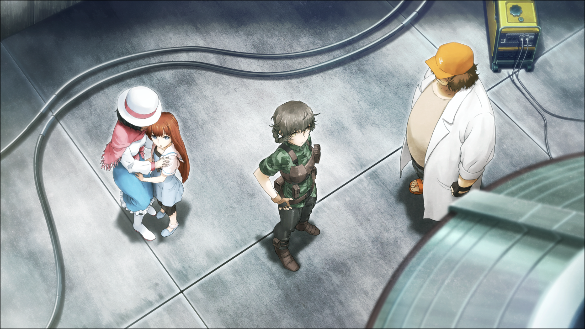
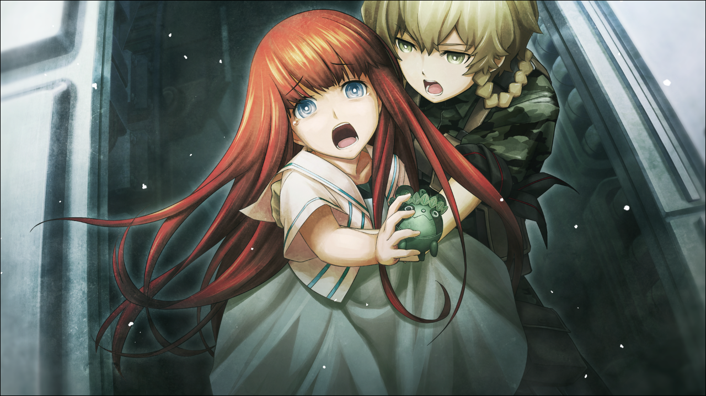

> <big> **闭时曲线的碑文 - 08** </big>  
> 1.129848  
> [ 间章 2036/08/13 19:46 ] 回忆中的未来，跳跃向着过去。篝的初登场。

铃羽：“爸爸，治安部队已经到万世桥了！”  
桶子：“那就是说，这里被发现也只是时间问题了。之前放出去的假情报也没有效果吗……”  
铃羽：“动作快！”  
桶子：“啊啊。要打开了哦。”  
真由理：“真厉害！居然连这种地方都会有门啊……这样就谁也发现不了了呢。”  
桶子：“快点，快进去！”  
真由理：“这里是？”  
铃羽他们所踏入的，是从天花板到地板全部都由隔音材料拼起来的很煞风景的房间。窗户自然不用说，连通往走廊的门都没有。这个房间所在的大楼，在第三次世界大战末期的大空袭中烧毁，只留下一副凄惨的样子。但作为曾经的秋叶原站前标志之一，让人们感到很亲近。几乎没有人知道，在这栋大楼里，有这样一个被隐藏起来的房间。而这里之所以如此机密的最大理由，就是摆放在房间一角的，有着人造卫星一样轮廓的物体。  
真由理：“啊，这个是……时间机器吧？”  
少女：“这就是时间机器？”  
铃羽：“篝，很危险的，别太靠近了。”  
铃羽说话的对象，是与真由理一直手牵手的少女。这个时代的少男少女们的话，大部分人的身体都会被富含放射性物质的雨导致的皮肤炎所侵蚀。然而她却没有。名字叫做“椎名篝”，户籍上的年龄虽然在10岁左右，但真实情况却是不明。因为她是个婴儿时期就因为东京大空袭而失去双亲的战争孤儿，所以没有一个准确的出生年月。“篝（*Kagari*）”这个名字，也是她在儿童养护设施里被保护着的时候，由当时在设施里工作的真由理起的，含有“即使是在这样的黑暗时代里，也能够成为照亮大家的篝火”的这个愿望。在那之后，真由理将她收为养女，户籍上的姓氏也就改为了“椎名”，离现在已有四年。  
篝：“真漂亮啊，妈妈。”  
真由理：“是……呢。”  

铃羽让椎名母女俩退后，将自己的右手与右眼靠近时间机器的传感器。通过生体认证后，舱门滑开了。然后就这样进入时间机器内部，将身体在座位上固定好。  
“这种的长时间载人跳跃虽然还是第一次，但是技术上应该是完全没有问题的。  
&emsp;&emsp; 只要能按照目前以来的测试跳跃一样顺利的话就可以了。”  
“*Okey-dokey！*”  
铃羽一边回答着父亲，一边按照顺序将机器的开关一个接一个地打开。因为已经预见到今天迟早会到来的缘故，启动过程早已经过不知道几百次的模拟，让身体彻底记住了。机器原本微弱的声音，逐渐的开始变大。  
“根据数据来看的话，以前的广播管正好就在这个地方的楼顶。  
&emsp;&emsp; 但是高度可能会出现1米左右的误差，落地的时候应该会有冲击。”  
“了解。”  
这台时间机器虽然能够做到时间跳跃，但是没有办法空间移动。为了到达近60年前的广播会馆楼顶的话，就必须从这个坐标出发。  
“出现问题的时候一定要保持冷静，回想以前的训练就好。”  
“没事的哟，因为我信任着爸爸的机器。”  
像是被这样的话语所感动，桶子张嘴想要说些什么。但是铃羽用手示意他不要说出来。  
“很恶心的……”  
“真是悲伤啊……我还什么都没说呢。铃羽就这么讨厌爸爸吗？”  
“反正爸爸说的话，总感觉背后有点什么小心思。”  
“不管怎么说，对女儿总不可能有什么小心思吧！”  
“‘最近，总觉得你跟妈妈变得好像啊哈嘶哈嘶’什么的，是谁说的来着？”  
妈妈，并不在这个地方。在战斗中牺牲，被治安部队给残忍地杀害了。  
“别把玩笑当真啊……”  
“什么啊，是开玩笑来的？”  
铃羽一边像是觉得遗憾似的说着，一边将目的地坐标设定为1975年的8月13日，需要在那里完成第一项任务。  
“这样就可以了。那么爸爸，还有真由姐——”  
铃羽在向他们做出发前的道别。突然这时，房间一阵震动，外面传来爆炸声，还有枪声和脚步声等嘈杂的声音，使得真由理和怀中的篝不由得发出一声惊叫。  
“是屋顶那儿！要进来了！”  
“可恶！比预想的要早！”  
铃羽从枪套中拔出了枪，想要从机器上下来参加战斗，但是父亲阻止了她这么做。  
“不行！快点跳跃！”  
“但是爸爸你们……”  
“我们几个不要紧！快点去吧铃羽！”  
“怎么可以！”
“真由喜！快把篝酱——！”  
“欸？”  
“这台机器，还可以再乘上一个人！”  
桶子和真由理将还在发呆的篝抱住放进了时间机器中。  
“铃羽酱！篝就拜托了！”  
“……知道了！”  
事实上，如果铃羽成功地完成了任务让世界线再构筑的话，现在的篝就这么消失的可能性极大。就算从这里逃出去也没有意义的可能性也是有的。可是另一方面，这是一个母亲想让孩子远离危险的愿望。铃羽的母亲曾经也是这样。  

“妈妈……？不，不要！我不要！！不！！！”  
好不容易才掌握情况的篝，一边挣扎着想要出去，一边向机外的妈妈呼喊着。  
“不要紧的哟，篝~铃羽酱带着你呢，听话。”  
“不行！不跟妈妈一起就不行！”  
“到了过去的话，能见到以前的妈妈哦~比现在还要年轻好多，篝你也许会被吓到吧。”  
真由理对着篝，递给了她一个小小的钥匙圈。应该是有些旧了，本来应该有着鲜亮绿色的外观，现在却掉色得很厉害。  
“这个是妈妈一直珍惜着的乌帕钥匙圈哦，现在给篝了，一定要好好保管啊。”  
将它放在篝的手心里之后，真由理带着眼泪笑着退开了。  
“不要！不想去！想跟妈妈在一起！——妈妈！妈妈！”  
“不可以！篝，听话一点！”  
真由理发出尖锐的叱责，让篝老老实实地听话了。真由理会发出这样的严厉的声音，铃羽这也是第一次听到。
“呜……妈妈……呜呜呜……”  
篝呆站在那里，默默地流着眼泪。  
“要关门了！”  
舱门开始慢慢关闭。机内和机外，正在彻底隔绝成两个世界。不管铃羽的任务是否能够成功，这以后大概，再也不会相见了吧。  
“铃羽酱，篝她就真的拜托了啊！  
&emsp;&emsp; 还有，记得告诉冈伦！*Steins;Gate* 一定存在！”  
“‘绝对不能放弃啊你个混蛋！’这样告诉他！”  
“*Okey-dokey！*”  
接着，舱门彻底封闭。外面的混乱，还有真由姐与父亲最后的叮咛，都消失了。  
“爸爸，最喜欢你了。”  
铃羽对着已经关闭的舱门小声说着。  
“要去了哦，篝……向着过去。”  

时间机器启动了。  
跳跃向着过去，也向着未来。

 

> (to be continued)
---

| [←prev](./0012) | [home](../../) | [next→](./0014) |
