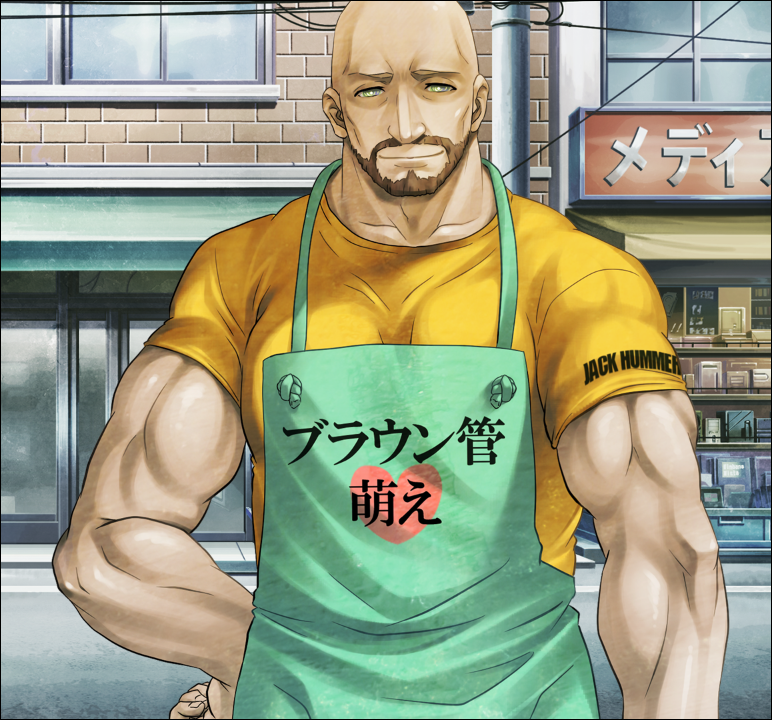

> <big> **闭时曲线的碑文 - 09** </big>  
> 1.129848  
> [ 2010/12/05 ] 冈伦终于回到LAB。  

“让人很有兴趣啊！”  
“什么啊？”  
“没听到吗？说的是，让人很有兴趣！”  
“……你该不会是……想要去吧？”  
“还请一定拜托。”  
“真不该说出来啊……”  
就在池袋的正中心，我用单手拿着手机，就那么仰望着天空。最近以来，一直尽量的在跟『Amadeus』的“红莉栖”进行着交流。既有自己主动进行联络的，“红莉栖”那边来的联络也有。这种给人的感觉，就像是现实中的朋友一样，没有什么区别。虽然这样在有很多人的地方对着手机说话还是有点羞耻……然而跟以前中二病那时候比起来的话，并不是什么大不了的事情。对话的内容也一般是普普通通没什么问题的内容。但是，不管怎么样都会像以前跟红莉栖对话时那样，一不小心就会有点由着性子来了。这次也是这么回事，无意中提到了LAB的话题，然后品尝到了恶果。  
“你刚才提到的这个LAB，原本的我是不是去过？”  
“啊……没。”  
“真不干脆呢。真相是？”  
“……没有去过。”  
红莉栖成为LABMem而来到LAB里的那些事，都是α世界线的话题了。到了这条世界线的话，红莉栖她根本都没有成为LABMem就与世长辞了，当然不可能去过LAB。  
“你好像误会了什么。我先声明，  
&emsp;&emsp; 虽说是LAB但并不是真正的Lab，只是……一起玩的社团。  
&emsp;&emsp; 而且——”  
现在，那里住着铃羽，桶子也频繁的出入。被那两个人知道“红莉栖”的话，难说不会产生各种各样的麻烦。  
“能不能不要把话说一半！”  
“没什么。”  
“不管如何，我也想多看看外面的世界。  
&emsp;&emsp; 至今为止和教授前辈们说话的时候，也全都是在研究室中。”  
“所以我才像这样，在周日的大清早就给你做池袋的向导啊。”  
早上10点，就算是这个时间，池袋车站前也有很多人，很热闹。伴随着正午的临近，人估计会更多吧。  
“如果有必要，带你去‘少女之路’的觉悟都有哦。”  
“那是什么？”  
“应该说，是你所不知道的新世界吧。”  
“等等，我查一下。……呀！”  
“当真产生兴趣了？”  
“什……才，才没有那种事！  
&emsp;&emsp; 总之，今天要带我去你的LAB！  
&emsp;&emsp; 既然说给我听了，就要好好负起责任！拜托了呢！”  
甩下这句话就挂断了……好像我成了那家伙的代步工具了……“红莉栖”无法自主的进行移动，变成这样也是必然的。  
“真是的，任性的家伙……”  
真是被小看了呢……这样下去的话，很可能过不久就会被那家伙当成下仆了。原版的红莉栖暂且不说——不，也不是暂且不说——还被作为人工智能的“红莉栖”这样使唤，简直是不可想象的屈辱啊……这难道不是关系到人类本身尊严的大事吗？  
“这……或许真应该做些什么了……”  
这么想着，一个人苦恼起来。  

“啊？冈伦？”  
手里提着大量东西的真由理向我打招呼。  
“呐呐，刚才是不是在和谁说话？”  
“嗯？啊啊……那个，刚才是……大学研究会的朋友。”  
“是嘛~今天也要去玩吗？”  
“不，今天并没有什么预定。  
&emsp;&emsp; 真由理呢？要去打工吗？”  
“不不，要在LAB和由季碰头。”  
“LAB……”  
不知道时机算好还是坏……  
“对了，好久没来的冈伦要不要也一起来？可以吃到由季亲手做的料理哦~  
&emsp;&emsp; 另外呢，真由喜也准备努力制作的说！  
&emsp;&emsp; 怎么……样……？”  
真由理越说越小声，越说越纠结的样子。  

结果还是来了。  
在路上还收到了比屋定真帆发来的“售后服务”一般的RINE。  
“那之后和‘红莉栖’怎么样了？”  
“没什么问题。”  
“是吗？可以的话，什么琐事杂事都谈谈吧。”  
“比如说对腐女街感兴趣的事？”  
“什么鬼？”  
“那是个，开满了通往新世界的商店的地方。”  
“等等，我这就去查。”  
“你还是别查了。一入腐界深似海啊。  
&emsp;&emsp; 如果有了在意的事，我会报告的。”  
“那就拜托你了哦♪虽说我觉得那会很累的。”

“欸嘿嘿~~”  
“你好像很高兴啊？”  
“嗯！很开心哟~”  
但是，我却相反。一旦来到这个地方，我紧张得胃液都像要逆流出来了。不太想和铃羽碰面啊……  
“嗯？呀啊，这不是冈部嘛！”  
一楼的显像管工房的们打开了。慢慢走出来的是身形魁梧的店长，也是这座大楼的房东——天王寺裕吾。

“店长先生！嘟嘟噜~”  
“哦！”  
“呜哇~只有一件T恤，不冷吗？”  
“因为锻炼过啦。”
曾经我定居在LAB的时候，还擅自用“Mr. 布朗”这样的外号称呼他来着，原因是他对布朗管的喜爱，如他穿着的围裙胸前所写的一样。这样的碰面真是好久没有过了。  
“冈部，看你这个样子，有在好好的做一个大学生的样子啊。”  
“谢谢。”  
现在在天王寺先生面前还是会不自觉的低头啊，在物理层面和心理层面，以及经济层面。  
“话说，租金现在是怎么办的？”  
忽然想到这，于是向真由理问道。以前都是我直接交到天王寺先生的手上的。  
“那个呢——”  
“桥田有好好的交给我的，安心吧。”  
“是这样嘛？”  
“嗯啊。”  
这个男人……在这个世界也是Rounder吗？这种事情，也不可能向本人确认。无论如何，不得不提高警惕。因此也和他保持了一定的距离。至少，尽量的避免以前那样的交流。  
“就聊到这吧。不要闹得太厉害了哟。”  
天王寺先生看了一眼沉默着的我，返回了店里。真由理也担心地看了看我的脸色：  
“没事吧？果然还是回去？”  
“……走吧。”  
天王寺先生的事情，随他去吧。比起这个，我为什么来到了这里？虽然觉得这样下去并不好……是因为真的想让“红莉栖”看看LAB吗？自己也没有整理好思绪，登上了台阶。

“嘟嘟噜~”  
真由理先走了进去。  
“不好意思呢，由季小姐，稍微有点迟到了~”  
“真由理酱，你好啊~”  
我窥视着屋内。屋里有桶子和阿万音由季在，两个人看见我，瞪大了眼睛。  
“冈部先生也在一起啊~”  
“哦，冈伦啊。好久不见！”  
“啊啊……好久不见。”  
迅速地观察了下屋内，并没有看见铃羽的身影。对于这点稍微松了口气。  
“可以进来吗？”  
“在自己的LAB有什么好客气的。”  
“这说的也是。”  
但是这种情况下也不方便把“红莉栖”叫出来啊……  
跟着真由理走进LAB，总之先坐在了沙发上。但是心情完全没有冷静下来，还是非常的坐立不安。而真由理已经开始和由季聊起天来。  
“由季，这件洋服好可爱哟~”  
“就是想要真由理酱这么说，我才穿的哟！”  
“真好啊，真由喜也想穿穿看的说。”  
“之后要换穿试试吗？”  
“大小合适吗？”  
我也从铃羽那里听说了由季未来的事情。这样的大美人将来会和桶子结婚什么的，我到现在还不敢相信，就连桶子本人都和我持同一意见。这简直是奇迹。的确由季身上有铃羽的影子，我觉得她们毫无疑问是母女。但是，桶子最近好像完全跟不上由季的节奏，也发短信抱怨过不擅长应付她。难不成……这两人之间的形式不太妙？但是世界线的收束应该不会引向他们没有结婚的未来才对。  

正想着这些有的没的，口袋里的手机又响了起来。  
不用说，一定是“红莉栖”那家伙打来的电话。  

 

> (to be continued)
---

| [←prev](./0013) | [home](../../) | [next→](./0015) |
