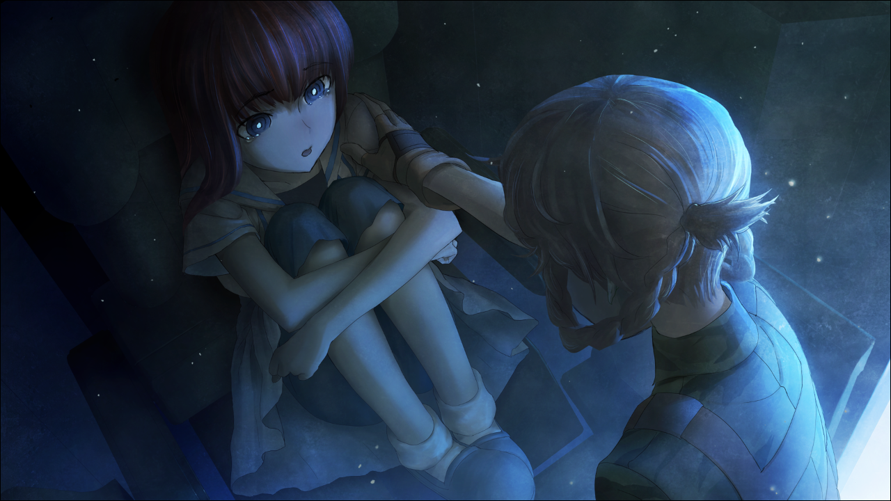
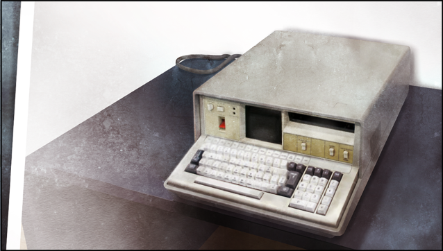

> <big> **闭时曲线的碑文 - 11** </big>  
> 1.129848  
> [ 铃羽视角 ] 广播管楼顶，相隔35年的对话。发现可疑人员，但没有追到。  

[ 1975/08/13 13:05 ]

“呜……呜呜……”  
少女置身于大大小小的机械之间，充满金属味的机舱内，只回响着她的呜咽声。铃羽到机器外面打探情况，大约已经过了一个小时左右。本来以为她差不多也该哭够了，但是并没有。  
“你想哭到什么时候？”  
“……”  
“你要坚强些，好好想想真由姐的心情。”  
闻言，椎名篝抬起沾满泪水的小脸，看向铃羽。  
“……妈妈？”  
“都说了别哭了。看着心烦。”  
“可是……”  
铃羽走近篝，接着单膝跪地，让视线与少女持平。不过，她并不想哄她。因为这是为了拯救数十亿人生命的第一项任务。  
“听好，从现在开始，我会将篝也视为‘瓦尔基里’组织的一员，作为我的部下。  
&emsp;&emsp; 今后可不再是非战斗人员了。  
&emsp;&emsp; 这里是1975年，没有人认识我们。  
&emsp;&emsp; 不论是我爸爸还是真由姐都没有出生。  
&emsp;&emsp; 也就是说，没人会保护我们。  
&emsp;&emsp; 自己的命自己做主，知道吗？”  
“嗯……”  
坚强的篝终于想起了现在不是哭的时候。她拼命地想要忍住泪水，虽然不是很成功，但是比起感情用事地一味哭泣要强多了。铃羽知道，这孩子本来就很聪明。  
“我们时间不多。要是被这个时代的人发现了时间机器会很麻烦。”  
时间机器所在的这个广播会馆楼顶人迹罕至，没有意外的话，被第三者发现的可能性很低。只是在这个时代，没有人能帮忙把机器隐藏起来。这样考虑的话，果然还是没法久留。有必要尽快地达成任务目标，然后跳向下一个时代。  
“失败了的话，再用时间机器回来不行吗？”  
“还要考虑燃料的问题。能进行跳跃的次数不是无限的。  
&emsp;&emsp; 关键时刻没法工作的话，那就全白费了。”  
“这样啊……”  
“站得起来吗？”  
铃羽带着篝来到外面。刺眼的阳光让篝惊讶地眯起眼睛。这个时代的东京的天空，要称其为蓝天，未免太过肮脏浑浊——从林立的工厂烟囱里排放出的，正体不明的烟雾与粉尘，以及在地面成群爬行的汽车所排放出的黑色尾气形成黑色的光化学烟雾。城市的上空，被这些东西构成的死亡帷幕所遮盖。然而即使如此，对篝而言，这恐怕也是首次经历的“清澈”天空。像这样刺眼的阳光，目前为止她只在录像与书本中才见到过。第三次世界大战开始后，东京的天空在核武器造成的气候变动下时常被浅灰色的云所占据，太阳只能从其后方映出淡淡的光晕，她从来没有沐浴过这么强烈的阳光。  
“我很小的时候，天空还是这种感觉的。虽然很模糊但依然能想起来。”  
铃羽望向天空，若有所思地说着。
“空气……好清新。”  
和长期外出时必须带上附有过滤器的面具的2036年相比，1975年的东京要洁净得多。  
“懂了吧，篝，为什么爸爸他们要把一切赌在改变世界线上的原因。  
&emsp;&emsp; 世界线会怎样，历史又如何，这些大道理以后再说就好。  
&emsp;&emsp; 现在，只要守住这天空的颜色。”  
篝不知是想到了什么，从口袋里掏出褪了色的乌帕钥匙链，一脸落寞地盯着。大概是想起了母亲真由理吧。并且，是想要理解母亲让她乘上时间机器的用意吧。  
看到篝的样子，铃羽判断已经没问题了，便从外面关上时间机器的舱门，接着机器便自动上锁。能打开舱门的只有事先进行了生体认证的铃羽，所以万一被谁发现了，也不能立刻知道其作用吧。

“篝，看这个。”  
铃羽把打印下来的照片递给少女。

“这是什么？”  
“是叫做‘IBN5100’的老电脑。  
&emsp;&emsp; 我们时代的不管哪个都没法正常工作。  
&emsp;&emsp; 但是在这个时代的话，就能得到完好的。  
&emsp;&emsp; 分头寻找这个，就是我和你的，第一个任务。”  
“嗯。”  
“联络就用这个。通讯距离好像非常短，聊胜于无吧。”  
铃羽递给篝一台小型对讲机。  
“额……*Okey…dokey？*”  
“每过90分钟，就在这栋楼前集合，互相确认状况。懂了吗？”  
“*Okey-dokey!* ”  
“很好的回答！”  
铃羽点了点头，然后摸了摸篝的头。  
“好，任务开始！”

[ 2010/12/05 夜 ] 

从LAB里出来之后，铃羽照例在秋叶原各处完成了自己的任务，现在正在2010年的广播会馆楼顶望着身下的街道夜景。已经过了晚饭的时间了，在街上散步的人不少。  
“35年……了吗……”  
现实世界中，在这么长的时间之前，铃羽曾在同样的场所与篝交谈。然而就铃羽的体感时间而言，那不过是数个月之前的事。从这里俯瞰的景色同那时相比变化已经相当大了。今后的26年里，将会再次剧变。自己时机见证了这栋楼61年的变迁。与其说感慨万千，不如说，铃羽体会到了与他人生活在不同时间中的恐惧与孤独感。  
“利用时间机器来改变世界线，意味着脱离这个宇宙的组成原理。”  
冈部伦太郎的这番话闪过脑海。  
说起来最近，自己开始越来越多地回忆起篝的事。铃羽在定期巡视这条街道——她在寻找着椎名篝。连她在不在这座城市都不确定，线索也没有，也不知道现在的样子，所以这样的行为或许根本没用。即使如此，出于自己的责任，铃羽也一定要找到篝。结果今天也是一无所获，徒劳而终了。回过头，她看向时间机器。每天最后来到这里查看也是铃羽必行的工作，最重要的原因是为了确认父亲桥田至没有来过。只要铃羽没注意，他就会试图到这里来检查时间机器，就算跟他说这样会引发时间悖论也没用。因此，铃羽必须时刻保持警惕。说实话，精神上的疲惫一直是有增无减。  
这时屋顶的风声中混入了一声铁门开启的声音。难不成是父亲来了？铃羽仔细观察着昏暗的出入口。出现在那里的是远比父亲更加较小的，戴着猫耳的少女。  
“喵喵~有了有了~铃喵，晚上好啊喵~”  
“什么啊，原来是留未姐。”  
菲利斯踏着轻快的步子走近铃羽。  
“留未姐是在说谁喵？菲利斯就是菲利斯喵！”  
“留未姐就是留未姐啊。”  
秋叶留未穗——也就是自称菲利斯，作为父亲的友人，一直到2036年都在向他提供各种各样的支援，所以铃羽从小就和她熟识，一直称她为“留未姐”。当然，这个时代的她似乎无论如何都想要别人叫她“菲利斯”。然而即使询问她理由，也只会像刚才那样，说些“菲利斯就是菲利斯喵！”之类的莫名回答，令铃羽很困扰。  
“看到LAB没人，就在想是不是在这里，看起来是正解喵！  
&emsp;&emsp; 给，慰问品。虽说只是店里卖剩下的东西有点对不住喵。”  
菲利斯把一个印有 *MayQueen+Nyan²* 的logo的蛋糕盒拿给铃羽。  
“爸爸不在LAB真是太好了……”  
要是在这种时间给他吃这种东西，又要更胖了。  
“不是桶子喵，而是给铃喵的慰问品喵！”  
“给我？为什么？”  
“嘿嘿~明明很喜欢的。”  
菲利斯一边窃笑，一边用手肘轻戳铃羽的侧腹。  
“我，我才没……”  
“苹果挞加上蒙布朗，还有，草莓的水果蛋糕喵~”  
“唔……”  
“看~呦~很好吃的哟~”  
菲利斯故意掀开盖子凑到铃羽脸旁。香甜的奶油与水果的味道顷刻间环绕了她。  
“来，现在就开动也可以喵~别客气开动就好喵~”  
“咕……”  
“来来来，啊——张开那可爱的小嘴让菲利斯喂你喵~”  
“……放……放到冰箱里，我明天吃。”  
“哈哈。铃喵真是禁欲主义喵。”
菲利斯笑道，接着把蛋糕盒整个递给铃羽。  
“保质期是明天，所以一定要在明天吃掉喵~”  
“谢谢。”  
“不客气喵~”  
菲利斯恶作剧般地眨眨一只眼睛并点点头，接着抬头仰视着时间机器。  
“桶子喵的时间机器研究做得怎么样了喵？”  
“似乎在竭尽全力。留未姐，这台机器，继续放在这也没关系吗？”  
铃羽环视着整个屋顶问道。这么大的东西放在这里，之所以还没引起骚动，都是菲利斯的功劳。既是在这附近一带拥有影响力的名家的继承人，又对秋叶原的开发做出了巨大贡献，因为这层关系，她主动承担了隐藏时间机器的任务。  
“嗯。这一层——不如说是楼顶，已经被菲利斯整个借走了，别担心喵。  
&emsp;&emsp; 对老板说了是在研究体感游戏喵，虽然这解释有点牵强。”  
“帮大忙了。”  
“别在意！为了将世界四精灵从 *Byakhee* 手中救出来，菲利斯无论如何都会出手相助的！”  
“是，是吗……  
&emsp;&emsp; 从以前开始——不，以现在来说是未来吗——我就觉得，  
&emsp;&emsp; 留未姐说的话有时候非常难懂啊……究竟是什么语言？”  
“不要思考，用心感受喵！”  
“不不不……”  
“呜~冷死了喵。菲利斯还是回家吧喵。”  
结果，又一次被岔开了话题。对铃羽来说，这名女性无论经过多久都被很多谜团包裹着。  
“我送你，一起出去吧。”  
“喵？那么顺便在我家吃了饭再走好啦~”  
“我并不是因为这个才这么说来着。”  
“反正平时也没怎么好好吃的吧？
&emsp;&emsp; 看到铃喵这种禁欲的样子，菲利斯总觉得一定要做些什么喵。  
&emsp;&emsp; 保护欲？母性？总之，一直有这种冲动喵！”  
“我没问题的——”  

“欸……？”  
话刚说到一半，便感觉到了什么人的视线。铃羽当即集中精神，探查周围的动静。  
“怎么了喵？”  
“嘘……”  
竖起耳朵。刚刚，的确是从通向楼下的铁门那边传来了些微的声响。这是只有像铃羽这样，受过对可以声响敏感反应的训练才能察觉到的细微声响。  
“有人。恐怕……我们的话被人听到了。”  
虽然大都是没营养的闲聊。但中间，稍微夹杂了一些时间机器的话题，如果被人听到的话……
铃羽从怀中拔出枪，下一刻便全力冲向铁门。几乎同时，门后方也响起急速下楼的，像是军靴的声音跨着大步远离。  
“唔，好快！？”  
铃羽打开铁门跳向楼梯平台，然后，就维持这速度，大约三阶并作一步地飞奔下楼。然而，却没追上。铃羽对自己的脚力很有自信，更不用说她还受过相应的训练。即使如此，仍然没能追上。终于下到2楼时，铃羽听到了摩托车引擎空转的声音。  
“糟——”  
心急的铃羽被放在楼梯的东西绊了一下，一脚踩空的她就这么从中间的部分滚落下来。采取受身动作护住头部的结果，令她的腰结实地撞到地上。忍住疼痛迅速起身，接着奔向楼外。结果只看到奔驰而去的摩托的大大的尾灯。可以看到驾驶的人被全黑的头盔和骑手服包裹着，再加上已经离开了相当一段距离，连是男是女都已经无法分辨了。尖锐的引擎声仿佛在嘲笑着咬牙切齿的铃羽一般，摩托车就这样转向转角处，消失在中央大道上。  
“铃喵！没事喵？”  
过了一会儿，菲利斯追了上来。  
“被逃掉了……”  
“那个……最好收起来喵！”  
“啊！”  
慌张地把一直握着的枪收进怀中的枪套后，铃羽把被汗水黏在额头的头发撩了上去。  
“刚才的是谁喵？”  
“不知道……但不是普通人，我想是经过训练的。”  
“训练？”  
“有什么东西掉在楼梯上吗？”  
“躺着一个包包。”  
“刚好是在死角的位置，应该是故意丢在那里的。  
&emsp;&emsp; 而且，在我通过那里的时候，就发动了引擎……  
&emsp;&emsp; 完美地上钩了。”  
“就是说是陷阱喵？”  
“能够及时做出那些事情，一定经受过特殊的训练。不然没可能的。”  
铃羽盯着摩托车消失的方向推测着。  
对方是什么人呢？SERN吗？  
在秋叶原，潜伏着正在寻找IBN5100的，被叫做Rounder的，属于SERN非正式组织的一群人。听冈部伦太郎说起过。不过确切地说，这应该是“另一条世界线”的事。  
“虽然不知道是谁，不过可以肯定，我们以外也有知道时间机器的人。”  
只是知道而已，不做出更多干涉的意思吗？或者说，有抢夺时间机器的想法吗？既然不知道对方的意思，就只能以最坏的情况为假设而行动，否则到了关键时刻就无法应对了。铃羽对着天空长长地叹了一口气。已经完全染上这个坏习惯了。  
“那个，留未姐，这件事情请对冈伦叔叔保密。  
“为什喵？”  
“现在的冈伦叔叔要是知道了，可能会因为危险所以想要毁掉时间机器，是吧？”  
“虽然是这样喵……”  
“我绝对会守护好时间机器的！因为必须带着冈伦叔叔走向命运石之门的入口。  
&emsp;&emsp; 因为那是与未来的父亲，以及所有把我送到这里来的人们的约定……  
“铃喵……我知道了。相对的，只有桶子喵必须全部告诉他。”  
“*Okey-dokey……*”  

铃羽最后的像是自言自语一样的话语融于秋叶原的冬季天空中。  

 

> (to be continued)
---

| [←prev](./0015) | [home](../../) | [next→](./0017) |
