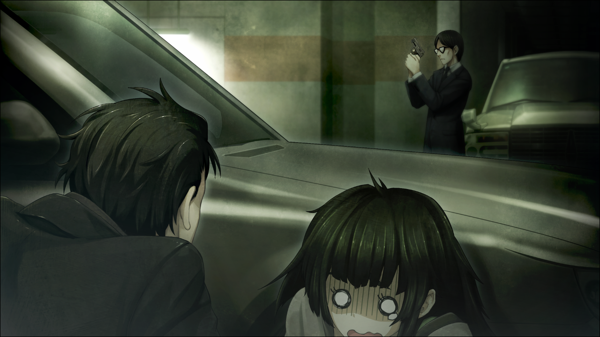
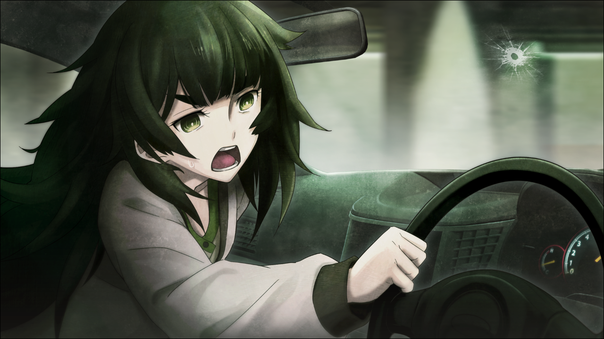
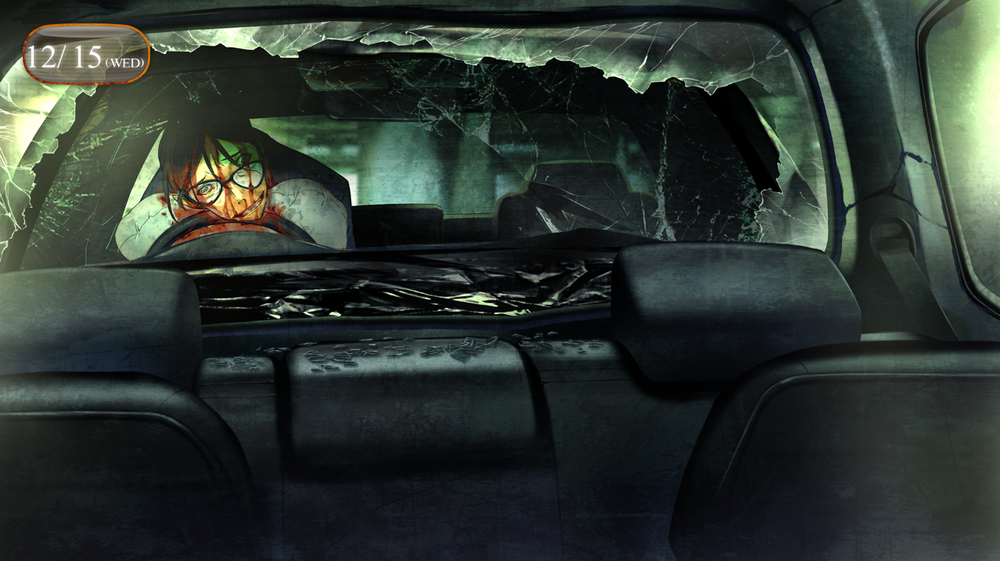
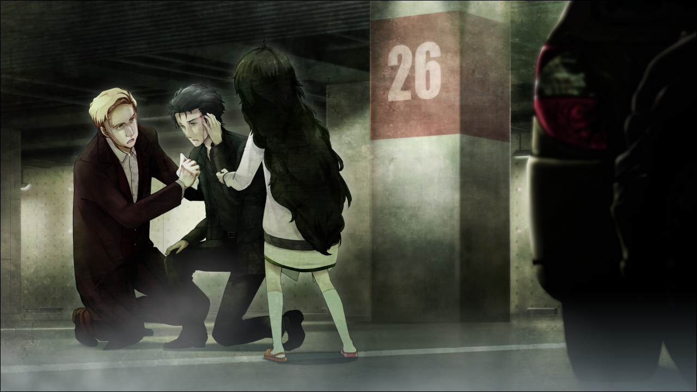

> <big> **双体福音的契约 - 02** </big>  
> 1.129848  
> [ 2010/12/15 ] 与雷斯吉宁教授二人晚饭后，在地下停车场被狂信徒袭击。

轮胎摩擦地下停车场地面的声音传来，一辆深银色的旅行车正转向往这边开来。并不是国产车，而是一辆海外的不知道叫什么公司的，看起来很像跑车的旅行车。虽然我对车不太懂，但是据说正规经销商的话轻轻松松都超过了800万日元的价格。要说我为什么知道的这么清楚，是因为被车主炫耀过很多次了。  
车在我们面前停下，按响喇叭示意着。从驾驶席上走下来的是井崎准教授。当我和雷斯吉宁教授、比屋定真帆吃饭的时候，偶然，因为别的事情打电话过来，然后和他说了教授他们的事情，他就提出回去的时候用他的车来送我们。雷斯吉宁教授虽然不想麻烦他，但是因为井崎强调无论如何都要这么做，于是就在这里见面了。明明是准教授却开这么好的车……大学内流传着，他是有钱的富二代，又或者是哪里来的社长夫人的援助——因为是独身所以把全部财产都拿来买车了——这是他以前悄悄告诉我的真相。当然是真是假我就无从得知了。  
井崎就像是专属司机一样，专门打开后车门，护送着雷斯吉宁教授和比屋定真帆。雷斯吉宁教授对井崎说了声谢谢，坐进了车里；比屋定真帆因为要放行李，婉拒并绕到了车后备箱。  
“冈部君，这么机灵地让雷斯吉宁教授满意，还真是不能小看啊，你这家伙。”  
井崎笑嘻嘻地用手肘顶了顶我。  
“这个路子可不要放手哦？这关系到你的将来。”  
“哈啊……”  
虽然并不是让人厌恶的人，但是作为准教授的立场这样说稍微——不，相当轻浮。这也是他可惜的地方。井崎和我挥了挥手，打开了驾驶席的门。  
“piu——”  
嗯？什么？刚才的声音？几乎是在那没听过的声音到达耳朵的同时，副驾驶席这边的挡风玻璃开了一个孔。  
“啊啊！！”  
井崎惨叫着跌坐在地上。接着后部的车窗也变得粉碎。雷斯吉宁教授和比屋定真帆也同时发出惊呼。  
“什么啊，这是？！”  
我还以为发生超常现象，陷入了混乱。在我的余光里，瞥见一个人影在移动。从柱子的阴影里，一个陌生的穿着黑色西装戴着眼镜的男人走了出来，明明是普通上班族的装扮，手里却握着一个似乎是奇妙形状的，像是手枪的东西。整体看起来很小枪身也很短，而且稍微有些扁平，哪里也没有装着类似消音器的东西。  

“谁！？”  
有点眼熟，感觉是在哪里见过的。是哪里？刻意去想然而一点也想不起来。  
男人站在那里，嘴里不停地自言自语着：  
<abbr title="引自马太福音18:718:8">
***“这世界有祸了，因为将人绊倒；  
绊倒人的事是免不了的，但那绊倒人的有祸了！  
倘若你一只手或是一只脚叫你跌倒，就砍下来丢掉！  
你缺一只手或是一只脚进入永生，强如有两手两脚被丢在永火里。  
倘若你一只眼叫你跌倒，就把它剜出来丢掉！  
你只有一只眼进入永生，强如有两只眼被丢在地狱的火里。”***  
</abbr>
男人浑身散发着异样的魄力和狂气，再次把那似乎是枪的物体指向这边。  
“神所赐予的灵魂，是只有作为神之子的我们才具有的……绝对不会存于硅晶之上！”  
“呜啊啊啊啊啊！！”  
站起来的井崎，因为太过恐怖转过身去，脱兔一样地逃跑了。  
“piu——”  
又是那个声音！太过于安静的细小，完全无法想象到那是枪声。但这次车窗并没有破，我的身上也没有被开洞。打偏了？难道被井崎的行动分心了吗？但是没有下次了。动起来！  
先把比屋定真帆塞进后座，然后我爬进了驾驶室。幸好车子的引擎一直是发动着的。连关门的时间都不想浪费，我一口气使劲把油门踩到底。激烈的引擎声浪让地下的空气激荡起来，袭击者也被这震耳欲聋的声音和震动吓了一跳。然而，车子完全没有前进的意思，一动不动。  
“*Shift*（换挡）！”  
“不把档挂上是不行的啊！”  
后座上低着头的雷斯吉宁教授和比屋定真帆，发出不输于引擎声的怒吼。总之先把脚从油门上拿开，看了看手边的换挡杆，现在是放在写着N字的地方。  
“到底要怎么办！？”  
“你怎么考的驾照？！”  
“我没有！”  
“欸欸！？”  
这个时候，透过挡风玻璃看见袭击者重新架起了枪。男人盯着我，感觉那是能毫不犹豫地杀人的眼神。  
“灵魂，不会寄宿于硅晶之上！”
糟糕！挡风玻璃上出现了蜘蛛网一样的裂痕。侧头部似乎有什么擦过。一阵刺痛传来，同时伴随着耳鸣。其他的所有声音都在远去，消失，意识都快要飞走了一样。  
“关上门！快！”  
比屋定真帆越过座椅，滑到副驾驶席上。  
正在远去的意识被拉了回来。按照比屋定真帆说的，我用力地关上了驾驶室的门。同时比屋定真帆把变速箱挂上档，身子跨到我这边握住方向盘。  
“踩下去！”  
全力踩下油门，车子以轮胎差点空转的势头突然前进了。  

袭击者的身影迫近，要撞上了！这样想着，我想要稍微松一下油门。  
“就这样！”  
比屋定真帆叫道。我咬紧牙关，按照她说的做了。并没有受到冲击，似乎是袭击者为了避免被撞而侧身翻滚到旁边去了。但是根本没有去确认的空闲，车子开始在停车场内疾驰起来。速度太快了，而且比屋定真帆是从副驾驶席上操作着方向盘，车子没办法安稳地走直线。车体左摇右晃，我差点从碎裂的窗子甩出去。拼命地抓住座椅的边缘，坚持住了。车子多次撞到柱子和墙壁，向出口冲去。  
“那，那家伙……是怎么回事！？”  
“不知道！”  
“！——右边！右！”  
眼前已经出现向右出口的标志了。  
“转不过去了！”  
我忽然踩下刹车，从她手上抢过方向盘，向右急转弯。但是却没有办到，车后轮打滑了，车子在原地转了个圈，停下了。  
“呼……”  
“没事吧？”  
“嗯……教授呢？”  
看了看后排，雷斯吉宁教授从座椅上正起身并给我们做了个OK的手势。  
“让我来开！”  
“啊啊！”  
我慌忙地想要开门从驾驶室下车。但是背后逼近而来的老旧轿车的声音，让我汗毛倒竖。是刚才的男人！追上来了，而且这么快！  
“下车！要撞上了！”  
“这边的门……打不开！”  
难道是因为撞到墙上凹进去了的原因！？我立即从副驾驶席抱起比屋定真帆的身体，把她拖到了外面，雷斯吉宁教授也从后门钻了出来。就在仅仅零点几秒之后，轿车就撞了上来。如果再晚一点的话，可能就成肉泥了吧……  
“哈……哈……哈……没事吧？”  
“谢，谢谢。”  
拉着比屋定真帆的手站起来，稍微和已经没有原形的车拉开了距离。两辆车几乎被压扁，袭击者轿车的车头完全撞进了我们的车后箱，这样，开车的那个男人应该没救了吧……完全没有刹车的痕迹，也就是说没有减速地直接撞了上来。我被这个事实吓得一身冷汗。只差一点，就被杀掉了啊……  

“总而言之先联系警察……”  
正要拿出手机的时候，听到声音的保安从出口方向赶了过来。  
“抱歉，请叫警察！”  
保安点着头报了警。  
“唔？啊，痛……”  
侧头部感到一阵阵脉搏似的疼痛。是刚才子弹擦过去的地方。开车的时候，完全没有感觉。小心翼翼地摸了摸，血开始从太阳穴不停地流下来，指尖已经被染成鲜红，我不由得咽了咽口水。真由理的头被子弹击中时候的景象；杀掉红莉栖时候的景象；这些景象一瞬间闪现，脚步稍微有些不稳而跪在地上。  
“你全身是血啊！中弹了吗！？”  
比屋定真帆察觉到了，脸色发青地叫着。  
“这里……是要害什么的吗？”  
“这里有颞浅动脉——”  
“让我看看，要稍微摸一下哦。”  
雷斯吉宁教授查看了我的伤口。触碰的时候很痛，但还是紧咬牙关坚持住了。  
“没问题，伤口并没有那么深。”  
“太……太好了……用这个擦擦吧。”  
“抱歉。”  
我将比屋定真帆递来的手帕压在了太阳穴上。  

“袭击者是……研讨会出场的人。”  
比屋定真帆好像认出了那个人。  
“真的？”  
“不记得了？是你喊出异议反驳的那个人。”  
“啊……！”  
对了。因为说了像是侮辱红莉栖的发言，所以我一生气站起来反驳他的那个男人。难道说……因此对我产生了仇恨？不会吧……  
“神所赐予的灵魂，是只有作为神之子的我们才具有的，绝对不会存于硅晶之上……”  
“你说什么？”
“他在开枪之前说的。”  
“……他是指……『Amadeus』吗？”  
“不清楚……”  
隐约听见远方传来警车的警笛声，酒店的保安和工作人员也都陆续赶来。  
“我说……这情况，应该怎么跟他们解释？”  
“只能一五一十地交代了。我们也是不明就里——”  
比屋定真帆忽然瞪大了眼睛。雷斯吉宁教授和围观群众也都表情惊愕地瞪着一个方向。我随着他们的视线看去，差点叫了出来。  
“……这世界有祸了，因为将人绊倒……那绊倒的人……有祸了……”  
那个男人浑身是血，从被挤压得不成样子的面包车里爬了出来，晃晃悠悠地站起身。那副惨状，简直像是鬼怪或者僵尸。除了攥着手枪的手，其余的肢体都向着古怪的方向扭曲着，依稀可见破肉而出的骨头。他早已开膛破肚，血淋淋的脏器在他爬动的同时向体外掉落。然而，他好像丝毫不感觉疼痛似的，像我们这边转过身。我们目睹他凄惨的样子，吓得不敢张口。袭击者摇摇晃晃地将枪口指向了教授。他的身体命不久矣，胳膊晃悠悠地瞄不准，但是雷斯吉宁教授却也是一脸惊恐，动弹不得。  
“……亵渎……灵魂……有祸！”  
“教授！快躲开——！”  
“砰——”  
枪响了。却是那个男人的头爆出血花，整个人飞了出去，然后摔在地面上，仍然攥着手枪。他还想垂死挣扎，然而只是抽搐了几下，便不动了。围观群众发出了惨叫。袭击者被打中了？难道是自杀吗？不，刚才的枪声明显不一样。那刚才是谁开的枪！？我环顾四周，正巧，出口方向跑过来几名警察。然而，他们没有任何一个人拔出了手枪。围观的都是些保安和酒店工作人员，根本看不到谁会随身带枪。那是谁，从哪里开的枪？而且还能精准地一枪爆头。这可不是谁都能办得到的事情。  
“到底……怎么回事啊……”  
不用说，没人能回答我的问题。  

之后，我们被带去了警察局。关于事情的原委，一直被盘问到深夜。我们被释放出来的时候，天空已经泛起了鱼肚白。在警察署门前别过，警察开着警车把我送回了家门口，雷斯吉宁教授和比屋定真帆则是要被送回和光市的宾馆。到头来，枪手袭击我们的动机，仍然不明。

 

> (to be continued)
---

| [←prev](./0019) | [home](../../) | [next→](./0021) |
