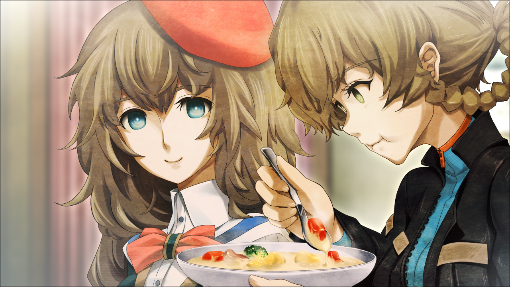

> <big> **双体福音的契约 - 04** </big>  
> 1.129848  
> [ 间章 2010/12/18 ] 铃羽病后康复期难得的平静日常。第一次听由季唱《星之奏》。

那之后过了3天。铃羽依然处于被照顾的状态。由季每天都会和真由理一起来看望。正因如此，铃羽能够吃到有营养的东西，烧完全退了。接下来只要恢复了体力，就完全康复了。尽管这样，由季还是说“请接着静心养病”。归咎于此——或者应该说，托她的福——尽管现在是白天，铃羽还是躺在沙发上打着盹。刚刚开始有点清醒时，通过微弱的意识——好像从远处的某个地方，传来了非常五音不全的歌声。  
*♪~有一个要寻找的东西~星星在对我笑眯眯~♪*  
*♪~随着风儿眨着眼~只要伸出手就能抓到哟~♪*  
伴随着水声听见了这歌声，是在淋浴吧。  
这……是什么歌啊？  
铃羽小时候也听过妈妈唱着这首歌。然而歌的具体内容，因为已经是很久以前了，无论如何都想不起来。  
必须起床了。不能一直睡着……但是，想要眼睛睁开，眼皮却不听话。身体还需要休息吗……果然如同妈妈说的那样，可能还应该静心养病。  
“唔……嗯……”  
铃羽小声哼哼着，扭动着身体，导致毛毯掉到地板上。可是连把它捡起来的力气都没有。  
“啊~呀……”  
有人从桶子平时用的个人电脑桌子那里站起来，来到铃羽的身边，给她重新盖好了毛毯。  
真由姐的味道……  
即使没有特意喷香水之类的，真由理的身上也散发着不可思议的香味。微甜的、有着优美颜色的花一样的芳香。这是，在遥远的未来失去心爱的妈妈那一夜，整整一夜，把铃羽抱在怀中的真由姐身上同样散发着的香气。  
铃羽把腿缩进被窝，像胎儿一样双手抱膝。小睡中，记忆徘徊着。  
“妈妈会不会有什么痛苦的体验啊……”  
一起进行时间跳越的篝曾说过的话，不经意间从内心深处浮现。  
2036年，铃羽启程的那天。真由理在分别的时候，向时间机器中的铃羽和篝微笑着。那温柔的微笑，和保护女儿而死的铃羽的母亲一样。  
“唔……！”  
“铃小姐？把你吵醒了吗？”  
“不是。已经醒了一会了。”  
“吃点什么吗？”  
“嗯！”  
铃羽孩子一般直率地回应着。突然她意识到这点，神志清醒了过来。果然自己的内心正变得软弱。意识到这点而变得愕然的铃羽，强行让大病初愈的自己从沙发上起来。感觉大脑在摇动，身体就像要前倾倒下一样，铃羽还是握着沙发背，想用双脚站起来。  
“啊，不可以哦！这样突然起来……”  
“已经没事了。给你添麻烦了呢，真由姐。”  
“麻烦什么的，没有哦~”  
真由理走进厨房，给上面放着炖锅的煤气灶点火。噗噗作响的滚水声和香味，充满了LAB。真由理用一边用勺子搅拌一边尝味道，向铃羽笑了。  
“喔~大成功呢~”  
“真由姐做的吗？”  
“嗯~托由季的福，真由喜的厨艺在突飞猛进的哦！”  
“爸……哥哥呢？”  
“去 *MayQueen* 了哦~据说那之后有打工。”  
“这样啊……”  
“啊，你在想既然桶子君不在，晚上要出门之类的吧？不可以的哦！”  
“没事……”  
“才不是没事呢！你这么说的话，要让由季来教育你哦~”  
“嗯？我怎么了？”  
由季把淋浴间的帘子拉开，皮肤微微发红地从淋浴间里出来了。  
“铃小姐她，不肯睡觉呢！”  
“啊啦。不可以哦，铃羽小姐。”
“啊……”  
“乖乖再躺一天。听到了吗？”  
“哦……”  
铃羽含糊不清地嘟哝着，迫于由季像是在说“不行”的表情，坐回沙发上不动了。  
“好的，就这样躺下。”  
“知道了啦……”  
铃羽闹别扭一样地咕咚倒下，裹上了被子。  
对真由姐能够直截了当地说出自己想法的铃羽，面对由季却无论如何都没办法强硬起来。  
“欸嘿嘿~”  
“什么？”  
看着两人相处的真由理突然可爱地笑了出来，引得铃羽不明就里地发问。  
“觉得铃小姐这么看的话，好可爱呢~”  
“什……”  
“现在的样子如果给桶子君看见了，可能有点危险哦——？”  
“是的呢，我也这么觉得。有时会想，他们俩真的是兄妹吗？”  
“不、不要说这么恶心的话啦！”  
“咦？铃羽小姐，难道在害羞？”  
“害羞什么的才没有呢！”  
“真的吗？”  
“当然咯。为什么我会——”  
“一边这样说一边害羞的铃小姐，果然可爱呢~”  
“是萌呢，萌~”  
“讨、讨厌啊！”  
对于两人的调笑铃羽无法再还口，只得扭向了一边。  
“那么，真由喜马上得去打工了~”  
“不吃炖菜吗？”  
“打完工回来的时候准备顺道再来这边一趟。想那个时候吃~”  
“那我做点沙拉什么的放着，和那一起吃吧。”  
“谢谢，由季。我很期待呢~”  
真由理反复叮嘱铃羽“不睡觉可不行哦——”，出门去 *MayQueen+Nyan²* 了。

留下来的由季把真由理做的炖菜稍微调整了一下味道，关掉了火。  
“啊，对了，铃羽小姐，出汗了吧？吃饭前，给你擦擦身体吧？”  
“欸？不是说了不用了吗？”  
由季每天都像这样想帮忙，铃羽每次都拼命拒绝。  
“虽然不能淋浴，但是不好好清洁的话是不可以的哦。”  
“昨天和前天都擦过了，可以了啊。一星期或两星期不管又不会死掉……”  
“一星期！？那样不行的！不行！”  
由季一边重复着，一边迅速跑向了淋浴间。  
“啊，那个……我自己可以的啦……”  
“越是这样说的人，越是一直都不做呢！”  
“那种事……”  
“不 行！”  
由季拿着装了热水的洗脸盆和毛巾回来了。
由季在这方面很固执。从这三天她说“不行”的次数，铃羽切身体会到了这一点。和记忆里的母亲简直一模一样。没办法，铃羽慢吞吞地起来了。然后，一边以皮肤尽量不被看到的姿势蜷曲身体，一边把上半身穿的衣服脱下来。  
“都是女孩子，没必要这么害羞的。”  
“也没影响吧，这样。”  
“只是背部而已，我帮你擦擦吧？”  
“不用了。我不是小孩子，可以自己做的。”  
“但是没办法好好擦干啊……”  
“说了不用了！”  
对于铃羽突然的发火，由季带着吃惊的表情，快速把浸了热水的毛巾拧干递过去。  
“对、对不起……讨厌被触碰的人也是存在的呢。”  
“唔……是我不好。不小心喊了出来。”  
“热水，放在桌子上了。我去准备晚饭了。”  
看到沮丧的由季在厨房继续准备料理的样子，铃羽退进了帘子后的工作间里。用带进来的毛巾和洗脸盆清洁着身体。  
这身体，绝对不可以被由季看到。  
散布在身体各处的新伤旧伤，还有可能已经治不好的烧伤痕迹。这些伤痕是铃羽在激战中幸存的勋章般的存在，给别人看到并没有关系。但是，唯有赋予了自己这副身体的——不，是今后将要赋予自己的妈妈，无论如何也不想让她看到。尤其是，不想让她看到胸前的多个紧皱的凄惨伤痕。  
“妈妈……”  
至今仍能回忆起，噩梦一般的那一天。导致母亲死亡的无数子弹，贯穿母亲的内脏，从而渐渐失去动能，最后陷入了被母亲抱在怀中的，铃羽的皮肤上。母亲的血和肉片大量滴落。然后，皮肤留下了恐怕终生都无法消除的伤。这对于铃羽而言，正是等同于母亲的墓碑。  
“唔……”  
铃羽像是要摆脱噩梦一样地猛烈摇了摇头。上半身之后是下半身，连脚都擦干净后，铃羽拿出了新内衣穿在身上，再穿上洗好的衣服，终于松了一口气。  

回到房间时，由季正将盛着沙拉的碗和炖菜锅摆在桌上。  
四目相对，拘谨的沉默充满了房间。  
“啊，那个……做好了……”  
先打破沉默的是由季。  
“嗯，谢谢。”  
“要盛多少？”  
“不，不用了。我自己盛。”  
铃羽不只是盛了自己那份的食物，接着也给由季盛了同样的一份，放在桌上。  
“啊，不好意思。”  
“我才是，麻烦你准备食物了，抱歉……”  
“身体不好的时候大家要互相关照啦。吃完了要好好吃药呢。”  
“嗯……”  
两人并排坐在沙发上吃了起来。不愧是真由理做的炖菜，柔软而又温和的味道。  
“真由理酱进步了很多吧？并不是只热了罐头什么的哦。”  
“了不起呢。”  
“那个，铃羽小姐也做做看吗？我教你哦？”  
“我？我就算了吧。不是这块料……”  
“我不这么认为呢。”  
“嘛，再说吧……”  
“这样说的人，结果到最后都不会做哦？”  
“你刚刚也说了类似的话。”  
“是这样吗？”  
“嗯。”  
之后，对话中断了。铃羽一边哧溜哧溜地略不合礼仪地吃着食物，一边想着话题。  

也有想起不好回忆的原因，铃羽没法忍受和由季在一起时的沉默，于是开了口：  
“嗯……刚刚的歌，是什么？”  
“歌？”  
“你在淋浴间里，那个……”  
“欸、欸？难道我在唱歌吗？呜啊，好难为情。  
&emsp;&emsp; 明明不擅长却喜欢唱歌，一不小心就哼出来了呢……”  
“没什么，擅长不擅长什么的不用在意的。  
&emsp;&emsp; 是什么歌啊？很熟悉却想不起来了。”  
“啊哈哈，我也是呢……”  
“欸？”  
“应该说只记得比较印象深刻的地方了吧。可能是小时候教育节目的歌什么的吧……  
&emsp;&emsp; 啊哈……对不起没帮上忙。铃羽是什么时候听过的那首歌？”  
“我也是小时候呢。那个，妈妈经常唱呢……”  
“毕竟是那样温柔的人呢，铃羽小姐的妈妈。”  
“是啊。”  
由季自然地说了，铃羽就自然地回话了。然后顿了一下，铃羽终于理清了这句话的含义，突然目不转睛地盯着自己的“妈妈”。  
“出什么事了……？”  
“我的妈妈？怎么回事？”  
“什么怎么回事……前天见到了……”  
“哈？！”  
“所以说，前天来拜访这里了。”  
“这、这怎么可能……”
“妈妈来了的话很奇怪吗？”  
“因为——”  
因为，妈妈不就是眼前的你吗——这话，差点脱口而出。  
铃羽混乱着，只能闭口不言。由季看到铃羽慌张的表情，急忙想要帮她圆场而作出解释。  
“对、对不起……”  
“啊？”  
“我、我什么都不知道才说的……莫非，你和妈妈之间出了什么事？”  
“不不……”  
“吵架了，离家出走了？”  
“并不是……”  
“现在想来，是有些奇怪呢……  
&emsp;&emsp; 作为妈妈的话，却只给桥田君带了换洗衣服和慰问品，铃羽什么都……”  
“给爸——哥哥带了换洗衣服，慰问品？”  
“是的……”  
铃羽全速思考着，于是终于找到了答案。  
“啊，这样啊……”  
由季在说的，是父亲的母亲啊。也就是对铃羽而言，只在照片上见过的祖母。但是因为现在对外宣称两人是兄妹，由季会误会是当然的事。  
“怎么了？”  
“没什么。”  
如果提前告知一下，就不会有这种误会了，简直太大意了！过会儿好好教训他一顿吧。  
铃羽心里对父亲火冒三丈的时候，由季好像对自顾自想象出的铃羽的处境完全代入感情了。  
“铃羽小姐，我随时可以帮你出主意的！无论如何都要说出来啊！”  
由季一边说着不知为何连眼睛都变得湿润了。  
“啊，那个……谢谢……”  
尽管眼前的场面让铃羽感到很是难办，但是在这其中，又稍稍有点害羞的感觉。  
果然很温柔呢，妈妈……  
如同铃羽曾经向桶子吐露过的那样，这个地方感觉太舒适了，让人不由得产生这样的生活可以一直持续下去的错觉。  
可是，将这幸福的却短暂的时光葬送在世界线的远方，正是铃羽重要的任务。  
不这么做的话，这个世界只会向着毁灭发展。  

 

> (to be continued)
---

| [←prev](./0021) | [home](../../) | [next→](./0023) |
