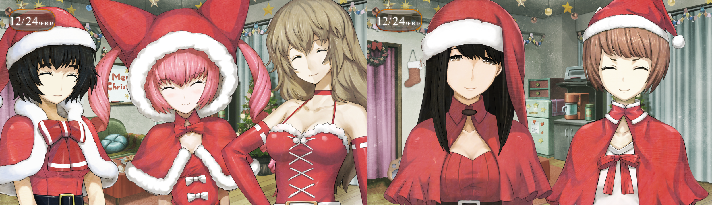
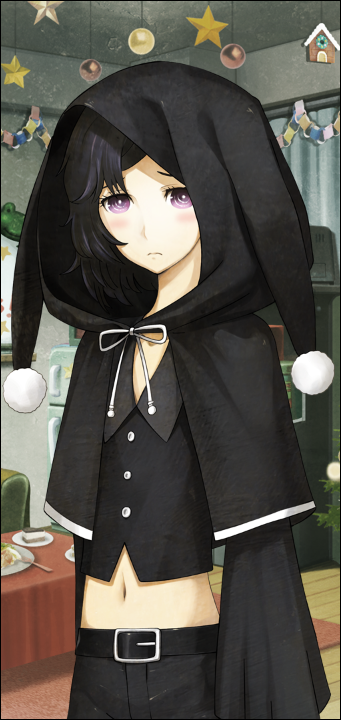

> <big> **双体福音的契约 - 08** </big>  
> 1.129848  
> [ 2010/12/24 ] 圣诞派对（上）众人聚齐，给铃羽惊喜（吓），聚餐。  

如电话中所言，LAB里全是圣诞老人。而且是迷你裙圣诞老人。  

真由理：“啊，冈伦~”  
菲利斯：“来了喵来了喵！”  
由季：“全都准备好了哟！”  
吹雪：“嗨~圣诞快乐！”  
枫：“冈伦先生，晚上好。”  
“啊，嗯……”  
这么多女孩全部穿着迷你裙圣诞装，挤在这个狭窄的房间里向我打着招呼，实在让人有点喘不过气来。正当我不知道该把视线摆在哪里时，琉华子摇摇晃晃地来到我的面前。  

“冈部先生……”  
“琉华子……”  
居，居然被逼成这样的打扮……竟然是黑色圣诞装……而且这不是露出度最高的吗？  
非常……妖艳……  
但是是男的！  
“冈部先生……我……我……”  
“琉华子……怎么说呢，辛苦你了……”  
想必很难熬吧，毕竟之前这里就只有他一个男性。于是我轻轻地拍了拍他的肩膀表示安慰，琉华子则像是卸下了重担一样露出了微笑。  

“我也好想穿圣诞装啊。”  
“那明年给绹酱也做一件”  
“真的？”  
“嗯~”  
“谢谢真由理姐姐！”  
“欸嘿嘿~”  
众人之中只有绹小小的身影还穿着常服，一脸好奇与羡慕地盯着其他大姐姐们——但是琉华子是男的！刚刚安慰好了她的真由理凑过来招呼我：  
“冈伦，快进来呀”  
“桶子和铃羽呢？”  
“还没有联络。”  
让铃羽参加是今天最大的目的，说真由理是为此才举办的派对也不为过。  
“对了，冈伦的客人呢？”  
事先已经告知了我要带雷斯吉宁教授和比屋定一起过来的事，我马上招呼两位客人进屋。  
“介绍一下，这位是雷斯吉宁教授。”  
*“Merry Christmas!”*  
“呼哇~” “哇！” “喔喔！” “啊啦~”  
雷斯吉宁教授与众不同的外表与高大的身型引起了女性众的惊叹，绹更是直接叫出了 “好大只！” 他本人则是绅士地回应道 “谢谢，cute的大小姐。” 对此绹的应对却是“但是我爸爸更大只！” 真是可爱的小动物啊。  
“那么，接下来还有另一位，比屋定真帆小姐。”  
“大家好，初次见面。”  
“呼哇~” “哇！” “喔喔！” “啊啦~”  
女性众又是同样的一套惊叹欢迎，不用说是因为她与前一位反差极大的萝莉体型了。  
“真帆喵，又见面了喵~”  
“啊啦，喵喵的那位……”  
因为不久之前见过，她与菲利斯还互有印象。  
“小学生？初中生？”  
“……别看这样，我可是成年人了。”  
“呃，对、对不起……”  
小动物本来以为找到了年龄相仿的玩伴却实际上踩了地雷，真帆则是一脸苦笑。凑在一起的两小只还不知道已经引起了两位“危险人物”的窃窃私语。  
“真由理酱，你怎么看？”  
先发言的是由季。  
“两个人都是好材料啊~真由喜的妄想已经停不住了！  
&emsp;&emsp; 连同绹酱的份在内，多准备些小号的就好了呢~  
&emsp;&emsp; 这是真由喜一生的失误啊！”  
“小小圣诞老人组合……啊啊~好想看啊~”  
“是啊！”  
被真由理盯上了啊……看来比屋定是逃不掉了，毕竟连那么害羞的琉华子都被缠得投降了。两人的密谋仍在继续。  
“教授先生的份呢？”  
“那个身高大小的没做过呀。”  
“感觉他光是存在本身就已经赢了。”  
“让他穿上毛茸茸的驯鹿布偶装也不错呀~再戴上红鼻子。”  
“哎？那个……会怎样呢？”  
喂喂，居然想让把教授装成驯鹿……  
“这个，真由理？不要觉得每个人都有cosplay的兴趣比较好哦。”  
“啊，嗯，是的呢，勉强别人是不好的呢~”  
“不过最近，便利店一类的地方，店员们也都穿成圣诞老人了哦。  
&emsp;&emsp; CM和圣诞节，性质完全不同呢。”  
说这些结果还是想让比屋定他们穿圣诞装吧……  
“所以说~真帆小姐！不介意的话把真由喜的圣诞装借给你吧？”  
真由理一副天真无邪的样子向比屋定发动突击，遭到了全力拒绝。倒是雷斯吉宁教授很有兴致地自己找了个纸质三角帽戴在头上。  
“啊，桶子君来联络了~说是马上到了，铃小姐也在一起。”  
真由理看着手机说道。看来桶子那边很顺利，不愧是铃羽的父亲。这样最大目标就达成了，接下来就要开始下个任务。事先大家一起决定了要给铃羽一个惊喜，即将回到这里的铃羽并不知道我们在等着她。我们每人配了一个拉炮移动到各自的位置，顺势也叫了雷斯吉宁教授和比屋定一起帮忙。真帆还是有些困惑，教授很则是兴致勃勃。  
菲利斯：“关灯了喵！”  
真由理：“铃小姐，会开心吗？”  
由季：“铃羽小姐惊讶的表情什么的，平时基本没看过呢。”  
菲利斯：“但实际上很喜欢甜食喵。”  
琉华子：“而且，待人也很亲切。”  
绹：“之前，向她打招呼，她回我了哟。”  
由季：“欸……我也想要和铃羽小姐关系变得更好呢……”  
真由理：“会的哟~一定没问题的，你们一定合得来的。”  
这时，楼前的小巷，桶子的声音通过窗户传了进来。  
“好——要进去了哦——要和铃羽一起进去了哦——！”  
像解说一样不自然地声音响彻四周。按照之前说好的，桶子到LAB楼下就会给暗号。黑暗中我们互相做出“嘘—！”的动作保持安静。走上楼的脚步声越来越近，所有人屏住呼吸一动不动地等待着。时机很重要。可是……不会在我们行动之前露馅吧？料理的味道，女性们化妆品的味道，各种各样的味道充满整个房间，铃羽的话对这种异常应该会马上察觉吧？心里愈发担心的时候，听到了门打开的声音。  
“啊咧，今天吗，没人过来啊？”  
“偶，偶然会这样嘛……”  
笨蛋桶子！声音别发抖啊！心里更慌了。还没好吗？号令呢？几乎想要抢先跳出去拉响拉炮了。掌心全是汗。  
“就是现在喵！”  
听到了铃羽脱鞋的动静，菲利斯发出号令。房间灯点亮的同时，我们一齐拉响拉炮。  
噼里啪啦的声音，让铃羽露出一瞬惊惧的表情。下一秒的她的动作，快得让眼睛无法捕捉。铃羽身势一低，往前一踏，拉近了和正前方的由季的距离。比起我制止的声音，铃羽手掌击向由季下颚的速度或许要更快。  
“呀啊！”  
由季被铃羽的突进吓到，向后退时脚下绊倒，使得铃羽锋锐的掌击在其鼻尖前切了个空。  
“住手！铃羽！”  
这一连串动作结束时，我才发出了声音。铃羽正一手撑着快要摔倒的由季，另一手准备继续攻击。这两人，还有周围的我们，都僵住了。真是千钧一发。如果时机再差一点，由季很可能已经受重伤了。  

菲利斯：“stop喵！”  
真由理：“是，是庆祝圣诞的哟——”  
周围的人总算搞清楚状况，慌乱的声音打破了寂静。由季睁大眼睛，一动不动地靠着铃羽。  
“这，这是在做什么……？”  
铃羽：终于，铃羽回过神来，看向我们。  
真由理：“所以说，是庆祝圣诞的哟，铃小姐！”  
铃羽：“庆祝圣诞？”  
真由理：“是的……”  
吹雪：“哈，哈啊~吓死了~”  
真帆：“好厉害的身手……”
琉华子：“速度快到我什么都看不见呢……”  
枫：“由季，没事吧？”  
铃羽转头环顾着房间，好像还没搞明白状况的样子。是因为没经历过，所以不知道这是派对吗？天花板和墙壁装饰着花环和缎带，折叠桌上摆满了料理、蛋糕、零食和饮料。  
铃羽：“派对？”  
由季：“对，对不起。是我提议想吓你一跳的。”  
由季慌忙从铃羽身上离开，连连低头道歉。  
桶子：“铃，铃羽……这个，怎么说，大家只是想给你个惊喜，绝对没有恶意的。”  
铃羽：“…………”  
桶子：“铃，铃羽？”  
铃羽：“爸……哥哥也是提前知道的？”  
桶子：“唔……嗯。”  
铃羽：“这样啊，难怪今天表现的有点奇怪。”  
真由理：“抱歉，铃小姐。提出计划的是真由喜的哟。  
&emsp;&emsp; 所以不要生由季和桶子君的气，要生就生真由喜的气吧！”  
铃羽：“真由姐姐真是的，我平常有一直在生气吗？”  
铃羽再次环视室内。  
铃羽：“欸~好厉害啊，真不敢相信这是平时的那个LAB呢。”  
真由理：“是吧~大家一起装饰好的呢，欸嘿嘿~”  
铃羽：“嗯，真的很厉害，太漂亮了。”  
铃羽有些不知所措地笑着，就这么徐徐后退，打算出门。  
真由理：“要，要去哪儿？”  
铃羽：“欸？去哪……真由姐姐你们要开派对吧？打扰你们就不好了。  
&emsp;&emsp; 哥哥也真是的，一点也不机灵，这种场合我在也没什么用不是吗？”  
菲利斯：“没那种事喵！一起来派对喵！”  
铃羽：“欸？但是……这种事我也没有经验……”  
真由理：“只是开开心心吃东西聊天而已。所以，一起来吧？”  
真由理仿佛像说决不让你逃走一样，紧紧用自己的手缠住铃羽的手。  
铃羽：“真，真由姐？”  
桶子：“看，铃羽你的位子我们也准备好了da✰ze！”  
铃羽：“可是……我真的不知道该做什么……”  
桶子：“好了好了，快坐下吧！”  
真由理：“铃~小~姐~~（可怜的拖长音的语气）”  
被真由理拉着同时催促着，铃羽坐到了我旁边。  
菲利斯：“好了好了，大家！这样就全员到齐了喵！”  
吹雪：“好的！鼓掌鼓掌！”  
大家跟着吹雪的号令鼓起掌来，桶子则是用电脑，播放着各种大街上耳熟能详的的圣诞歌曲。屋子里原本低迷的气氛，一下子就高涨了起来，我也稍微松了口气。  

“那么，先来一起干杯喵~倒自己喜欢喝的饮料就好了喵~”  
可能是由于工作经验的关系，菲利斯自动担任起了主持与暖场的角色。于是，大家就开始四处物色着自己想喝的东西。  
“给，铃羽”  
我给有些不适应这个气氛的铃羽递过去一杯无酒精的香槟。  
“啊，啊啊，嗯……  
&emsp;&emsp; 果然我还是适应不来啊，这种场面。”  
“为什么？”  
“因为……我不是为了玩才到这个时代来的啊……”  
来到这个时代的目的……吗？  
我是没有资格对这方面说三道四的，毕竟铃羽无法完成使命而这样一筹莫展，都是我的错。就算是这样——  
“偶尔这样，不是也挺好嘛。”  
“可是——”  
“铃羽你，想太多啦。”  
桶子加入到了对话中。  
“单纯只是跟大家吃个饭而已。再说你肚子也饿了吧？”  
“这个……”  
不知道是不是因为被说出来所以意识到了，铃羽的肚子咕噜噜地叫起来了。  
“唔……”  
“看吧。大家反正都做了这么多东西，心怀感激的吃个痛快就好了。”  
“嗯……”  

“大家喵~喝的东西都准备好了喵？  
&emsp;&emsp; 那么，先请策划这次派对的真由喜来说点什么喵~”  
“欸，欸~？”  
突然被甩到话题的真由理，慌慌张张的站了起来。过程中碰到了坐在旁边的琉华子，两人手中杯子里的东西差点溅出来了。  
“哇，哇啊？琉华君，抱歉呢！”  
“真由理酱，冷静点。”  
“呼嗯……”  
真由理就这样，呼——哈的深呼吸着调整气息。  
“嗯——今天是平安夜！  
&emsp;&emsp; 现在到处是现充，今年真由喜跟大家也开起了派对，成为现充吧！”  
“啊，不是……我想那个现充的意思弄错了啊，真由喜……”  
吹雪看了看远方，嘴里嘟哝着。而枫见机补充道：  
“吹雪酱，从好几位后辈酱那里接到了圣诞节约会的邀请呢！而且是很热烈的那种！”  
“虽然，全部都是女孩子的后辈呢。”  
“这个，那个……总而言之，大家能过得很开心的话，真由喜就很高兴啦~说完啦~”  
真由理微微鞠躬低头，对铃羽微笑了一下。铃羽则用不知该笑还是如何的暧昧表情回应着。  
“那么，就来干杯喵~真帆喵，领头就拜托了喵~”  
“欸？我，我来！？”  
“好不容易才来一次喵，顺便就加上自我介绍吧喵~”  
被指名的比屋定，一副苦涩的样子站了起来，考虑了一会儿后开了口。  
“今天能被大家邀请到这里，十分感谢。  
&emsp;&emsp; 我跟雷斯吉宁教授一直住在美国那边，  
&emsp;&emsp; 像现在这样在日本过圣诞节还是第一次。  
&emsp;&emsp; 能这样跟一群朋友一起热热闹闹的过圣诞也是，我觉得很棒——”  
“来点有趣的东西喵！”  
“……啊？”  
“有趣的东西喵！”  
“啥！？嗯，那个……”  
菲利斯……又这么乱来……  
“唔嗯……这个……那个……”  
不行了，比屋定已经完全不知所措了，比刚才的真由理还要慌张。在ATF上那么爽快的演讲——还能够进行同声翻译——什么的，就好像是别人一样。难道是不擅长即兴表演吗？  
“呜……meow！！”  
被迫不得已的比屋定所弄出的“有趣的东西”所渲染，LAB里顿时多了几分暖意，还充满着温馨的气氛，宛如在宠爱一只小动物的感觉。  
“哦哦！真帆喵！有成为猫耳女仆的资质喵！”  
“嗯嗯！真帆玲·喵喵诞生的瞬间呢~”  
而菲利斯跟真由理，好像打从心底里很感动的样子。  
“呜呜……我也真是的，到底说了些什么啊……”  
比屋定一脸阴沉地反省着自己刚刚的行为，看到这样子我还是帮她解围一下吧：
“比屋定小姐，差不多该干杯了。”  
“是，是呢！就这样吧。那就……干杯——！”  
“干杯——！”  
大家都很开心的把杯子砰的碰到了一起。  
总而言之，既然是我邀请比屋定来这个派对，先去向她说些安慰的话吧。  
“很有趣的干杯问候哟。”  
“真是让人自我厌恶……”  
“说什么呢？不是很 *cool* 的 *cat* 嘛！”  
“真帆喵，什么时候能来 *MayQueen* 工作喵？”  
“没有那个打算啦……”  
菲利斯跟雷斯吉宁教授也为了能让真帆振作起来而高兴地跟她说着话。  
“铃小姐，来，干杯~”  
“铃羽小姐，我也来——”  
“啊，嗯。”  
铃羽那边表情还很僵硬，真由理跟由季，还有桶子稍微有些强硬的跟她一起碰杯了。  
“给，铃小姐。这个，是真由喜自己做的哟！”  
真由理把法式咸饼盛好递给了铃羽。铃羽尝了一口，表情顿时闪亮了起来。  
“好吃！”  
“真的吗？！”  
“嗯。”  
“多吃点。再多吃点！”  
“那么多一下子吃不完的啦。”  
“啊，是吗？”  
于是真由理就把法式咸饼也推荐给了比屋定和教授他们。  
“真帆小姐跟雷斯吉宁先生也是，请尝尝看~”  
“谢谢。”  
“嗯~好吃！这真是 *Oishi*（好吃）啊！”  
“欸嘿嘿~”  
“那，这边也试试怎么样？虾仁奶汁烤菜，还有，炸鸡也试着调了民族风味——”  
*“Excellent!”*  
“还真是讲究呢。”  
由季勤快地给所有人分发着料理，但是，铃羽那边却好像一直没有去的样子。真由理一直用动作示意着让她去铃羽那儿，但是由季一直都在磨磨蹭蹭。应该是太过在意铃羽的感受了吧。但是，铃羽从刚才开始，就一直在对真由理和由季做的料理赞不绝口。毕竟大概从一个月前开始，这两个人就在LAB进行着料理修行。这也算是得到了回报吧。  
“啊，还有蛋糕哟？枫自己装饰出来的呢！”  
“因为还不是很熟练，还请见谅呢。”  
“枫就是这种呆萌的女孩子呢~但是，这样的枫也是很萌的哟~”  
“完全没觉得是被表扬了啊……”  
真由理跟枫互相看着对方，一同笑了起来。  

晚餐就这样愉快地进行着。

 

> (to be continued)
---

| [←prev](./0025) | [home](../../) | [next→](./0027) |
