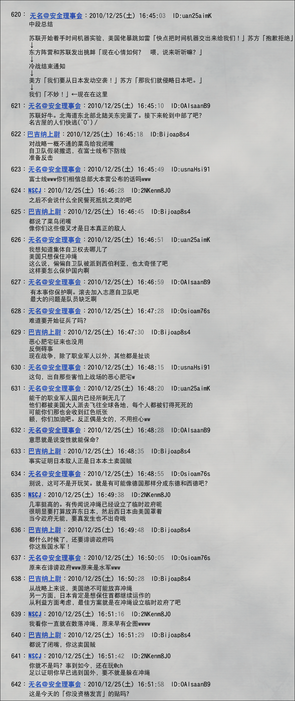

> <big> **永劫回归的潘多拉 - 01** </big>  
> 1.382733  
> [ 苏联线 ] 世界线变动，冈伦被自卫队保护逃亡，持续一个多月。  

时隔四月，再次品尝到这世界被扭曲的滋味。  
是谁？到底是谁让世界线变动了？  
我什么也没做。没有任何干涉世界的举动。  
可为何世界还要再次戏弄我？  

睁开眼，周遭的色彩渐渐复原。摇摇晃晃的整个世界，渐渐地再次回到了稳定的样子。眼前的光景，已不再是LAB里温馨派对的场景。我在室外，下着雨，很大的雨，打在脸上很痛。彻骨的寒冷，急速地夺去我全身的力气，让我清醒地感受到，这是寒冬之雨。视界不再扭曲，进入眼中 的是一群不认识的男人，坚实的后背对着我。复数穿着靴子踩在泥上的足音交织着雨声进入耳中。强烈的恶臭刺激着鼻腔。让人难以呼吸的下水道的臭气，交杂着像是橡胶和塑料燃烧的恶劣臭味。这里是哪？我现在在做什么？周围的变化实在太剧烈，我拼命想知道现在是什么状况，大脑的运转却跟不上。  
“快到了，请再加把劲。”  
我停下了脚步，一只粗壮的手鼓励地拍了拍我的肩膀。转头一看，是一位和我同龄的有着精悍脸庞的青年，应该是不认识的。青年穿着新闻里常见的自卫队迷彩服和装备，肩扛自动步枪，周围的七八个男人都是这个装束。他们围着我警戒着四周，无声地前进着。这些人是……自卫队员？这时我才注意到，自己也穿着同样的迷彩服。我竟然也是自卫队员？试着摸摸自己的上臂，完全没有肌肉，还是那么手无缚鸡之力。和周围男人不同，我身上也没有步枪之类的武器。那么这到底是怎么回事？这七八个身强力壮的自卫队员在护卫着我移动——怎么看都是如此。我何时成了这种VIP？搞不清楚，但还是被自卫队员催着，拖着沉重的双脚前进。而且这条路是怎么搞的？全是黏黏的泥巴，周围散落着大量垃圾和瓦砾，要频繁地避开这些前进。左右可以看到高墙的轮廓，往耸立的两壁上方看去，下着大雨的夜空呈现异样的红色，还带着模糊的光亮。倒也因此，不用手电筒就能在这样的道路上前进。  
嗯？有声音。这是……水声。寻声一看，侧边墙上开了个大洞，大量污水涌进。因此前方都出现了几条小河。原来如此，这里是水干掉的河底，左右的高墙是河的两岸。  
“这里是哪一带？”  
为了不被雨声掩盖，我几乎是用喊的回头询问刚才说过话的队员。  
“嘘！请不要大声说话。”  
“啊，对不起。”  
“就快脱离市中心了。到练马驻屯地附近应该就能上车了，到那之前请步行——”  
但他的话语戛然而止，全员突然被前所未有的紧张感所包围。一个队员抓住我的手腕，把我推到墙上，其他所有人也背靠着墙，屏住呼吸。远处传来直升机的声音，而且不止一台，逐渐靠近这里。我还没完全弄清情况，只是被这种紧张感所淹没，心跳得厉害。  
“躲到那辆车的阴影里去。”  
几米远的瓦砾之间，满是泥的汽车倒在那里。似乎是河干后从河岸掉下来的，车体严重变形，车顶已经全碎。俯身到散发恶臭的污泥中，我滑到车的阴影里。另一方面，自卫队员们小声着交换着指令，看来这样的事态也在预想之中。他们开始了行动，仅剩两名队员留在我身边，其余人向我们来的方向跑去，然后各自利用墙上的裂缝和凸起，蹬上河岸，消失在我们的视线中。然后马上传来了枪声。而且不是手枪打了一枪这类天真的东西——是战斗的声音。被枪声吸引，直升机的声音离我们而去。  
怎么会这样……  
在这条世界线上，日本发生了战争？  
第三次世界大战——铃羽的话从脑海闪过。  
我心不在焉地把视线扫向藏身的车的内部。一男一女和小孩，三个人的尸体被安全带固定着倒吊在那里，身上都是凝固为黑色的血，看起来简直就像鬼屋里粗制滥造的假人。然后我发现了，刚才一心行进时没有发现的，原来污泥里到处都沉着类似的假人。那些筋骨裸露在外的手脚扭曲地伸展着，仿佛在向苍天求救。  
“唔……啊……”  
我差点叫了出来，赶紧用手捂住。那些，并不是什么假人，而是……  
“就是现在，贴着墙壁前进！”  
“啊……？”  
“路线变更。快，请站起来。”  
我被一把拉了起来。因为过度的震惊和疲劳，膝盖有些发软。  
“同伴在吸引苏联直升机部队的注意力，但是坚持不了多久。快点！”  
苏联？因为恐惧而迟钝的大脑迷迷糊糊地思考着，好像听到了很有违和感的词汇——  
“请振作一点！为了保护你，已经牺牲了多少人你不知道吗？”  
“保护……我？为什么？”  
“理由没有告诉我们。但是，我们接到的命令是，  
&emsp;&emsp; 即使拼上性命也要保护你。说这关乎到这个国家的未来。”  
上空又飞过一架直升机，探照灯一扫而过。好在河岸的阴影藏住了我们。  
“这边！”  
不知名的青年队员把我拉向墙上流着污水的洞。仔细看发现那是下水道的出口，大小刚够一个人弯腰通过。我们逆着淹过膝盖的流水在黑暗中前进，不多久嗅觉已经麻痹，也不觉得下水道臭了。途中出现多次岔道，带路的自卫队员似乎已经掌握了路线，毫不犹豫地前进着。这么走了一阵，又再次从下水道回到了河床。和最初的一样，这个河也是干的。不知道是回到了刚才那条河，还是到了另外一条，队员也没有告诉我。不管怎样，总算从那个充满恶臭的黑暗空间中脱出，我试图大吸一口新鲜空气。但是，刚吸进一点，就闻到了比下水道更糟的异臭，不由得退了两步。因为眼前的，是一副过于凄惨的光景。大量的尸体代替了河水堆叠在这个曾是河底的地方。因为大多数已经炭化，连数量也无以数计。远处，篝火一样的火焰在燃烧着，在大雨中猛烈地燃烧着。正在燃烧的，是堆积成山的曾经作为人的肉块。  
“就快到了。也许会很难受，能跑吗？”  
“欸？啊啊，能……”  
多亏自卫队员在和我说话才恢复了自我。如果没有这两个人，我可能已经疯了。两个人前后夹着我，在河里奔跑。空中依然不断传来直升机的声音，探照灯偶尔在附近划过时，我们就躲到那成山的尸体中，趴在地上躲避。  
我原以为我在曾经的世界线漂流中已经见过很多了。  
“死”。  
死的瞬间。  
但我从没见过“长时间被放置的死”。  
恐惧、悲伤，比这些感情更突如其来的“死的味道”，那种腐臭，侵蚀的不是我的精神，而是肉体。身体对这种异常起了反应——恶心——明明这种感觉是对死者的不尊重，但却毫无办法。  
“欣嫩子谷”——  
我想起了那句话，与比屋定和教授一同被袭击的那个夜晚，令人毛骨悚然的袭击者口中的话语：  
“你只有一只眼进入永生，强如有两只眼被丢在地狱的火里。”  
地狱的英文“Gehenna”其实是希伯来文的音译，指耶路撒冷以南的欣嫩子谷。本来是焚烧垃圾的地方，谷中火焰昼夜不停地燃烧着，连天空也被灼烧得通红。传说无数人被残忍地投入火中抱着悔恨死去，化为黑烟后怨念仍不消散。我眼前的正是那番景象的重现。  

两个队员最终带我来到了一条塌了一半的地铁隧道。因为停电没有灯光，只有三台迷彩涂装的装甲车打着灯在轨道上等着我们。四轮驱动越野车型，装甲看上去很坚固，但没有发现武器。  
“从这里穿过地铁路线可以逃到埼玉。  
&emsp;&emsp; 据说入间基地还是安全的，到了那里应该就能离开关东了。”  
“离开……关东？”  
“有话到那边再问。总之请快点。”  
现在也还能听到外面的枪声，满肚子疑问的我被强行塞进了一辆车的后座里。  
“这样就行了。希望你安全到达。”  
“欸？你们呢？”  
“我们还有别的任务。再见。”  
把我带到这里的两名队员向我敬礼告别，转身离开了车站。可能再也见不到他们了……我有这种预感。  
装甲车门发出厚重的声音关上了。司机是一位看上去略比我年长的自卫队员。柴油机启动，在本来设计给电车使用的隧道中装甲车以相当快的速度疾驰着。不言而喻，乘坐感很糟糕，但只能忍受。虽然想去一趟秋叶原，但现在的气氛叫我无论如何也无法提出。  

我没有把世界线改回去的方法，只能且必须在这个地狱般的世界线上活下去。为了生存，就要听从自卫队的人的指示。我的意志影响不了任何事，甚至连表明意志都不被允许，唯有听从指示一味逃亡。这是我唯一能做到的事。  
唯一没想到的是，这样的状况竟然持续了一个月之久。  

 

> (to be continued)
---

| [←prev](./0027) | [home](../../) | [next→](./0029) |
