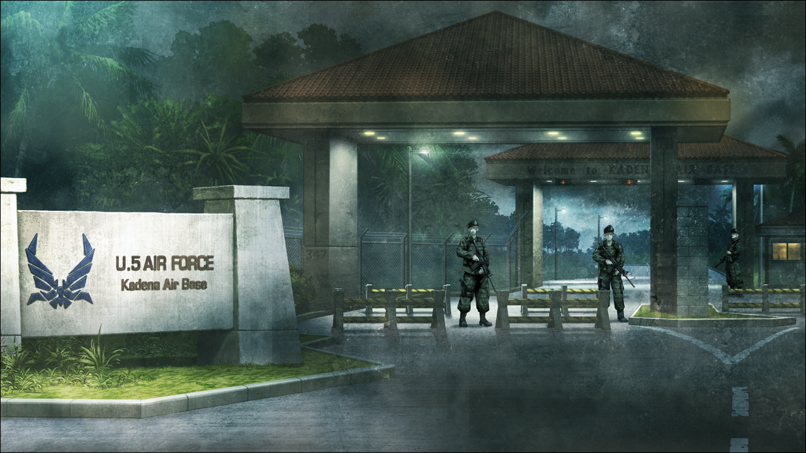
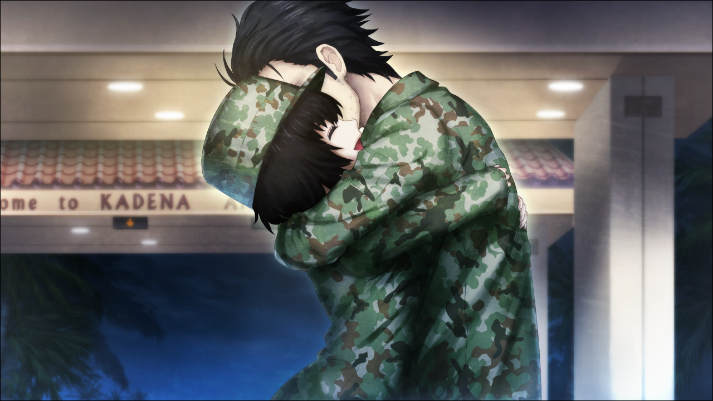

> <big> **永劫回归的潘多拉 - 02** </big>  
> 1.382733  
> [ 苏联线 ] 冈伦最终被交给美国，见到红莉栖（Amadeus）后再次引发跳线。  

到冲绳之所以花了一个月，是因为战况的不断恶化。据说我本来应该从入间基地直接走空路到冲绳的，然而连续几天遭到空袭让我们放弃了走空路的计划，转而走陆路逃到九州。苏联的特工和强袭部队多次袭击了我们，许多自卫队员为了保护我死伤了。即便如此，我还是成功在佐世保乘上了海军自卫队的护卫舰，总算逃到了冲绳。  
为什么要为我做到这个份上？无论问多少次，都没有回答。  

冬天的冲绳，天上是厚厚的积云。说来我在这一个月没有看过云以外的天空。想着这种悠闲的事，一辆改装厢型车到港口来接我了。车里除了司机外，副驾驶席上还有一名中年男性，很矮，说不定只有一米五左右。然而他全身都散发着军人的气息，透过衣服也能隐约看到那健实的肌肉。  
“是冈部伦太郎君吧？我是防卫厅属下中央情报安全队的下山。  
&emsp;&emsp; 现在我们先去一趟机场，之后再到嘉手纳的冲绳防卫局。  
&emsp;&emsp; 长路劳累，但请你再忍一会儿。”  
“是……”  
听说东京已经沦陷了。中央省厅中的防卫省，也为了和在日美军保持密切的协力体制，把冲绳防卫局当作临时厅舍。下山向我说明了这些。也就是说，我们现在正在前往日本防卫的中枢。到了那里，我就能明白，受到VIP待遇、被自卫队员用生命保护的原因了吧。  

车暂时停在了那霸机场，意想不到的人坐了进来。  
“哦？冈部先生！”  
“哇，真的！是冈伦啊！”  
“你们俩……这不是由季小姐和中濑小姐吗？”  
没想到在这种地方与这两人相遇，这是我来到这条世界线之后第一次遇到熟人。仅是如此，泪水就高兴得要涌出。虽说如此，也不能只顾高兴。  
“真由理呢？知道真由理的下落吗？”  
“放心吧。”  
由季点点头，让我安下心来。  
“刚才我们还在一起。”  
“在一起？”  
“是啊。有真由喜，留未穗，琉华君，枫酱。  
&emsp;&emsp; 今早到机场后，说是会转到防卫局保护我们，就等着了。  
&emsp;&emsp; 刚才突然让我和吹雪酱走。”  
“然后上了车，就发现冈伦也在。”  
“总之，大家都没事就好。”  
桶子和铃羽的名字没有出现，那两人的事虽然也想问——  
“对不住，积攒的话可以之后再说吗？”  
下山打断了我们，车子再次启动。  
“按计划，你们的家人也会到冲绳防卫局来的。现在我方人员正在保护他们。”  
“真的吗？太好了……”  
“你们的朋友没有在外行动，都在后面的车子里，不是分开了，放心吧。”  
往后看去，稍微有点距离的地方看见同样的车子。真有理她们就在那辆车上吗？  
“那么，等一会儿我们还能再见的吧？”  
“当然。”  
得到肯定的答复，由季安心地呼了口气。但是，我的脑中出现了新的疑问。为什么，要和别的车分开来？这辆车至少还能乘三个人，勉强点挤一下的话，全部人也能坐得下。还是说，把我、由季和吹雪装在一辆车里，有什么特别的用意？  

车子沿着冲绳轻轨的轨道，笔直向南边行去。看着沿途的街景，我不由得感叹：  
“好暗啊……”  
“欸，什么？”  
“没……明明有这么多的店铺，但是到处都是一片黑。”  
众多的特许餐厅和大型超市，面向观光客的食堂，汽车租赁店等像排队一样被压缩摆放在一起。但是，无论哪家店都关着灯，一片寂静。路灯也几乎没有，行驶的车子都是日本和美国的军用车辆，完全没有行人的影子。  
“现在实行了灯火管制和下午五点宵禁。  
&emsp;&emsp; 虽然冲绳目前还算安全，但是战争时期，像以前那样是不行了。  
&emsp;&emsp; 真想早点结束战争回到以前的生活啊。”  
战争时期……啊。下山回答了我的疑问，然后继续向我搭话：  
“呐，冈部君，你熟悉的那个冲绳，晚上应该是灯火通明充满欢乐的地方吧？”  
“……啊，不是很了解。我是第一次来冲绳。”  
“那真是太可惜了。希望你下次来是为了旅游，这儿真的是一个好地方啊。”  
车子从旁路的高架桥往上开，直接进入机动车道，接着是长长的隧道。  
“其实，在三位到达防卫局之前，稍微有点问题想问。这就是你们同车的理由。”  
……果然是这样啊。就是说，只找我们三个人有事。但为什么是我们三个？我和由季、吹雪算不上特别的亲密，上一次说话已经是几个月之前了。不，想到这里我摇了摇头，那只是世界线变动以前的情况。在这条世界线，或许是不一样的。我完全不知道自己在这条世界线的人际关系。难得享受到VIP级的待遇，我不想被下山怀疑。  
“阿万音由季小姐。”  
“是，是的？”  
下山第一个直接点了由季的名字。由季紧张得身体僵硬，坐在旁边的我能感受到。  
“你知道桥田至君和他的妹妹现在在哪里吗？”  
妹妹……是指铃羽吧。也就是说在这条世界线里，铃羽也是从未来来到这里，以妹妹的身份和由季她们成为朋友的吗？而且看来下山他们并没有掌握到桶子和铃羽的消息。  
“不……那个……我……”  
由季吞吞吐吐地回答，并向我投来求助的目光。但是我也不知道那两个人的去向。说到底我没有这条世界线之前的记忆，所以没法回答。只是，由季态度让我很在意。那种态度，就像是知道那两个人在哪里，却有意隐瞒，而且我应该也是同样的立场。可是她的表现既然我都有所察觉，下山应该同样感觉到什么了吧。车内莫名地产生了紧张感。由季想要隐瞒什么呢？对象是谁？  
“嗯？不知道吗？”  
坐在副驾驶席的下山回过头看着我们再次确认道。  
“不好意思。”  
这次，由季很是抱歉地低下了头。  
“但是你和桥田君很亲密地在交往吧？恋人之间却没有任何联系——”  
“手机什么的，现在不是已经用不了了吗？”  
“手机以外的联系方式也是有的吧。”  
“但是，真的什么都……”  
“他的妹妹也是？”  
“是的。”  

“话说回来，冈部君你和桥田君好像是在研究什么，对吧？”  
“欸？”  
下山突然把对话的矛头指向了我，让我十分慌张。研究？什么研究？糟糕，我这惊慌的样子一定很可疑。  
“是做着怎样的研究啊？”  
这样的话，我只能先在保险的范围内回答了。  
“与其说是研究……怎么说呢，不过是一点小发明小创意……”  
“发明？”  
“比如在竹蜻蜓下面装一个CCD摄像头看看能不能在空中拍摄……  
&emsp;&emsp; 尝试用吸尘器的排气代替吹风机之类的……”  
“呵，挺有趣的嘛。  
&emsp;&emsp; 那么，你们不是因为做出了什么不得了的东西，  
&emsp;&emsp; 不想被我们知道，为了躲避我们而逃走——  
&emsp;&emsp; 是这样的吧？”  
“逃走？”  
糟了，一不留神就反问了，走错一步。但是，桶子和铃羽，在这种混乱的状况下，为什么要避开自卫队，不知去向呢？自卫队在这一个月中，可是拼了命地保护着我，倒不如说他们才是我们应该寻求保护的对象不是吗？这个局面真的是越来越混乱了。  
“不知道的话就算了，桥田君他们的事情就先到这吧。”  
“……”  
真希望谁能告诉我正确的答案，我在这里该回答什么才好。  
“那个，中濑克美小姐？我有另外的问题要问你。”  
“啊！我？”  
这次，轮到吹雪一瞬间在座位上吓了一跳。  
“不不，不用那么紧张，不是什么大事。”  
下山这么说，反而让吹雪更加惶恐。她的反应也很奇怪，太过度了。说不定自卫队并不是把我们保护起来。话说回来，本来就不可能把我们这样的普通人当做VIP对待。这样做的话，目的是什么？——不，隐隐约约能猜测到。时间机器。这场战争的起因是俄罗斯开始进行时间机器实验，这理所当然是与逃亡的中钵有关——在这条世界线，那家伙同样是逃到了俄罗斯寻求庇护——我通过自卫队员们的对话知道了这一点。而且，铃羽是从2036年乘坐时间机器来的时间旅行者。既然铃羽来到这个时代，就是说那台时间机器的开发者，是未来的桶子。“如果有时间机器的话，战局就会立刻被改变。”有这种想法的日本政府机构，会试图约束疑似和时间机器有关联的桶子、铃羽以及他们的朋友，也不足为奇。当我注意到这些，就觉得车内的情况非常的令人恐惧。这辆车的目的地，真的是冲绳防卫局吗？在那里，我们真的能被好好地保护吗？  
“关于上周中濑小姐接受的健康检查……”  
“是……是检查出了什么问题了吗？”  
“不，你在东京受的伤已经基本痊愈了，身体状态是没有问题的。  
&emsp;&emsp; 只是，精神压力好像很大啊。嘛，这也难怪。  
&emsp;&emsp; 毕竟经历过那么惨烈的空袭，可以说现在几乎所有平民都有PTSD。  
&emsp;&emsp; 但是，你的情况，好像和别人有点不一样。  
&emsp;&emsp; 比如说做一些非常真实的梦，严重的时候，白天也会做梦……  
&emsp;&emsp; 听说连现实和梦境也可能会区别不出来。”  
“所以说，这不就是那个PTSD吗？”  
代替害怕得说不出话的吹雪，由季突然严肃地给出回应。由季这样的态度是很少见的，至少我是第一次看见。很明显，由季不仅不信任下山，反而抱有敌意。  
“没，说起来那真是奇怪的事啊……”  
下山装模作样地说着，摸了摸下巴。  
“有和中濑十分相似的做白日梦的人。而且，不是一两个。”  
“欸？”  
“当然在程度上也有差异，但光是国内就已经发现了十几名左右。  
&emsp;&emsp; 好像在海外也有。嘛，虽然只有西方国家的情报而已……”  
“那样的事，仅仅是碰巧而已吧？”  
吹雪表现出的恐惧非同小可，因此，我忍不住开口了。  
“你知道普金吧？”  
下山唐突地把视线转向我提问道。  
“普金？是苏联的……总书记对吧？”  
差点要回答“是俄罗斯总统”，不过总算是忍住了。在这条世界线，苏联依然存在着。普金的职衔并非总统，而是总书记。这件事在入间基地的时候听说了。  
“是这样。但是，中濑小姐的回答令人很感兴趣，说普金是俄罗斯的总统呢。”  
什么？  
“对不起……当时我应该是说梦话的，而且我的学习什么的完全不行……”  
“不，不是那样的。做白日梦的人都有一个特征，他们的回答都是这样的——普金总统。  
&emsp;&emsp; 而且戈里巴乔夫和列利钦这两位，也被称呼为总统。  
&emsp;&emsp; 为此，研究员在暗地里称这个现象为‘总统病’……真是没品的名字。”  
难，难道说……这些症状是，*Reading·Steiner* 吗……看来除我之外，其他人也拥有的可能性很高，能力的程度上可能有所差别。虽然无法确定，但是α世界线的菲利斯的言行，隐隐约约让我感觉到，她也拥有那个能力。所以，下山所说的“做白日梦的人”，很有可能就是拥有 *Reading·Steiner* 的人。如果那些人和我一样，意识到了一个月前的世界线变动的话……如果吹雪也和我一样，有着另一条世界线的记忆的话……回答普金是总统，也并非不可思议。  
“戈里巴乔夫？列利钦？”  
“由季小姐不知道吗？历史课上应该教过吧。”  
“我……高中时代一直是理科的……”  
“我觉得这应该是常识啊……现在的年轻人都不知道吗？  
&emsp;&emsp; 没想到最近的学生都这么不用功啊。  
&emsp;&emsp; 冈部君你多少知道的吧，戈里巴乔夫和列利钦这两位？”  
“欸……嗯。嘛……”  
“柏林墙的倒塌，还有经济改革。”  
“是的，这些都在教科书里——”  
说到一半，大脑中警钟激烈的响了起来。——总觉得不妥，下山的话有哪里不太对劲。  
“啊……！”  
然后察觉到了。现在，正是东西方阵营分裂，在世界大战发生的这个时候，“柏林墙倒塌”之类的事会发生吗？原本有的戈里巴乔夫改革之类的事有果断地实行然后完成吗？被套话了，注意到这个的时候已经晚了。不安开始出现在脸上。  
“嗯？……你也是这样的吗？而且，是想故意隐瞒吧？”  
“……”  
“果然，和情报一样，你知道什么重要的事情啊。  
&emsp;&emsp; 呵呵呵，呐，冈部君，希望你能告诉我呢。”  
下山不知为什么，突然带点自嘲地笑了起来。那笑容令人多少感到恶心和讨厌。  
“戈里巴乔夫？列利钦？你们口中的这些人物，到底是谁啊？
&emsp;&emsp; 我们这边就不说了，美国所有的情报机关也都不存在这些人的资料。”
不存在？我看向了坐在旁边的由季。从她的表情来看，她并不是不用功，而是真的不知道这些人物。
“戈里巴乔夫改革什么的，柏林墙倒塌什么的……  
&emsp;&emsp; 那真的是存在过的事吗？回答我！”  
但是，我不能回答。大脑考虑起一个月前的平安夜，世界线突然变动的主要原因。难道说在那一天，俄罗斯使用了时间机器，做了改变过去的实验吗？实验的内容，是阻止20世纪末发生的苏联解体。于是改变了过去所导致的结果，是现在的这条世界线的话……！真是，太愚蠢了……经过仅仅一次的过去改变，由蝴蝶效应把世界带到了这里。这到底会让多少人死去啊……  
“你和你的朋友，真的能看到别的世界历史吗？  
&emsp;&emsp; 我原本完全不相信，以为只是脑子奇怪的学者们的鬼话——”  
下山想继续追问的这个时机，车内响起了手机来电的铃声。  
“嘁……”  
下山砸了砸舌，从口袋里取出手机。  
“这里是下山。……啊啊，现在，正在前往防卫局……  
&emsp;&emsp; ……什么？这是怎么回事？
&emsp;&emsp; 可恶，这就是白痴啊……他们是哪国的政治家啊……”  
下山向对方发泄心中的不满，接着毫不掩饰怒火地用力按下按键，结束了通话。  
“目的地变更。去嘉手纳基地，二号门。”  
下山一副不耐烦的语气对驾驶员下达指示。目的地变更？刚才的通话对象是谁？在我困惑的时候，下山主动拨通了和某处的通话。  
“我是下山。目的地变更，在嘉手纳基地二号门前汇合。”
只说了这些便结束了通话。由季小心地提出询问：
“请问……这是怎么回事？”  
“情况有变，接下来要请冈部君去美军基地一趟。
&emsp;&emsp; 说不定，接下来会直接坐军机去美国，然后愉快的畅游美利坚啊。”  
“什！？”  
美国！？
“姑且会给你争取一下头等舱，不过别太期待。  
&emsp;&emsp; 毕竟我们说的话，在那些家伙耳朵里不过是宠物狗的吠声而已。”  
“为什么要去美国！？”  
“不知道是美国的CIA（中央情报局）还是NSC（国家安全委员会），  
&emsp;&emsp; 对方要求即刻将你交过去。”  
“所以说为什么！？”  
“这种事，你自己当面问他们去。”  
接着便转向前方，不再说话。  
我们的车沿着高速路前行了一段时间，最终在标着“冲绳南”的出入口下了高速。  

车停在了美国空军基地的大门前，有几名美国士兵似乎是在等着我们到达。  
“把你交给美方的话，恐怕我们这边再也别想获得一丝有效的情报了吧。  
&emsp;&emsp; 所以，这是最后的机会。”  
这时，下山从副驾驶席回过头，径直盯着我。那眼神，仿佛被逼上绝路般，近乎恳求。  
“——请告诉我，我们接下来，究竟该怎么做才好？”  
“呃……”  
“拜托了！”  
脑海中，浮现出在东京的战火里，誓死保护我的青年自卫队员的面容。他们现在是否也仍在东京，为了其他人而战斗呢？还是说，已经……？  
“我……不知道……”  
“冈部君！”  
“我真的不知道！  
&emsp;&emsp; 你真的认为，凭我一己之力能对战局产生什么影响吗？  
&emsp;&emsp; 戈里巴乔夫和列利钦会成为俄罗斯总统什么的……  
&emsp;&emsp; 东西冷战会猝然终结什么的……  
&emsp;&emsp; 这些历史知识就算知道了……也根本无济于事。”  
“……”  
从后方，听到了其它车辆的引擎声逐渐接近。下山叹了口气，把头转回前方，打开了副驾席的门。  
“下车。”  
我遵从指示下了车。  
“冈伦！！”
真由理从后面停着的厢型车下来，叫着我的名字径直向我跑了过来。  
“真由理……！”  
“冈伦！”  
我紧紧抱住向胸口飞扑过来的青梅竹马。  

“终于……见到你了……”  
“太好了……你平安无事……”  
真实的体温。真由理，就在这里。迄今为止，我们从未有过近一个月没见面的经历。更何况现在是战时，和原本的世界线不同，很难取得联系。所以我一直担心真由理的安危，每时每刻心中都充满不安。甚至可以说，就是为了确认真由理安全，我才能熬到现在的。我为了拯救真由理，放弃了整个α世界线。现在的我只希望真由理能够平安无事。  
“冈伦……好难受哟……”  
“啊，抱歉。”  
抱得太紧了……被真由理提醒后，我松开了手。  
“真由喜呢，相信着哟~一定能再见到冈伦，一直相信着。”  
“啊……”  
“太好了！你没事喵！”  
“冈部先生！”  
接着听到了更多熟悉的声音。菲利斯和琉华子，后面还有枫的身影。  
“大家也是，都平安无事……”  
“冈部先生，我……我……呜呜……”  
“琉华子……”  
琉华子一哭，我也不禁眼角开始温热起来。和枫也互相打了个招呼。吹雪像小孩子般黏在枫身边，依然因恐惧而脸色苍白。  
“菲利斯……果然不是女仆装了啊。”  
“被人叫做菲利斯也是久违了喵。”  
菲利斯略显寂寞地说着，接着用手环绕我的脖子，用力地抱住。就这样将粉色的小嘴凑近我的耳边，像是要吻过来。  
“喂喂……？”  
这到底什么情况——  
“喵哈哈，不用害羞喵~”  
恶作剧一般地笑着，菲利斯——不，秋叶留未穗一边装作要吻我，一边在我耳边轻语：  
“要小心。不管是防卫省的人还是美军的人都不可信。  
&emsp;&emsp; 大人总是谎话连篇。大家都不说真话。”  
是了，菲利斯有一种特技，柴郡猫的微笑（*Cheshire·Brake*），能洞悉他人内心深处的天才洞察力。  
“嗯……已经切身体会到了。”  
刚刚才被巧妙地蒙骗过。菲利斯脸上浮现出些许惊讶，放开了我。  
“……真悲哀喵。”  
“是啊……”  
接着，再次传来了引擎接近的声音。这次的声音来自门对面，基地的内部。是一部车牌上刻有字母E的漆黑豪华轿车，其后跟着一辆小型巴士。两辆车在门前停了下来，与旧识的再会时间，因此而结束了。  
*“Welcome!”*  
从漆黑的豪华轿车里，走下一位像篮球选手一样高大的美国军人。  
“欢迎大家来到这里！我是哈蒙德。欢迎各位。  
&emsp;&emsp; 那么，*Mr. Okabe* 以外的各位，请乘坐巴士。”  
这个男人操着一口不正宗却流利的日语。虽然满脸笑容，但却是一副说一不二的口气。其他的美军士兵则从刚才开始，就端着步枪一脸严肃的警戒着周围。下山一行人则只是在远处守着，默默地低着头，没有插手的意思。  
“欸，冈伦以外是……什么意思……？”  
“不用害怕。我们只是稍微向各位问一些话。  
&emsp;&emsp; 之后，马上会将各位送去冲绳防卫局！  
&emsp;&emsp; 来吧，请。”  
“冈伦……！”  
“没事的。放心。”  
“但是……”  
“由季小姐，真由理就拜托你了。”  
“……好的。”  
由季点了点头，轻轻抱着真由理的肩膀一起走向巴士。其他人也跟在她们后面。  
“冈伦……”  
“帮我跟我爸妈，报个平安。”  
我之外的全员上车后，小型巴士马上发动离开了。寂静降临在门前。这份静谧与我拼命地在本州各地逃亡的一个月相比，就像天堂一样。实在很难想象这是同一个世界。  
“那么，*Mr. Okabe*，请坐这辆车。”  
他示意我坐进高档轿车的后座。坐进去之后，会怎么样呢？我短暂地思考，就算赖在这里大闹也没用，于是下定决心，刚想上车——  
“冈部君快跑！去了美国的话就再也不能活着回——”  
下山的怒吼，被冲锋枪密集地开火声所覆盖。视野的一隅，捕捉到了美军士兵毫不犹豫开枪的身影。骗人的吧？刚想回头——  
“上去！”  
视野被一只大手挡住，身体被哈蒙德推搡着。已经听不到下山的声音了。在手指的缝隙间看到的些许景色中，已经没有活动的东西了。这意味着什么，我不可能不知道。连思考的时间都没有，我便被强行推进车里。  
“这种事——”  
刚想开口，但哈蒙德默默的盯着我，左右摇了摇头。“别说话”，似乎想表达这个。哈蒙德就这样坐在我旁边，在关上车门的同时，车子也动了起来。中途，转向了与真由理她们的小型客车不同的方向。  
美国，吗……第一次去，在那里我会遭遇什么呢？实验对象？开颅后把脑子调查个遍？愉快的观光什么的恐怕是不可能了。虽然已经是忍不住要大叫的心情，但我还是努力让自己冷静下来。  
“有个人想让你见见。”  
哈蒙德唐突地说道，接着交给我一个东西。不假思索地接过来，仔细一看，发现只是一台普通的手机。  
“没有锁定。按一按那个按钮。”  
虽然感到困惑，但依然按照指示按下了按钮。  
接着，在液晶画面上显示出的是——  
“红莉栖！？”  
『Amadeus』的牧濑红莉栖。  
为什么美军会有『Amadeus』——  
刚想向坐在一旁的哈蒙德寻求答案——  
时隔一个月左右，那个感觉再次向我袭来——  

*Reading·Steiner*。

 

> (to be continued)
---

| [←prev](./0028) | [home](../../) | [next→](./0030) |
