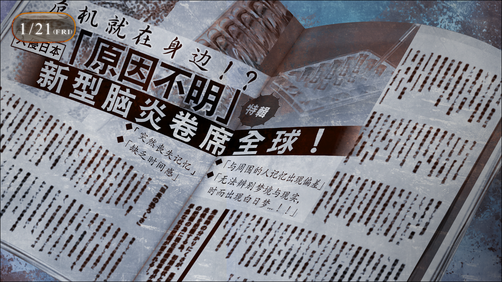
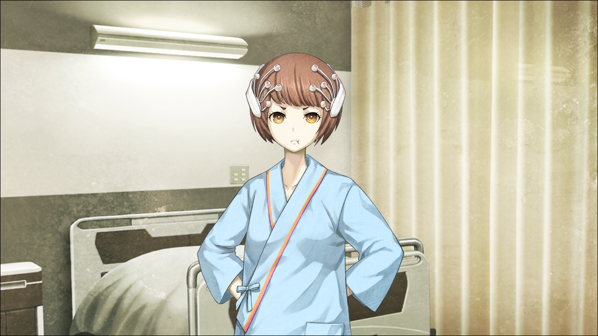

> <big> **永劫回归的潘多拉 - 03** </big>  
> 1.129954  
> [ 2011/01/21 ] 冈伦回归原本的世界线，当天随众人一起去探望吹雪，确认其Reading·Steiner能力并告知简要情报。  

整个世界，连同色彩一起在晃动。像是大脑无法认知自己的存在一样，不安定的感觉。并且伴随着如同贫血的症状一样的目眩和坠落感。耳朵深处，血管随着心脏的跳动而发出的声音听起来格外的大。然后，轻飘飘的感觉终于消失，周围的景象开始渐渐保有存在感，形成了固定的影像。  
“冈伦？”  
“……？！”  
真由理出现在眼前。这里是LAB，司空见惯的房间。冲绳的景色已经不见踪影。  
“那个，被这样盯着的话，真由喜会有点害羞呢……”  
回过神来，发现自己正目不转睛地盯着真由理。  
在房间四处张望。桶子一如既往地驼着背坐在电脑前；铃羽坐在沙发上读着杂志。一如往常的沙发，便宜的冰箱，桶子的电脑桌，用来隔断开发室的脏兮兮的挂帘……从垃圾堆中捡来的挂钟，指向下午六点多。看向日历，2010年已经过去，已经是2011年的1月了。世界线……再次改变了。回来……了吗……原本的世界线？我立即开始向真由理确认：  
“呐……真由理，这里是，秋叶原对吧？”  
“嗯……？”  
“不是……吗？”  
“是秋叶原的哟~”  
“今天，是几号？”  
“那个……21号。”  
“戈里巴乔夫，知道吗？”  
“各尼八樵夫？好像在哪里听过……”  
“经济改革对吧？俄罗斯好可怕……  
&emsp;&emsp; 啊，话说戈里巴什么的好像是苏联时期的吧？  
&emsp;&emsp; 果然提到俄罗斯就要说普金老大！  
&emsp;&emsp; 被他正面盯着的话，我可是有被吓尿的自信。”  
“普金先生的话我知道哟~是俄罗斯的总统对吧？  
&emsp;&emsp; 其实他很喜欢狗狗的哟~在养着秋田犬的，新闻有播的。”  
“总统……啊，是的，没错，是总统！”  
“啊……？”（x3）  
桶子的及时插入以及两人十分自然的对话，让我从心底里松了口气。然后发现真由理、桶子和铃羽全都在用诧异地眼神看着我。被这样看着也是久违的感觉了。我，回来了。从经常和死神擦肩而过的状态中解放了，就是这么一回事。可是——许多疑问又很快涌现而出。究竟为何世界线突然发生变动呢？有必要冷静地思考一下。  

我走上楼顶，打开了手机的浏览器。和战争时期不同，很快就连上网了。我对连接的速度感到惊讶，在战争时期，仅仅是连接到网上也得花费不少功夫。总之先搜索了“戈里巴乔夫”，很快就显示了结果。“经济改革”、“苏联最初也是最后的总统”、“8月政变与苏联解体”……我所预期的关键词一个个罗列在我眼前。确认了苏联于20世纪末解体，现在已经不存在这一事实，我就关闭了浏览器。  
那么，为什么世界线会再次变动呢？我什么都没做，也没有任何能够干涉世界线变动率的方法。既然这样，是谁引起了变动？是最初俄罗斯使用时间机器进行改变过去的实验的那些家伙，让改变恢复原样了吗？观察了约一个月的世界的进展后满足了吗？这种荒唐的事情今后也打算继续吗？那个时候我又会被卷进世界线的变动之中吗？  
好冷……不穿外套就出来是个失误。就算再怎么考虑，目前也只能做出这样的推测了……  

于是我回到了LAB。圣诞派对装饰的花环还挂在玄关。仅仅过了一个月左右，却让我感觉是许久以前的事情。话说回来，这条世界线的自己在圣诞派对之后都干了些什么，我并没有记忆。  
“啊，说起来，那些装饰一直都放在那里啊。是时候收拾下了——  
&emsp;&emsp; 派对的时候，冈伦和吹雪氏不是都昏倒了嘛，  
&emsp;&emsp; 所以都手忙脚乱的，没有仔细收拾的时间呢。”  
“我和中濑小姐，昏倒了吗？”  
世界线变动的那一瞬间，真由理她们，有着我在圣诞派对上昏倒的记忆。那就是说，我现在回到的世界线，与变动之前的世界线一致。如果这真的是俄罗斯干的，我不由得感到颤栗，为他们竟然能如此娴熟地利用时间机器。还有另一件事，不只是我，连吹雪也昏倒了，这让我很在意。  
在我沉思的时候，桶子和真由理再次向我投来了疑惑的目光。  
“冈伦？”  
“啊……话，话说，我在想中濑小姐她情况如何呢。”  
我慌忙找借口掩饰。  
“吹雪酱，还在住院呢。”  
“住院？已经住了一个月了吗？”  
“本人说是没问题了，但是医院那边就是不肯让她出院。”  
如果不是得了很严重的病症，一般是不让病人住院这么长时间的。吹雪患了什么病吗？  
“应该跟这个脱不开干系吧。”  
铃羽说着，举起了正在读的杂志页面。  
“新型脑炎……”  
我读了读文章。好像是从11月开始成为话题的，也曾经瞥见过关于它的新闻报道，说是海外已经发现近百名发病者，在日本也有约10人正在住院接受检查。不知何时已经登陆日本了吗……就是说吹雪也是住院接受检查的病人之一……是这样吗？会空气感染之类的吗？在圣诞派对上一起的我们也会被传染吗？……尽管知道就算不安也没有办法，但还是不由自主地往这方面想。  
“呐，冈伦……也去医院检查一下比较好吧？当时冈伦的脸色比吹雪酱更差哦……？”
“……啊，我会考虑的。”  
敷衍地回答了真由理，目光又回到杂志上。

症状的描述简直就是 *Reading·Steiner* 啊……而且和之前的世界线里，下山的描述完全一致。在听到那些话的时候我也想到了，吹雪是不是也拥有着 *Reading·Steiner*。圣诞派对那晚她昏倒实际上并不是因为新型脑炎，很可能是 *Reading·Steiner* 无预兆发动的原因。如果是这样的话，病症的诊断就完全是误诊了，根据不必要的检查进行错误的治疗，是不可能让她痊愈的。总之，有必要再和吹雪谈一次。  

当天，我们便决定去探望吹雪。她住院的地方是医学部附属综合医院，位于御茶水，距离秋叶原就算用步行也不是很远，所以过去很方便。因为我独自一人突然去探望的话会招来不必要的误解，所以我说服了真由理一同前往，而我仅仅作为陪同。  
但是现在探病小队的规模变得比我想象中更大，因为由季和枫听说真由理要来探病便也一起过来了。真由理她们好像已经来过好多次了，对吹雪所在的病房知道得一清二楚，在走廊里毫不犹豫地走着。因为就快到晚上8点的会面截止时间了，我们走得很匆忙。路过的护士站的时候，看到那里稍微有点吵闹，一位身穿灰色针织衣的四十多岁的女性正在跟医生和护士僵持着。  
“也该适可而止了吧!到底什么时候能让我出院！”  
“都说了，要在接受了必要的检查和治疗之后才行。”  
“明明没有什么所谓的治疗啊！  
&emsp;&emsp; 而且本来简单检查一下就行了，为什么用了一个多月？  
&emsp;&emsp; 耽误我的工作你们要怎么负责？！”  
“请您冷静。这个疾病还有很多未知的部分，不充分检查并慎重治疗的话是很危险的。”  
“骗人！电视上说这并不是太严重的疾病，大可放心的！”  
“所以说，那是以接受妥善的检查和治疗为前提的。  
&emsp;&emsp; 刚才护士也报告说你出现了突发性晕眩。”  
“那只是因为晚饭来的太晚饿着肚子造成的贫血！我健康的很！快让我出院！”  
女性单方面纠缠着医生，情绪激动地想要拽住医生的衣领。最后数名女护士上前勉强把她制止住，之后一边安抚着一遍把她带到不知道哪里去了。  
“吓到我了……”  
“吹雪酱没事吧？”  
枫和由季看到此情此景表示担心，真由理虽然没说什么却也再次加快了脚步。  
吹雪所在的病房是在走廊尽头的四人间。我们悄悄地向里面窥视。  
“呜呜呜……哈呜呜呜呜……”  
“这个声音是……？”  
用帘子隔开的吹雪的病床那里，传来了什么声音。真由理面色铁青，慌忙地拉开帘子。  
“吹雪酱？”  
“呜欸？”  
仔细一看，发出奇妙的声音回应的吹雪，正在毫无形象地在床上盘着腿，用旁边的小型液晶电视看着电视剧。眼睛虽然哭得红肿，嘴里却叼着Pocky，看样子只是单纯地被电视剧感动了。  
“啊咧……哦哦，大家又来啦！”  
吹雪擦掉眼泪，用一如既往的笑容迎接我们。  
“呼……真由喜紧张死了~听到吹雪酱在哭什么的……”  
“真是太容易让人误会了……”  
“抱歉抱歉。”  
吹雪一边道着歉，一边又拿起一个巧克力零食塞进嘴里。她的头上戴着头套一样的东西，把头发束在一起。起初我以为她因为厌倦了住院生活不想弄头发才戴着这东西，事实好像并非如此。从头套延伸出数条数据线连接着腰间佩戴着的腰带，好像是监测脑电波的装置吧。想到这一点，我向病房内的其他患者看去。和吹雪一样，全员都佩戴着一样的装置。可能所有新型脑炎患者都佩戴着这样的东西。  

“抱歉呢吹雪酱，大家没跟你说就过来了。”  
“没什么，我很欢迎呢！而且……没想到连冈伦也过来了。”  
吹雪这样说着，目不转睛地盯着我。被她这样认真看着还是第一次，让我以为自己脸上是不是沾了什么奇怪的东西。  
“听说你跟我一样都昏倒了，有点担心。感觉怎么样？”  
“完全没事。为什么不能出院呢？实在搞不懂。  
&emsp;&emsp; 一天天的除了检查什么事都没有，无聊无聊。  
&emsp;&emsp; 而且啊，病房里禁止用手机啊！想发短信要到大厅；  
&emsp;&emsp; 晚上九点就自动熄灯了，深夜动画都看不了。  
&emsp;&emsp; 真是不敢相信！”  
吹雪病床四周散落着掌机、杂志、小型DVD播放器……总之用来消磨时间的东西大量堆积着，以及到处乱丢的吃完的零食包装袋。实在看不出来是新闻报道的重病患者。  
“冈伦的身体不要紧吗？”  
“啊，刚才真由理也问过了，如你所见没什么问题。”  
“这样啊，太好了。”  
她看起来打心底舒了口气，但是视线仍然停留在我身上。  
“哈哇……？！”  
突然不知为什么，枫露出慌张的样子。不仅如此，脸还一下子变得通红，鬼鬼祟祟地打量着我，一副要哭的样子，行为显得很奇怪。  
“嗯……？枫酱？”  
“怎么了？”  
“那个……”  
受到所有人注目的枫扭扭捏捏地，无奈之下凑到吹雪的耳边，貌似说了什么。  
“啊——？！”  
“吹雪酱，嘘——”  
吹雪突然大叫，所有人赶紧提醒她注意。这里是医院，病房里还有其他病人，不可以大吵大闹。  
“可是，大家听我说啊，这位来岛枫小姐，竟然在怀疑，  
&emsp;&emsp; 我与冈伦是不是瞒着大家在偷偷交往哦？”  
“啊！？”  
差一点连我们都叫出声来，拼命地忍了下来。  
“在…在说什么啊……”  
“但是，照真由理酱说的，今天提出要来看望吹雪酱的是……冈伦先生吧？”  
“这个……嘛，的确是这样的……”  
那是因为有别的目的——但是不能告诉她们。  
“而且，从刚才开始，吹雪酱和冈伦先生就一直亲密地对视着……”  
“才没有亲密地对视着呢！  
&emsp;&emsp; 那个，不是那样的，这个是……”  
吹雪困惑得想要抓头发，但是头套一样的仪器让她放弃了。  
“稍微……我做了一个有点真实的梦。”  
“真实的梦……？”  
我心中一惊。说不定，这就是我想要确认的事。  
“今天傍晚的样子吧，稍微有些迷迷糊糊的。也没有什么事可做，闲得发慌。  
&emsp;&emsp; 然后，怎么说呢……具体的也记不太清了……  
&emsp;&emsp; 我和冈伦还有由季，被可怕的人带上了车，带到什么地方去了。  
&emsp;&emsp; 是这样的梦。”  
“我也有出现吗？” 由季插话问道。  
“嗯……”  
哈……一样的。吹雪看到的梦境，和我在那条世界线的经历一样。今天傍晚的话，时间也刚好吻合。我从隔帘的缝隙观察病房内，确认了没有医院的工作人员在。  
“抱歉，大家，能让我和中濑小姐两个人单独谈谈吗？”  
枫：“哈哇？”  
真由理：“唔欸？”  
由季：“难道……！”  
“不是那样啦……”  
她们这样的反应，让我有些不好意思……  
“那个是，不想让我们听到的事吗？”  
“是关于病情的事。”  
“哦……嗯，我懂啦。”  
真由理顺从地点点头，走到隔帘外。其他两人一副困惑的表情，不过也跟着离开了。  
“那个……”  
“中濑小姐，你所说的梦，该不会地点是在冲绳吧？”  
“欸？是的……吧。嗯，我想……大概就是冲绳。  
&emsp;&emsp; 坐在车上的时候，好像看到了那样的标牌。”  
“车上的有，我和你，还有由季小姐，另外有司机和矮个子的男性自卫队员。”  
“嗯。”  
“男人的名字是，下山。”  
“啊……！”  
吹雪的脸色很明显地变了。如果只是一起乘车在公路上行驶的梦境的话，或许勉强可以认为是偶然。但是具体的姓名都一致的话，就另当别论了。  
“为……什么……”  
“那个男人和你说了关于白日梦的事，还有俄罗斯总统的事。”  
“嗯！”  
“然后，我们被带到了美军基地。在那里与真由理她们汇合后，与我分开了。”  
吹雪说不出话来。不会错了。我的心中，猜想变成了确信。果然吹雪相比一般人有着更强的 *Reading·Steiner*，能以比较清晰的“梦境”的形式记住别的世界线发生的事情。  
“在梦中，那个叫下山的人说了……冈伦和我一样，拥有别的世界的记忆。”  
“啊。”  
“这些，是真实发生的吗？”  
“……是啊。”  
稍微犹豫了一下，结果还是把关于 *Reading·Steiner* 能力的要点简单地告诉了她。至少想告诉她，经历的白日梦并非病症。但是当我说完之后，吹雪说的话却出乎我的意料：  
“这样的话，除我之外说不定还有其他的，并非病患的人。”  
“是吗？”  
“因为很闲，我经常和大家聊天，关于自己梦到的事。  
&emsp;&emsp; 大家的梦的内容出乎意料地相似，令人吃惊。  
&emsp;&emsp; 就在刚才，我在这里认识的隔壁病房的小学生也说了，  
&emsp;&emsp; 明明一次都没有去过，但是他却梦到了冲绳，  
&emsp;&emsp; 说是因为战争东京陷入火海，被自卫队救了后逃往冲绳……”  
“这，这样啊……”  
难以置信……如果这一切都是真的话——现在的情况就是，不只是吹雪，其他的患者中也有一些人被误认为是脑炎而导致无谓地长期住院。  
“告诉医生会不会比较好？”  
“不，我并不认为医生会相信。不仅如此，可能反而会被诊断为妄想症状恶化……”  
“唔……是啊……”  
“这件事也先别告诉其他人比较好，引起骚动就麻烦了。”  
“嗯……”  
这时，由季从隔帘外探头进来：  
“冈部先生，有护士过来了。”  
“探病时间结束了哦。”  
看了下时间，早就过了晚上8点了。  
“匆匆忙忙的真是抱歉啊，吹雪酱。下次会早点来好好陪你的~”  
“啊啊！真由喜~不要走~”  
“可是，护士小姐要生气的哟~”  
“那些事无所谓啦~今晚和我一起睡吧！”  
吹雪已经回到了平常的样子，紧紧地抓着真由理的手。枫苦笑着把她的手拉开了。  
“我们会尽量多过来的，不要说任性话哦……”  
“只是尽量还不够啦~明天、后天放学后都要来啊~快要无聊死了~”  
吹雪故意地乱甩着手脚撒娇，枫微笑着摸了摸她的头。  
“好好，那就再见啦……”  
真由理和由季也效仿着枫，一边说着“乖孩子乖孩子”一边不停地安慰着她，最终，大家留下眼神像是被托放到狗窝的小狗一样的吹雪，离开了病房。走在最后离开病房的时候，我回过头去，吹雪坐在床上一直目送着我们。眼神对上了，于是我对她微微地点了点头。  
——没事的，你不是生病，不用担心。  
虽然不知道这个意思有没有传达到，不过吹雪已经点头回应了。  

 

> (to be continued)
---

| [←prev](./0029) | [home](../../) | [next→](./0031) |
