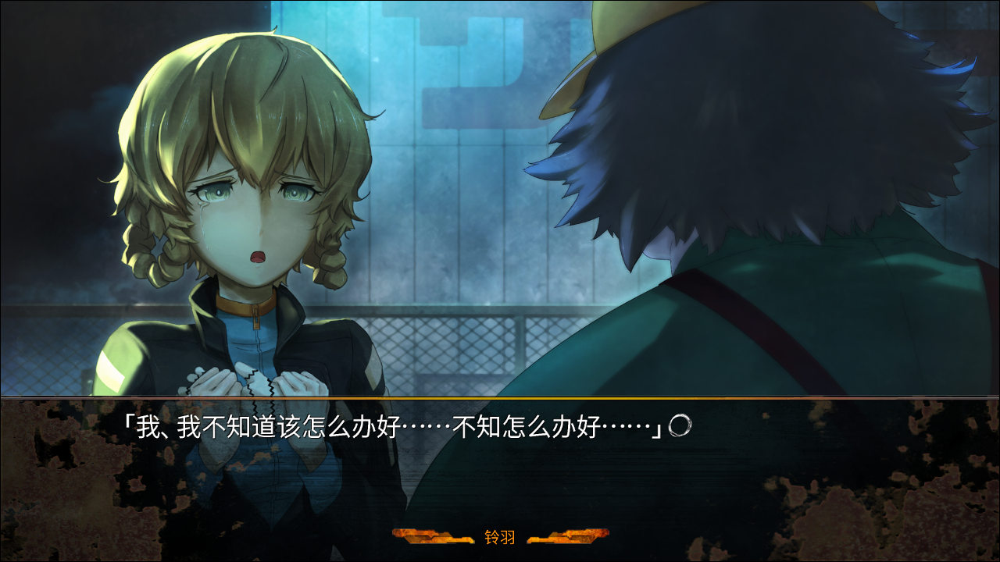

> <big> **永劫回归的潘多拉 - 04** </big>  
> 1.129954  
> [ 2011/01/21 ] 铃羽猜测到世界线变动，与冈伦对峙，桶子赶来。  

探视时间结束后的医院走廊变得与之前截然不同的安静。等电梯的时候，手机收到了RINE消息，是铃羽发来的。  
『有些话想找你单独说一下，等你回复』  
那简短的文句中，缭绕着非同一般的紧张感。  

我和真由理他们分开后联系了铃羽，见面的场所定在广播馆的屋顶。到达之后，看见铃羽静静地站在黑暗之中。她的脸上完全没有笑容，盯着我的双眸闪烁着锐利的光芒，让我不禁脊背发凉。眼前的明显不是平时的铃羽，准确的说，是变回了原本的铃羽的感觉。对我来说，不会是什么好事的样子。  
“不好意思啊，冈伦叔叔，把你叫到这种地方来。”  
“想说的是什么？”  
“啊，嗯……我，该怎么说呢，不懂什么话术，也不擅长什么巧妙地套出信息的方法……”  
看她吞吞吐吐的态度，一定是难以开口的话题了。  
“就单刀直入地说吧。以前的你的话，大概就会这么做吧？”  
“是……的呢……”  
“难道说，是在顾虑我的感受吗？”  
“……”  
“是吗……谢谢了。”  
“也不是那样——”  
铃羽冲动地想要反驳，不过说到一半就停下了。  
“实际上，我最初的时候很震惊。你，和我熟知的铃羽，完全不一样……”  
“这也是没办法的。世界线不一样的话，  
&emsp;&emsp; 相对的成长环境，以及由此形成的人格和思考方式也会随之变化。”  
“啊。但是，现在我不这么认为了，铃羽果然还是铃羽。”  
“……不，我果然还是不一样。我不是冈伦叔叔熟知的阿万音铃羽。”  
“铃羽……”  
“今天，我跟踪了冈伦叔叔。”  
“跟踪？”  
“是的，甚至到医院里，一直跟着。”  
什么？为什么做这种事？不，理由不用问也知道。现在的铃羽这样做的理由只有一个。  
“我在世界线间移动的事，被察觉到了吗？”  
“圣诞节那晚，叔叔该不会是发动了 *Reading·Steiner* 吧？我一直这么怀疑着。  
&emsp;&emsp; 不只那一天，今天也是。于是，怀疑转变成了确信。”  
我故意没有告诉铃羽世界线发生了变动，因为很显然会像这样，看到铃羽焦虑的申请。  
“告诉我，这里已经和之前的世界线不一样了吗？”  
“知道了又怎么样？”  
“怎么样都好，回答我！这是命令，冈部伦太郎。”  
“呃啊……！？”  
看到铃羽从怀中拔出闪烁着金属光泽的手枪，我倒吸了一口气。枪口瞄准我的眉间。  
“开玩笑……的吧？”  
“我不会开这种玩笑。”  
可以看出，现在的铃羽想要重新变回刚到达这条β世界线时的自己——作为忠实的任务执行者的自己，表现得这么痛苦而竭尽全力。——如果在这里被击中了，会怎么样呢？我想象了自己扑倒在血泊中的样子，与曾经看到过的红莉栖尸体的样子重叠了起来。那一天的情景再次在我的脑海中闪回，我闭上眼睛，咬紧牙关，拼命忍住。到昨天为止差不多一个月的时间，我一直在战争中四处逃亡着，即使这样，还是无法习惯像这样直接被枪口指着。  
“再问一遍，世界线变动了吗？这里已经和以前是不一样的世界了吗？”  
但是，这样逼问着我的铃羽，那双本应稳稳地握着枪的双手却轻微地颤抖着。如果是半年前刚来这个时代的铃羽的话，这是绝对无法想象的。可能是为这样的自己感到羞愧，她更加用力地咬紧了牙关，似乎咬破了嘴唇，鲜红的血顺着下巴流下，形成了一道印记。  

我凝视着着那道血迹回答她：  
“没事的。我们还在之前的世界线……”  
“真的？”  
“嗯。曾经一度移动到了别的世界线是事实，不过再次移动回来了……应该是这样。”  
“做了这种事的人是谁？俄罗斯吗？”  
“我认为是这样。”  
“时间机器的实验终究开始了吗？”  
我点了点头。  
“既然如此，情况刻不容缓不是吗？  
&emsp;&emsp; 那群人继续实验的话，不久就可能会造成无法挽回的局面，  
&emsp;&emsp; 通向命运石之门的路会被封死也说不定……  
&emsp;&emsp; 我真是笨蛋。不是苦恼的时候了，说服时间到此为止了……”  
“你想怎么做？”  
“冈部伦太郎，服从我的命令，跟我一起回到7月28日。”  
“如果我拒绝呢？”  
“不允许拒绝。”  
“你觉得这么做好吗？”  
“什么？”  
“这条世界线会变得不复存在，然后——”  
“烦死了！”  
伴随着令人不适地金属般的耳鸣，强烈的痛感从鼓膜处席卷而来。火药独特的危险气味，在脸颊侧面留下一丝余韵后散去。……这家伙，真的开枪了啊。  
“下次就不是威吓了，会射中的。”  
开了枪的铃羽，那双盯着我的眼睛仿佛要哭出来了。我们沉默不语地互相凝视着对方的眼睛，站在那里一动不动。我拼命地思考着能让铃羽冷静下来的话，可是完全没有头绪。不能一针见血的话，对铃羽是不管用的。该怎么办——

“铃羽！冈伦！你们在干什么啊？！”  
突然间，桶子的声音响了起来。转向声音传来的地方，正好看到了刚刚爬上楼梯打开门的桶子的巨大身体。  
“爸爸……！？为什么……”  
“我收到了真由喜和阿万音氏的邮件，说是铃羽把冈伦叫出来了什么的。  
&emsp;&emsp; 我有种不好的预感，就到处找你们了哦。  
&emsp;&emsp; 还有，收到了发件人不明的邮件。”  
“发件人不明？”  
“发来了这个地点的地图链接，我猜你们有可能在这里，就优先过来了。  
&emsp;&emsp; 然后枪声就响起来了，吓死我了……”  
桶子汗流浃背，说话期间，大颗汗珠不断从额头渗出来。看来是匆匆忙忙地跑过来的。  
“于是，铃羽，那把枪是怎么回事？”  
“啊，不，铃羽什么都没做——”  
“如果什么都没做的话，是不会开枪的吧，常考？  
&emsp;&emsp; 来，铃羽，说点什么吧？”  
“爸爸才是，明明已经知道了……”  
“什么？”  
“世界线变动了啊。俄罗斯开始进行时间机器的实验了。”  
“确定无误？”  
“所以我这不是正在着急吗？这样下去的话，一切都完了！  
&emsp;&emsp; 没办法到达命运石之门，也没办法阻止第三次世界大战！  
&emsp;&emsp; 无数人会死，母亲也会死，什么都阻止不了！”  
“那样很难办呢。但是，尽管如此……  
&emsp;&emsp; 威胁冈伦，强行带他回到过去，这样就一定会成功吗？”  
桶子的表情格外认真，与平常漫不经心的他完全不同。  
“开始研究时间机器和世界线后，我渐渐理解了，冈伦说的对，  
&emsp;&emsp; 如果是普通的方法，无论多少次都没办法拯救牧濑氏的性命。”  
“爸……连爸爸也……在说什么啊？”  
“如果世界线的规则、因果律之类的能这么简单地被改变的话，  
&emsp;&emsp; 冈伦在他所说的α世界线里，不早就拯救真由喜的性命了吗？”  
“那，你说到底该怎么办才好啊！？”  
桶子用拳头咚地敲了敲自己的胸脯。  
“该怎么做，我们不是正在研究嘛。”  
“但……但是……已经没有时间了！”  
“没问题，包在我身上吧。绝对想办法做给你看！  
&emsp;&emsp; 偶尔，也希望你能乖乖地听听爸爸的话啊。”  
桶子拿出了平时难以想象的威严的一面，然后，温柔地从铃羽的手上拿走了枪。铃羽没有抵抗。  
“你看，你忘了比枪更重要的东西。今天这么冷的日子，正应该用这个。”  
桶子从口袋里拿出了什么，代替了枪放在铃羽的双手中。那是手工编织的手套。圣诞派对那天，从由季那里收到的礼物。我对此记忆犹新。  
“我……我……”  
接过手套的那一刻，铃羽的眼泪一滴滴地落下。  

“帮帮我，爸爸……帮帮我……拜托了……”  
铃羽的肩膀颤抖着，眼泪扑哧扑哧地掉落。

我下意识地，凝视着伫立在黑暗中的时间机器的方向。  
“我……不会再乘坐了。已经决定了……”  
无论桶子怎么劝说，无论铃羽怎么威胁，我都不会再回到过去了。  
我不能，再回头了……  

 

> (to be continued)
---

| [←prev](./0030) | [home](../../) | [next→](./0032) |
