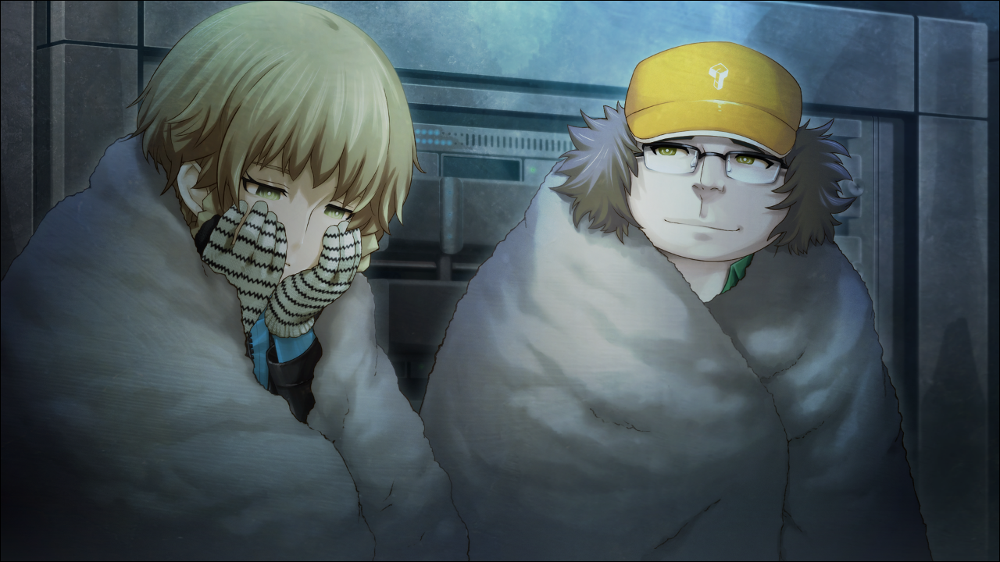

> <big> **永劫回归的潘多拉 - 05** </big>  
> 1.129954  
> [ 2011/01/21 铃羽视角 ] 桶子安慰崩溃的铃羽。  

回过神来，铃羽已经坐在时间机器里，裹着毛毯。可能是一个劲在哭的原因，无论是自己进了时间机器，还是冈伦已经回去了，她都没有察觉到。作为父亲的桶子在旁边裹着和铃羽一样的毯子，看着铃羽。  

“冷静下来了？”  
“现在几点了？”  
抽了抽鼻子，擦干了眼泪，铃羽问道。  
“马上就到新的一天了哦。”  
“抱歉，让你陪我到这个点。”  
“没事没事。之前也说过的吧，无论如何依赖爸爸都没有关系DaZe~”  
“嗯……”  
夜晚的寒气，从敞开的时间机器舱门那里潜入进来。铃羽和桶子说话时的气息全都变成了白色的雾气。机器里寂静无声。使用舱内的生命维持装置的话，就可以不用忍受寒冷了，但是铃羽不想把电源浪费在这里。铃羽用戴着手套的手摩擦自己的脸颊。从由季那里得到的手套非常暖和，全身上下只有手感觉热乎乎的。  
“我相信啊，冈伦一定迟早有一天会和我们一起……  
&emsp;&emsp; 不，不对，是站在我们的前阵，指引我们。  
&emsp;&emsp; 我相信这一点哦。”  
“……？”  
桶子有感触地说出了如此认真的话，让铃羽有点吃惊。平时的他只愿意说些玩笑话，很少这么认真。  
“未来机械研究所，正是因为有冈伦才会存在的。  
&emsp;&emsp; 现在虽然有些自暴自弃，但一定能重新站起来的。  
&emsp;&emsp; 同时，凤凰院凶真也会复活。  
&emsp;&emsp; ‘不死鸟这个名字可不是虚有其表的’什么的，‘厨二乙’什么的，  
&emsp;&emsp; 到那天的话，冈伦大概会自己坐上时间机器的，铃羽不说也会呢。”  
铃羽明白桶子在鼓励和安慰她，心里也变得稍稍有些温暖了起来。  
“爸爸，你意识到自己在说非常羞耻的话了吗？”  
“哇哈，是的呢。在冈伦本人面前，无论如何也说不出来的呢。”  
“我打算明天写一封信，给冈伦叔叔。  
&emsp;&emsp; 因为如果面对面说，气氛又会变得很奇怪的。  
&emsp;&emsp; 想对他说‘对不起’，‘再试着挣扎一下’之类的，  
&emsp;&emsp; 所以说，希望冈伦叔叔能再考虑看看。  
&emsp;&emsp; 虽然这么说……其实，已经快没有时间了。”  
“没时间了？因为俄罗斯的实验已经开始了吗？”  
“实际上，控制时间机器的量子计算机的内置电池，马上就要没电了。”  
“……真的？”  
“之前说过吧？为了找篝，1998年以来，使用过好几次时间机器。  
&emsp;&emsp; 这些是当初计划以外的行动，理所当然的，  
&emsp;&emsp; 控制机器的计算机的使用次数也比预定的多了……”  
“因此电池才消耗掉了么。”  
“比起机器的燃料，这里的问题更严重呢。  
&emsp;&emsp; 想要正确控制机器进行时间跳跃，变得困难了。”  
“电池的话，更换或者充电不就行了吗？”  
“不行的。”  
“可以让我稍微看一下这个内置电池吗？”  
铃羽点了点头，指向了机器的中枢部分。桶子立刻蜷起巨大的身体检查起来，却很快发出了困惑的声音。  
“这是啥玩意儿？”  
内置电池的大小和汽车电池差不多。但这是2036年的技术结晶，恐怕在作为2010年的人类的桶子看来，是一头雾水的吧。对桶子来说，这种未知技术可以说是黑匣子一般，只是看一眼，应该不可能理解其原理和构造的。也正因为这样，铃羽才允许桶子去看。
“用2010年的技术解决问题什么的，不可能的吧。  
&emsp;&emsp; 硬要说的话，它和一次性电池是同样的状态。不能充电也无法更换。”  
“如果换成这个时代的电池或者发电机呢？”  
对于这个提案，铃羽重重地摇了摇头。  
“已经试过了哦。但是还是不可能。  
&emsp;&emsp; 我拜托过留未姐找来了车载电池，卡车用的那种大家伙。  
&emsp;&emsp; 接上去以后，1秒钟也撑不住。”  
“什……么……？！”  
“汽油发电机也试过了，也不行。  
&emsp;&emsp; 况且也万群不知道需要多少加仑的汽油；  
&emsp;&emsp; 这么大量的汽油，也没办法装在这台机器里。  
&emsp;&emsp; 留未姐也是竭尽全力呢，连最新的燃料电池都设法弄到了……”  
即使做到这种地步，结果，还是杯水车薪。  
“未来的技术真是厉害啊！这么小的东西就能提供这么巨大的电量啊？”  
至看着面前的未来电池，一个劲地赞叹。  
“能像科幻电影一样，能把生活垃圾转化成电力就好了啊……  
&emsp;&emsp; 那么，这个电池，还能再维持多久？”  
“大概……再支持一两次跳跃，就没电了。”  
“只有这么点了！？”  
“此外，即时机器这样停着，重力场和坐标点的计量装置也一直是在运行的……  
&emsp;&emsp; 就算不进行跳跃，也早晚会没电的。  
“以剩余的电量，能够做出精确跳跃的范围，最多还有半年左右吧。  
&emsp;&emsp; 能去拯救牧濑红莉栖的时机，也就只有这么久了……”  
铃羽靠在桶子的背上，叹了口气。肉肉的，感觉很舒服。  
“电池断电，机器控制系统失效的话……我会怎么样呢？  
&emsp;&emsp; 克尔黑洞失去控制……停留在视界线的尽头，永远也回不来了之类的？”  
“不要说一些不吉利的话哦！”  
“嗯，抱歉。但是，那里，是什么样的地方呢……  
&emsp;&emsp; 像现在这样宁静的时间，永远地持续吗……  
&emsp;&emsp; 如果是这样的话……也不错呢……”  
倚靠在父亲温暖的背上，铃羽被强烈的睡意侵袭。感觉一不小心就会睡着。曾经被苦心教导过，在战场上要抵抗睡意……然而这里不是战场，也有哭累了的原因，偶尔委身于睡魔或许也不错呢。于是，铃羽像孩子那样抱着膝盖，悄悄地闭上了眼睛。  

“这样啊……结果铃羽在夏天前一定会离开啊……无论冈伦得出什么结论……”  
即将陷入睡眠时，铃羽好像听到了父亲自言自语。

 

> (to be continued)
---

| [←prev](./0031) | [home](../../) | [next→](./0033) |
