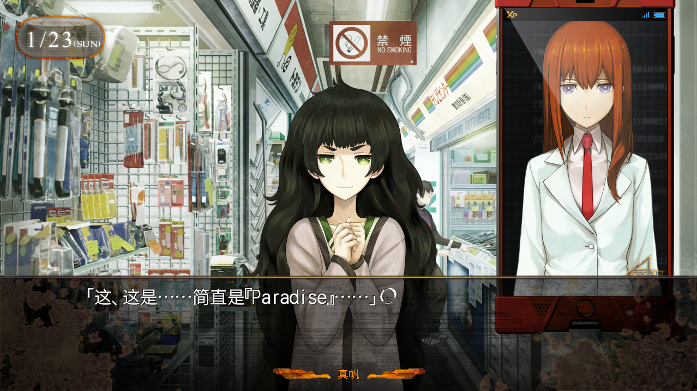
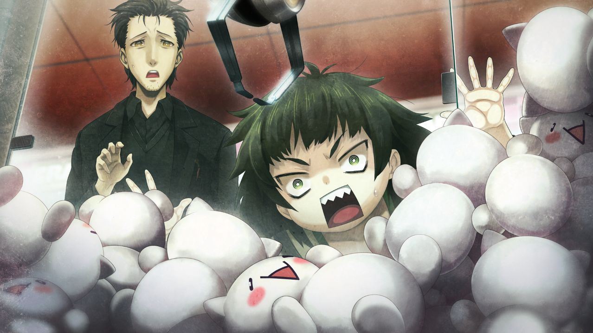

> <big> **永劫回归的潘多拉 - 06** </big>  
> 1.129954  
> [ 2011/01/23 ] 冈伦带真帆和“红莉栖”逛秋叶原，电器街、抓人偶。

比屋定就像少女一样眼睛闪闪发光。被带到这种地方，还会有这种眼神的女性，相当稀有吧。作为向导的我，已经完全被她无视了。比屋定迫不及待地在这条罗列着零件商店的狭窄道路上前进着，突然，在其中一家的店门口静静地站住了。在那里堆着许多塑料盒子，里面放满了大大小小各种各样的装满了破旧零件的袋子。似乎是从废弃的PC和家电之类的机器上拆下来的，无论哪个都很明显的古老而又肮脏，大多数都粘着灰尘。  
“这个，究竟是什么电路板呢？样式简直就像艺术品一样美丽。  
&emsp;&emsp; 而且居然是矾土电路板！”  
“啊，唔……？”  
“哈？！居然是‘IFX008’图像传感器？！简直不敢相信！  
&emsp;&emsp; 就算陈列在博物馆都不奇怪的东西，怎么会随意地摆在这种地方？！”  
“哦，哦……？”  
“秋叶原……真是个百闻不如一见的地方啊！”  
露出恍惚表情的比屋定，让我有点敬而远之。  
“真帆前辈，其实是这样的人哟。”  
手机中的“红莉栖”如此说道。之前被比屋定拜托，今天也让“红莉栖”同行，因此现在对于我来说，就变成了另类形式的“左拥右抱”的状态了。大概这也算是『Amadeus』验证实验的其中一项吧。  
“虽然我也来过这里不少次了，不过像那样看到零件就眼睛发光的人类，  
&emsp;&emsp; 在她之前我也只见过一个……”  
“我知道了。你说的是桥田先生吧？”  
“啊……”  
“被当成是那种人的同类，前辈也太可怜了。  
&emsp;&emsp; 从你的描述来看，桥田先生是个难以想象的变态啊。”  
“是啊……对比屋定小姐失礼了。”  
现在是周日的午后时分。和比屋定一起来零件商店是有原因的。她和雷斯吉宁教授决定在数日后回国。因为很快就要离开日本了，比屋定联系我，履行之前说好的承诺，给她当秋叶原的向导。于是我们今天上午在站前汇合，问她想去哪里的结果，就是现在这个状况。顺带一提，最先去的是友都八喜，接着是SOFMAP。除此之外，一些小路里面的二手PC和复古PC店也去了几家。  
“比屋定小姐，很喜欢这种零件吗？”  
我出于好奇问了一句。  
“与其说是喜欢零件，不如说是喜欢组装东西呢。  
&emsp;&emsp; 小时候，经常拼日本产的‘Plastic Model’呢。”  
比屋定正处于兴奋状态，所以回复得很详细。而这也勾起了“红莉栖”的兴趣。  
“‘Germanium收音机’之类的也组装过吗？”  
“焊接的时候经常被烫伤呢。”  
“我也是。”  
“大家都是一样呢！”  
我可不觉得……大家都这样。倒不如说，小时候家里有焊锡的反而是比较少的？  
“啊啊~想一直看下去……为什么我没有早一点来到这个地方？”  
再这样陪她逛下去，估计无论多久都走不出这片地方，于是我提出差不多该去吃饭了，好不容易才成功把她从零件商店门口带走。到了大路上，因为这边是车站前，所以特别拥挤。在等着信号灯的人山人海中，几乎无法直线行走。那么，去哪里吃饭好呢？第一念头是*MayQueen+Nyan2*，不过考虑到以前带她去时的情景，还是不要选择那里比较好。但是……对于秋叶原新手来说的话，Sanpo（牛丼屋）的难度太高了。雁船？还是厨房次郎？GOGO咖喱也不错……  

“啊……”  
正在我边走边想东想西的时候，比屋定被眼前的游戏中心吸引，停下了脚步，似乎是对一层摆放的夹娃娃机有兴趣。  
“稍微……进去看看如何？”  
对于比屋定的提议，我点了点头。一靠近夹娃娃机，比屋定就像小孩子一样贴在玻璃上，观察着里面。那里装着各种@ch衍生的角色商品化的玩偶，大小各异。难道比屋定也和红莉栖一样，是个隐藏的@cher？毕竟是关系亲密的前辈和后辈，的确有这个可能……于是我在比屋定耳边悄悄地念叨着咒文。  
“nurupo……”  
/* 注释：@ch用语，起源于程序员版某人的发言“让我们用ぬるぽ（nurupo）来指代NullPointerException吧”，逐渐发展成每次出现这个词就会有人吐槽“ガッ（ga~tsu）”来表示击打。有人说“nurupo”的时候，肯定会有别的什么人吐槽“ga！”，这已经成为一种约定了。*/  
“啥？那是什么，那个nuru……什么的？”  
比屋定懵了。  
“什，什么都不是！忘了吧。”  
手机画面中的“红莉栖”射出可怕又冰冷的视线，还是装作没看到吧……  
“比屋定小姐，想要那个玩偶吗？”  
“哎，不是很可爱吗？——对吧，‘红莉栖’？”  
“等……前，前辈？！”  
“什么？为什么这么慌张？”  
“……没什么……”  
比屋定突然促狭地笑着把话题抛给“红莉栖”，被发现了吗？  
“稍微有点意外啊。因为刚才你说喜欢零件，我还以为你在感性方面更接近男性呢。”  
“冈部！说话不走心啊，你这人！  
&emsp;&emsp; 说点好听的话啊。‘你这种反差好棒啊’之类的。”  
我自以为很自然地承接了话题，结果受到了“红莉栖”的严厉批评，才后知后觉。  
“啊……不好意思……”  
“没关系啦。实际上呢——红莉栖的卧室里一直摆着这样的玩偶呢。”  
“是这样吗……？”  
“哇啊啊！前辈！”  
果然暴露了啊……“红莉栖”。我习惯性地开始调笑她：  
“难道是……用邮购之类的直接寄到美国去了？”  
“怎，怎么样都好吧……”  
“不愧是，隐藏的@cher呐。”  
“什么嘛，@cher什么的？从来没听说过——”  
“nurupo。”  
“ga！——  
&emsp;&emsp; 啊……（突然反应过来而沉默）  
&emsp;&emsp; 呜啊~~~~~~（羞愧而发出了奇怪的叫声）”  
这家伙，就算变成『Amadeus』也还是一样啊。  
“比屋定小姐，红莉栖有告诉过你这是什么角色吗？”  
“没有。虽然我问了好多次，可是每次都被她岔开话题。”  
“哈哈……我想也是。”  
“所以我一直很在意的哟。冈部你知道吗？”  
“嗯~嘛……”  
“冈——部————”  
手机里传来怨灵一般的声音，背后升起一股寒气。  
“我也……不知道啊。啊哈哈……”  
“这样啊……”  
哎呀，我保住了你的名誉，红莉栖，感谢我吧。  

“我试试挑战一下好了。 ”  
比屋定从怀里掏出钱包，把100日元硬币投入了游戏机。  
“那个……把这个吊臂前后左右操作，抓到玩偶就可以了吧？”  
“难道说，你是第一次玩吗？”  
“真帆前辈只玩过赛车游戏呢。”  
“说得没错。”  
比屋定点点头，按下操作按钮，把吊臂完美地停在了目标玩偶的正上方，然后沾沾自喜地露出洁白的牙齿。  
“真简单呢。之后就是等着吊臂下去自己把娃娃抓起来就行了吧？”  
“啊，不，理论上来说是这样的，可是……”  
“嗯？”  
结果——虽然吊臂笔直地向玩偶抓取，也许是因为细微的角度偏差，并没有抓起来。  
“奇，奇怪啊，这是怎么回事？”  
“初次挑战的话，一般就是这种结果了。”  
比屋定在之后挑战了很多次，但是总是抓不住诀窍。  

“呜呜呜……”  
比屋定呻吟着，握着手上仅剩的三百日元，走向游戏中心的里面。目标是，画着红白两种配色的方程式赛车的游戏机体。正好有个空着的位置，比屋定气呼呼地钻了进去。那个应该是取景自实际存在的跑道的真实CG赛车游戏。  
“冈部，冈部！”  
看到比屋定离开的“红莉栖”突然小声叫我。  
“嗯？怎么了？”  
“这里应该表现下男子气概了。”  
“男子气概？”  
“你来替前辈把玩偶抓到手这样。”  
“啊啊，原来如此。”  
然后把它当成礼物送给比屋定，是这个意思吧。先不管男子气概什么的，看到她那么想要的样子，我也产生了想做点什么的心情。从口袋里拿出零钱包，确认了手上的金额。  
“那么，来久违的投币吧。”  
虽然这么说，我也对这种游戏并不拿手……即使这样，我也有超过比屋定的自信。那么，来挑战看看吧……最终，多次挑战的结果是——不知道是运气还是实力，我意外轻易地拿到了瞄准的布偶。  
“好嘞。”  
“Nice！”   
把布偶用奖品的袋子装好，向比屋定玩着的赛车游戏的机体走去。周围已经聚集了十几个围观者。  
“好厉害！那孩子，到底是何方神圣？”  
“别问我啊。”  
“小学生吗？难以置信的技术啊。”  
“这个，要破纪录了吧？”  
观众悄悄地谈论着，都是感叹的声音。我透过人墙，看到了游戏的画面。比屋定玩的，是那种如果没有规定时间和规定名次内到达各个关卡就会GAMEOVER的游戏，而且，每一战赛道的难度会递增。就是这样，她也一直以第一名的压倒性胜利不断过关。就在观众被惊呆的时候，比屋定终于达到最后一关，同样是第一名的领跑，而且还刷新了记录时间。  
“呼——”  
比屋定对着ED画面的“Congratulations！”字样一副满足的表情——正在这时，才发现自己被人群围住，慌张起来。  
“恭喜你！本店的最佳纪录！”  
偏偏店员还过来鼓掌，把店内气氛炒了起来。被她带动，观众们也哗啦啦地拍起手来。  
“欸……啊，唔……？”  
比屋定满脸通红，眼神四处游荡。这里……帮下她比较好吧。我分开人群来到比屋定的面前，抓住她的手往外拉。  
“走吧。”  
“啊，好。”  
这时的她一反常态地听话。  
在人群中挤了一会儿，终于看不见店了，比屋定深深地呼了一口气。  
“呼……大意了哇。”  
“什么？”  
“不小心热血起来……拿出了真本事……”  
“这个的原因吗？”  
我把提着的战利品连同袋子一起交给了她。  
“什么？”
真帆摸索着袋子拿出玩偶。  
“这个……！抓到了吗？！”  
“运气比较好。送给你当礼物了。”  
“可以吗？”  
“我拿着也没用。”  
“是吗？那么，我就不客气的收下了。呵呵~”  
比屋定像幼小的少女一样露出无邪的表情，抱紧玩偶。看她这么高兴，我也变开心了。  
“……红莉栖逝去之后呢，我从她的母亲那里收到了各种遗物。  
&emsp;&emsp; 但是，因为说这个是红莉栖非常喜欢的，  
&emsp;&emsp; 她的妈妈把这个放到了自己的卧室。”  
即使不知道这个是@ch的角色商品，它的造型也还是很可爱。作为女儿的遗物装饰起来也并不会很奇怪。  
“可是，红莉栖的老家呢，遭遇了那样的事……我想玩偶一定也被烧掉了。”  
“前辈……”  
“因此，我想把这个送给美国的红莉栖妈妈作为礼物怎么样？”  
“当然。要是对方喜欢，就最好了。”  
“谢谢……”  

 

> (to be continued)
---

| [←prev](./0032) | [home](../../) | [next→](./0034) |
