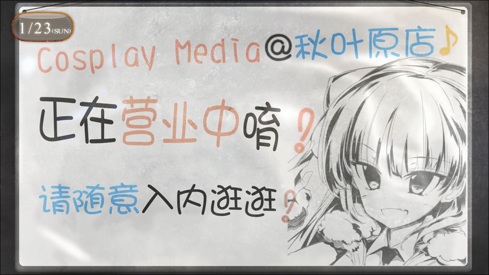
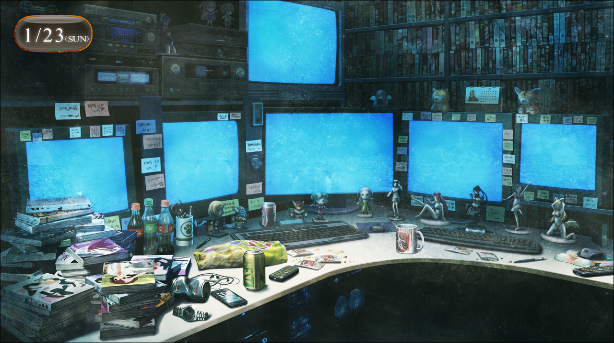

> <big> **永劫回归的潘多拉 - 08** </big>  
> 1.129954  
> [ 2011/01/23 ] P2：在桶子秘密基地是否优先接“红莉栖”的电话。  

桶子告诉我的地点同样是在秋叶原，从这里步行过去还不到五分钟。从大街上拐了几条小胡同，就看不到半个人了。东京中心，秋叶原，明明还是周日的大白天，却弥漫着潦倒的气氛。在这样狭窄的胡同里耸立的陈旧的杂居大楼的7层，桶子指定的店就在那里。  

“唔……”（x2）  
在入口的铁门上挂着的告示板让我们不禁稍微停顿了脚步。走进一看，不大的店面里确实摆满了Cosplay服装。距入口不远的墙角上是“新番角”和“人气Cosplay角”，那里展示着五颜六色的Cos用假发、缎带、珠宝饰物一类的小道具。对面的墙上则是“二手服装角”，还有袜子、学生鞋、高跟鞋、长筒皮靴之类的鞋子专卖角。再往里走，能看到那里陈列着死库水和竞技泳衣之类的东西。看来是家女性用Cosplay服装店，但氛围怎么看也不是女孩子会轻易进来的。毕竟其它层也都是些“有限公司 灵神的水滴”、“宇宙电波接收器贩卖处”、“花瓣影像企划”之类的奇怪名字的店铺。  
“比屋定小姐来过这里吗？”  
“不，之前见面是在别的杂居大楼。虽然也是一家可疑的店就是了。”  
“是，是吗……”  
好像看到了桶子不可告人的一面……  

店内鸦雀无声，除了我们没有其他的客人。一个像是店员的长发瘦男坐在深处的收银台，在我们进来后头都没抬过一下，读着类似于杂志的东西。事实上，我从进来到现在都没松过一口气，一直觉得和比屋定来这里在旁人看来可能是一种相当糟糕的行径，就算被当作带女中学生到不三不四的店里的变态大学生也完全不奇怪。  
“喂，冈伦，这边。”  
刚才连个影子都没有的桶子，冷不丁地出现在了店的深处。  
“话说真帆碳也来了呢。”  
“那个‘真帆碳’的称呼，能别用吗？”  
“为什么？不是很可爱吗？”  
“感觉自己被当成傻瓜似的。”  
“先不说这个，桶子，你是从哪儿出来的？”  
待在收银台的男子什么都没说，也就代表，对方已经知道并且同意桶子待在这里了。  
“总之先来这边。”  
桶子走进店铺深处，挪开一个挂着大量偶像系Cosplay服装的衣架，带我们穿过里侧挂着的帘布。帘布后面有大约一平米左右的空间，墙上有一扇写着“STAFF ONLY”的门。如果不挪开衣架的话完全不可能注意到啊。我吃惊得说不出话，比屋定也感叹这里简直就是忍者屋舍。  
打开门后，是一个挤得要命的办公室。不，这个房间原本应该还是很大的。也有太过昏暗的原因吧，有种很大的压迫感，甚至让人呼吸困难。四张满是金属支架的桌上乱堆着各种各样的电脑和周边设备；不知道是不是垃圾的盒子和塑料袋扔得遍地都是；杂志、游戏、塑料模型以及手办的盒子像塔一样堆积着；桌上也是乱七八糟，和LAB的情况一模一样。虽然装饰用的手办因为太暗看不清，想必也是积满了灰。说起来真的需要六台显示屏吗？每一个显示屏上都是显示着不同角度的店内的样子，看来是监视器的影像。从这个店的规模和客流量来看，三个监视器都显得多。  

“嘛，随便坐吧。”  
“这有人坐的地方吗？”  
“我现在就腾点地方出来。”  
桶子把地板上堆积的箱子随便一挪，勉强挤出了点空间，然后在那摆了两把折叠椅。  
“你……和这家店是什么关系？”  
“嗯……就像是兼职领班一类的吧，我有不少在这种地下店铺的兼职呢。  
&emsp;&emsp; 所以，有时候也拜托店主把办公室借我当作个人工作室使用。”  
“为了地下兼职的工作吗？”  
“就是如此。”  
这家伙，说不定是个相当厉害的男人啊。  
“这里的东西，全是你的私人物品吗？”  
“不，是和兼职的大家的共同财产。说到底我哪有那么多钱买这么多啊。”  
“哦……”  
话虽如此，哪些是真话哪些是假话，很可疑。  

这个时候，口袋里的手机突然响了起来，查看发现是“红莉栖”的来电。比屋定满脸犹豫的表情。接下来要谈的话题，尽可能不想让“红莉栖”知道。我也不知道该怎么办。而且——我突然想到，在那条我迷茫地漂泊在战争时期一个多月的世界线里，我最终见到的“红莉栖”——『Amadeus』——处于美军的管理之下。然后世界线就发生了变动。那究竟代表着什么，我现在还没有找到答案。  

我注视着手机屏幕，  
是**现在接电话**，  
还是**先和桶子谈完**呢？

 

> (to be continued)
---

| [←prev](./0034) | [home](../../) | [next→](./0036) |
