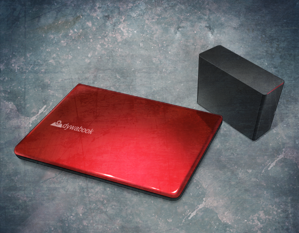

> <big> **永劫回归的潘多拉 - 09a** </big>  
> 1.129954  
> [ 2011/01/23 - 2011/01/26 ] 优先“红莉栖”，躲开黑衣人。事后在菲利斯住所，冈伦与真帆交流中钵论文的红莉栖原稿与『Amadeus』军用化情况。真帆和教授回国，继续让冈伦担任测试员。

对于“红莉栖”这个时候打来很是在意，于是我对二人解释了一下，接起了电话。  
“嗯？怎么了？”  
“你还和真帆前辈在一起吧？”  
“额，嗯。在一起呢。”  
“发生什么了吗？”  
听到了自己名字的比屋定也凑过来加入了对话。  
“虽然只是刚刚才从雷斯吉宁教授那里听到的……  
&emsp;&emsp; 和光市的办公室好像被什么人洗劫了。  
&emsp;&emsp; 还有，真帆前辈住的宾馆也联系了过来，  
&emsp;&emsp; 那边好像也有什么人入侵过了。”  
“欸？你说什么？！”  
听到的事实让比屋定十分震惊。  
“虽然很快雷斯吉宁教授也会联系你，但我想能越早知道越好吧。”  
“谢谢你，‘红莉栖’。  
&emsp;&emsp; 比屋定小姐的话，有我和桶子在，没事的。”  
“也是呢。拜托了。那就这样。”  
“红莉栖”挂断了电话。比屋定低着头咬着嘴唇，陷入了沉默。于是我转向桶子。  
“担心的事情成为了现实啊……对方盯上的，肯定是红莉栖的笔记本电脑和硬盘。”  
“欸？真的假的？”  
“……转移场所可能比较好。”  
“但我觉得这里很安全啊？”  
“不管怎么说都有股不好的预感，类似于直觉吧。”  
“……我知道了哦。”  
“那么，笔记本电脑和硬盘到底在哪？”  
桶子像死了心一般叹了一声，打开了设置在旁边的架子上锁着的防火箱。  
藏在这种地方啊……  
笔记本电脑是搭载着十二英寸显示屏的日本造产品，颜色是深红色。  
硬盘是以耐震性优良的塑胶外壳为卖点的美国货。  
“带着这个赶紧出去吧！”  
比屋定和桶子都沉默着点了点头。  

从小店出来后离开建筑物不远，我们看到有辆车子正开进人流量稀少的小胡同，是辆美国的RV。我们赶忙藏到其他大楼的阴影里。我的预感实现了。那辆RV停在了我们刚刚出来的杂居大楼前，里面走出了三个男人，全都不是日本人，装束都是黑色的西装，就像电影黑衣人里的一样，不管怎么看都不像是来秋叶原的游客吧。  
“真是千钧一发啊。”  
比屋定看着那些进入建筑的人，脸色都发青了，身体似乎在微微地颤抖着。  
“这种事……就像是……电影里演的那样……根本没想过居然会发生在现实中……”  
“但是啊，那伙人到底是怎么得到这个小店的情报的？”  
“不是因为桶子你的疏忽吗？”  
“你以为我是谁啊？”  
“超级嗨客咯？”  
“是黑客。我明明很小心翼翼地注意的。”  
“或者也可能是，跟踪我和比屋定小姐来的……”  
“不要说那么可怕的事啊……”  
“和光市的办公室和宾馆都被洗劫了，比屋定小姐肯定是一直被跟踪着。”  
“啊，对了。”  
比屋定好像想起了什么似的，拿出手机打电话。  
“不联系教授的话……”  
“告诉他你今天会先躲到安全的地方就好了。和教授见面的话可能会牵连到他。”  
对于我的话，比屋定露出微妙的表情点了点头。  

比屋定被冈部带到了菲莉丝·喵喵的家，坐落于秋叶原中心的某个高层大厦的最顶层，比起cosplay商店的老式建筑，安全性肯定是上升了几个档次。菲莉丝愉快地招待了二人，并提供了床铺和食物。而桥田至为了和铃羽碰面，一个人回了未来道具研究所。  
“这个笔记本电脑，只是存在本身就会招来灾祸，舍弃它可能比较好。”  
状况稳定下来之后，冈部开始讨论起关于处理红莉栖的笔记本电脑和硬盘的问题。他的意见十分坚定。虽然平常的他都是那种会呆在某处，不愿太过强调自身主张的类型。但是对于这件事他却显得十分顽固。但是，比屋定也是一样的顽固。  
“我想至少应该解锁之后确认下里面的内容吧。虽说以现况看来这个还做不到……”  
“现在不是说这种悠闲的话的时候。应该立即舍弃掉，最好是直接在这里破坏掉——”  
“居然说要破坏掉……这可是红莉栖的遗物啊！”  
“我还以为你是更有逻辑性的人。”  
“我也以为你不是那么冷漠的人。”  
“……”  
对于比屋定的话，冈部楞了一下，刹那间露出了可怕的表情。  
——这个人，到底在隐瞒着什么啊？比屋定在心里想着。能轻易猜到的部分是，这应该是和红莉栖有关的事。所以，她决定借着这个机会，把中午匆忙间没能问的问题毫不客气地质问出来。  
“我感觉，关于红莉栖事件，你可能隐瞒着什么——”  
“……我知道的都是些无关紧要的事。”  
比屋定感觉冈部无论如何都想回避这个话题。中午在那个工作室的时候，如果没有那件事的介入的话，他应该已经说出来了吧。  
“比起这些，现在最重要的是这台笔记本电脑应该怎么处理。  
&emsp;&emsp; 这已经不是什么‘朋友的遗物’这种级别的问题了，  
&emsp;&emsp; 而是会引起国家规模的争夺战的东西。”  
“到底在说什么阴谋论呀。”  
“都到这种时候了你还要说这是阴谋论吗？  
&emsp;&emsp; 你也看到了吧，那些穿着黑色西装的外国人；  
&emsp;&emsp; 你一直在的办公室和住着的酒店都被洗劫了；  
&emsp;&emsp; 红莉栖的家也被纵火了；  
&emsp;&emsp; 纵火事件后，你的研究室也有自称FBI的神秘男子为了调查而来；  
&emsp;&emsp; 之前在酒店的停车场被袭击的事，说不定也有什么关联。  
&emsp;&emsp; 平常绝对碰不到的事，一个接一个地发生，这绝非偶然。”  
“就算这样，国家规模什么的……”  
对于比屋定来说，她还处于云里雾里的状态。给所有事情强加上关联性，就会让人容易掉入阴谋论者的圈套。但事实是，世界上发生的很多事，并没有那么复杂的原因。刚想这样反驳，冈部又继续说了更多让比屋定震惊的话。  
“事态在此之后将会像约翰·提托预言的那样发展吧。”  
“约翰·提托？”  
那个名字，比屋定并不知道。  
“十年前美国某个网络论坛里出现的人物。从2036年乘坐时间机器来的，自称未来人。  
&emsp;&emsp; 我知道那家伙是真的，也见过面。  
&emsp;&emsp; 约翰·提托曾说过，2015年会爆发第三次世界大战。  
&emsp;&emsp; 战争的导火索是，时间机器。”  
“……你在把我当笨蛋吗？”  
“我是认真的。  
&emsp;&emsp; 你说过很想知道中钵博士的事吧。  
&emsp;&emsp; 那家伙，是红莉栖的父亲。  
&emsp;&emsp; 《中钵论文》也可能和红莉栖有关。”  
“……你……你说什么？”  
《中钵论文》，比屋定也曾抱着很大兴趣读过。去年夏天，那个人逃亡去俄罗斯之后，轰轰烈烈地发表了的关时间机器的论文。但内容全是很幼稚又拙劣的，没什么阅读价值的东西。那种论文和红莉栖有关？怎么都不可能相信的吧。  
“如果说那个论文是劣化版，存在着红莉栖自己写的原稿的话？”  
“啊……！”  
“红莉栖留下的笔记本电脑和移动硬盘，那之中实际存着什么，已经不重要了。  
&emsp;&emsp; 只要那东西有可能在就会有组织想要得到。”  
“等，等下……让我稍微整理下思路……”  
冈部的话是否属实，稍微冷静一下，想想看吧。通常情况下，肯定会把这种东西当作奇怪的闲话，连听都不听吧。但是，比屋定最近在这遭遇的事，却并非通常。所以不能明确否定冈部的话。确实，比屋定自己也当然有过一点类似阴谋论的想法。  
“……其实我也有过，这个电脑被人盯上了的预感。  
&emsp;&emsp; 只不过，你说的话和我的预测差的太远了……”  
“你的预测是？”  
“我曾想过会不会是『Amadeus』的军事转用之类的事。”  
“军事转用……？”  
“红莉栖经常出入精神生理学研究所，她说会时不时地在那边看到无关人员。  
&emsp;&emsp; 说不定是国防总省的人。”  
“『Amadeus』能够杀人吗？要怎么做到？”  
“比如说，拷贝身经百战的飞行员的记忆数据，写入无人战斗机的控制程序里什么的。  
&emsp;&emsp; 还有，以前说过的在医疗方面的应用，还记得吗？”  
“那个……向人类的大脑里重新写入记忆数据什么的？”  
“对。如果能实现记忆数据的修改并重新写入，就可能制造出‘没有恐惧感的士兵’，  
&emsp;&emsp; 或者‘不论多么非人道的任务都能轻松执行的部队’这种很可怕的东西。  
&emsp;&emsp; 我还以为，红莉栖是不是偶然掌握了这些实验的证据。”  
“啊……那，『Amadeus』的研究中，美军的参与……没有的吧？”  
“这怎么可能呢？”  
“真的能这么断言吗？你只不过是研究人员，又不是这个项目的总负责人。”  
“雷斯吉宁教授的话，也不会让军队来参与的吧。”  
“也是呢……那只是别的世界线的话题……”  
“世界线？什么东西？”  
“不，请忘掉吧。可能是我想太多了。”  
并不是很好的转移话题的说辞。这样的说法，让比屋定心里起了个疙瘩。结果，虽然想再多问一些约翰·提托的事，但冈部却不愿意再说了。红莉栖的笔记本电脑和硬盘也无法解除锁定，比屋定即使拿着也没用。而且就像冈部说的那样，恐怕还会有袭击者的存在。所以，不得已只能交给他了。是不是要破坏掉，他却没有明确表示。  

“*Maho*，你没事真是太好了！”  
比屋定来到和光市的办公室后，已经到了的雷斯吉宁教授张开双臂，用高大的身体给了她一个大大的拥抱。  
“教授……好难受！”  
“哦哦，抱歉。*Hahaha！*”  
办公室已经被整理得很干净了，没有任何入侵的痕迹。  
“是教授你整理的吗？”  
“虽说是被洗劫了，但是这里本身也只有我和*Maho*在使用，东西也不多呢。  
&emsp;&emsp; 之后的就交给警察吧。”  
自从办公室被洗劫，已经过了两天。比屋定前天和昨天都是在菲莉丝家度过的，今天和雷斯吉宁教授取得联络，所以来和光市取行李。明天就和一开始预定的那样，准备回国，因此也要和这个办公室说再见了。  
“犯人好像还没抓到吧？”  
“啊。自从来了日本，灾难就不停啊。”  
“是呢……”  
两个人环视着已经空空如也的办公室。不管怎么说也是不得安宁的两个月啊。  
“*Maho*觉得怎么样呢？毕竟日本也是你的另一个故乡吧？感想如何？”  
“想要快点回到大学，埋头开始做研究啊。这两个月只是一味地在整理资料。”  
“*Hahaha*，*Maho*真是认真啊。”  
“还有……能够感受这红莉栖度过了最后时光的国家的气氛……真是太好了。”  
“*Maho*……”  
只是，还没有弄清楚红莉栖死亡的真相，来日本之后更是多了不少疑团，并且只能这样无可奈何地带着疙瘩回国，真是令人咬牙切齿。如果冈部把所有事都说出来的话……  
“说起来……『Amadeus』的测试员的事，要怎么办？”  
想起冈部于是就想到了这件事。比屋定和雷斯吉宁教授回国了的话，他的测试员身份也不得不结束了。  
“*Hum……* 也是呢……”  
教授莫名开始沉思起来，让比屋定有点困惑。还以为是根本不用想的事，难道不对吗？  
“我想让测试的事就这样继续下去，你觉得怎么样？”  
“欸？！您认真的吗？”  
“实际上你不是也看到了吗，  
&emsp;&emsp; 和*Rintaro*说话时，‘*Kurisu*’做出了前所未有的反应。  
&emsp;&emsp; 今后，不止是他，我也打算找更多的测试员参与进来。”  
“在安全的层面上，不会有不安因素吗？  
&emsp;&emsp; 美国和日本离得这么远，要是出了什么问题，我们无法应对啊。”  
“没关系的，因为我信任着*Rintaro*呢！”  
“不，这不是信不信任的问题……”  
“而且，如果继续测试的话，*Maho*也能定期和*Rintaro*联络哟？”  
“啥？！和我没关系的吧？！”  
“是这样吗？”  
“是的哟！”  
“那么之后和*Rintaro*联络的事，就由我直接进行吧。”  
“没、没意见啊。”  
虽然感觉是被岔开话题了，但比屋定也因为害羞没能继续追究。只是，雷斯吉宁教授这么中意冈部，还是挺意外的。从相遇的那一刻起，教授好像就对这位叫做冈部伦太郎的青年特别有好感。只是单纯欣赏，或者因为他是红莉栖的朋友，还是说别的什么原因？比屋定并不知道。  

第二天，比屋定和雷斯吉宁教授按照预定从成田机场回美国了。来送行的冈部，在和雷斯吉宁教授谈论到继续测试员一职的事时，显得十分吃惊。  

然后，半年的时间过去了。  

 

> (to be continued)
---

| [←prev](./0035) | [home](../../) | [next→](./0037) |
