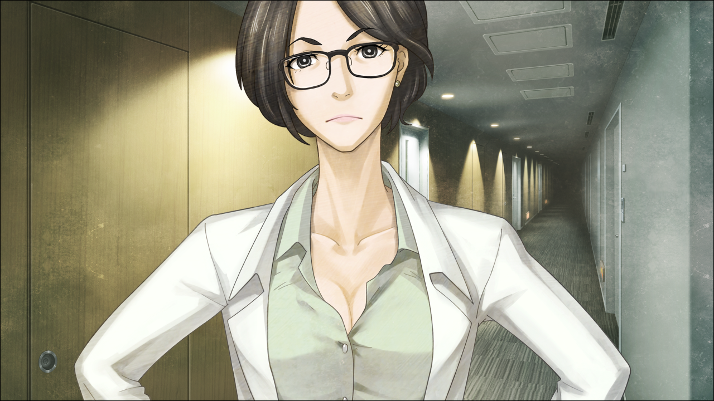
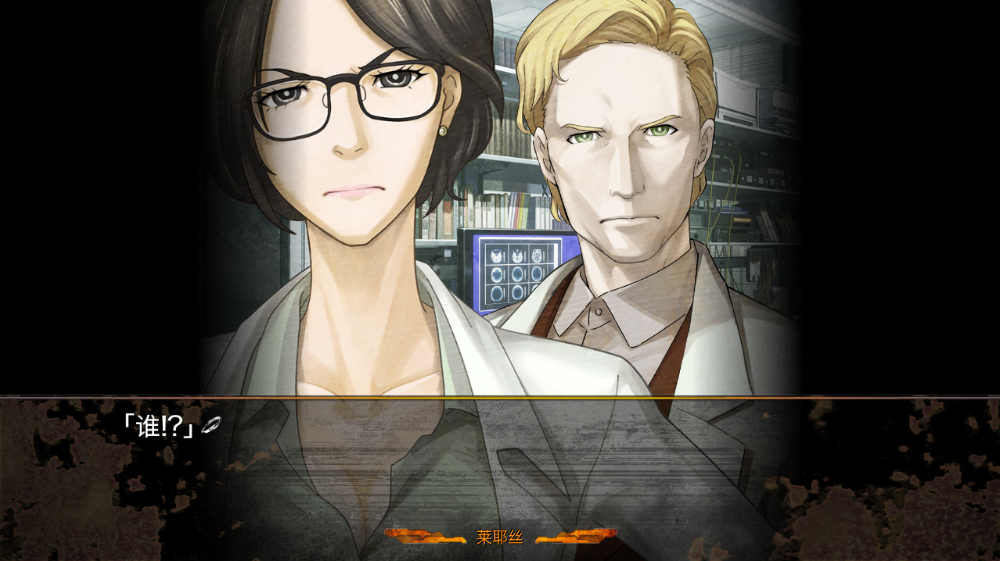

> <big> ** 私秘境里的圣痕 - 01** </big>  
> 1.129954  
> [ 间章 2011/06/03 ] 真帆偷听雷耶斯和雷斯吉宁密谈被抓。

时间已经过了晚上11点，维克多·孔多利亚大学内一片宁静。就研究室而言，因为经常有从深夜一直进行到早上的实验，所以并非完全没有人员的进出，但是相比白天来说还是相当的安静。因为走廊的照明已经关掉了，一个人走的话还是有些不安。真帆住在相邻的研究员用公寓。这天晚上，她在自己的房间里思考各种问题，脑子都快炸了。从房间正好能看到的“脑科学研究所”的窗子，这个时候还亮着灯。一定是雷斯吉宁教授还在那里吧，这样想着真帆用保温壶装了咖啡准备带过去。  
（说起来，为什么我要执着于时间机器的研究呢……）  
一月份从日本回来之后，真帆就投入了这方面的研究。虽然自己这么说有点怪，有点太过执着了。当然，这是不能公开的研究，也不能妨碍到本来的工作，理所当然的，她就只能在工作时间之后悄悄地在自己的房间里进行了。结果，就变成了像这样每天晚上都和并非自己专业的物理学搏斗的状况，睡眠不足和疲劳差不多快累积到难以承受的程度了。  
——时间机器什么的，太荒唐了。  
明明现在也这样认为，却拼命到这种程度，对于这样的自己，真帆也感到惊讶。  
（这也好那也好，都是冈部的错……）  
在日本的那段时间，冈部所说的话让她十分在意。  
“《中钵论文》，有可能与红莉栖有关。”  
这可能是冈部的谎言或者是误解，也可能只是他的妄想。尽管如此，真帆还是觉得这说不定是事实，她想要这么认为。当然，仅就《中钵论文》来看，绝对不会有人相信那是红莉栖写的，它的内容是如此的稚拙。但是——  
“如果说那个论文是劣化版，存在着红莉栖自己写的原稿的话？”  
要是把这当成单纯的可能性的一种而忽略的话，也就轻松了吧。然而无法做到这一点正是比屋定真帆的风格，真帆如此分析自己。  
——红莉栖所发现的东西，自己也想发现。  
这样的愿望，推动着真帆前进。但是，超越了名为时间的真理的理论，越是研究越是难解。太过于难解，以至于自己所相信的东西都快要崩坏了。然后，一直存在的扭曲的自卑感在心中抬起了头。  
（红莉栖……我……果然无法成为你……）  
每次，明明是重要的、珍视的、无可替代的朋友——嫉妒、怨恨、不甘这些与之相违的情感却总是想要侵入真帆的心中。这样的情绪让真帆手中的研究停了下来。  
和雷斯吉宁教授稍微说会儿话，今天就睡觉吧。真帆这样想着，向研究室走去。  

“教授？”  
“嗯？呀，*Maho*。”  
雷斯吉宁教授惊讶于真帆的忽然来访，立即从椅子上站起迎了过来。  
“怎么了，都这么晚了？对于小孩子来说，现在是应该睡觉的时间哟？”  
“这句话，原封不动地还给您。”  
“*Hahaha*。没错呢！”  
对于真帆尖锐的反击，雷斯吉宁教授像小孩子一样无邪地笑了。  
“从我的房间，看到这边灯还亮着——这个，请用。”  
雷斯吉宁教授桌上放着的杯子正好是空的，真帆把保温壶里的咖啡倒了进去。并不是真帆喜欢的绵密香甜的欧蕾咖啡，而是对教授口味的黑咖啡。和蒸汽一起，一股好闻的香味在房间里散开。  
“这真是让我吃惊啊，没想能喝到*Maho*泡的咖啡。”  
“我好歹也是有这样的眼色啦。”  
“但是，你不是很讨厌这样吗？  
&emsp;&emsp; 那应该是，你来到这个研究所的第一天吧。  
&emsp;&emsp; *Mary*给大家分发早间咖啡，到你的时候你，你却这样拒绝了——  
&emsp;&emsp; ‘你在这里的任务就是泡咖啡吗？’  
&emsp;&emsp; ‘有这个时间的话，快点开始工作如何？’这样。  
&emsp;&emsp; 啊呀呀，真是来了个不得了的人呢，当时真的惊讶到我了。”  
“这、这种陈年旧事，不用现在重新提起来吧……”  
真帆感觉无地自容，鼓起了脸颊。  
“那个时候是，那个……  
&emsp;&emsp; 被说是天才少女，稍微有点得意忘形了……  
&emsp;&emsp; 什么都不懂的小孩子而已……  
&emsp;&emsp; 我有好好反省过了。”  
顺便一提，真帆后来和玛丽研究员道歉之后，两人相处得还挺不错。  
“教授真是坏心眼呢。我不会再拿咖啡过来了，就这样吧！”  
正打算干脆也把难得泡好的咖啡拿走回去的时候——  
“就是说哟，教授，请不要太欺负前辈了。”  
雷斯吉宁教授的台式电脑传来了声音。  
“哎啦，‘红莉栖’？”  
“是的，是我。”  
“正好在对她的程序进行验证。”  
真帆走到能看见显示器的地方，屏幕上显示着“红莉栖”的CG。『Amadeus』正在运行。  
“晚上好，前辈。”  
“这么晚辛苦你了。”  
虽然她只是电脑上运行的程序，但不知不觉就这么说了。察觉到这一点的真帆不禁苦笑。交往了这么久，对于真帆来说，如今的“红莉栖”已经和人类没什么区别了。  
“我并不是在欺负*Maho*哟。  
&emsp;&emsp; 玛丽那件事也是，我其实挺看好*Maho*的。  
&emsp;&emsp; 不讲情面，非常理性，又酷，而且还很有趣呢。  
&emsp;&emsp; 所以才让她成为我的助手。  
&emsp;&emsp; 当然……我也不讨厌现在温柔的你呢。”  
雷斯吉宁教授说着眨了眨眼，把手伸向了咖啡杯。  
“谢谢，我开动了哟。”  
教授喝着咖啡，一边用手指做着眼部按摩。看起来轻松活泼，实际上应该相当疲惫了。  
“程序的验证，是做了些什么？”  
“啊，就是现在正在整理的论文的那个。”  
“『Amadeus』的说谎机制吗？”  
“能够解析这部分的程序的话，可能就能更进一步了解人类的说谎机制了。”  
“女性的谎言有时包含重大的秘密。想要揭露它的行为真心不值得推崇。”  
画面中的“红莉栖”以非常认真的表情说着。  
“也不是说要揭露你的谎言。只是想知道说谎时的‘思维过程’而已。”  
“嘛，算了。真要揭露些什么的时候，首先就说真帆前辈藏起来的甜蜜小秘密吧。”  
“等等，请不要说奇怪的话。话说，甜蜜小秘密是什么？”  
“是什么呢？”  
一副装傻的表情。红莉栖偶尔也会有这样调皮的一面，又可恨又可爱。  
“嗯~比如……在游戏中心，‘他’帮你拿到玩偶的事……你以为我没有察觉吗？”  
“……哈？！”  
游戏中心，听到这个单词真帆脑中立马浮现出在日本秋叶原发生的事情。真帆挑战很多次都没有拿到的玩偶，被冈部轻易的拿到，当作礼物送给了真帆。  
“那个怎么了？”  
“一直放在前辈的床上对吧？”  
“你、你在说什么蠢话？！……那是给红莉栖母亲的礼物哟。”  
“嘿嘿~那么~为什么会在前辈的房间里呢~？”  
“因、因为，伯母说正在找新的房子，在此之前租住在临时公寓，  
&emsp;&emsp; 想着到时候要搬家的话，给她增加行李就不好了……”  
“真的是这样~？”  
“真、真的哟！再说，那个玩偶对我来说，是对红莉栖珍贵的回忆。  
&emsp;&emsp; 抱着睡觉有那么奇怪吗？”  
“啊哈~果然在前辈的床上呢，那个！  
&emsp;&emsp; 而且，抱着睡觉什么的，太可爱了！  
&emsp;&emsp; 关于这个，请再讲的详细一点！”  
“咕唔！”  
区区程序居然自大到给我下套——真帆察觉到这点的时候，已经晚了。“红莉栖”和一直听着对话的雷斯吉宁教授都一脸奸笑地看着真帆。  
“呜哼~哼~~”  
真帆红着脸瞪着这两人。  
“这样看起来，是‘*Kurisu*’的胜利呢。”  
“胜、胜负什么的一点关系也没有！我要睡觉去了，晚安！”  
真帆愤懑难平地准备离开教授的房间，这时“红莉栖”从背后投来了会心一击的一句话：  
“前辈，已经一个星期没有和冈部联系了哟。  
&emsp;&emsp; 要是以太忙为借口而忽略了联络的话，之后会后悔的哦？”  
“我说啊……你无论如何，都想把我和冈部先生撮合到一起吗？”  
真帆逼近显示器，“红莉栖”并没有退避。  
“偶尔不会有‘想要直接见面啊’这样的想法吗？”  
“没有想过。”  
“是吗，真可惜啊。”  
这时雷斯吉宁教授不知为何，难过地左右摇了摇头。  
“最近，因为共同研究，日本方面又要叫我过去。  
&emsp;&emsp; 到时候，还想着要联系下*Rintaro*呢。  
&emsp;&emsp; 我还在烦恼是否要带上*Maho*一起去的，  
&emsp;&emsp; 这样子看起来还是算了吧~”  
“欸！？又要去日本吗！？”  
这件事真帆完全是第一次听说。通常雷斯吉宁教授的项目的相关信息，都会事前通过研究所的内网通知自己的。  
“啊。”  
“……”  
真帆条件反射地想说“想去”，又咽回去了。要是说了这话，又要被雷斯吉宁教授和“红莉栖”调侃了。尽管如此，真帆还是不想放弃这个机会。在日本，还有很多没做的事情。首先，还想再直接问冈部一些事——时间机器的事，红莉栖的事——绝不是因为想和冈部说话，和感情方面没有关系。  
“……务必……请把我带上吧。”  
结果还是放弃了抵抗，说出了自己的心声。  
“*Oh！* 终于坦率起来了呢！”  
“那么来考虑下告白计划吧！”  
“你们两个啊……”  
事到如今，真帆也觉得每次都要吐槽和订正很麻烦。  
“嘛，玩笑就到这里。到底要不要带你去，现在还不好确定。”  
“怎么说？”  
“你不是在日本卷入了各种事件吗？就脑科学研究所而言，对这方面很是在意呢。”  
“怎么会……！”  
“有*Kurisu*的前例，不能再让优秀的人才遭遇危险了，理事们是这么考虑的。”  
“我的话没有问题的！现在不是好好地站在这里吗！”  
“哦……也就是说，*Maho*这么想去日本见*Rintaro*吗？”  
“这差不多算是性骚扰了哟？”  
“*Oh！* 这个还是放过我吧！”  
“不过，前辈不认真考虑下交往吗？  
&emsp;&emsp; 将来，冈部不是很可能到这边来的吗？  
&emsp;&emsp; 这样的话，就应该现在就下手的。”  
“请不要像爱管闲事的亲戚大妈一样说话……”  
“*Maho*的想法我理解了，我也会去找理事谈谈的。  
&emsp;&emsp; 但是，并不能保证你一定能去日本。”  
“好的，非常感谢。”  
“我还是挺认真的呢……”  
“还在说啊？真是的……”  
真帆不由得感觉像是在和真正的红莉栖对话一样。这种感觉，远比『Amadeus』刚开发出来的时候更强烈。于是，最近经常想到又被自己制止了的事情，在脑中一闪而过——  
（和这位“红莉栖”讨论一下时间机器的事情怎么样？）  
红莉栖生前是否真的完成了时间机器理论还不确定。但是，如果是真的，“红莉栖”的记忆深处，说不定还留有一些片段。不过，这种事情不可能当着雷斯吉宁教授的面说。在自己房间偷偷进行时间机器研究的事情也是，绝对不能公开。要是被研究所的人们知道了，毫无疑问肯定会被当成傻瓜的。说到底，这也并不是真帆原本的研究领域。  
“那个……就这样，教授，我差不多该回房间睡觉了。”  
真帆结束话题，留下装着咖啡的保温壶，准备离开研究室。  
“啊，稍等一下。最近，‘*Maho*’的记忆资料，完全没有更新吧？”  
“啊……？”  
“是说『Amadeus』的‘*Maho*’哟。”  
“啊，那个……”  
“最后一次采集资料是去日本之前，不是吗？”  
“那个，关于这个呢……”  
真帆被说到痛处，一瞬间词穷了。  
“那个……因为在日本经历了各种可怕的体验，  
&emsp;&emsp; 我考虑会不会给『Amadeus』留下不好的记忆呢……”  
“虽然我理解你的心情，但是这样的话就无法进行对比实验了。”  
所谓的对比试验，就是把各种体验学习之前和之后的记忆资料载入『Amadeus』，对其言行的不同之处进行对比研究，目的是探究体验和学习的有无对人类大脑产生的影响。因为红莉栖的逝去，现在已经全部托付给了真帆。  
“现在的你，和『Amadeus』的‘*Maho*’记忆相差得太多，说是另一个人也不为过。”  
“是，是的，是这样呢……”  
“这样下去的话，说不定要让你从这个项目里退出，找其他人代替了。”  
“这个……”  
真帆的脸沉了下来。  
“不要总是和‘*Kurisu*’对话，偶尔也要顾及‘自己’，肯定很寂寞呢。  
&emsp;&emsp; 明天，必须要进行记忆的更新，可以吧？”  
“……明白了。”  
真帆点点头，走出了研究室。不进行“真帆”的记忆更新的原因，除了对雷斯吉宁教授说明的以外，其实还有一个。就是伦太郎的话。  
“那，『Amadeus』的研究中，美军的参与……没有的吧？”  
没有可靠的证据，但是，这句话无论如何也无法从脑中抹去。『Amadeus』的研究，有没有幕后的巨大力量在操纵呢？就连雷斯吉宁教授也无法干预的巨大力量……如果把在日本的记忆资料更新的话，“真帆”就会获得关于红莉栖的笔记本电脑和硬盘的情报。即使信任『Amadeus』，但是如果存在幕后想要利用『Amadeus』的人，这些信息就会全部泄露。这种近似妄想的，过剩的不安，从真帆回到美国之后一直存在。  

“不过果然……是我想太多了吧……”  
“谁？谁在那里！？”  
正在真帆自言自语的时候，忽然，漆黑的走廊前方，传来女性的声音，吓得真帆停住了脚步。通道的灯一下子被点亮，从连接着隔壁研究所大楼的走廊，多名男女成列向这边走过来。隔壁的大楼，是【精神生理学研究所】。真帆所属的【脑科学研究所】，以大脑本身的机能研究为主。另一方面，【精神生理学研究所】，是关于脑活动带来的心理活动或者病理之类的，更接近医学的部分为专业的。  
“不、不好意思，我是比屋定真帆，雷斯吉宁教授的研究室的。”  
真帆认识走在最前面的女性，是所属于【精神生理学研究所】的雷耶斯教授。  

“啊啦，原来是*Maho*嘛。”  
“雷耶斯教授。这个时间还在工作吗？”  
“你也是？”  
“是啊，嘛……”  
“我们都是工作成瘾呢。”  
朱蒂·雷耶斯教授眼镜后面的双眼眯起来，露出微笑。  
“阿莱克西斯呢？还在自己的办公室吧？”  
“是的，在做『Amadeus』的研究。”  
“真是很执着呢。不知道是不是和自己的女儿搞混了？”  
“那个，这个时间还要和雷斯吉宁教授见面吗？如果是紧急会议的话，我也——”  
“这倒是不用。我的研究稍微遇到了点问题，想赶紧借用一下他的智慧呢。  
&emsp;&emsp; 就算你在场也并没有特别要拜托你的……  
&emsp;&emsp; 啊，无意冒犯。不过，谢谢啦。”  
雷耶斯教授笑着说完后，穿过真帆身边走向雷斯吉宁教授的研究室，其他研究员们也陆续跟在后面。  
（研究上的问题……究竟是什么呢？）  
仔细看了一下，真帆在同行的研究所人员中发现了一幅没见过的面孔。也说不清楚为什么会注意到那个人，该怎么描述呢——他，完全不像个学者。长期从事研究工作，能自然而然地感觉到相同的科研人员的气质。但是，那个男人明显散发出与周围完全不同的氛围，而且，对雷耶斯教授的态度也很不恭敬。如果是她研究室的人是绝对不会这样的做。另外，包括雷耶斯教授在内，其他的研究员全体都穿着白大褂，只有那个男人整整齐齐地穿着完全没有褶皱的西装。真帆总觉得不对劲。  
本来快要回到自己房间的真帆，因为非常在意，就绕了回来，压低脚步声走向了雷斯吉宁的研究室。研究室的门微微开着，从那里能听到里面的谈话声。真帆知道这么做不对，但是还是把脸贴在门边，竖起了耳朵。  
“——准备放任到什么时候？”  
“那可是贵重的情报来源。鲁莽行动导致被废弃的话就可惜了吧。  
&emsp;&emsp; 不管怎么说，我这个月会出发去日本，准备在那时回收。” 
“为什么要观察将近半年？能给我一个可以接受的解释吗？”  
“我感觉他隐瞒着什么我们所不知道的事。  
&emsp;&emsp; 于是，想用『Amadeus』引诱他说出来……  
&emsp;&emsp; 但是他警戒心很强，是个谨慎的青年啊，*Rintaro·Okabe*。”  
“对真帆施展你得意的手术怎么样？”  
“可是我认为她什么都不知道呢。”  
“啊……”  
真帆听到了自己的名字被提及，内心产生了巨大的波动。然后——察觉到了自己犯了个严重的错误。因为听得太过于集中注意力，以至于肩膀稍微碰到了门。这个研究室的门不太精良，发出了嘎吱嘎吱的声音，让房间中的所有人一起回过了头。  

真帆心里想着或许逃跑会比较好，但是事与愿违，身体完全无法动弹。完全没有办法理解两位教授在说什么，即使被发现了，也只是傻傻地站在那里。不敢相信，也不想相信。这种情景，比悬疑电影都要神秘。这样想着，雷耶斯教授与一位同行的研究员一左一右架住真帆的双臂，牢牢地抓着，把她带进了房间。  
“教授……刚才说的……究竟是……”  
雷斯吉宁教授带着略微悲伤的表情来到真帆面前，弯下庞大的身体，直视着真帆的脸。  
“哎呀哎呀，被听到了啊……算了，正好。  
&emsp;&emsp; 真帆，之前说的去日本的事呢，果然要请你也一同前往。”  
她不明白。研究所的理事们不是反对么？以雷斯吉宁教授的立场能够擅自决定吗？什么正好啊？真帆带着疑惑，一瞬间看到了显示器。然而那里已经没有刚才显示的“红莉栖”的画面了。  

真帆唯一理解到的一点是——  
冈部说过的话，果然不只是阴谋论者的妄想而已。  

 

> (to be continued)
---

| [←prev](./0036) | [home](../../) | [next→](./0038) |
