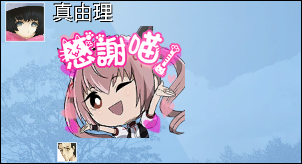
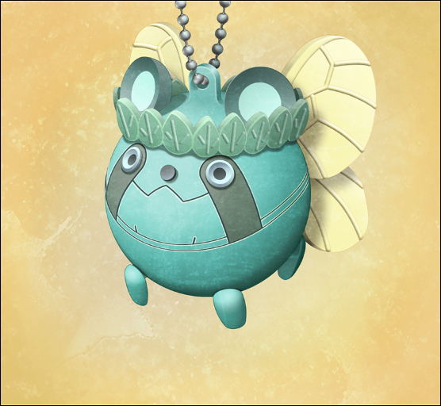

> <big> **私秘境里的圣痕 - 02** </big>  
> 1.129954  
> [ 2011/06/25 ] 与真由理逛商场，送给她绿妖精乌帕。  

季节马上就要进入7月了。今年不知是不是干黄梅的原因，东京没有下梅雨的迹象，却已经呈现出了梅雨期后的天气。不如说，气温已经早就变成夏天的炎热了。  
（夏天啊……）  
也就是说……那件事之后，已经快要一年了。  
这是个周六的午后。在家里不仅酷暑难当，还被老爸唠叨着帮忙生意，于是我就来到了池袋车站附近。一年前的话，还有LAB这个歇脚地，但现在因为铃羽住在那儿，就尽量不过去了。但是这样一来，在休息日适合学习的地方就不怎么好找了。去大学也嫌麻烦，休息日教室估计也不开放。经过种种考量之后，决定在离老家较近的这间咖啡店坐几个小时。实际上，这一类的咖啡店里和我一样，一杯咖啡坐上几个小时的人非常多，有的带来了笔记本电脑，有的在读书。我说不定也加入了这些现充的队列了……心中这样苦笑道。  

正在咖啡店看书时，手机响起了RINE的消息提示音。  

『嘟嘟噜~♪现在在哪？』  
  
『啊，老地方的咖啡店啊  
&emsp;刚才去了冈伦的家，你不在』  
「去了啊，老爸没有给你添麻烦吧？」  
『没有哟，还款待了麦茶  
&emsp;有些不得不买的东西，能陪我吗？』  
  
  
『那我现在就过去，在那等我哦』  

那家伙，去过我家了啊……  
我的老家【冈部青果店】，是古老的商业街中的一家破旧的店，差不多建成有40年了。残破得很，是时候重新装修一下比较好。  
“呼……”  
注意力分散了。还有不到15分钟真由理就要来了，今天的学习就到此为止吧。中午的时候把该读的都读过了，嗯，也算是可以吧。对于最近自己的专注度，我自己都有些吃惊。因为有了目标，感觉到干劲涌了上来。必须尽早达到去维克多·孔多利亚大学的条件。  
（维克多·孔多利亚大学啊……）  
我和比屋定因为『Amadeus』的事有在定期进行邮件和聊天。那边好像研究很繁忙，总是一副睡眠不足的样子。  

这时手机又响起了铃声，拿出来一看是“红莉栖”的来电。  
“你好（悄声）。”  
“……怎么了？为什么要压低声音？”  
“嘘——！现在在店里面。拜托了，请别无视我的情况就联系我……”  
“你在哪里干什么我又不知道。  
&emsp;&emsp; 还是说，你希望被我24小时监视么？  
&emsp;&emsp; 你睡觉的样子啊、洗澡的样子啊，全都想被偷窥吗？”  
“啊……”  
“哈……不是一般的变态啊。”  
“是我太自以为是了真是抱歉……”  
“我联络过来，你不想接的话，不接也行。不会因为这点事生气的。”  
“是、是么……”  
“好了，看你现在很困扰的样子，就如你所愿，挂了哦。  
&emsp;&emsp; 的确，与手机上的3D模型女孩一本正经对话的男子大学生够恶心的。”  
“你啊……”  
“开、开玩笑的啦。  
&emsp;&emsp; 一直都愿意搭理我，至少、那个……  
&emsp;&emsp; 感谢你啦……是这么想的……”  
“这种话就算了，总之先挂了啊。”  
“啊，等——”  
我挂断了电话。“红莉栖”说起话来总是很长时间都说不完的样子。的确本体也是滔滔不绝的性格。在这种地方和她对话，我会太在意周围的目光，感觉很不自在。我也提议过因为看着屏幕说话太羞耻，想要变成和平常打电话一样的形式来交谈。但是这样“红莉栖”就有意见了——为什么我要可悲地一边看着你的脑袋一边说话？真是个任性的程序，真是的……  

与真由理汇合后来到了HANDS（东京手创馆）。进到空调十足的店里，有重生的感觉。才6月份就这种热度，真不知道到了7、8月份该怎么办。  
“那么，到底要买些什么东西？”  
“那个，要做宣传商品用的POP，所以，要买用到的卡片啊、荧光笔之类的。”  
“今年准备在漫展卖同人本么？”  
“不是的，用在『冈部青果店』的哟~”  
“啊？你说什么……？”  
我的老家？  
“今天，去冈伦家的时候，和叔叔谈到了这件事。  
“‘那么就让真由喜来做！’——这样参选了。”  
“喂喂……”  
老爸那家伙，真是厚脸皮啊。  
“你没有必要做这事哦。”  
“但是但是，真由喜是想要做才做的。”  
“真的……没关系吗？”  
“因为总是受冈伦和叔叔阿姨的照顾呢。”  
“……那么，作为补偿下次会送你礼物的。”  
“真的？好开心呐！”  

  

大致地转了一圈卖场，用于POP的材料种类相当的多。我尽量不出声，让真由理按自己的品味选择。真由理花了相当长的时间，仔细地斟酌着该买哪个好。只是，因为平时在 *MayQueen+Nyan²* 的原因吗，真由理的品味该怎么说呢……偏向于萌系的方向。交给真由理应该没什么危险吧……尽管这么说，被拜托的是真由理，所以我出手干涉也不对吧。这里就放开胸襟，全部交给真由理吧。因此，我就在卖场随便地转悠着等待真由理买完东西……这时又接到了“红莉栖”的电话。  
“怎么了吗？”  
“难道说在买东西？”  
“嗯，和真由理一起。”  
“欸~约会？”  
“sweet(笑)”  
“都说过不要用这种说法了。”  
“那么，你也改改你恋爱脑的习惯吧。”  
“是是是，我知道了啦。  
&emsp;&emsp; 但是，真由理真是可爱呢。  
&emsp;&emsp; 居然有那么可爱的比你小的青梅竹马，你真是有福气啊。”  
“是啊。”  
“这么一来，真帆前辈的胜算不是绝望性的么……  
&emsp;&emsp; 又不可爱，年龄上也赢不过，身高更不用说，还有胸围方面的也是惨败……  
&emsp;&emsp; 呜，可怜的前辈……”  
“这些话在比屋定小姐的面前说的话，她会把整个程序都删除掉的吧。”  
“话说，我，至今都没有被介绍给真由理呢。  
&emsp;&emsp; 你这人，朋友明明挺多的，但是跟谁都没有提过我的事呢。”  
“有类似保密义务的，被要求过尽量不要告诉别人。”  
“真的只是这样么？实际上，是不想让别人看到在和我说话的样子对吧？”  
“……没有那种事。无论如何都希望被介绍的话，我就向比屋定小姐征求下许可吧。  
&emsp;&emsp; 然后首先，就把我最信赖的男人——桶子介绍给你。  
&emsp;&emsp; 如果是那家伙，应该会对你相当执着的吧。”  
“24小时一直被工口的目光注视着然后不停的被哈哈着么我懂的……  
&emsp;&emsp; HENTAI真是可怕……”  
“红莉栖”脸色一青，伴随着失去任何感情波动的话语颤抖了起来。  
桶子是怎样的人，我不厌其烦地灌输给了“红莉栖”，所以她应该能轻易想象出，被交到那个人手上的瞬间，自己会被如何当成玩物的吧。  
“……果然，不用介绍也好。  
&emsp;&emsp; 有你作为谈话对象了，应该觉得满足了才是——”  
“冈伦~”  
就在这时真由理拿着购物篮回来了。  
“咦？刚才在和谁说话呢？”  
“啊，呃、嗯，那个……”  
我看了一眼手机，“红莉栖”的图像已经消失了，屏幕返回了主界面，看来是“红莉栖”挂断了。
“是大学的前辈打来的。”  
“这样啊。”  
……虽然我也觉得“红莉栖”的事没有必要这样拼命地隐藏，另一方面，又觉得唯独还是不要让真由理知道比较好。因为，起码她知道我去年的夏天没能拯救牧濑红莉栖的事。  
“那么，要买的东西确定了吗？”  
“啊，嗯！这种感觉的怎么样？”  
购物篮里面，放着大量的心形或星形的POP纸。这些……与我老家店铺的氛围，致命地不合适的感觉……但是，这也是一开始就肯定会变成这样的——全部交给真由理的品味的话。之后可能会被老爸牢骚一番，但是不关我的事。拜托真由理的不是我，而是老爸。因此，我什么意见也没说就去结账了。因为是周六，收银台附近等待结账的客人堆得满了出来，会很费时间的样子，我就让真由理到别的楼层的动漫周边卖场去等了，那里会有真由理喜欢的《雷NET翔》的周边商品出售。真由理觉得很抱歉的样子，还是按照我说的去了。  

结果，结账花了15分钟。同时我为表歉意许下的送礼物的约定也兑现了。  
“欸嘿嘿~~”  
真由理一副高兴至极的样子注视着手上的钥匙圈。  

这是《雷NET翔》中登场的吉祥物角色“乌帕”。我让真由理在动漫周边卖场等待的时候随便选个喜欢的东西，于是她拿了这个。  
“乌帕的话，明明已经有了很多了……还是这么高兴啊。  
&emsp;&emsp; 而且，这只是普通的绿色乌帕吧？不是稀有的那种啊。  
&emsp;&emsp; 稀有的貌似是……金属乌帕来着？”  
全身闪烁银色光辉的金属乌帕，在乌帕之中也算人气很高，作为商品的稀有度也很高。比方说的话，以便利店的商品抽签来说，金属乌帕肯定相当于特等奖。据说在网上拍卖的话能值好几万，之前听真由理说过的。  
“不-不-不——”  
真由理不知为何显得很得意的样子，左右摇动着食指。  
“不是的哦~这个啊，虽然是绿色的乌帕先生，但是和普通的不一样的！  
&emsp;&emsp; 是在之前放映的电影中登场的‘绿色的妖精先生乌帕’哟！”  
说起来，《雷NET翔》的剧场版在春季上映了呢。真由理也混在小孩子当中去看了吧？  
“绿色的妖精先生？”  
“剧透电影的情节也没关系吧？”  
“没事，反正不会看的。”  
“那个，这次的电影啊，是在虚拟世界中与邪恶的超级黑客先生们战斗。  
&emsp;&emsp; 那个虚拟世界啊，就是妖精先生住的森林。  
&emsp;&emsp; 超级黑客先生特别强呢，翔君和乌帕们都陷入了危机……  
&emsp;&emsp; ‘已经不行了~！’的时候，妖精先生们前来帮忙了呢。
&emsp;&emsp; 其实，那些妖精先生们，是翔君在照顾的学校花坛的花儿们哦~
&emsp;&emsp; 为了拯救一直都温柔地照顾它们的翔君，  
&emsp;&emsp; 在虚拟世界‘皮卡皮卡~’地放着光与乌帕合体了！
&emsp;&emsp; 那就是这个‘绿色的妖精先生乌帕’！超级可爱，超级强大的哟~
&emsp;&emsp; 真由喜好感动啊~对这类剧情没辙呢~导演先生真是天才啊~”
“原、原来如此啊。”  
能让真由理这么热衷地诉说的事情实在少有。的确仔细看的话，能发现真由理拿着的乌帕和普通的绿色乌帕在设计上稍微有些区别。因为不怎么了解乌帕，哪里有什么不一样……要是被这么问的话还是一头雾水的。  
“这个钥匙圈啊，我到处找过呢。  
&emsp;&emsp; 超级有人气的，不管哪里都卖完了哟~没想到HANDS还有剩下的呢~”  
“很幸运呢。”  
“嗯！而且，这是最后的一个哟~今天来了真是太好了，要感谢冈伦和叔叔呢！”  
真由理用指尖灵巧地拆开纸质的商品包装，从包中取出家里的钥匙，然后小心地装了上去。  
“嘿嘿~呐，冈伦，真由喜啊，要把这个一直~一直~~珍藏着的！”  
“啊，好好珍惜吧！千万别才买了5分钟就丢了哦。”  
真由理可是有前科的。我在广播管抽到的金属乌帕，在交到真由理手中后，仅仅5分钟就弄丢了。到最后，那个金属乌帕也一直都没有找到。那个时期的事不怎么想回忆起来，所以关于金属乌帕的去向也就不了了之了。  
“嗯！绝对、绝~对~~不会再弄丢的！”  
一边说着这些话，两个人踏上了回家的路。  
“冈伦家店的POP，我就鼓足干劲去做咯！”  
“啊——还有这么一回事啊……”  
还以为买完材料就算结束了。不如说现在才是正式开始。  
“要我帮忙吗？”  
“不不，没事的。希望你能相信真由喜的品味啊~”  
“……光是买了心形的POP这点，就该怀疑你的品味了。”  
“没问题的啦~”  
“嘛，能帮忙弄POP已经很感谢了，没什么抱怨的了。”  
“啊，要给妈妈发个短信呢，告诉她晚饭的时候再回去。”  
“那要不在我家吃也行啊？反正我爸妈他们肯定要留你的。”  
“唔~嗯，怎么办比较好呢~  
&emsp;&emsp; 冈伦的话，今天之后一直在家的吗？不去联谊什么的吗？”  
“最近完全都没去了。”  
去年秋天刚弃掉中二病那会儿倒是想着成为一个普通的大学生什么的，然后十分勉强地跑去参加联谊来着。最近则是忙于学习的事，去参加的机会也减少了。  
“这样啊~那，我就去打扰了~”  

就在真由理稍微犹豫着拿出手机，想要输入邮件的时候——  
她的表情，突然沉了下来，就那么站在原地不动了。  

 

> (to be continued)
---

| [←prev](./0037) | [home](../../) | [next→](./0039) |
