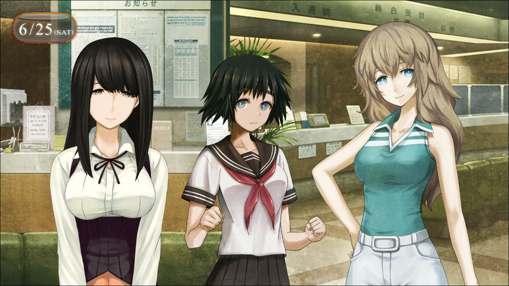

> <big> **私秘境里的圣痕 - 03** </big>  
> 1.129954  
> [ 2011/06/25 ] 去医院探望再次入院的吹雪，偶遇雷斯吉宁。  

“啊……”  
“怎么了？”  
“嗯……就是刚才啊，枫发了邮件过来，都没有发觉呢……  
&emsp;&emsp; 怎么办啊，冈伦……？”  
真由理非常的动摇，眼看着就要哭出来了。  
“发生什么了？”  
“呐，冈伦……？你之前说过的吧？吹雪酱她，不是生病什么的。”  
“吹雪酱？是指中濑小姐？不是来岛小姐吧？”  
“嗯。那个是真的吗？真的不是生病了对吧？”  
“啊，是啊。应该不是。”  
“可是……”  
真由理把手机的邮件画面展示给我看。  

  

“又住院了……？”  
我难以置信地盯着画面上显示的文本内容。  

吹雪住院的医院和上次的不一样，是在代代木的一个叫做“AH东京综合医院 附属先进医疗中心”的地方，在日本是以屈指可数的最新医疗设备而闻名的样子。根据网上的情报，最近流行起来的新型脑炎患者，现在应该都被集中在这里进行着专门的治疗。然而，网上的传闻并不止这些，有关这个医院的都市传说还有各种轶闻也被大量地贴了出来，让人不禁害怕那究竟是什么可怕的地方。不过实际进到里面以后发现并非什么很可怕的设施，反而是很干净的，像星级宾馆一样的地方。  

“真由理酱，冈伦先生——”  
“在这边。”  
我和真由理进入大厅以后，正等着的枫和由季向我们挥了挥手。  
由季应该也是收到了枫的邮件后急忙赶过来了。  
“吹雪酱怎样了……？”  
“没事的。”  
由季温柔地抱住不安的真由理的肩膀，向她微笑着。另一边，枫则是过意不去地低下了头。  
“吓到你了抱歉呢。我也是太着急了。应该好好确认过之后再发邮件就好了。”  
代替快要失了神的真由理，我开始向枫了解状况。  
“所以呢……？中濑小姐的情况怎么样了？”  
“我刚才在病房里见到了吹雪酱的妈妈，她说应该不是上次的病情恶化了。”  
“那……就只是住院再检查……之类的吗？”  
“对的，是这么说的。所以完全不用担心。”  
“什，什么呀。哈啊……太好了……”  
保持被由季抱着的样子，真由理终于放松下来。  
好像吹雪以前检查的时候，“虽然还有疑问，但是在病情不恶化的情况下对日常生活没有影响”，根据定期去医院进行观察的结果应该是这样。这个新型脑炎自从登陆日本国内以后，至今患者数量仍在持续增加。不过不幸中的万幸是，这其中没有出现任何一名死者。  
（我倒不觉得那是什么病啊……）  
在我的想法里，这种被叫做新型脑炎的症状，实际上应该是一种跟 *Reading·Steiner* 很接近的能力。之前探望吹雪的时候，我顺便悄悄地对她以外的患者进行了一些调查。虽然不能得到准确的结论，不过至少能确定当时和吹雪在同栋楼住院的患者，基本都有着程度不同的对于“同一世界线”的记忆——也就是有着，处于战争状态的日本的相关记忆，不止一人是这样。  
“可以和吹雪酱见个面吗？”  
“那个的话，她现在在MRI那里做脑部检查的样子，所以不在病房里。”  
“这样啊……”  
“不过，应该很快就结束了。吹雪酱的妈妈让我们在这里等一下，检查结束后会告诉我们的。”  
枫带着由季和真由理坐到了旁边的沙发上。我则继续站着，环顾着整个大厅。  
“真是个厉害的医院呢。”  
“啊、啊啊。中濑小姐家里，实际上是很厉害的有钱人吗？居然能在这种地方住院。”  
由季的感叹我深表赞同，光看大厅就感觉这里的费用一定很高。解答我的疑问的依旧是枫。  
“不，并不是那样……听吹雪酱的妈妈说，  
&emsp;&emsp; 好像是日本和美国的政府出资，在这里实施新型治疗项目的样子。  
&emsp;&emsp; 是以这家医院和美国的专科医院以及研究所为中心进行的。”  
“这样啊……”  
我的内心产生了很复杂的心情。这种症状虽然被认定为新型脑炎，但是，如果真的像我想的那样，并不是病的话……应该不会有比这更加浪费的事情了吧。  

“拜托了，请给所有患者分配单独的病房。  
&emsp;&emsp; 还有，让患者之间尽量不要相互接触，安排相互间隔开的房间。”  
“可是啊，要去准备那么多的病床很难做到的。”  
“就算是那样，不这么做也不行！  
&emsp;&emsp; 一旦患者间进行对话，‘梦境’的情报不就会互相传播了吗？”  
“不，虽然是这样没错……”  
“大脑这种东西呢，明明是别人的梦境，但是有了共感的话，  
&emsp;&emsp; 就会产生自己也梦见了的错觉。是有这种可能性的！”  
我循着争论的声音横穿过大厅，穿着白大褂的日本老医生和正追着他在说着什么的穿着西装的巨大人影，一下子进入了我的视野。  
“……啊！”  
那个穿着西装的外国人，我记得是谁。不如说，还是我很熟的人。  
“教、教授——雷斯吉宁教授！”  
我慌张地追了过去。  
“雷斯吉宁教授！是我啊！冈部！”  
因为他在用日语和老医生交流，应该是戴了之前的翻译机吧。所以我也试着用日语打了招呼。雷斯吉宁教授也注意到了我，很有气势地笑了起来。  
“*Oh——! Rintaro!* ”  
他的声音大得过头，以致于医生、护士、职员，还有患者，大厅里的人们都看向了这边。然而，雷斯吉宁教授却完全不在意，啪嗒啪嗒地跑了过来，带着和倔强的橄榄球手正要触地得分一般的魄力。  
“呜哇！？等，请等一下教授！STOP！STOP！”  
我的哀求完全没有奏效。雷斯吉宁教授华丽地完成了擒抱，然后顺势嗖的一下勒紧了我的全身。瞬间从橄榄球手转职成摔跤手的教授，一脸开心的表情抱着我刷刷地旋转着，让我有种好像变成了小孩子一样的感觉。事到如今我也只好任由摆布，毫无反抗之力。  
过了一会儿，雷斯吉宁教授终于注意到了周围冰冷的视线，把我放开了。  
“哎呀哎呀，不好意思。实在是太惊讶了，一不小心过头了。”  
雷斯吉宁教授接下来缩着巨大的身子，向周围人点头哈腰地道歉。  
“雷斯吉宁博士，和这位青年是什么关系呢？”  
刚才和雷斯吉宁教授说话的那位初上年纪的医生讶异地看着我。  
“啊，呃……这个……”  
要问是什么关系的话，也并不是什么师徒关系。应该怎么回答这个问题呢……  
“看你应该还是个学生吧……是哪个大学呢？和教授一样是脑科学相关的话——”  
“不，我是——”  
“他的话，9月开始就是维克托·孔多利亚大学的学生了。以后也是准备来我的研究室的。”  
“欸？”  
“嚯嚯，维克托·孔多利亚大学啊。真是让人惊讶。”  
虽然想着用眼神去问雷斯吉宁教授这到底是怎么回事，但只得到了微笑作为答复。  
这个人……还是老样子，像个孩子啊。  
“日本学生里没有几个能去那里的啊。真了不起。”  
“谢、谢谢。啊哈哈哈（心虚）……”  
“*Hahaha!* ”  
随后，送走了老医生之后，我用雷斯吉宁教授也能看出来的动作吁了口气。  
“那个？刚才那位是？”  
“这家医院的院长。”  
“院长！？对那种大人物，就这么光明正大地说谎吗……”  
“哦呀？我有说什么谎吗？  
&emsp;&emsp; 确实我说了‘从9月开始就是我们学校的学生’，  
&emsp;&emsp; 但是并没有说就是今年的9月哟。  
&emsp;&emsp; 要么是什么？你最终还是没有来我们学校的自信吗？那真是太遗憾啦……”  
……真是和小孩子一样的强词夺理。太明显了吧。但是，不可思议地并不觉得讨厌。  
“不过我很惊讶，教授居然又来日本了。”  
1月在成田机场送别之后，已经有5个月没见了。  
“*Maho* 也一起来了哦。”  
“是吗！？她一句话都和我提过啊……”  
提交『Amadeus』测试报告相关之外，我们定期也会通过邮件或者视频聊天来联络。但是有关来日本的话题却是完全没有提过。从“红莉栖”那儿，也完全没有听过类似的事。  
“还是和光市的那间危险的办公室。和‘红莉栖’一起，什么时候来玩都可以。  
&emsp;&emsp; 因为被洗劫过，真是想叫他们换个别的地方啊。”  
雷斯吉宁教授夸张地仰望着天花板。确实那个地方有很严重的安全问题。  
“*Rintaro* 你有哪里不舒服吗？来这里接受治疗？”  
“啊，不，不是的。是来探望住院的朋友。”  
“啊，这样。那真是太好——  
&emsp;&emsp; 不，对于那位朋友来说并不好。真是抱歉。”  
“啊，没事……”  
“那么，教授也是，在日本的医院要做什么？”  
这是教授把脸凑近我这边，注意着周围的情况压低了声音：  
“你也是知道的吧？之前的新型脑炎的事情。  
&emsp;&emsp; 受美国政府委托，精神生理学研究所进行着治疗方法的相关研究，  
&emsp;&emsp; 不过好像很棘手的样子。  
&emsp;&emsp; 我也受大学之命加入了调查，就是这样。”  
“这样啊。雷斯吉宁教授来调查新型脑炎……”  
在意外的时间点出现了这个词啊……  
我向教授简单说明了之前提到的“住院的朋友”的事，以及她被怀疑患有新型脑炎的事。  
“难道那个朋友就是，*Nakase·Katsumi*（中濑克美）？”  
“欸？啊啊，在圣诞派对上见过的。”  
“嗯嗯。实际上我之所以会对新型脑炎感兴趣，也是以那个派对为契机的。  
&emsp;&emsp; 你和 *Katsumi* 那时候都倒下了吧？”  
这么说来确实是的。虽然我在那个时候是跳到别的世界线去了。  
“几天前我见过 *Katsumi*，她向我抗议了好几次。  
&emsp;&emsp; ‘为什么又让我住院了呢？明明我还这么健康！’之类的。”  
“这，这样啊……”  
“如果能保持稍微配合一点的态度的话我就很高兴了。*Rintaro* 可以和她传达一下吗？”  
“啊哈……”  
“实际上，不仅是 *Katsumi*，我对所有患者都抱着一种过意不去的心情。  
&emsp;&emsp; 不管是我们还是日本的医疗团队，虽然在努力推进着研究，  
&emsp;&emsp; 但是弄不清楚的检查结果实在是太多，我们也很困扰。”  
不论何时都很阳光的雷斯吉宁教授的脸色少见地阴沉了下来。我现在才注意到，一直以来都在源源不断地展现活力的教授，露出这种表情的时候，脸上也会出现许多很深的皱纹。看来他正如刚才说的，承受着相当大的压力。  
“说实话，最早的时候不管是哪个医生，好像都没想到会是这种让人无法理解的病症……”  
“……”  
“嗯？怎么了吗？*Rintaro*？”  
“啊，呃，这个……”  
“有什么在意的事吗？”  
“没有……”  
“我毕竟并不是医学生，完全不懂啊。”  
差一点，就把 *Reading·Steiner* 的事说出去了。但是，最后还是忍住了。我这种外行人的意见如果哪里弄错了的话，对那些新型脑炎的患者们可能就会是性命攸关的问题。所以，这并不是什么可以随便说说的话题。  
忽然，教授一下子把脸凑过来。  
“说起来，那个 *Katsumi* 说了一些很有趣的事呢。”  
“嗯？”  
“‘我们不是生病了，而是有通过梦境看见别的世界发生的事的能力’之类的……”  
“唔……！”  
我应该一再叮嘱过吹雪，要她对这件事保密的。难道是没忍住吗？这下情况麻烦了，搞不好，吹雪会被怀疑是否有精神方面的问题。  
“呃……中濑小姐她，那个……想象力特别丰富。特别喜欢SF和动画什么的。  
&emsp;&emsp; ‘感知其他平行世界的力量’什么的，我想大概是受兴趣的影响才会那么说的吧。  
&emsp;&emsp; 实际上，我也有经常说那些事情的时期啊，哈哈哈哈……”  
我拼命想蒙混过去，但是雷斯吉宁教授却一副认真的表情在考虑着。  
“但是啊……我加入了治疗项目之后，也发现了很让我惊讶的事实……  
&emsp;&emsp; 的确，作为这个病症的特征，出现了很多患者会拥有同样梦境的现象。  
&emsp;&emsp; 这和集体幻觉现象很类似，我们目前正在向这个方向调查。  
&emsp;&emsp; 究竟是怎么回事呢？第一次见这种事呢。  
&emsp;&emsp; 用脑科学的话讲，现在还无法得出‘解答’。  
&emsp;&emsp; 说实话，‘非科学性’这个词是最合适的表达了。  
&emsp;&emsp; 也就是说，平行世界，还有前世记忆什么的。”  
“这样啊……”  
“你如果能和 *Katsumi* 多聊聊各种各样的东西也会很有帮助的。  
&emsp;&emsp; 有些东西不能对医生说，却可以告诉朋友。”  
“好。姑且……先记下了。”  

“那么，*Rintaro*，这些事就到这。有件事我想确认下。”  
雷斯吉宁教授把视线转向了我的后方。  
“圣诞派对那会儿我就觉得，你的这些 *girl friend* 们都是些 *cute* 的大小姐呢。”  
“欸？”  
我转身看向那边。真由理、枫，还有由季都从沙发上站起来看着这边。她们注意到了雷斯吉宁教授的视线，轻轻地挥了挥手。  
“果然，这里面的其中一位就是你的恋人吧？  
&emsp;&emsp; *Yuki*（由季）？*Kaede*（枫）？*Mayuri*（真由理）？  
&emsp;&emsp; *Ruka*（琉华）？还是说，就是 *Katsumi* （克美）吗？”  
“啥！？”  
我被突如其来的问题给封住了嘴巴。一直都被比屋定说成“喜欢淘气的少年”的中年教授，现在的表情正像她所说的那样。  
“哎呀，我不是勉强你一定要告诉我，也并不是想要探究你的个人隐私。  
&emsp;&emsp; 只是，嘛，想回去的时候和可爱的学生聊一些旅行见闻的而已啦。”  
“？？？”  
在我还在混乱中的时候，雷斯吉宁教授就这样往回走了。  
“那么 *Rintaro*，我还有些事要和院长说，就这样吧。  
&emsp;&emsp; 可以的话还想和 *Yuki* 她们每个人来个拥抱的，  
&emsp;&emsp; 还是留到下次吧，替我向她们问好。”  
“啊，是！”  
我一遍目送着那个巨大的背影离开，一边靠近在远处看着的真由理她们。  
真由理：“刚才那个人，是雷斯吉宁老师？”  
枫：“应该是吧。就觉着好像在哪里见过的样子。”  
由季：“不是回去美国了吗？”  
“……哈，哈哈……（干笑）”  
“冈伦？”  
刚才和雷斯吉宁教授谈的那些内容，对女性阵容还真是完全不能说啊……  

吹雪的检查结束了以后，在病房里听她发了发牢骚，这天的探望就这么结束了。吹雪就如同雷斯吉宁教授所说的那样，一直都很精神，还豪言道现在就能马上出院，跑着回家。看到那种样子，真由理她们多少是安下心来，但是我却仍然有各种各样的烦恼。  
果然，还是应该和雷斯吉宁教授说说有关 *Reading·Steiner* 的事比较好吗？  
但是，到底又该怎么说……  
实在不行，拜托比屋定和雷斯吉宁教授说明应该也行。  
然而我无法立刻得出结论。  

 

> (to be continued)
---

| [←prev](./0038) | [home](../../) | [next→](./0040) |
