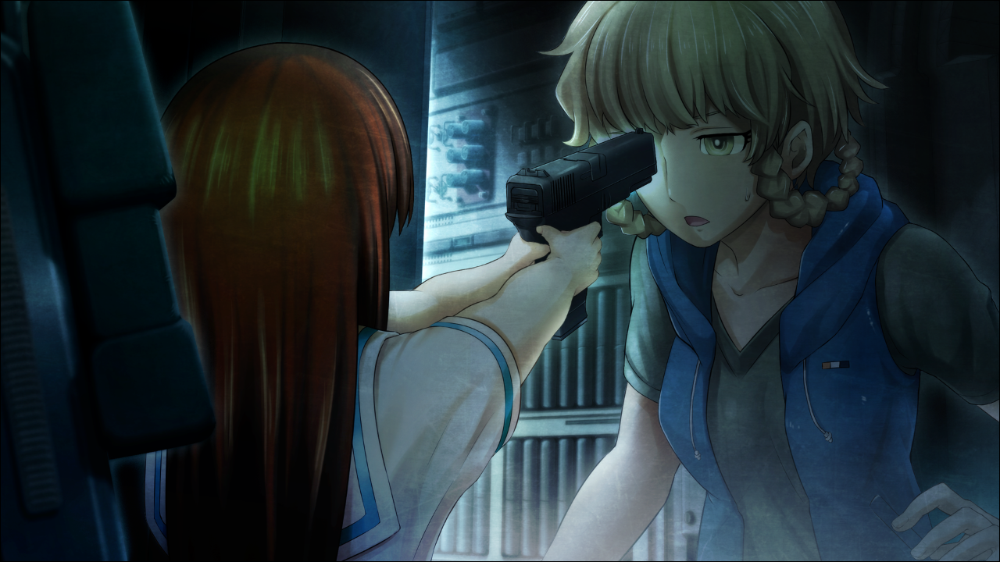

> <big> **私秘境里的圣痕 - 04** </big>  
> 1.129954  
> [ 1998/夏 铃羽视角 ] 与篝失散的那一天。——“听到了神的声音。”  

铃羽与椎名篝分别的那一天，天气很热。铃羽从附近商店补充了食物和水回来，打开时间机器的舱门后，听到篝歇斯底里的声音：  
“啊——真是的！完全搞不懂啊！”  
铃羽瞄了一眼机器的内部，发现篝正在用她的小手吧嗒吧嗒地使劲敲打着控制台。  
“你……在干什么？”  
“啊……”  
看着铃羽的脸，篝蜷缩起了身体。  
“不……不是的……这个是、那个……”  
“回答我。”  
“因、因为！因为！  
&emsp;&emsp; 醒来之后，铃羽姐姐你不在，周围好黑又没开灯，又窄又吓人又难受！  
&emsp;&emsp; 所以，我想把门打开……  
&emsp;&emsp; 然后，就在按着这里那里的时候……就变成了这样……”  
她这么说着，开始流下了一滴滴的泪水。  
“对不起铃羽姐姐，对不起。但是我真的好怕，所、所以……”  
“……这样啊。”  
铃羽解除了对篝的戒心。  
听说篝是战争遗孤，有严重的心理创伤，而且好像还没有完全治好。想起未来的真由理也说过篝特别害怕黑暗和封闭的地方，既然这样，篝会恐慌也是情有可原。而且，这台时间机器，没有铃羽的生体验证是无论如何也启动不了的。凭篝的力气，就算再怎么用力敲打，也破坏不了控制台吧。  
“你因为时间移动的冲击失去了意识。所以想让你休息就把你留在这里了……抱歉。”  
铃羽牵住篝小小的手离开了座位，把篝带到了机器的外面。  
“呜哇……好热……”  
“篝，我们说好了，不管发生什么事，都不能碰控制台的按钮。可以吧？”  
“嗯、嗯……”  
“那，我还有工作要办。你就在这边上休息——随便吃点喝点吧。”  

铃羽把采购回的食物递给篝之后，自己进入机器内部，把头探进驾驶座下面的储物仓，然后把保管在那里的IBN5100连接上从2036年带来的手机终端。虽然看起来像2000年初的手机，但是内部却是2036年的小型量子计算机。当然，这也是未来的桶子亲手制造的。  
启动IBN5100之后，手机终端的画面上开始罗列出让人眼花缭乱的数字。  
“在干什么？”  
篝从机器外面凑过来看。  
“学过‘千年虫问题’吗？”  
“在设施学校稍微学到了一点。最后什么都没发生对吧？”  
“表面上是这样呢。”  
“嗯……？”  
“虽然没有被公开，可是在当时，因为那个，很多国家和地区都产生了严重的问题。”  
“是……吗？”  
“产生问题根源的就是这种IBN5100电脑。  
&emsp;&emsp; 它应用了一种古老的编程语言，技术人员没有修复某个程序的问题。  
&emsp;&emsp; 或者说，他们完全不知道里面有一个使用这种语言编写的重要程序。  
&emsp;&emsp; 第三次世界大战虽然是以时间机器的竞争为开端的——  
&emsp;&emsp; 但更深层的原因可能是因为‘千年虫问题’产生的某个事象以及由此引发的分歧。”  
这种话题铃羽不觉得年仅10岁的篝能理解，所以她也没有深入说明的打算。  
“而且，公元2000年是一个特殊的年份。好像所有的世界线收束成了一个。  
&emsp;&emsp; 以此为关联，这个问题说不定会严重影响各条世界线因果。  
&emsp;&emsp; 我们作为目标的‘处于缝隙的世界线’——*Steins;Gate*，也不例外。”  
铃羽把视线转向连接着IBN5100的手机终端。  
“所以这是为了防止‘千年虫问题’的修正程序哦。”  
现在，她正在将修正程序转换成IBN5100专用语言。之后，再把这个程序以病毒的形式在全世界扩散，就能完全解除这个时代的工程师忽略的“千年虫问题”。
就在这时，手机终端的辅助画面显示了“CONNECT”这几个字母。  
“OK。连上了。”
听说这个时代的日本，ADSL线路还处于测试阶段，一般用户的网络环境应该是使用ISDN的低带宽网络拨号。但是类似秋叶原周边的大城市地区的大学和研究所，或者是PC相关企业的中心，已经配备了可持续连接的光纤宽带线路，其中有些设施甚至已经开始使用无线局域网了。铃羽侵入了其中一处。爸爸曾经嗤笑，在2036年的技术面前，20世纪末的网络防火墙就像纸一样。事实上也的确是这样。  
“但、但是……如果改变了未来，篝和大家在一起的未来世界……也会完全改变的吧……？”  
令人意外的是，篝好像粗略地理解了刚才铃羽所说的话。  
“没错。不会让那种世界存在了。我们就是为了通往*Steins;Gate*才来到了这里。”  
“……”  

突然，篝脸上不安的表情沉了下来。仿佛灵魂出窍一般，她缓慢地睁大了眼，面无表情。  

**“……声音。**  
**听到了……神的、声音……”**  

“篝？”  
“不行的哦。这样不好的哟……  
&emsp;&emsp; ……绝对不行的哦，铃羽姐姐。  
&emsp;&emsp; 不可以，那么做。”  
“喂？”  
篝的样子很怪。觉得可疑的铃羽，向篝那边伸出了手。  
但是。篝避开了铃羽的手。她用完全不像孩子的敏锐动作，用肩膀冲撞过来。  
“——啊！？”  
篝的速度一瞬间甚至超过了铃羽的反应，她眼看着对方的肩膀陷入了自己的胸口。  
“嘎哈！”  
铃羽受到冲击，倒在了驾驶座上，手里的手机终端也被篝抢了过去。她扯下了和IBN5100连接的电缆，两机的画面显示出了错误提示。  
“喂，你、在干什么——！？”  
篝没有回答痛苦中的铃羽的问题。这个时候，她正拿着铃羽放在驾驶座上的帆布背包，倒出了里面所有的东西。方便食物、小零件、衣服什么的和自动手枪一起散落在地板上。  
铃羽吃了一惊，因为篝明显是要捡起那件东西。  
“住手！”  
铃羽忍住痛苦，纵身向篝扑过去，却又一次被她不可思议的力量顶飞了。  

“……！”  
冰冷的东西顶在铃羽的眉间。  
“不许动！”  
篝握着自动手枪，小手没有一丝抖动。她在刚才那短暂的瞬间将枪的保险也打开了。见状，铃羽明白篝绝对不是在闹脾气。教会篝用枪的正是铃羽自己，所以她很清楚篝现在非常地冷静。  
“你是认真的？现在马上把枪放下！立即停止这种闹剧！”  
“该停止的是姐姐你！”  
“什么？”  
“不可以改变这个世界！姐姐说的话太奇怪了！”  
篝的眼里没有一丝动摇，只有坚持到底的决心。  
“那，就这样眼睁睁看着战争发生也无所谓吗？”  
“我才不懂那些呢！我只是想回到原来的世界啊。”  
“那个……已经不可能了。  
&emsp;&emsp; 我们已经用时间机器干涉了过去，世界线应该已经发生偏差了。  
&emsp;&emsp; 回到那里的可能性很低——”  
“吵死了吵死了吵死了！我绝对要救妈妈！  
&emsp;&emsp; 不能抹掉这个世界！绝对不会让你这么做的！”  
篝声嘶力竭地哭喊着，把枪口对准了IBN5100。  
“住、住手！”  
铃羽连阻止的时间都没有，篝不假思索地扣动了扳机。一枪，一枪，又一枪。  
“给我停下，篝！住手！”  

那之后，篝飞奔出了时间机器——  
——再也没回到铃羽的身边。  

 

> (to be continued)
---

| [←prev](./0039) | [home](../../) | [next→](./0041) |
