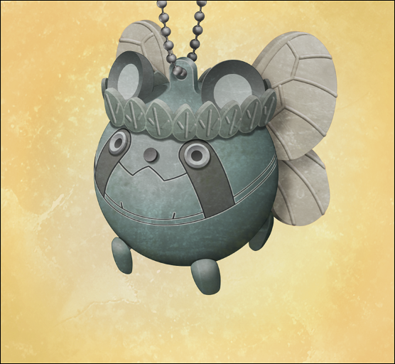
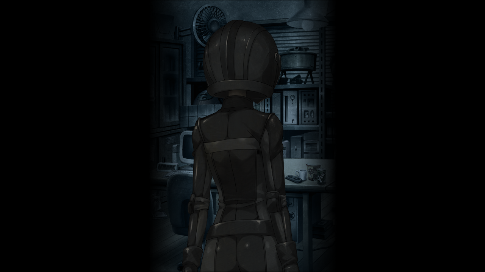
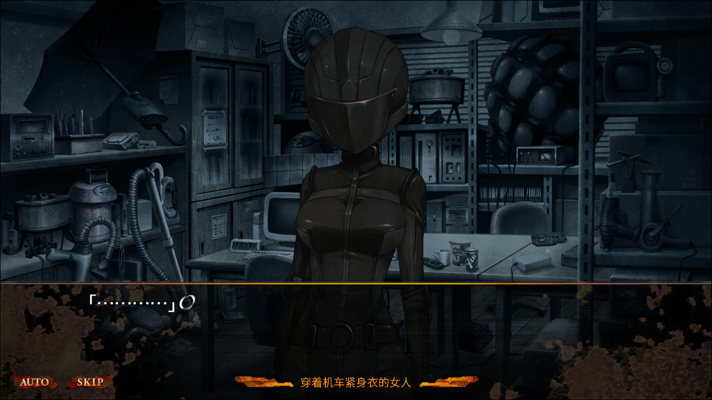
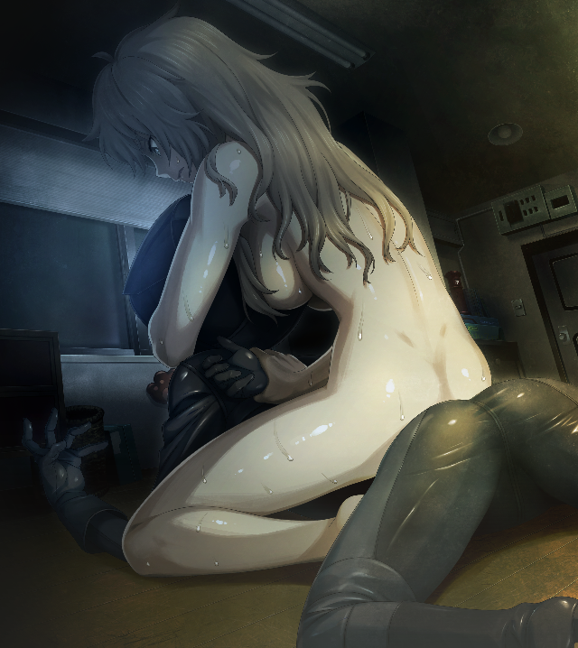

> <big> **私秘境里的圣痕 - 05** </big>  
> 1.129954  
> [ 2011/06/月末 铃羽视角 ] 篝为了找回挂坠在LAB袭击了铃羽。

铃羽没有一个晚上不想到篝。来到这个时代之后已经找了她一段时间了，结果没有任何线索。然而——现在应该已经22岁的椎名篝，毋庸置疑就在秋叶原。铃羽确信着这一点。  
就算再怎么想也没有用。铃羽转换心情，环视整个房间。身为父亲的桥田至一如既往地玩着登场人物全是女孩子的游戏。他半张着嘴，一幅呆呆的表情，一边挠着从衣服里面流出来的赘肉，一边操作着。这幅样子，不论作为父亲还是作为一个人类，都让人不太想尊敬。  
“话说，你跟妈处得还好吗？”  
“嗯啊？”  
“没问题吗？不会演变成我无法出生的情况吧？”  
“啊~怎么说~？这件事比制作时间机器还难吗？”  
“喂——！”  
铃羽忍不住逼近了桶子。  
“别搞砸了啊！爸爸！”  
“嗯、嗯……爸爸会加油的。”  
“一直都空口说白话，结果上次的电影票不也白白浪费了吗？”  
她指的是之前的圣诞节派对上，真由理和菲利斯在“作战”中特意准备的那两张电影票。  
“啊、那个啊，冈伦和吹雪氏不是突然晕倒了嘛？  
&emsp;&emsp; 那之后在忙着去探病之类的事情的时候，放映期就结束了……也是没办法嘛……”  
“但是听说在那之后，打算给你准备新的电影票，也被你拒绝了吧？”  
“等、听谁说的？”  
“当然是真由姐和留未姐咯。”  
“这、这个，那个哦，依靠真由喜和菲利斯碳的话，太没有男子气概了吧。
<abbr title="作认真状">*Kiri！*</abbr>”  
“所以呢？你自己有采取什么行动了吗？”  
“……”  
“啊~这样不行啊。”  
确实，这方面的问题说不定真的比时间机器的问题严重。铃羽感到头痛。  
“听好了，爸爸，我没办法一直对你说教下去知道吗？我也马上就要离开了哦？”  
“啊……”  
桶子垂下了眼，眼神突然变得很寂寞。  
“别摆出那样的表情。咱们都说好了吧？不会再迷茫了。”  
这半年，铃羽一直在反复思考，把这个世界线变成没发生过，真的好吗？  
但是每当这种时候，背后给她打气的不是别人，就是桶子本人和他说过的话。  
“对不起……”  
桶子失落的样子实在让铃羽看不下去，于是她用手掌拍了拍他庞大的后背。  
“别想这个了，快给妈妈发个邮件，问问她有没有空闲时间。  
&emsp;&emsp; 如果有空的话，就约她去看电影。”  
“欸——！？难度系数突然变得这么高！”  
“管它高不高，赶快去邀请她。听好了，这可是命令哦。”  
“命、命令什么的……”  
“回答呢？”  
“*Sir！Yes，sir！*”  
铃羽对他的回复很满意，于是转向卫生间，准备去洗澡。  
“啊，但是在那之前，让我稍微去一下便利店……”  
“……”  
“噫！不要瞪我啦！我会尽量吃不会发胖的东西啦，还请批准。”  
“……香草。”  
“嗯？”  
“我洗完澡之后想吃冰激凌。香草的。”  
“嗯，我知道了！我会给你买很多庶民平常完全吃不到的高级品哦！”  
“我不要那么多啦，一个就好。”  
“*Sir！Yes，sir！*”  
桶子一下子恢复了精神，拿着钱包飞奔出了LAB。  
“哎呀哎呀，难得需要他照顾呢。”  
铃羽正准备脱掉上衣去洗澡，但是……  
“铃羽——”  
原本已经出门了的桶子，突然又回来了。  
“怎么了吗？”  
“在楼梯那儿掉了个这样的东西。”  

是一个全身暗淡绿色的圆形卡通角色。那个是……乌帕。  
“你知道是谁的吗？”  
“不是真由姐的吗？”  
把脸凑近好好观察了一下——脑海中浮现出强烈的既视感。
“这个乌帕，好像在哪里……？”  
以前也看见过吗？但是完全想不起来是什么时候在哪里见到的。虽然如此，但铃羽的本能敲响了警钟。这个钥匙链一定是有着什么重大的意义的。  
乌帕本身是随处可见的东西。本体的塑料部分呈圆形，涂装本来应该是更鲜艳的颜色，但是已经严重褪色，并且遍布各类撞击的痕迹。不过，完全没有粘到灰和脏东西，不如说被擦得闪闪发亮，想必它的主人一定很珍惜吧。挂环的地方因为长年累月的老化，有个部分明显断裂了。想必这就是它掉落的原因了。  
“到底是哪里呢……我记得在哪里见过……”  
“让真由喜看看怎么样？”  
“也是呢……”  
铃羽目不转睛地盯着桶子里的乌帕——突然，铃羽的脑内灵光一闪，回响起了一位少女的叫喊声。  

“妈妈！！”  
“这是妈妈一直很珍惜的乌帕钥匙链哦~给你，要好好保管呐。”  

“……啊！！”  
铃羽不禁倒吸一口气，后背激起一阵难以名状的战栗。  
“莫、莫非……这个是……篝的……吗？”  
是那个时候——2036年8月13日，铃羽乘坐时间机器的那天。就是那时看到了这个乌帕。虽然比那天看到的旧了很多，记忆也有一些模糊了，不过没有错，这个就是未来的真由理交给篝的。幼小的篝在时间机器里看着它流泪的样子，铃羽也目睹了无数次。  
“你说的篝……难道是未来的真由喜的女儿？”  
“……嗯，”  
“找到她了？”  
“还没，不过对方好像知道咱们这里。”  
“所、所以说，这到底怎么回事啊？”  
“那家伙……在监视这个LAB。”  
半年前在广播馆屋顶上穿着紧身衣监视铃羽，被她发现追赶后却逃之夭夭的人，绝对是篝。从那之后，铃羽一直集中心思保护时间机器，附近再也没有发现类似篝的人物——铃羽压根就没想过，篝在监视LAB。
“不，稍微考虑一下的话这也是当然的事情。  
&emsp;&emsp; 那家伙，在阻止我们到达 *Steins;Gate*。  
&emsp;&emsp; 她不想把这个世界变成没有发生过。  
&emsp;&emsp; 也就是说，不止是我，爸爸你也被盯上了……？”  
“欸？我？”  
“不过，我觉得你应该没有……生命危险。  
&emsp;&emsp; 如果相信世界线的真理，你至少会活到2036年。  
&emsp;&emsp; 但是，为了阻止到达 *Steins;Gate*，她也可能妨碍你的研究。”  
最近在父亲，还有冈部伦太郎身边，总是接二连三地发生各种事件。父亲说不定成为了篝的目标。  
“从今天起，以防万一，我不在的时候要把门上锁啊。”  
“嗯、嗯。知道了哦。”  
“就算和冈伦叔叔、妈妈、或者真由姐在一起，也绝对不能把门开着哦。  
&emsp;&emsp; 最好把门链也拴上，算是心理安慰也好。”  
“但是啊，冈伦和真由喜他们俩姑且不论，和阿万音氏两人相处的时候这么做，  
&emsp;&emsp; 会不会产生别的奇怪的意思呢？阿万音氏不会误解什么吧？”  
“啊……那个确实。”  
“如果因此被讨厌了，就是咱们家的大危机了哦。”  
“唔……”  
铃羽为难地呻吟着。  
“你要是早点和妈妈在一起就什么问题都没有了……”  
“欸，结果还是绕回那个话题了吗！？”  
“总之还是需要多加注意啊。”  
桶子把绿色的乌帕钥匙链递给了铃羽。铃羽接过后一边注视着，一边试着用指尖触碰它。  
“呐——铃羽，篝碳虽然和真由喜没有血缘关系，但是她的女儿吧？”  
“是啊。”  
“那样的真由理抚养出的孩子，会变成袭击别人的恐怖的人吗……？”  
“……”  
“总感觉铃羽口中的篝碳和想象中的差别很大啊……  
&emsp;&emsp; 我还在想会不会是更加温柔一点，更软一点，更可爱的女孩子呢。”  
“如果是那样就太好了。嗯，我在之前也这么想。但是，现在的篝……可能……”  
看她当时的行动——从广播馆的屋顶逃走的动作就能知道，她绝对接受了专业的战斗训练。和铃羽教给还是小孩子的她的防身术程度不同，年龄增长之后的她被赋予的，是更加冷酷的杀人技术。从1998年行踪不明到现在，没有人知道她现在身在何处，到底经历了什么。但是，铃羽明白，她绝对是真心实意地在阻止自己的计划。  

（稍后）  

铃羽一边冲澡，一边叹了口气。水温因为是夏天，所以调的很低，接近常温水的感觉。冲洗脑袋的时候，一件件烦心的事情接连浮现，铃羽有种想把它们都冲走的冲动。她赶快双手拍了拍自己的脸，关掉阀门。贴满瓷砖的狭窄淋浴间内瞬间安静下来。在这悄无声息的环境中，铃羽用毛巾胡乱地擦了擦自己的头发。这栋楼最初建设的目的并非居住，所以生活空间非常粗糙，淋浴间外连更衣室都没有，只有用帘布隔开的空间，狭窄又没有窗户，蒸汽全部闷在里面，夏天会变成难以接受的桑拿房。桶子和冈部受不了这种闷热，所以貌似经常近乎全裸地坐在电风扇前。当然，这是屋子里没有女性以及漆原琉华时的限定行为。铃羽无法这么做。因为在胸口的地方有一个很大的伤疤，万一不小心被由季她们看见的话问题就大了。所以铃羽一直在这狭窄的空间里穿衣服。  
“……！？”  
从淋浴间出来的瞬间，铃羽察觉到了异样。帘布的外面——LAB房间里的灯没有亮。洗澡之前，LAB里面确实开着荧光灯，铃羽不记得把它关掉过。铃羽连内衣都没穿，直接拉开了帘布。她匍匐在地板上，借助从淋浴间漏出的灯光，警惕地环顾室内，但没有任何人的踪影，也没有有人潜入的迹象。  
爸爸又回来了一次……？然后在出门的时候，把灯关上了？  
不……不对……  
借助朦胧的光线，铃羽察觉到屋内被人翻过了，以普通人发现不了的细小程度。从桶子的电脑桌和沙发，到放杂志的架子和迷你厨房，全都有被人动过的痕迹。看来那开发室那边也一样吧。铃羽快速扫视了藏着枪的几处地方。最近的是平时当床用的沙发。铃羽把坐垫的里面弄破，藏了一把防身用的手枪，以便在睡觉的时候被袭击能够迅速反应。因为是防身用的.32口径，所以如果打不中的要害的话威力很弱，但是它尺寸很小巧，而且声音比较安静，最适合现在的场合。铃羽全身的肌肉像弹簧一样绷得紧紧的，屏息着向沙发靠近。她一边移动，一边注意周围的动静。开发室深处传来了一个微小的声音，普通人会漏听的，小小的地板的吱吱声。但是对铃羽来说，这就足够了。铃羽一瞬间从刚才的“静”切换为猛烈的“动”。她一口气跳到沙发上，迅速拔出手枪，随即借势躲到了冰箱这个掩体后面。这个位置能正好透过开发室帘布的间隙看到里面。  

室内再次鸦雀无声。但是和刚才完全不同，开发室里的入侵者好像也不再隐藏自己的气息了。  
“如果你耍花招，我就开枪。把双手放在脑后，慢慢走出来。”  
铃羽沉着嗓子威吓对方，但是对方没有表现出丝毫动摇，缓慢地将全身暴露在铃羽的视线里。  

“哼，大热天的，真亏你能穿成那样呢，至少把头盔摘掉如何？”  
对方和当时一样穿着紧身衣，就连头盔也没变。完美贴合曲线的皮革，勾勒出凹凸有致的黄金比例身段。毫无疑问是女性。  
“你要找的东西不在那里哦。在我外套的口袋里。”  
铃羽指向淋浴间的入口，刚刚脱下的衣服都凌乱地堆在那里。  
好像被抓住了弱点，穿紧身衣的女性把头扭向那边。但由于头盔的遮挡，并不能看见她的表情。  
“呐？弄丢了可不好哦，这可是妈妈送给你的重要的东西吧？**篝**？”  
话音刚落，那名女性——椎名篝率先采取了行动。她拔出藏在腰后面的那把经过消光处理的军用匕首，撞向铃羽怀里。铃羽为了不击中要害，向她的脚按下了扳机。伴随.32口径的枪口发出轻盈的枪声，篝失去平衡跌向地面——然而这完全是假动作。篝假装失去平衡，却绕过铃羽向淋浴间冲了过去。看来她想要先发制人夺取目标物品。  
“这是！？”  
开枪后，铃羽立刻察觉到，即使是.32口径的枪，后坐力也不会这么小。  
她又开了一枪，果然对篝的动作毫无影响。  
(空包弹！？怎么回事！？）  
铃羽手中的枪不知道什么时候被替换成了空包弹匣。  
篝抓住铃羽这一瞬间的动摇产生的破绽，把手伸向了淋浴间前的外套。  
“可恶！”  
铃羽放弃射击，把枪投掷出去。一声钝响，击中了篝的脖子。她踉跄了一下，没能抓到外套。  
“唔咕！！”  
头盔中，篝第一次发出了沉闷的声音。铃羽朝她飞踢过去，毫不留情地用绷紧肌肉的腿踢向了趔趄的篝。被踢飞的篝，借势滚到了房间的角落。她应该已经断了几根肋骨才是——铃羽对自己刚才的发力有把握，打算乘胜追击。但是篝以可怕的爆发力迅速起身，向铃羽猛冲过来。这反击来的太快使得铃羽无法立刻调整动作——  
“呃哈！？”  
刀尖的轨迹离铃羽裸露的腹部仅有几厘米。回避动作慢上零点几秒，就会划破肠子，造成致命伤。  
“你个混蛋！！”  
铃羽非常生气。这家伙毫无疑问是打算杀了我，她的动作里没有任何的犹豫。  
铃羽后退了一些，同时寻找着能作为武器的东西。但是，恐怕其他隐藏的枪也被做了手脚，替换成了空包弹。搞不好，也许连护身用的匕首也全部被拿走了。既然这样，剩下的就是——铃羽悄悄瞥向了厨房里摆放得很整齐的几把菜刀和小刀，是由季为了教真由理料理特意买来的。但是，篝也已经注意到了它们，移步挡住了铃羽的移动路线。  
“嘿，很老练嘛。完全不像是那个在时间机器里哭哭啼啼的小孩，真让我吃惊啊。”  
铃羽一边挑衅，一边对峙着沿着墙壁慢慢移动。她被激起了战斗欲，准备扭转不利的局面。  
“看，篝，你是想要这个吧？”  
铃羽移动到淋浴间前，捡起外套，拿出了口袋里的绿色钥匙圈。  
篝的呼吸混乱了起来，发出了似是愤怒似是不甘的呜咽。  
“怎么了？不来拿吗？”  
铃羽的手指动了动，像是要碾坏钥匙圈。  
篝反应很大，自现身以来第一次表现出头盔也掩饰不住的心情波动。  
“……哼。”  
下一瞬间，铃羽把钥匙圈向着篝的腹部轻轻地抛了过去，仿佛朋友间的传接。钥匙圈在空中慢慢地画出一道抛物线。再强大的人，看见自己重要的东西被如此抛来，都会本能地想要用双手小心地接住。篝即使受过训练也没有胜过这种本能，举着刀的右手和左手一起，紧紧地握住了母亲的遗物。  
“嗬呀——！！”  
与慢悠悠地抛物线运动同时进行的，是铃羽迅猛地冲拳。她的右拳深深地陷进了篝的腹部，接着左勾拳全力打在篝的头盔上击倒了她。头盔下沉闷的痛呼、右肩触地脱臼以及匕首落地的声音相继传来。铃羽趁势跨坐在篝的背上，反扭住她的右臂，同时左臂绕前勒紧了她的脖子。  

“唔、咳、咳……！”  
耳边听到篝从喉咙发出的呻吟。  
嘎吱……嘎吱……  
手臂传来篝的颈骨发力扭曲快要碎裂的触感。  
“给我老实点！我不会杀你的！”  
但是，篝以这种极不自然的姿势，用唯一自由的左手抓起掉在地板上的匕首打算刺过来。  
铃羽不得不再加大力度勒紧她的脖子。  
“咳、咳……！”  
“别再抵抗了！篝！现在的我明白你的心情了。但是，这样果然错误的！是错的啊！”  
就算是这样劝说，篝依旧没有放弃抵抗——反而将全身的力量用到极限，想要把铃羽甩开。  
（这，这家伙！？到底是经历过怎样的训练啊！？）  
根据以往的作战经验，无论多么坚强的士兵，在这种被控制住要害即将晕厥的时刻也是会屈服的。铃羽不寒而栗，又加大了力度。再这样下去，恐怕就不止勒晕，而是真的会勒死篝的。但是，如果解开束缚的话，自己肯定会被攻击甚至被杀。到底该如何是好——  
“铃羽、姐姐……痛……好痛……”  
这时，悲伤的声音从头盔里传了出来。铃羽不由得放松了警惕，双手的力道也减小了。  
然而——篝明显算计到了这些，用尽全力将匕首刺向铃羽松弛下来的左手腕，迫使她放开了手臂，并借此机会翻身将她从背上甩下，然后双腿蹬着她的腰部踹飞了她。  
铃羽的后背猛烈地撞在了电脑桌上，一瞬间无法呼吸。她倒在地上，头顶上的显示器和打印机等东西掉落下来，无情地殴打着她的赤裸的身体。  
“呼、咳、咳咳……！”  
“哈！嗬！呃嗬……！”  
两人都气喘吁吁地艰难地站起身，继续对峙着。  
篝的右臂无力地下垂，完全朝相反的方向扭曲着，恐怕暂时是废了。但她的左手扔紧握着匕首。  
“你这家伙，连这种阴招都学会了吗……”  
铃羽恶狠狠地瞪着头盔面罩，仿佛想要看清那下面的篝成长后的变得丑恶的嘴脸。  
两人维系着暂时的沉默，调整着呼吸。气氛紧张得连一根手指都不能轻易动作。汗从额头流下，流进了眼睛里。尽管如此，铃羽眼也不眨地等待着对方下一步的行动。  

打破此刻平衡的，是开门的声音。  
“喂，铃羽？刚才里面传来了好大的声音啊？”  
听到那个声音，冷汗遍布了铃羽的后背。  
“咦，怎么黑乎乎的？”  
“不行，爸爸，别动！”  
铃羽喊话的同时，桶子点亮了房间里的灯光。由暗到亮的转变让铃羽暂时失去了视野，篝却因为戴着头盔占据了优势，抢先铃羽一步到达了桶子的身边。  
“呜哇！？”  
桶子被突然出现在眼前的陌生人和她手里漆黑的匕首吓到而发出惊呼。  
“爸爸！！”  
“咦？呀！呀啊——！！”  
刀刃抵在了桶子因为恐惧而僵直的脖子上——篝绕到了桶子背后，用他的身体作为巨大的盾牌。  
铃羽向他们慢慢逼近，紧咬着牙齿，发出冰冷到极点的低吟：  
“放 手，篝……你要是敢伤到我爸一根汗毛……就算是你，我也真的会下杀手。”  
“……”  
但是，篝沉默不语，缩在人质背后退向门外。然后，在下一个瞬间，全力撞向了桶子巨大的后背。  
“啊！！！”  
桶子失去了平衡，将铃羽压倒在地上。桶子勉强用四肢支撑起全身,铃羽才没被压扁。  
“起开！”  
铃羽有点强硬地推搡着桶子的大块头。因为太重，桶子费了很大功夫才翻到一旁。  
“跟你说过多少次了叫你减肥！”  
“欸欸欸……”  
这样下去要被她逃了。铃羽立刻起身，就要飞奔出去追篝。  
“——铃羽，穿上这个！”  
坐在地上还来不及起身的至，抓过一件T恤扔给全裸的铃羽。  
铃羽接过麻利地套上，立即追了出去。  

可惜，在周围环视了一圈，连影子都没有了，连她是向哪个方向逃跑的都无法判断。  
“……让她溜了。”  
事已至此，盲目地在附近到处寻找反而危险，她有可能趁着空档返回实验室偷袭桶子。  
“刚才的那人，难道是……篝碳？”  
桶子随后也来到了外面。  
“……嗯。大概没错。”  
“这样啊……”  
“结果，那孩子，变成了这样啊……”  
铃羽的身体遍布钝痛，但相比之下内心的自责带来了更为强烈和沉重的痛楚。  
“我啊……真的很喜欢……那孩子啊……”  
“嗯。”  
“虽然很娇小，但是很勇敢，一直在努力保护真由姐……  
&emsp;&emsp; 我也教过那孩子各种东西，一直……把她当成妹妹一样。”  
“嗯。”  
“但是，她已经……完全是敌人了。”  
桶子帮衣着凌乱的铃羽整理了T恤的下摆。  
“现在的铃羽，就像是工口游戏里的痴女角色一样的造型哦。”  
“欸？啊—”  
桶子突然提起不相干的话题，让铃羽懵住了。  
<abbr title="os：这部分难道不值得一张CG吗 @5pb">
确实，现在的铃羽像是穿着一件迷你连衣裙一样。T恤从肩膀滑了下来，差点露出胸部；下摆也卷了起来，几乎要被窥见隐秘部位了。  
</abbr>
“嘛，痴女也蛮对我胃口的，不得不说不修边幅的裸体单穿T恤造型相当不错的。嘿~嘿~”  
“又在说这样的胡话。你刚才搞不好就受重伤了。”  
铃羽不满地抱怨着，桶子却摇了摇头：  
“我啊，虽然那时候看见刀忍不住叫了出来，不过想想其实没有必要害怕……  
&emsp;&emsp; 那时，如果不是我听错了的话——”  
桶子用手指摸了摸脖子，刚刚匕首抵住的位置。  
“被刀抵着的时候……虽然很小，但是我听到了——”  
“什么？”  
“她……大概……在哭。”  
“……欸？”  
哭了……？  
在那个头盔里面？  
在和我激烈搏斗的同时也在哭泣着吗？  
拿着匕首抵在父亲的脖子上威胁的同时也在哭泣着吗？  
究竟是，为什么啊——  
“所以啊，现在就认定她是敌人，是不是为时过早了呢？”  
“……呼……爸爸。”  
“哦？”  
“冰激凌，买来了吗？香草的。”
“啊，当然了。”  
“好想吃啊……我……稍微有点累……了……”  
话还没说完，铃羽就失去力气向前倾倒。  
“哇？！”  
桶子吓得赶紧扑了上去，在她倒地前用厚实的身体抱住了她。  
“喂、喂，铃羽？”  
“啊，不好意思……没事的…………不过……稍微…让我休息会儿……”  
这句话用尽了她最后一丝力气。  
铃羽就这样在父亲的怀中，闭上了眼睛——失去了意识，瘫软下来。  

 

> (to be continued)
---

| [←prev](./0040) | [home](../../) | [next→](./0042) |
