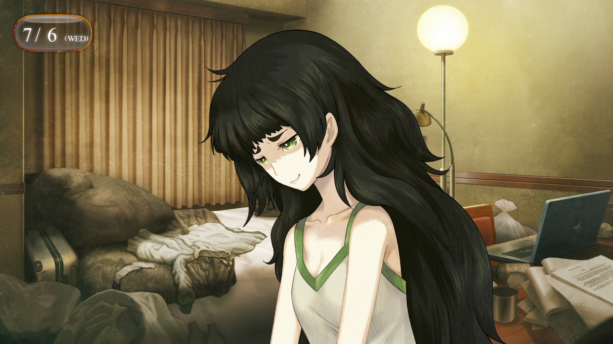
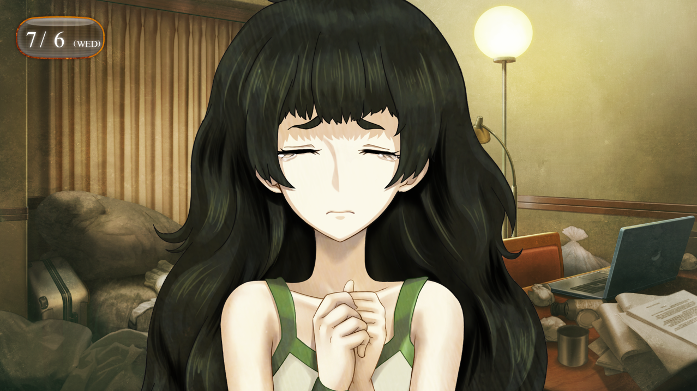

> <big> **私秘境里的圣痕 - 08** </big>  
> 1.129954  
> [ 2011/07/06 ] 冈伦告知真帆（洗脑）真相，所有情报泄露。  

位于和光市的【脑科学综合研究机构·日本办公室准备室】与半年前相比没有任何变化。还是一样大得离谱，空空荡荡的，摆放着许多没有人使用的办公桌。桌面上的灰尘……好像比之前更厚。半年前，雷斯吉宁教授他们从这里搬走之后，这里一直没有其他人使用了吧。  
“特地把你叫过来真是不好意思啊，*Rintaro*。”  
“啊，没什么。”  
登录『Amadeus』的APP需要更新为最新版本，因此我在大学的课结束后赶到了这间办公室。现在，真帆正为了更新而将我的智能手机连上数据线，用PC操作着。说是差不多10分钟就能完成更新了，于是就发着呆等着。  
“话说，*Rintaro*，我想以前也提到过，要不要认真地考虑下留学的事？”  
“哎！？”  
“你觉得没问题的话，我可以帮你写个推荐信。当然，也需要通过测试和面试。”  
我慌张地摆正姿势。  
“那个，真的是非常感谢您……  
&emsp;&emsp; ……但是我想以我现在的学习水平可能有些困难。  
&emsp;&emsp; 我是真心以维克多·孔多利亚大学为目标的。所以，绝对不想失败。  
&emsp;&emsp; 因此，我认为至少还要用一年的时间来专心学习才行。”  
雷斯吉宁教授微微嘟着嘴唇，听着我语无伦次的说明。然后，过了一会儿——  
“*OK, OK！*”  
他拍了拍我的肩膀，露出满意的笑容。  
“你果然是个非常深思熟虑的青年啊。”  
“是、是么？我还是第一次被这么说呢。”  
嘴上说着简单，其实，或许我只是胆小。  
有时候是需要不畏挫败踏前一步的勇气的。  
现在的我……怎么说呢……  
“那么，挑战留到明年吗？”  
“是呢……”  
机会……就这样错过了吧……雷斯吉宁教授愿意等我到明年吗？心中荡起了不安。  
“太过钻牛角尖也不好哦。  
&emsp;&emsp; 如果，来大学参观一下，也有助于 *motivation*（行动力）的 *up*（提升）是吧。”  
“参观……吗？”  
“如果时机合适的话，旅费我来出，要不要来看看啊？”  
“能为我考虑这么多……非常感谢！”  
“当然，我下一次什么时候回美国，具体时间还无法确定呢，*HAHAHA~*”  
“好的！”  
我低头鞠躬，打从心底里表示感谢。能与这个人相遇，是我人生的一大幸运。  
“…………”  
无意中，我与真帆的视线对上了。她立刻错开目光继续低头工作。  
不知为何，我总觉得真帆的微笑的表情中掩藏着些许的悲伤。  

真帆住宿的地方是一家商务酒店，距离和光市数站电车。果然还是对半年前的酒店避而远之。  
“虽然说有点远不太方便呢……”  
“话说，稍微整理下如何？”  
这才来日本几天，房间居然已经乱到这种程度……  
“整理？我只是以让自己生活最有效率的位置摆放而已。”  
这么说来，她也拒绝了酒店客房服务的床铺整理等清洁工作吧……  
“前辈就是这样粗枝大叶，才至今都找不到男朋友哟。”  
我的智能手机里传来了“红莉栖”无奈的声音。  
APP升级结束后，『Amadeus』一直启动着。  
“啊…多管闲事！”  
“房间这样的惨状还邀请别人做客……通常来说都会羞耻得做不到的。”  
“唔……”  
不过，我本人也不擅长整理，这方面还是别说太多了。  
“那么，和我要说什么？”  
我会来到这里，是因为真帆说“有话要说”。就我个人而言，在办公室说也没关系，但是真帆坚持主张要到酒店房间两个人单独谈。倒是完全不担心会有什么不轨的企图，真帆不是那样的人。相处了将近半年，这一点我是明白的。  
“……”  
真帆看起来难以启齿。  
“还没有听你说过……  
&emsp;&emsp; 关于红莉栖事件的……真相……”  
“啊…！”  
我立刻关掉了『Amadeus』的APP。  
“另外……也想问下关于时间机器的事。”  
“时间机器？”  
“红莉栖与中钵论文有关，这么说的是你哦。  
&emsp;&emsp; 呐……那孩子她……真的和时间机器……？”  
“……”  
我该怎样回答呢？  
半年前，真帆曾经试图破解红莉栖的笔记本电脑和硬盘。为了阻止她，我也考虑过在合适的时机把经历过的事说出来。结果，因为各种情况，错失了那个机会。可是现在不一样。红莉栖的笔记本电脑和硬盘已经不存在了，事到如今不该再把这事翻出来。  
但这时,真帆说出了让我意想不到的话。  
“其实，这半年来，我在研究原本的课题同时，也在一直研究着时间机器。”  
“……你说什么？”  
“如果红莉栖做到了，那么我也……我是这么认为的。  
&emsp;&emsp; 一种扭曲的对抗意识吧……说不定也是在赌气。  
&emsp;&emsp; 但是，但是啊，  
&emsp;&emsp; 如果能够做出时间机器的话……或许能够拯救红莉栖——”  
“快停下！！”  
“……！”  
这是最坏的情况……  
事到如今又要折返回去？  
不止如此，真帆对红莉栖的执着不比我少。  
“不要想这些蠢事！”  
“……冈部先生？”  
“不要去想，能拯救牧濑红莉栖什么的。  
&emsp;&emsp; 这种可能性，是零！  
&emsp;&emsp; ‘神的法则’绝不允许这种事。”  
“果然……你，绝对知道些什么吧？”  
真帆逼近过来追问着。  
“难道说……已经实现了？红莉栖完成了时间机器吗？  
&emsp;&emsp; 你已经乘坐那个，进行了人类首次时间旅行了吧？一定是那样的！”  
“……你是有什么依据，才这么说的吗？”  
“……！”  
我强装镇定的样子进行反驳。真帆闻言低下了头，似乎也惊讶于自己会说出那样的话。  
“……对不起。我…感觉自己有哪里不太对，居然说出这样的妄想……呜……”  
“比屋定小姐！？”  
泪水从真帆眼中涌出。她突然在我面前哭了起来，让我不知所措。  
“我到底是怎么回事……突然就……  
&emsp;&emsp; 明明没想哭的……  ”  
真帆一脸困惑地用手指擦拭着从眼中涌溢而出的泪水。  
在我看来，她的情绪相当不稳定。相比之前，好像内心脆弱的一面更加显而易见。感觉她的精神已经被逼得走投无路。是半年前被卷入各种事件中的影响吗？视频聊天的时候，完全看不出来她有这样的一面。  
我应该，说出来吗？  
开始着手进行时间机器的研究，是个不好的征兆。之后，她应该就会自己开始这样那样的调查，然后有可能一不小心踩到地雷。既然如此，看来我应该告诉她自己经历过什么从而选择放弃，让她也就此收手。  

“……我知道了。  
&emsp;&emsp; 就把我的经历告诉你吧。  
&emsp;&emsp; 绝对，不能和任何人透露。  
&emsp;&emsp; 另外，关于这个再强调一次，  
&emsp;&emsp; 不要想着去拯救牧濑红莉栖。  
&emsp;&emsp; 可以吗？”  
“…………”  
真帆擦拭着眼泪，轻轻地点了点头。  
我给她讲了——  
我在α世界线经历的事、时间机器的事、*Reading·Steiner* 的事。  
被我们称为时间跳跃的，只有记忆穿越到过去的事，以及红莉栖成功开发了时间跳跃机的事。  
还有自称约翰·提托的，来自2036年的时间旅行者阿万音铃羽的事。  
最后就是铃羽说到的未来，会第三次世界大战的事。  
我告诉她，那场战争的导火索，就是时间机器的开发竞争。  
我平静地给她讲述了这一切。  
可是红莉栖死亡现场的情况……无论如何也说不出口。  

听完所有事的真帆，沉默着陷入了沉思。  
过了一会儿，她长长地叹出一口气，满脸苦涩，用手指揉着太阳穴附近。  
“头，好痛……”  
“你没必要全部相信。  
&emsp;&emsp; 认为我脑子有问题也没关系。  
&emsp;&emsp; 但是，如果你想继续研究时间机器，想着拯救红莉栖的话，  
&emsp;&emsp; 我会不择手段地组织你的。  
&emsp;&emsp; 所以，不要再有那些奇怪的想法了。  
&emsp;&emsp; 不要自己逼自己了。”  
真帆抬起手制止我继续说下去。  
“让我稍微整理下。你所说的 ‘*Reading·Steiner*’，  
&emsp;&emsp; 不就新型脑炎吗？和雷斯吉宁教授说到的症状一样啊……”  
“是……是的，或许就是这样。  
&emsp;&emsp; 我还在犹豫，该不该对雷斯吉宁教授说，  
&emsp;&emsp; 说不定会导致无谓的混乱……  
&emsp;&emsp; 你怎么认为？”  
“……别问我。”  
真帆还在用指尖揉着太阳穴附近。  
“说的也是。抱歉。”  
“你真的破坏了红莉栖的笔记本电脑吗？”  
“是的，破坏掉了。”  
“里面呢？看过了吗？”  
“不知道破解方法，没办法看。”  
听说桶子也举手投降了，那我怎么可能破解得了。  
“你读过红莉栖写的关于时间机器的论文原稿吗？”  
“没。”  
真帆一个接一个地向我抛出问题。不知为何，她给我的感觉，好像有些急躁。  
“你知道红莉栖是如何完成时间跳跃机器的吗？”  
“大致上吧。”  
“能重现出来吗？”  
“不好说。如果有桶子的帮助的话，或许……”  
“能行，对吧？”  
“我一个人的话很难。”  
“再加上我呢？”  
“不要想那种事！”  
“……”  
这时真帆忽然表情扭曲，十分痛苦的样子。认真看发现，她的脸色非常不好。  
“比屋定小姐，没事吧？稍微躺一下吧？”  
对于我的提议，真帆摇了摇头，然后继续提问。  
“时间机器，现在，在哪里？  
&emsp;&emsp; 就是铃羽乘坐来到这里的那台，现在在哪里？”  
“这……”  
“在哪？”  
我有些迟疑。没有铃羽的许可，这个问题该不该告诉她呢……  
“……秋叶原。”  
被真帆用哀求的眼神直视着，结果我还是回答了。  
“在广播馆的楼顶。现在也在那里。”  

“这样啊……”  
真帆不知为何失落地垂下了肩膀，低头嘟囔着。  
我本来已经做好了心理准备，她的下一句说不定会是“让我亲眼看看吧”。  
不过她停止了问话，满脸不舒服的表情。  
“真的没事吗？”  
我伸手扶住她的肩膀，凑近看看她的脸色。  
“今天还是先休息比较好——”  
“嘿——！”  
一切发生得很突然，真帆柔弱的身体用尽全力地撞过来，把我逼到了墙边。  
“干、干什么——”  
在混乱之中，她用手臂扼住我的喉咙，手臂的骨头压迫着我的气管。  
“咕呃……！！”  
无法呼吸，也无法出声。不明所以的我扭动着身体想要抵抗。于是真帆用另一只手猛地抓住我的头，使劲将我的后脑挤在墙上。  
“啊……呃……！！”  
她的力量相当惊人。体格上明显是我占优，但是却无法从禁锢中逃离。  
“真可惜，冈部先生……”  
真帆的这个声音，非常低沉，非常冰冷。  
霎时，又转为痛苦的呜咽声，表情也扭曲着。  
“咕……唔……头…要裂开了一样……”  
那眼中又滴下了眼泪。  
“为什么……  
&emsp;&emsp; 为什么要……告诉我啊……  
&emsp;&emsp; 你……应该……闭口不谈……的！”  
“啊……啊……！！”  
无法逃开……虽然扯着真帆的长发试图挣脱她，但她完全没有松手，就像感觉不到疼痛一样。  
我挣扎着从口袋里取出了从刚才开始就一直在振动的智能手机，用手指在屏幕上摸索着。  
——快回应我, “红莉栖”。  
“冈部——！？”  
“啊……‘红莉栖’……”  
意识逐渐模糊。  
就要死在这里了吗。  
在不知道为何真帆会对自己下杀手的情况下，就这么死去——  
只是……  
全力抵着我脖子的真帆脸上却一直挂着痛苦的表情。  
又在流泪了。  
就这样，分不清这泪水是出于真心还是演技，我失去了意识……

 

> (to be continued)
---

| [←prev](./0043) | [home](../../) | [next→](./0045) |
