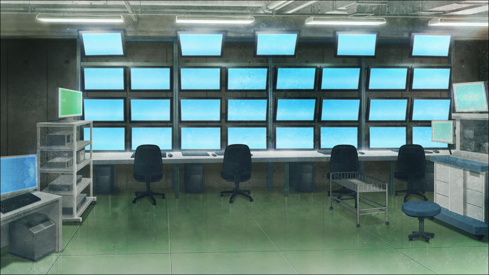
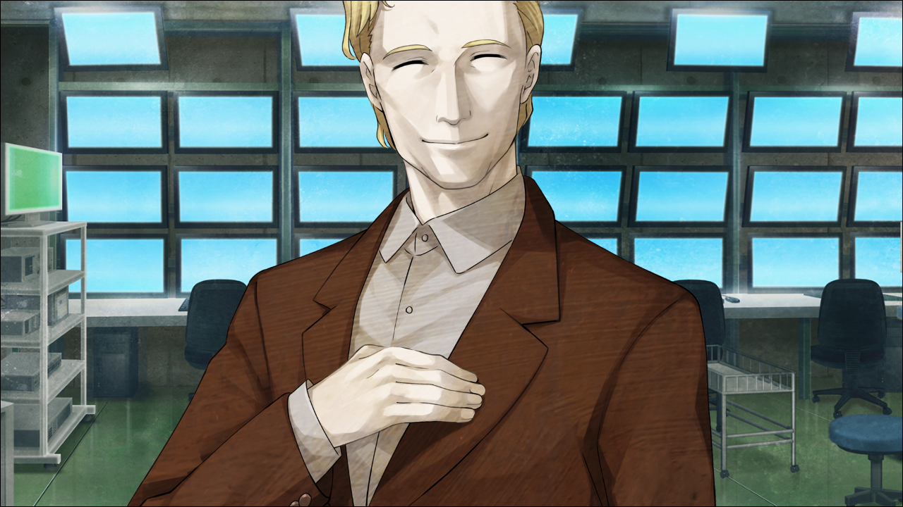

> <big> **私秘境里的圣痕 - 09** </big>  
> 1.143688  
> [ 2011/07/07 ] 确认雷斯吉宁STRATFO身份。  

伴随着喉咙中涌动的疼痛醒来。  
“咳，咳咳……”  
正想要捂住嘴，但手像是被什么东西拽着无法动弹。  
慢慢睁开眼睛，首先看见的是自己的腿，同时也理解了自己被绑在椅子上这一状况。手腕被扎带固定在扶手上，
随意乱动的话，扎带会勒进皮肤带来剧烈的痛感。  
慢慢抬起头，环顾四周。从未见过的房间，周围并排放置着让人误以为这里是医院手术室的设备，而墙壁上整齐地排布着许多显示器，感觉像是警卫室或者监控室。没有看见窗户，所以完全不知道这是哪里。  

“有、有人……吗……”  
声音极度嘶哑，喉咙随着发声又传来一阵痛楚。于是我紧接着回想起真帆对自己下杀手的事情。为什么她会做这种事？比起愤怒，心中现在更多的是疑惑。  
“哟，*Rintaro*，醒了啊？”  
伴随着脚步声，昏暗的灯光下浮现出一个巨大的身影。我记得那个声音。  
“欸……？雷斯吉宁……教授……？”  
“感觉怎么样？要是口渴的话，我会让人准备水的。”  
仔细一看，在场的并不只有雷斯吉宁教授一人。他的身后，数位身着黑色西装的男人一言不发地伫立，紧紧地盯着我。所有人都拿着手枪。他们那类似
<abbr title = "Men In Black。参见电影黑衣人">
MIB
</abbr>
的打扮，让我回想起半年前在桶子的店里遭遇的那群外国人。或者说，这跟那时候的是同一群人？  
“这……究竟是……”  
虽然有成堆的问题想问，但首先无法理解的是，为何雷斯吉宁教授看到我现在的处境却没有伸出援手。当然，最恰当的答案显而易见——把我关在这里的，就是雷斯吉宁教授本人，真帆是听从教授的指示把我捉住。然而，我并不愿相信这个事实。  
“这里…究竟是哪儿……？”  
所以我只能问出这种蠢问题。  
“我的眼光果然没错。  
&emsp;&emsp; 你简直就是‘情报’的宝库啊。  
&emsp;&emsp; 就目前的情况而言，说你的价值与合众国总统不相上下也不为过。”  
教授并没有回答我的问题，而是如此说着，一脸满足地微笑着。  
警报声响彻脑海，对雷斯吉宁教授的戒备心正在逐渐加强。  
“我……被监禁了吗？”  
“与其说是‘监禁’，‘保护’这种说法更为恰当。  
&emsp;&emsp; 假如你的价值被公之于众，你会被无数人盯上呢。”  
“这是雷斯吉宁教授……你的指示吗？”  
“没错，我认为这是最妥当的做法。  
&emsp;&emsp; 我从 *Maho* 那里了解了你所拥有的‘情报’啊。”  
“比屋定小姐在哪？”  
“应该在酒店里休息着吧？”  
“比屋定小姐，是为了从我这里套出情报而接近我的吗？”  
“最初不是这样的哟。但从结果来看，还是变成这样了呢。”  
“你也是吗……？  
&emsp;&emsp; 对我这么热心，也是出于算计的吗！？  
&emsp;&emsp; 你，到底是什么人！？”  
“嘛嘛，别激动嘛。以前跟你说过的吧？  
&emsp;&emsp; 科学家必须时刻保持冷静。只有在试验成功的时候才能大喊大叫。”  
“嘁……”  
反倒被一脸镇定的雷斯吉宁说教了。被人背叛的心情逐渐扩散开来。愤怒，懊悔，悲伤。各种感情交织令我要紧牙关。雷斯吉宁并不在意我的态度，转身对身旁的那群男人用英语下达了简短的指令，让他们去隔壁房间。现在这里就只剩下我和雷斯吉宁。  
“那么，*Rintaro*，我来告诉你我的另一个工作吧。”  
“……另一个工作？”  
我回想起以前跳到其他世界线发生的事情。自卫队在美国组织的要求下要把我交到他们的基地，这是从下山那里得到的消息。  
“<abbr title="美国中央情报局（Central Intelligence Agency）。直属美国总统的情报机构。为了保证美国的国家安全，从事外国谍报、情报收集、政治工作等活动。据说参与了很多历史事件。
——来自游戏Tips。">
CIA
</abbr>？
<abbr title="美国国家安全委员会（National Security Council）。就美国国家安全政策向总统提供建议的白宫直属机构。由总统、副总统、国务卿、财政部长、国防部长组成。
——来自游戏Tips。">
NSC
</abbr>？”  
雷斯吉宁对于我的猜测还以苦笑。  
“被当成和他们一类真是令人遗憾啊。他们只是一群无能的公务员集合体。  
&emsp;&emsp; 你知道
<abbr title="(虚构)战略焦点社（Strategic Focus）。美国私人情报机构，也被称作“影之CIA”。其运用独立的信息网，收集和分析世界的安全信息，受雇于众多知名企业和军事组织。
他们本质上是盈利企业，根本上来说，和目的是破解极机密情报的“匿名者”，或是由那些义愤填膺的密告着公开资讯的“维基解密”组织的理念及方针是有差异的。
并且，在美国德克萨斯州还实际存在着贩卖情报的“战略前瞻公司（Strategic Forecasting， Inc.），但是这个公司与他们无关。
——来自游戏Tips。">
‘*Strategic Focus*’
</abbr>
这一美国私人情报机构吗？”  
“*Strategic Focus*”？  
接着，脑中突然闪过数个新闻报道。那是过去中二病全开时期在一个阴谋论整合网站上看到的。  
“STRATFO！？”  
据说，他们轻易地弄到了连CIA都难以获取的俄罗斯弹道导弹的最高机密情报并拿去交易。CIA为此事颜面扫地，同时也动摇了俄罗斯军队的战略根基。还有传闻说，在海湾战争和伊拉克战争中，他们赶在各大组织之前率先获取了所有参战国的军事情报，根据需求散播到全球各地。全世界都称呼其为“影之CIA”。  
“你是…那个STRATFO的人……？  
&emsp;&emsp; 可你不是脑科学研究所的主任吗……”  
“当然，那个才是我的主业，毋庸置疑。  
&emsp;&emsp; 话说回来，我常常会听人提倡这种论调：  
&emsp;&emsp; ‘人类是一群会杀戮的猴子，  
&emsp;&emsp; 只有人脑会因为发达的大脑新皮质而拥有狂热的信仰和野心，从而引发战争。’  
&emsp;&emsp; 我每次听到这话就会想，这种愚蠢的想法真是无法接受，简直一派胡言。  
&emsp;&emsp; 然而为何人类会无休止地进行无意义的战争呢，你知道吗，*Rintaro*？”  
“……”  
“这都是源于‘情报’哟。  
&emsp;&emsp; 人类中无论是谁，都是附属于某个共同体的群居生物。  
&emsp;&emsp; 就算每个个体都想按照自己的意志行动，  
&emsp;&emsp; 但终究所有的大脑还是被共同体中流传的‘情报’维系在一起。  
&emsp;&emsp; 所以他们不得不作为一个整体生存下去。  
&emsp;&emsp; 举个例子吧。我想想，嗯……虽然不是什么好例子……  
&emsp;&emsp; 欧洲某国曾经执行了人类史上最残酷的大屠杀。  
&emsp;&emsp; 我不是说中世纪时代发生的魔女狩猎。  
&emsp;&emsp; 那可是20世纪中叶，原子弹已经发明了的时代啊。  
&emsp;&emsp; 而且，这个国家还是当时科技最发达的文明国家之一。  
&emsp;&emsp; 关于领导人资质问题，就交给历史学家去讨论了……  
&emsp;&emsp; 你知道那些亲身参与屠杀的人吗？  
&emsp;&emsp; 他们真的仅仅是只会杀人的猴子吗？  
&emsp;&emsp; 不，他们只是再正常不过的普通人罢了。  
&emsp;&emsp; 从脑科学的角度看，他们的大脑也十分普通，没有任何异常。  
&emsp;&emsp; 然而，如果向那里传递某种最可怕的“情报”的话——  
&emsp;&emsp; 他们的大脑就会促使他们变成能若无其事地进行屠杀的恐怖群体。”  
“……最可怕的……‘情报’？”  
“——‘这是我们的使命。我们是正义的。所以，不遵从使命的人都是邪恶的。’  
&emsp;&emsp; 这样的‘情报’。”  
“你究竟……想说什么……？”  
“这些为人类大脑这种脆弱群体准备的‘情报’，不交给能够好好控制的人来管理是不行的。  
&emsp;&emsp; 这就是 *Strategic Focus* 的最终目的。  
&emsp;&emsp; 我对此深有同感，作为脑科学家，以特工的身份跟他们合作。  
&emsp;&emsp; 理解了吗？”  
“……我理解不了！  
&emsp;&emsp; 这些话不过是电影里反派常用的狡辩罢了……  
&emsp;&emsp; 说到底，你不还是用钱来交易情报吗……！  
&emsp;&emsp; 你刚说过我是‘情报’的宝库吧……  
&emsp;&emsp; 你究竟想把时间机器的情报卖到哪个国家！？  
&emsp;&emsp; 美国？中国？还是中东或非洲的战乱地区！？”  
“……是你所说的全部哟。”  
“……！！”  
雷斯吉宁耸了耸肩，平静地笑了。  
“跟核武器一样。我认为作为抑制力来说，所有国家都需要。”  
“……时间机器跟核武器有本质上的区别！  
&emsp;&emsp; 没人会察觉它是否被使用，  
&emsp;&emsp; 甚至世界可能在使用者本人都不知情的状况下发生改变！  
&emsp;&emsp; 这样无法成为抑制力。  
&emsp;&emsp; 无论哪个国家，肯定都会在无法察觉是谁改动了世界线的情况下，  
&emsp;&emsp; 发疯般的不断改变世界！永远持续下去！！”  
“确实是这样！  
&emsp;&emsp; 时间机器比核武器更加精密纤细。  
&emsp;&emsp; 正因如此，你的——你们的能力是必要的。  
&emsp;&emsp; 记得你是称呼它为‘*Reading·Steiner*’吧？  
&emsp;&emsp; 看样子和新型脑炎的症状基本相同。”  
“……！”
对了，雷斯吉宁正在进行关于新型脑炎的研究。  
“新型脑炎患者或许能够察觉过去的改变，  
&emsp;&emsp; 我们是这么猜想的，只是一直在追寻确凿的证据。  
&emsp;&emsp; 全世界的情报机构同样也在竭力调查。”  
“啊……！”  
事情发展到这种地步，对于完全没有想过这种可能性悔恨不已。所谓的新型脑炎患者，明明没有生病，但是要集中接受无意义的治疗——我之前一直是这么想的。然而这种想法太过天真，太过幼稚了。雷斯吉宁他们的目的只是把*Reading·Steiner* 持有者聚集起来，从而进行研究……！  
“刚才，我从 *Maho* 那详细地听取了你那异于常人的能力。  
&emsp;&emsp; 本来，只是想从你那获取 *Kurisu* 遗失的成果。  
&emsp;&emsp; 没想到连新型脑炎的情报也……！你实在是太棒了哟！  
&emsp;&emsp; 至此我们就能率先一步引领这个世界。”  
“喀咕……（咬牙切齿）”  
“话说回来……你为什么不早点告诉我那个能力的事情呢？  
&emsp;&emsp; 这样的话，你的朋友——*Katsumi* 的脑袋也不必被我翻弄到那种地步了。”  
“什……！”  
*Katsumi*，中濑克美——是说吹雪吗！  
“而且，如果你早告诉我，我也不用对 *Maho* 的大脑实施手术了。”  
“连比屋定小姐你都……！？”  
之前表现得那么不对劲就是这个原因吗！？  
“她可是你的助手啊！？明明那么尊重你，仰慕你！  
&emsp;&emsp; 这种人体实验一样的行为！你竟敢！！”  
“这是为了获得之后会对人类产生贡献的情报，所必须付出的代价。  
&emsp;&emsp; 而且，你不需要那么慌张。  
&emsp;&emsp; *Maho* 和 *Katsumi*，将来应该只会稍微有一点点脑功能障碍而已。”  
“你，你这家伙……疯了！”  
我在此刻第一次感受到，眼前的男人是如此的让人恶心——同时也感到恐怖。  
完全无法相信，眼前的人和我之前无比尊敬的人竟然是同一个人。  
“如果研究透了*Reading·Steiner* 持有者的大脑，应该能有更多地发现吧。  
&emsp;&emsp; 然后把它和时间机器配套卖出去，就能完美地保持世界的军事平衡。  
&emsp;&emsp; 同时也能避免战争。也请你务必提供协助。”  
雷斯吉宁一边说着如此恐怖的事情，神态却一如往常。他以真帆数落他时所说的“顽皮的孩子”的那种天真感，很开心地畅谈着疯狂的计划。  
“你骗我！你接近我，只是因为我和红莉栖关系亲密，想从我这套出红莉栖生前的情报吧！”  
“我没打算骗你啊。  
&emsp;&emsp; 和你最初的相遇纯粹是偶然。  
&emsp;&emsp; 拜托你担任『Amadeus』的测试员，主要也只是因为你是 *Kurisu* 的朋友。  
&emsp;&emsp; 不过在逐渐认识你之后，单纯对你本人产生了兴趣也是真的。  
&emsp;&emsp; 现在我仍然在想，如果你能在我这边做研究员的话我会很开心的。  
&emsp;&emsp; 但是——‘那个’跟‘这个’是两码事。  
&emsp;&emsp; 刚才不是已经说了吗，你现在是能跟合众国总统相匹敌的重要人物。  
&emsp;&emsp; 比起我个人的想法，我们的工作才是第一位的。  
&emsp;&emsp; 这都是为了人类未来的和平。  
&emsp;&emsp; 很遗憾，*Rintaro*。同时，我也很期待。  
&emsp;&emsp; 为了尽早得到你所拥有的‘情报’全貌，我已经迫不及待了。”  
“滚下……地狱吧……！”  
“接下来我将提取你的记忆数据，
&emsp;&emsp; 把你的记忆用作『Amadeus』系统，是个很有趣的主意吧？  
&emsp;&emsp; 如此一来，即使你由于意外事故死亡，你的记忆也会留存下来。”  
“…………”  
“啊，别紧张。我本来就没有要杀掉你的打算。  
&emsp;&emsp; 跟『Amadeus』比起来，人类自身的安全防护机制太过简单。  
&emsp;&emsp; 只要稍微尝点苦头，就会为了脱离困境，轻易地把情报泄露出去。  
&emsp;&emsp; 隐藏秘密的安全防护机制等同于无。  
&emsp;&emsp; 比起拷问不奏效的『Amadeus』，还是把拥有肉身的你作为询问对象更轻松。  
&emsp;&emsp; 提取你的记忆数据，你可以理解成一个备份。  
&emsp;&emsp; 比如说，你没有经受住拷问而发生精神崩坏——  
&emsp;&emsp; 只要在不久的将来把记忆数据载入你的脑内，你就能从崩坏中回复过来呢。  
&emsp;&emsp; 你也参加了我的演讲，应该理解的吧？”  
“………………”  
“首先获取记忆数据，接下来就要请你告诉我各种各样的情报啦~  
&emsp;&emsp; 要变得忙起来了呢~来，放轻松，不然没法正常获取数据呢~”  
“雷斯吉宁……！你这混蛋……！！”  
“就算你摆出这张脸，也不会有人来救你的。  
&emsp;&emsp; 这是可是我们STRATFO的管辖场所呢。  
&emsp;&emsp; 除了我们以外，没有人知道。  
&emsp;&emsp; 没有，任何人的。”  
“……………………”  

我的大脑一片空白。  
无处可逃了。  
想到接下来会发生在自己身上的事情，由于恐惧双腿不住颤抖。  
比起这样，直接死掉可能会更加轻松一点……  
同时我由于确定未来的自己到2025年才会死，心情无比的阴暗。  
如果说受到无尽的拷问还不能死的话，  
真的如同字面意思一样，是身处地狱了……

 

> (to be continued)
---

| [←prev](./0044) | [home](../../) | [next→](./0046) |
