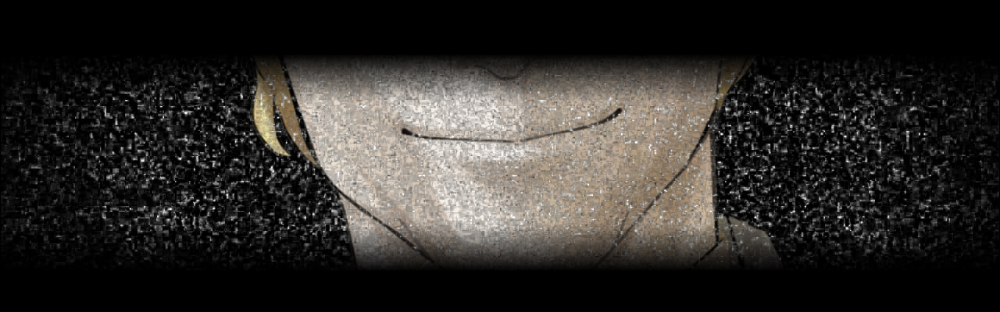
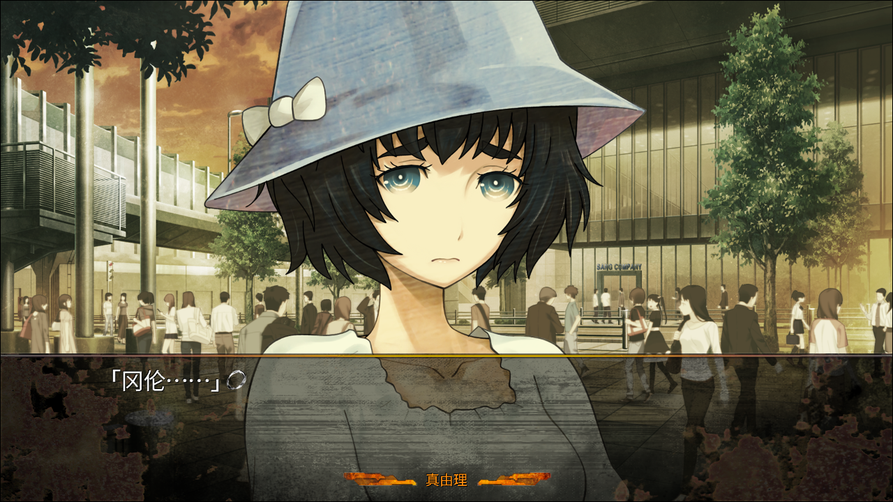
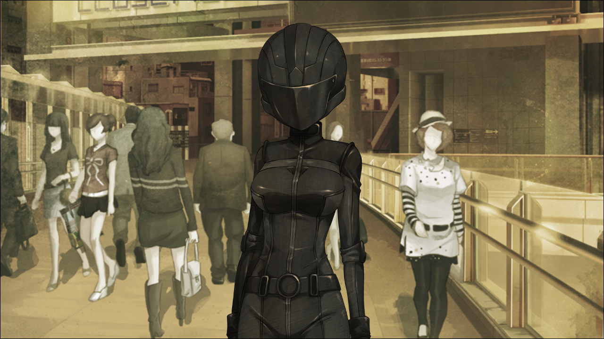
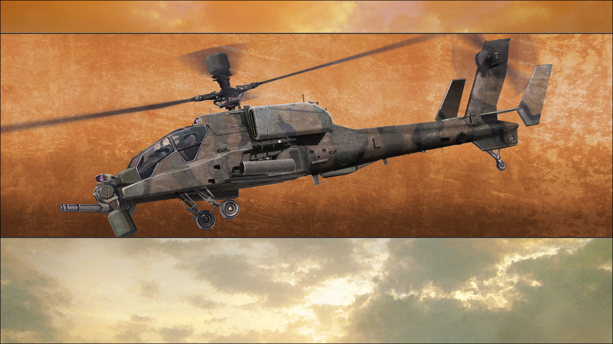
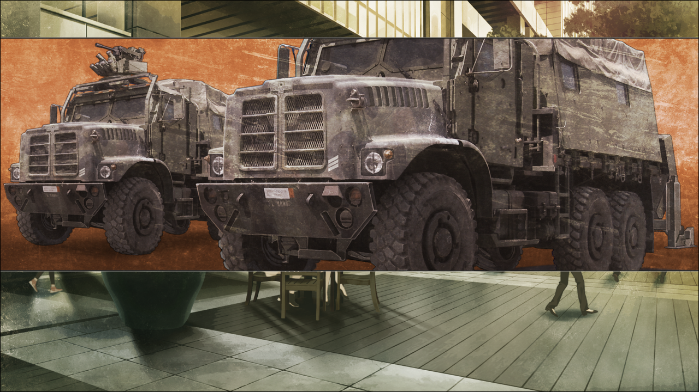
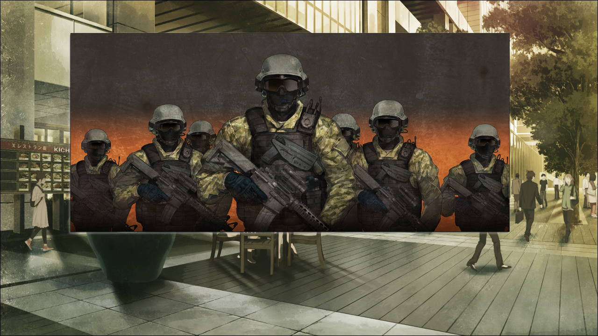

> <big> **私秘境里的圣痕 - 10** </big>  
> 1.129954  
> [ 2011/07/06 真帆视角（上） ] 真帆洗脑状态负面爆发。朦胧确认对冈伦好感；为了伤害真由理告知其α世界线情报；对“红莉栖”表达了嫉妒的负面情感。  

头，好痛。  
真帆为了忍耐那撕裂般的疼痛，蹲下来抱住头，紧闭双眼，咬住嘴唇。令人厌烦的噪音一直在她的脑海中响着，让她的头疼更加严重。不管怎样塞住耳朵，都无法让声音消失。因为太痛苦了忍不住要叫出声音，但是想到那样的话只会让头痛更加恶化，所以只有一味的忍耐。  
噪音里混杂着话语，是雷斯吉宁教授的声音。  
“听好了，*Maho*。  
&emsp;&emsp; 不管用什么手段，都要揭开 *Rintaro·Okabe* 隐藏的秘密。  
&emsp;&emsp; 不然的话，就不得不杀掉他。  
&emsp;&emsp; 你不希望事情变成那样吧？  
&emsp;&emsp; 你不是也很在意 *Rintaro* 的吗？  
&emsp;&emsp; 毕竟我和 *‘Kurisu’* 可是做了不少煽风点火的事呢，  
&emsp;&emsp; 就算你没有那方面的打算，也会慢慢变成那样的。  
&emsp;&emsp; 这，就是人的心理啊。  
&emsp;&emsp; 就算从帮助他的角度讲，也希望你能套出他持有的情报。  
&emsp;&emsp; 那样的话，我也可以无条件让 *Rintaro* 进入我们的研究室。  
&emsp;&emsp; *Maho*，把你了解到的关于他的事，全部报告给我。  
&emsp;&emsp; 也可以这么说——他的未来掌握在你的手里。”  
那些话语和噪音非常令人厌烦，真帆到现在也没理解它们到底在表达什么内容。虽然作为声音的的确确地传入了脑袋，但是大脑拒绝将之作为语言提取出其中的意义。不过，即使理解了也无济于事了。真帆已经对冈部伦太郎做出了无法挽回的事——把他出卖给了雷斯吉宁教授和STRATFO。越是意识到这一点，真帆心中的罪恶感就越重。  
真想现在就从这个世界上消失——。  

“真帆小姐……？”  
“…………”  
人来人往的秋叶原，正蹲靠在某幢大楼的阴影里的真帆听到了少女呼唤自己名字的声音而抬起了头。  
“果然是真帆小姐呀。”  
“真由理……小姐？”  
在意料之外的时间，被意料之外的人搭话，真帆陷入了迷茫，只是双目无神地盯着真由理的脸。  
“身体不舒服吗？”  
“…………没事的……”  
“那个……看到冈伦了吗？”  
“欸？”  
真帆心头一紧。面对这名纯洁无瑕的少女的问题，她更加意识到自己的所作所为是多么愚蠢、卑劣和污秽。  
“怎么……了……”  
反问的声音，在颤抖着。  
“冈伦从昨天开始就联系不上……  
&emsp;&emsp; 也没有回家，也不接电话，也不回复短信和RINE……  
&emsp;&emsp; 虽然桶子君说我过分操心了……但心里总感觉不安……  
&emsp;&emsp; 所以今天我从学校早退，一直在这附近找他。”  
虽然才七月份，但是气温已经很高了。这样的大热天，一直在秋叶原毫无线索地四处追寻吗？  
椎名真由理，是个善良又纯洁女孩子。这是真帆一直以来保持的印象。这名楚楚可怜的少女，看起来就不知道世间的污秽，绝对不会做出背叛他人、嫉妒他人、被他人利用之类的事情。  
“想知道吗……？”  
“欸？”  
真帆的一句话，让真由理探出了身体。  
“真帆小姐知道什么关于冈伦的线索吗？如果有的话请告诉我！拜托了！”  
真由理一边说着一边深深地低头鞠躬。  
（这样啊……）  
真帆意识到了，下意识就明白了。  
真由理喜欢冈部伦太郎。  
唰地一下，真帆的太阳穴附近又痛了起来。  
“你不是也很在意 *Rintaro* 的吗？”  
那噪音又在脑内吵了起来。  
——干脆，向真由理坦白一切算了。  
——然后，让这个纯真的少女痛骂自己一顿。  
——这样，说不定会更加轻松。  
真帆的心中，闪过了这个想法。  
不能这样——一边这样想着，一边忍耐着头痛的真帆开口了。  

“昨晚——深夜，冈部和我在一起。”  
“是…这样吗……？那么，冈伦现在在哪里……？”  
真帆无视了真由理的问题。  
“冈部昨天，对我说了这样的话。”  
——不行。  
“在他所经历过的别的世界里，椎名真由理，你死过无数次。”  
“欸……？”  
——不能说出来。
“无论尝试几次都无法拯救你，你仍旧不断地死去。”  
——这样的事，明明不应该说出来的。  
“为了从那噩梦般的循环里逃出来——  
&emsp;&emsp; 为了……拯救你——”  
好像被别人付身一样，真帆的口中不断地涌出这些话。  
“冈部，牺牲了红莉栖什么的，对她见死不救什么的。  
&emsp;&emsp; 他是这么对我说的。”  
“啊……”  
“如果制作出时间机器，想要再去拯救红莉栖的话，就会回到那个时候。”  
——我在伤害她。  
但是，话却止不住地继续流淌出来。  
“冈部非常害怕会变成那样。  
&emsp;&emsp; 一直在拼命地保护着你。  
&emsp;&emsp; 这里，是为了守护你，而牺牲了很多其他东西所选择的世界哦。  
&emsp;&emsp; 虽然，他应该什么都没有告诉过你吧。”  
“这不是真的……  
&emsp;&emsp; 那种事……  
&emsp;&emsp; 冈伦……”  
真由理受到了沉重的打击，什么都说不出来。那双眼睛里，泪水好像随时准备夺眶而出。紧接着，她背过身体，低落地垂着肩膀，一个人走开了。她的背影摇摇晃晃，看起来摇摇欲坠。突然被告知这些过于残酷的事实，让她甚至动摇了自身的存在意义。真帆能理解真由理现在的心境。  

“呼…………”  
真帆仍然处于迷失自我的状态。眼前的一切都仿佛笼罩了一层迷雾一样的滤镜，一切都是模糊的，一切都如梦幻般虚无缥缈。如果有人告诉她这里是梦境，她也一定会轻易相信。甚至自己的思考回路也是一样的状态。刚才和真由理的对话也是，自己应该更加后悔才是，但是她却只能认知到伤害了她这一事实，对此却没有渗入任何情感。正因如此，她才能毫不在乎地在本人面前说出那些残酷的话。  

这时，口袋里的手机震动了起来。  
看了下，是『Amadeus』——“红莉栖”打来的。  
她感受到，麻痹的内心深处，好像被一根细小的针刺到了一下。  
“…………”  
没有接。  
也无法接。  
真帆的手指丝毫无法动弹，只是屏住呼吸盯着液晶屏幕。  
“接起来……怎么可能……”  
她做不到让“红莉栖”看到现在自己难看的一面。  
但她也觉得继续呆在这里不好，于是打算去追离开不久的真由理。  
可是，一路来到天桥，始终没有看见真由理的身影。车站前的行人太多，找到真有理是很困难的。  
“呼…………  
&emsp;&emsp; 为什么，要出现在我的面前……？  
&emsp;&emsp; 明明如果不向我搭话的话，就不会受伤了……  
&emsp;&emsp; 我已经，不是以前的我了啊……”  
真帆从天桥上眺望着车站前的人群，喃喃自语着。  

突然，一个衣着特别显眼的人从桥下走了过来。如此炎热的天气，那个人却穿着黑色的骑手服，戴着全罩头盔，显得与周围格格不入。她还以为是所谓的Cosplay，但是周围的人不要说拍照了，反而都退避地让出道路。看体形的话，好像是名女性。以真帆来看，那也算得上是凹凸有致富有魅力的身材。  
那个女人就那样穿过天桥下方，离开了真帆的视线范围。  
——就在以为她已经离开的时候，那个人却从天桥的楼梯走了上来，而且笔直地朝向真帆的方向。  
真帆就像其他行人一样慌忙低下视线，想赶快离开这个地方。然而在真帆逃开之前，穿骑手服的女性就跑到了她的身边，一言不发地抓住了她的手臂。
“呃……!”  
脸颊传来一阵痛楚。还处在被抓住的惊愕状态的真帆不禁伴随着力道瘫倒在地。一开始真帆没有理解发生了什么，摸了摸自己隐隐作痛的脸颊，她才意识到自己被这个穿骑手服的女性扇了个耳光。  
“你伤害了妈妈吧？”  
从头盔里，传来了女性沉闷的声音。  
“我要杀了你……”  
那声音低沉又冷静，反而让真帆感到了恐惧。  
“虽然‘教授’向我说过你……但是没有关系。”  
“你……是谁？”  
因为女性戴着头盔，所以真帆看不到她的表情。而且面罩也放了下来，就连眼睛也看不到。  

“…………”
对方没有回答真帆的提问。她好像注意到了什么，抬头向天空望去。真帆也顺着她的目光抬头望天。一瞬，大楼的窗户上闪过了巨大的黑影，伴随着直升机的声音，而且相当近。  
从什么时候出现的呢。  
完全没有注意到。  
那个时候，真帆也感觉到周围的气氛明显发生了变化。之前自顾自行走着的路人们都愣住了，表情有点畏怯地看着车站的方向，耳边不断传来“那是什么？”或者“电视剧摄影？”或是“Cosplay的活动？”之类的议论。  
车站那边好像发生了什么事情。真帆也站了起来，从天桥上望向车站。  
“那是……什么？”  
真帆的口中无意识地道出和周围人同样的疑问。  

车站前，停着两辆好像是军用深绿色涂装的卡车。车上陆续下来了许多穿着迷彩服、全副武装的男人。本以为是自卫队，但是那群穿迷彩服的男人并非日本人。很难把这场景和日本联系起来。  
众目睽睽之下，穿着迷彩服的那群人消失在了小巷里。那条路前方通向广播馆。而真帆昨天从冈部口中得知，那里的屋顶上有台时间机器。  
（难道是，STRATFO？）  
又或者是俄罗斯，还是别的国家的军队？  
他们会展开作战行动，也是因为真帆把从冈部那里问出来的情报报告给了雷斯吉宁教授吧。  
正在这么想的时候，头又剧烈地痛了起来。  
“呜……咕……啊……！”  
全都是自己的错。  
这一切，都是自己的错。  
明明直到刚才，心里都像被蒙上了一层雾的状态，所有东西都迷迷糊糊的，现在却要被冲上心头的猛烈的罪恶感击溃了。如果接下来，就和冈部说的一样，第三次世界大战从这个秋叶原开始爆发的话，那起因就是真帆将冈部持有的情报交给了STRATFO。  
回过神来发现，刚才打了真帆一巴掌并威吓要杀了她的那个穿骑手服的女性，跑下了天桥，正向着车站的方向奔去。结果到最后都不知道那个女人到底是谁。  

正想着，真帆的手机又开始了震动。
是红莉栖。
想逃避这个罪恶感。
虽然刚才无视了，但这次接通了。
前辈！
红莉栖……
……没关系吗？
你指什么？
到底，怎么回事？
什么事也没有
可是……你不是在哭吗？
……！
被指出后，才注意到泪水正从自己的眼里溢出来。
心里的迷雾已经完全消失，之后只留下罪恶感和后悔和难受还有头痛折磨着真帆的心。
因为头……很痛。
他的未来掌握在你的手里，这么说也行
又听到了噪音。
冈部呢？冈部怎么了？
冈部，怎么样都行吧。
不是打算杀掉他吗！我看到了哦！
不要理我的事情……
我不能那么做。
别管我啊！
比不过……你
不管我付出多少，都比不过红莉栖你
呐……红莉栖。
我一直尊敬着你。虽然比我年纪小，但是我觉得你是了不起的科学家哦……
但是我的心底却是这么想的啊……
为什么在我面前出现了呢？
为什么你不早出现10年呢？
为什么你不晚出现10年呢？
如果你不在的话，我应该会过着更平凡的日子的。
明明可以不被这种丑陋的感情所支配也可以的……！
我总是被你破坏常识！
即使死了，我也被你的事纠缠着……
明明想从心底悼念你的逝去……但是做不到。
你一直作为无法跨越的障碍矗立在那里……
自尊心和逞强心妨碍着我。
那里被趁虚而入，我，甚至被最信赖的人背叛……以至于，背叛了信赖我的朋友……
我的脑子里，已经乱成一团了啊……
所以，不要管我的事情啊……
前辈……
太过于情绪化了，虽然这是平时的自己所无法想象的言行，但是真帆怎么样也抑制不了。
……！

 

> (to be continued)
---

| [←prev](./0045) | [home](../../) | [next→](./0047) |
