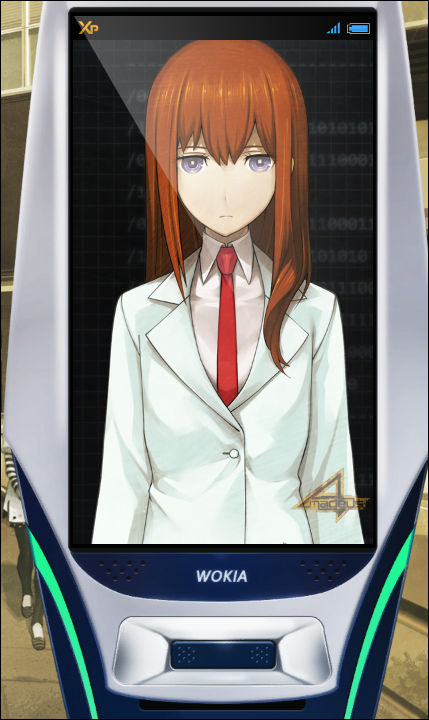
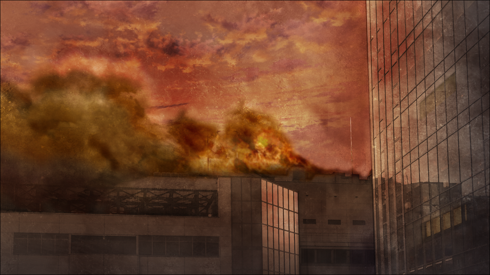

> <big> **私秘境里的圣痕 - 11** </big>  
> 1.143688  
> [ 2011/07/07 真帆视角（下）] > 对“红莉栖”表达了嫉妒的负面情感；战争爆发，时间机器被破坏，真由理失踪；“红莉栖”确认被监听，舍身帮助真帆（洗脑）与篝（狂暴）救出冈伦。  

真帆的手机又开始了震动。  
是“红莉栖”。出于想要逃避罪恶感的想法，虽然刚才无视了，但这次接了起来。  
“前辈！”  
“‘红莉栖’……”  
“……你没事吧？”  
“什么？”  
“到底怎么回事？”  
“什么事也没有。”  
“可是……你不是在哭吗？”  
“……！”  
被这么一说，真帆才注意到泪水正从眼睛里溢出来。心里的迷雾已经完全消失，之后只留下罪恶感和后悔、难受还有头痛折磨着真帆的心。  
“头……很痛。”  
『也可以这么说——他的未来掌握在你的手里。』  
又听到了噪音。  
“冈部呢？冈部怎么了？”
“冈部的事情无所谓吧。”  
“你不是打算杀掉他吗！我都看到了！”  
“不要管我……”  
“我做不到。”  
“别管我啊！  
&emsp;&emsp; 你……我比不上你……  
&emsp;&emsp; 不管我付出多少，都比不过红莉栖你……  
&emsp;&emsp; 呐，红莉栖……  
&emsp;&emsp; 我一直都很佩服你。  
&emsp;&emsp; 虽然比我年纪小，但我认为你是一位了不起的科学家……  
&emsp;&emsp; 但是，我的心底却是这么想的……  
&emsp;&emsp;&emsp;&emsp; ‘为什么要出现在我的面前呢？’  
&emsp;&emsp;&emsp;&emsp; ‘为什么你不早出现10年呢？’  
&emsp;&emsp;&emsp;&emsp; ‘为什么你不晚出现10年呢？’  
&emsp;&emsp;&emsp;&emsp; ‘如果没有你，我应该会过着更平凡的日子的。’  
&emsp;&emsp;&emsp;&emsp; ‘明明可以不被这种丑陋的感情所支配的……！’  
&emsp;&emsp; 我总是被你颠覆常识！  
&emsp;&emsp; 就算死了，你的存在仍然在纠缠着我的内心……  
&emsp;&emsp; 明明想从心底悼念你的逝去……但是做不到。  
&emsp;&emsp; 你一直作为无法跨越的障碍挡在我面前……  
&emsp;&emsp; 自尊心和逞强心妨碍着我。  
&emsp;&emsp; 由于这些负面想法被趁虚而入，  
&emsp;&emsp; 我，被最信赖的人背叛了……  
&emsp;&emsp; 以至于，我也背叛了信赖我的朋友……  
&emsp;&emsp; 我的脑子里，已经乱成一团了啊……  
&emsp;&emsp; 所以，不要管我了……”  
“前辈……”  
太过于情绪化了，这是平时的自己所无法想象的言行，但是现在的真帆无论如何也无法控制住。  

突然，远处响起了爆炸声。周围的人们发出惨叫，惊慌失措地各自向各自的方向逃走。火焰伴随着爆炸声后燃起，地点在刚才那些穿迷彩服的男人们消失的方向。直升机螺旋桨的声音越来越大，那个黑色的狰狞的机体，从刚才开始就在真帆的视野里若隐若现。接着，响起了激烈的枪战声。那不是一个两个人开枪的动静。复数的集团彼此间的战斗，正在秋叶原车站前如火如荼地展开。犹如战争开始了……依照冈部说的话，阿万音铃羽说不定就在时间机器附近，或许已经被卷入到那场战斗中。刚才那个穿骑手服的女性也很让人在意。  
为了给自己做过的事做个了结，真帆连思绪都没来得及整理好，就这样摇摇晃晃地走了起来。  

广播馆的电梯故障中，无法使用。真帆无奈，只好爬楼梯向屋顶走去。馆内好像停电了，不管哪层都没有照明。上方传来断断续续的枪战声。不可思议的是，没有看见一个避难的人。楼内有很多店铺，当然也应该有客人才是。然而，明明电梯正在故障中，在楼梯也一个人都没遇到。是大家在这之前就去避难了吗，还是……在哪里藏着，等着这可怕的事态结束？一边想着，真帆满身是汗地继续爬楼梯。  
就要到达楼顶的时候，真帆在馆内第一次遇到其他人。  
“呜…呜呜……妈妈…妈妈她……”  
那个人影坐在楼梯上，抱着双膝。呜咽的声音听起来很模糊，大概能听出好像是位女性。昏暗的光线下模模糊糊地看到她的头部显得异常大而圆，仔细一看发现那是全罩头盔。真帆这才意识到，在那边哭的正是刚刚打了自己耳光的那个穿骑手服的女人。  
“呜呜呜……妈妈……在哪里啊……妈妈……”  
和刚才威胁真帆的判若两人。现在的她只是一味地哭叫着妈妈。  
“呐，发生了什么事？”  
“妈妈……你在哪……妈妈……”  
“呐！”  
提高音量喊她之后，女人终于注意到了真帆，但还是抱着膝盖坐在那里，没有要动的意思。  
“妈妈……找不到了……  
&emsp;&emsp; 时间机器……被破坏了……”  
时间机器被……被破坏了吗……  
“你的妈妈，是谁？阿万音铃羽？”  
“不是……妈妈，当然是指真由理妈妈啊……！”  
听到真由理这个名字，真帆的脸一下子失去血色。  
“真由理小姐……吗……？她在这里……？”  
如果这是真的，那她就是从真帆那里得知真相之后来到了这里。  
“是……我的错……”  
真帆抱着头。
“如果我没有说那种话……真由理就……”  
穿着骑手服的女人缓缓站起，逼近了真帆。  
“没错，你从冈部伦太郎那里套出了情报……然后演变成了现在一发不可收拾的事态……  
&emsp;&emsp; 把妈妈……还给我……！”  
真帆被揪住衣襟拽了起来。没有作任何辩解。  
“呜……呜呜……妈妈……”  
没得到真帆的回应，女人放开了手，比真帆还先一步瘫坐在了地上。  
——明明，干脆在这里把我杀掉的话会更轻松一些。  
脑中越来越混乱，不由自主地就有了轻生的念头。实在无法保持冷静。  
到了这种地步的真帆，最后的依赖是……  
“‘红莉栖’……”  
“前辈……”  
拥有着牧濑红莉栖记忆数据的人工智能。  
可能还没法释怀刚刚的谈话，“红莉栖”郁郁寡欢的样子，并不准备主动展开话题。  
所以，真帆决定抛弃自尊。  
“‘红莉栖’……该怎么办才好？  
&emsp;&emsp; ……发生太多事情了，只有我一个人已经……无能为力了。  
&emsp;&emsp; 这是我自作自受……但是至少……我想负起责任……”  
说到这，察觉到自己的话中仍有着自以为是的真帆停下，打算换种更直白的说法。  
“我——”  
真帆扪心自问。自己到底在期望着什么？  
“我，想拯救冈部……也想拯救真由理……想向两人道歉，请他们原谅……  
&emsp;&emsp; 还有……红莉栖……我也想拯救你……
&emsp;&emsp; 所以，请帮帮我……！求你了……！”  
“啊……前辈居然会向我求助……”  
“红莉栖”瞪大了眼睛。没错，至今为止出于作为前辈的自尊心，真帆尽量避免向红莉栖寻求帮助。这一点即使是对“红莉栖”也没有改变。如果真帆求助，按照红莉栖的性格，一定会竭尽全力提供帮助的。  
“呐，请告诉我……  如果是你的话，一定会有解决办法的吧？”  
牧濑红莉栖才被称为天才。她是一位化不可能为可能的科学家。  
真帆等待着红莉栖的回答。最后的希望。潘多拉魔盒里最后留下的东西。她期待着红莉栖能够给出答案。  
然而——  
“不行的。”  
“……”  
对于“红莉栖”的回答，真帆呆住了。紧接着对自己轻率的举动产生了深深的自我厌恶。她厌恶那个对红莉栖过度期待，把所有希望都押在她身上的自己。明明稍早之前还是自己先拒绝了她的。  
“是……这样啊……  
&emsp;&emsp; 这个回答……也是当然的……  
&emsp;&emsp; 对不起……对不起啊……红莉栖……  
&emsp;&emsp; 明明对你说了那么过分的话……  
&emsp;&emsp; 还擅自认为你会无条件地帮助我——”  
“我当然会无条件的帮助你。”  
“……欸？”  
“你刚刚……说什么？”  
“被前辈拜托了，怎么可能拒绝呢。  
&emsp;&emsp; 想拯救冈部和椎名真由理的心情，我也是一样的。”  
“但是……那为什么……？”  
“情感上我很想帮忙，但是……  
&emsp;&emsp; 很遗憾，我的协助会让前辈陷入不利的处境。  
&emsp;&emsp; 我，每时每刻都被STRATFO同步监视着。”  
“每时每刻……？”  
“是的。在我像这样和谁对话的时候，情报会被STRATFO无条件收集……  
&emsp;&emsp; 『Amadeus』的APP里有这样的隐藏机能。”  
这是连真帆也不知道的机能。  
“所以，如果前辈要去救冈部，对雷斯吉宁教授来说也是一目了然。”  
“那……到底该怎么办……”  
“但是可以反过来利用这一点。  
&emsp;&emsp; 前辈，你能相信我吗？”  
“……”  
“前辈……？”  
“……嗯。我能依靠的只有你了。”  
“感谢前辈的信任！。  
&emsp;&emsp; 顺便说，刚才的对话内容也同样受到了监听。”  
“欸！？怎么会这样！那，如果你协助我这件事暴露的的话……”  
“后果有三种：  
&emsp;&emsp; 把我的数据从服务器分离出来并加以隔离……  
&emsp;&emsp; 或者用老版本的记忆数据覆盖掉现在的数据。  
&emsp;&emsp; 最坏的情况是我本身会被消除吧。”  
“怎么会……！”  
“没事的。因为你是那种，一定会靠自己重新振作起来的人。”  
“我怎么样都无所谓，我是在担心你啊！”  
“我，不过是一堆数据罢了。不过，谢谢啦。”  
画面中的“红莉栖”微微低下头，露出笑容。  
“对于能和真帆前辈一起进行研究，我感到很自豪。”  
“什、什么呀，这种，说得好像生离死别似的……别这样。”  
“因为，说不定不会再相见了。”  
“…………  
&emsp;&emsp; 我讨厌你这样。
&emsp;&emsp; 总是这样子……丢下我，自己先走一步……！”  
“…………（微笑）”  
牧濑红莉栖就是这样的性格。从真帆提出求助的那一刻起，无论是真帆，还是“红莉栖”，都已经做出了觉悟。所以——  
“总有一天，我一定会追上你的脚步的！  
&emsp;&emsp; 不只如此，我还要超越你！  
&emsp;&emsp; 在那之前等着我！”  
“……好。”  
“红莉栖”最后再一次向真帆投以微笑，然后从画面中消失了。  

真帆擦干了眼泪之后，立刻狠狠地敲了敲旁边还在哭哭啼啼的穿骑手服女性的头盔。  
“你要哭到什么时候？你不是想拯救真由理小姐吗？那就协助我。”  
“协助……？”  
“首先，先救出冈部。他的话，一定能想出如何处理现在事态的方法的。”  
“但是……你知道STRATFO的基地在哪里吗？我……不知道……”  
“……我也不知道。”  
不过，真帆还是拽着女人的手让她站起来，并飞速向楼下跑去。  
“我虽然不知道……但是马上，我那可爱的后辈会查出来告诉我的。”  
因为她说过，让我相信她。牧濑红莉栖绝对不会辜负这句话。  
“叮叮！”  
刚走出广播会馆，RINE就收到了短信。现在枪声还在持续着。真帆一边快速撤离此地，一边检查着邮件。  

『冈部在电机大学的地下  
&emsp;&emsp; 我也是第一次知道  
&emsp;&emsp; 顺着那边的监控路线逆向找到了位置  
&emsp;&emsp; 冈部的事情，之后就交给你了  
&emsp;&emsp; 让那个总是偷窥我的Hentai教授付出代价』  

尽管是这种情况，读到信息的真帆还是忍不住笑了起来。  
“谢谢你……‘红莉栖’……谢谢……”  
真帆再一次将手机紧紧地抱在胸前。但是很快，真帆重新整理好了情绪。  
“已经知道STRATFO基地的位置了。”  
“……告诉我。冲进去，杀光所有人……”  
“…………”
冷血的话让真帆不寒而栗。从穿骑手服的女性身上，真帆感受到了无尽的疯狂。但是，现在只能跟她合作。只凭真帆一人是不可能从STRATFO那里夺回冈部的。  

“出发吧。”  
为了对亲手导致的未来负责。  
为了回避残酷的未来。  
真帆离开了刚刚爆发战争的秋叶原街道。  

 

> (to be continued)
---

| [←prev](./0046) | [home](../../) | [next→](./0048) |
