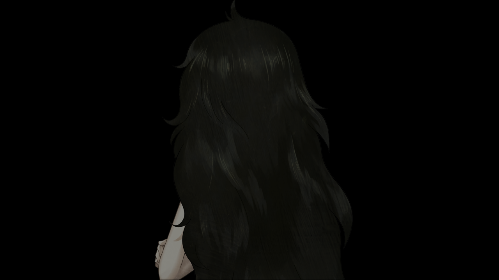
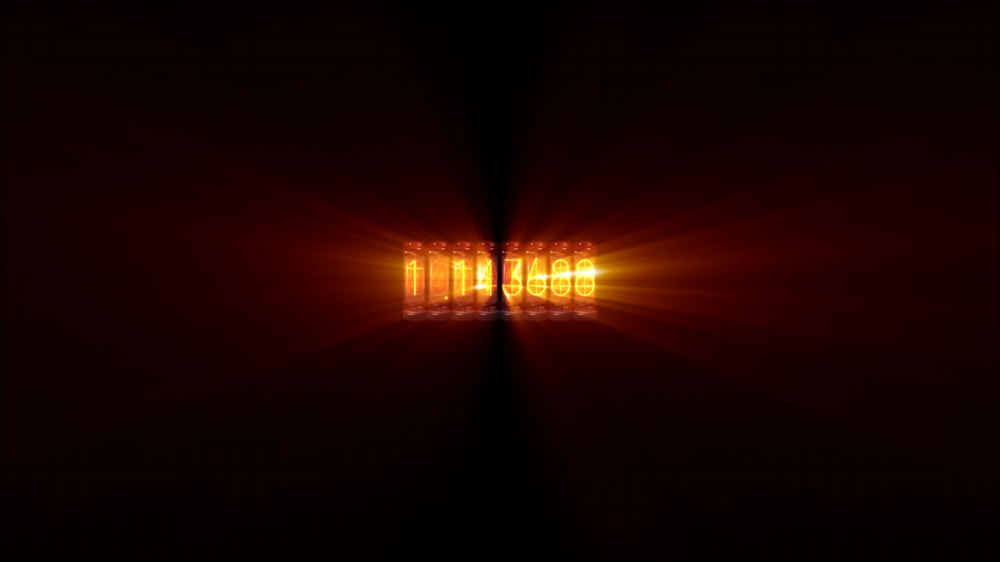

> <big> **私秘境里的圣痕 - 12 （ED1）** </big>  
> 1.143688  
> [ 2011/07/08 ] 冈伦被救出；篝去世，『Amadeus』被消除；桶子、菲利斯、琉华逃亡；真由理、铃羽、真帆失踪。冈伦放弃之下，桶子决心造出时间机器。  

“冈……”  
有声音。  
能听见声音。  
“冈部先生……”  
有谁在喊我的名字。  
我慢慢恢复意识，朝声音传来的方向看去。  
“冈部先生……”  
真帆站在黑暗中，脸上挂着有些寂寞亦或悲伤的笑容。  
“对不起。  
&emsp;&emsp; 我，不会再出现在你的面前了。  
&emsp;&emsp; 如果我在你身边，我说不定，会再一次背叛你……  
&emsp;&emsp; 呐……  
&emsp;&emsp; 希望你能听一下这样的我的，任性的请求。  
&emsp;&emsp; 请一定……要找到 *Steins;Gate*……  
&emsp;&emsp; 在你被抓的这段时间里，世界发生了翻天覆地的变化……  
&emsp;&emsp; 真由理小姐和铃羽小姐都下落不明。  
&emsp;&emsp; 我和篝小姐，为了救你闯进了STRATFO的基地……  
&emsp;&emsp; 篝小姐……在那里牺牲了……也拉了不少人垫背……  
&emsp;&emsp; 只是，雷斯吉宁教授逃掉了……  
&emsp;&emsp; 『Amadeus』也被消除了……  
&emsp;&emsp; 这些事不该发生的……  
&emsp;&emsp; 不过，现在，你是唯一的希望。  
&emsp;&emsp; 求求你。虽然知道把一切托付给你一个人很过分……  
&emsp;&emsp; 请一定要到达 *Steins;Gate*。  
&emsp;&emsp; 就说到这吧……冈部先生。  
&emsp;&emsp; 永别了——”  

“比定屋小姐！”  
我猛地弹起身子，发现自己在医院的病床上。  
“欸……”  
从病房到外面的走廊，全都挤满了受伤的患者。不仅仅是病床上，地上也有用毛毯拼凑的简易床铺，病患就被安置在那里。这是哪里？一瞬间以为自己回到了之前跳跃到的那条战争状态的世界线。然而，并不是那样。根据电视上的新闻，昨天好像在秋叶原发生了恐怖袭击事件。外国的武装特殊部队大闹了一番，好像战场一样。现在虽然事情暂时得以平息，来历不明的特殊部队也消失了，但是这场战斗造成了不小的伤亡。至于我为什么会在医院里，我记不清了。我本应该被雷斯吉宁监禁，接受残酷的拷问的。事实而言，全身上下的确很痛。  
突然，我回想起梦中比屋定说的那些话。难道那不是梦，而是现实？比屋定她……救了我？还有……篝？我摸了摸身上的衣服，手机就在口袋里。总之，先试着给真由理打个电话。如果梦中的话是真的，那么真由理现在下落不明。怎么能接受得了这种荒谬的事情。因为，这里是我为了让真由理能过上安稳的生活选择的世界线啊。至少能确保她继续活到2036年。在2011年的今天就死去什么的根本不可能。  
“真由理……接电话啊……！”  
但是无论打多少次电话都联系不上真由理。  
我强忍疼痛，起身走出了病房，来到了医院楼顶。看样子，这是之前吹雪住院的那家御茶之水医院。早晨的天空惊人的澄澈。在这里能看到远处秋叶原的样貌。那边浓烟四起。看到那异常的景象，我打了个冷颤。就算从这边望过去，也能感受到那里发生过的战斗到底有多激烈。世界正在变得像约翰·提托所预言的那样。  
我在楼顶又多次尝试打电话给真由理，还是没有联系上。  

接着我怀有抓住救命稻草的想法打给了桶子。  
“喂喂！冈伦！”  
“桶子……！”  
“太好了……你还活着……”  
“你才是，没事真是太好了……”  
“LAB附近意外地蛮安静的。”  
“你现在在哪？”  
“逃亡中。已经脱离秋叶原了。”  
“这样啊……”  
“我联系过菲利斯碳和琉华氏了。两人都去避难了。”  
“呼……”  
“呐，冈伦……
&emsp;&emsp; 铃羽和真由喜……都联系不上……  
&emsp;&emsp; 昨天的事件中，时间机器也被破坏得粉碎……  
&emsp;&emsp; 跟铃羽所说的未来比起来，世界变动得太快了啊……”  
“………………”  
果然“梦”中出现的比屋定并不是一场梦。那是在我意识残存之际，她与我道别的场景。  
“呐，桶子……我……我啊……  
&emsp;&emsp; 我想普通地生活……这也不被允许么……？  
&emsp;&emsp; 这种事情我早就有所觉悟了……  
&emsp;&emsp; 放弃 *Steins;Gate* 而选择了第三次世界大战这条世界线的，是我啊……  
&emsp;&emsp; 但就算这样……只有我活着，而大家全都离我而去什么的……  
&emsp;&emsp; 这也太过分了吧……（失声）”  
神的法则，无论如何也不肯放过我吗……  
脱离因果之环就是如此的罪业深重吗……  
如果是这样，明明只要诅咒我一个人就可以了……  
“我，要造出……时间机器。”  
“桶子……”  
“别无选择，非造不可了吧。  
&emsp;&emsp; 怎么可能就这样结束啊！  
&emsp;&emsp; 冈伦你打算怎么办……？”  
升腾着滚滚浓烟的秋叶原。我就这么呆呆地看着，呆呆地站在这里。  
“我……！我……我…………”  
眼泪夺眶而出。我瘫倒在那里，连站起来的力气也没有。  
对于桶子的询问，我无论如何也没有办法回答。  
无论多么努力，无论多么拼命进行轨道修正，到头来一切还是向着神明所期望的那样收束。  
违抗神是没用的，桶子……  
我已经……累了……  
稍微休息一下吧。  
距离真正的第三次世界大战爆发还有好几年呢。  
距离我死亡还有14年呢。  
绝对不做毫无胜算的抗争，尽力地，自欺欺人地地活下去吧。  
这正是跟我这种人相称的——人生的陌路。  

对不起，比屋定。  
对不起，真由理。  
对不起，红莉栖。  
请原谅在这里就放弃的我吧……  

 

> (Mission Failed. Rebooting...)
---

| [←prev](./0047) | [home](../../) | [next→](./0049) |
