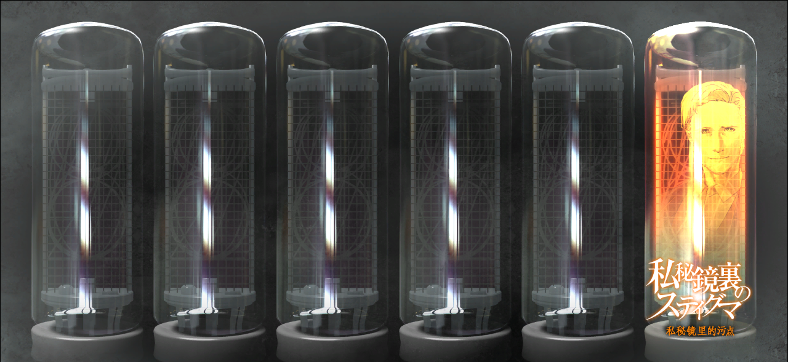

> <big> **瓦尔基里终末报告 - 01** </big>  
> 1.143688  
> [ 2036/08/13 ]  

|时间：| 2036/08/13 |  
|世界线变动率：| ■■■■■■■■（无法测定） |  
|主要作战成员：| 巴莱尔·提托，咲村，柴郡猫，约翰·提托 |  

No.001依旧处于沉睡状态，本体一直处于STARTFO监管下，与2025年去世；  
No.003自2011年失踪，至今下落不明；  
*Steins;Gate* 达成条件未探明。  

---
最终作战概要  
执行人：约翰·提托  
- 乘坐V204 2nd EDITION ver2.31前往分歧点19■■/■■/■■寻找■■■5100；  
- 乘坐V204前往分歧点20■■/■■/■■告知No.001相关情报并协助其拯救■■■■■；  
  - 若拯救行动失败，则之后行动核心为唤醒No.001使其重新振作。  
- 尝试回避20■■/■■/■■秋叶原冲突导致的人员失散与V204破坏。  

 ——No.002 巴莱尔·提托 
  

（我一个人没办法弄懂如何到达 *Steins;Gate*。我能做的只有复现我所知道的历史达成闭环，让希望不会断绝。我相信，凤凰院凶真一定迟早有一天会和我们一起……不，不对，是站在我们的前阵，指引我们。）  

 

> (Hope is always there in the “future”.)
---

| [←prev](./0048) | [home](../../) | [next→](./0050) |
